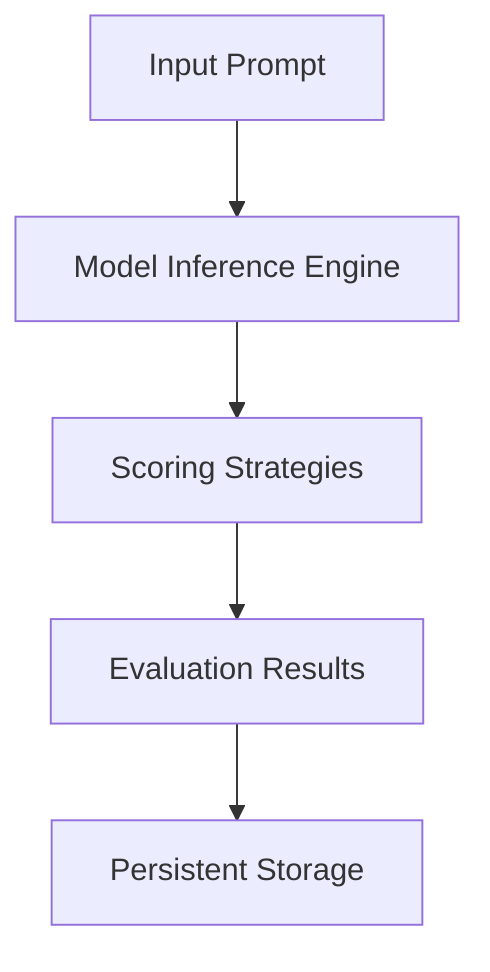

<h1 align="center">🚀 LLMEvaluationFramework</h1>

<p align="center">
  <a href="https://isathish.github.io/llmevaluationframework/">
    
  </a>
  <a href="https://pypi.org/project/llm-evaluation-framework/">
    
  </a>
  <a href="https://opensource.org/licenses/MIT">
    
  </a>
  <a href="https://github.com/isathish/LLMEvaluationFramework/stargazers">
    
  </a>
</p>


<p align="center">
  <i>Advanced Python framework for evaluating, testing, and benchmarking Large Language Models (LLMs)</i><br>
  <a href="https://isathish.github.io/llmevaluationframework/"><b>📚 View Full Documentation</b></a>
</p>

<p align="center">
  <a href="https://pypi.org/project/llm-evaluation-framework/"></a>
  <a href="https://github.com/isathish/LLMEvaluationFramework/actions"></a>
  <a href="https://opensource.org/licenses/MIT"></a>
  <a href="https://github.com/isathish/LLMEvaluationFramework/stargazers"></a>
</p>

---

## 🌟 At a Glance

<div align="center">

**LLMEvaluationFramework** is your **all-in-one** solution for **evaluating, testing, and benchmarking** Large Language Models (LLMs) with style and precision.

</div>

---

> **LLMEvaluationFramework** is your **all-in-one** solution for **evaluating, testing, and benchmarking** Large Language Models (LLMs) with style and precision.


---
## 📖 Overview

**LLMEvaluationFramework** is a **production-grade** toolkit for **evaluating, testing, and benchmarking LLMs**.  
It provides a modular architecture with model inference, automated suggestions, model registry management, and synthetic dataset generation — all in one package.

### Why Choose LLMEvaluationFramework?
- **Comprehensive Evaluation**: Supports multiple evaluation strategies including accuracy, relevance, and custom metrics.
- **Scalable**: Handles both small-scale experiments and large-scale benchmarking with ease.
- **Extensible**: Add new models, datasets, and scoring strategies without modifying core code.
- **Developer-Friendly**: Well-documented APIs, CLI tools, and examples for quick onboarding.
- **Production-Ready**: Built with testing, logging, and persistence in mind.

### Use Cases
- Benchmarking multiple LLMs for research or production.
- Generating synthetic datasets for training or evaluation.
- Automating prompt optimization workflows.
- Integrating LLM evaluation into CI/CD pipelines.

---

## ✨ Key Features

Below is a detailed breakdown of the framework's capabilities:

> A modular, extensible, and testable framework designed for both research and production environments.

<div align="center">

| 🚀 Feature | 💡 Description |
|------------|----------------|
| ⚡ **Model Inference Engine** | Evaluate prompts against multiple LLMs with ease |
| 💡 **Auto Suggestion Engine** | Generate intelligent prompt suggestions |
| 📚 **Model Registry** | Manage and register multiple LLM configurations |
| 🧪 **Test Dataset Generator** | Create synthetic datasets for evaluation |
| 🔌 **Extensible** | Easily integrate with new models and datasets |
| ✅ **Testable** | Designed with 100% test coverage in mind |

</div>

| Feature | Description |
|---------|-------------|
| ⚡ **Model Inference Engine** | Evaluate prompts against multiple LLMs with ease |
| 💡 **Auto Suggestion Engine** | Generate intelligent prompt suggestions |
| 📚 **Model Registry** | Manage and register multiple LLM configurations |
| 🧪 **Test Dataset Generator** | Create synthetic datasets for evaluation |
| 🔌 **Extensible** | Easily integrate with new models and datasets |
| ✅ **Testable** | Designed with 100% test coverage in mind |

### 🆕 Latest Additions
- 🚀 **Async Inference Engine** — Concurrent model evaluations for faster benchmarking.
- 📏 **Custom Scoring Strategies** — Plug in your own evaluation metrics.
- 💾 **Persistent Storage** — JSON/DB backends for saving configurations and results.
- 🖥 **CLI Support** — Manage models and run evaluations from the terminal.
- 📜 **Enhanced Logging** — Detailed logs for debugging and performance tracking.

---

## 📦 Installation

The framework can be installed in multiple ways depending on your needs:
- **PyPI**: For stable releases.
- **Source**: For the latest development version.
- **Custom Fork**: Clone and modify for internal use.

<details>
<summary>💻 Click to Expand Installation Steps</summary>

> **Tip:** Use a virtual environment to keep dependencies isolated.


**From PyPI**
```bash
pip install llm-evaluation-framework
```
</details>

**From Source**
```bash
git clone https://github.com/isathish/LLMEvaluationFramework.git
cd LLMEvaluationFramework
pip install -e .[dev]
```

---

## 🚀 Quick Start

This section demonstrates how to get started quickly with minimal setup.

<details>
<summary>📌 Show Quick Start Examples</summary>

> **Pro Tip:** Explore the [Usage Guide](docs/usage.md) for advanced workflows.

---

<details>
<summary>🔍 Model Inference</summary>

```python
from llm_evaluation_framework import ModelInferenceEngine

engine = ModelInferenceEngine(model_name="gpt-4")
result = engine.evaluate("What is the capital of France?")
print(result)
```
</details>
</details>

<details>
<summary>💡 Auto Suggestions</summary>

```python
from llm_evaluation_framework import AutoSuggestionEngine

suggestion_engine = AutoSuggestionEngine(model_name="gpt-4")
suggestions = suggestion_engine.suggest("Write a poem about the ocean.")
print(suggestions)
```
</details>

<details>
<summary>📚 Model Registry</summary>

```python
from llm_evaluation_framework import ModelRegistry

ModelRegistry.register("gpt-4", {"provider": "OpenAI", "max_tokens": 4096})
print(ModelRegistry.list_models())
```
</details>

<details>
<summary>🧪 Test Dataset Generation</summary>

```python
from llm_evaluation_framework import TestDatasetGenerator

generator = TestDatasetGenerator()
dataset = generator.generate(num_samples=5, topic="math problems")
print(dataset)
```
</details>

---

## 📊 Workflow Overview

The following diagram illustrates the high-level workflow of the framework:



---


---

## ⚙️ Advanced Configuration

Advanced configuration allows you to tailor the framework to your specific needs:
- **Custom Models**: Integrate proprietary or experimental LLMs.
- **Custom Scoring**: Implement domain-specific evaluation metrics.
- **Persistence**: Choose between JSON, database, or cloud storage.
- **CLI Extensions**: Add new commands for automation.

<details>
<summary>⚙️ Click to View Advanced Configuration</summary>

> Extend the framework to suit your needs.

You can customize the framework by:
- Adding new model backends
- Defining custom scoring strategies
- Configuring persistent storage (JSON/DB)
- Extending CLI commands

Example:
```python
from llm_evaluation_framework.evaluation import CustomScoringStrategy

class MyScore(CustomScoringStrategy):
    def score(self, prediction, reference):
        return custom_logic(prediction, reference)
```
</details>

---

## 🏗 Project Structure

Understanding the repository layout helps in navigating and contributing effectively.

> A clear view of the repository layout for easy navigation.

<details>
<summary>📂 Click to Expand</summary>

```
</details>
LLMEvaluationFramework/
├── llm_evaluation_framework/   # Core framework code
├── docs/                       # Documentation
├── tests/                      # Unit tests
├── setup.py                    # Installation script
└── README.md                   # Project overview
```

---

## 📄 Documentation

> Full API reference available in [`docs/api-reference.md`](docs/api-reference.md)

Full documentation is available at **[📚 Online Documentation](https://isathish.github.io/llmevaluationframework/)**.

You can also explore the local [`docs/`](docs/) folder:

- 📘 [Getting Started](docs/getting-started.md)
- 📖 [Usage Guide](docs/usage.md)
- 🤝 [Contributing Guide](docs/contributing.md)

---

## 🤝 Contributing

We welcome contributions!  
Please read the [Contributing Guide](docs/contributing.md) for details.

---

## 📜 License

This project is licensed under the **MIT License**.

---

<p align="center">Made with ❤️ for the LLM community</p>
