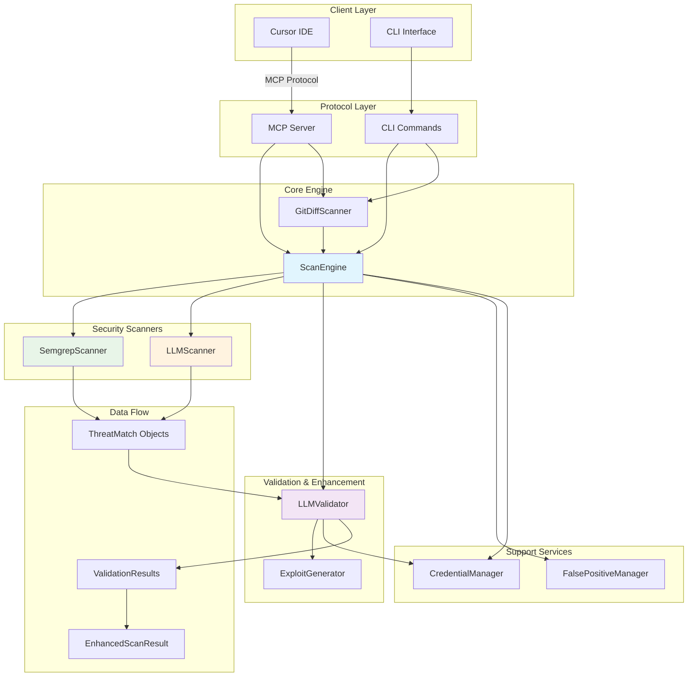

# Adversary MCP Server - Architecture

## System Overview

The Adversary MCP Server features a **hybrid multi-engine architecture** with integrated validation for comprehensive security analysis. The system combines static analysis, AI-powered detection, and intelligent validation to provide accurate threat detection with minimal false positives.

## 🏗️ System Architecture



## Core Components

### 1. MCP Server Layer (`server.py`)

**Purpose**: Protocol adapter between MCP clients (Cursor IDE) and security analysis engine

**Key Responsibilities**:
- Handle MCP protocol messages from Cursor IDE
- Validate tool requests and parameters
- Route requests to appropriate security scanners
- Format responses for IDE integration
- Manage server lifecycle and resources

**MCP Tools for Cursor IDE**:
```python
# Security Analysis Tools
adv_scan_code       # Analyze code snippets in editor
adv_scan_file       # Scan individual files
adv_diff_scan       # Git diff-aware scanning for commits
adv_generate_exploit# Generate educational exploit examples

# False Positive Management
adv_mark_false_positive    # Mark findings as false positives
adv_unmark_false_positive  # Remove false positive marking
adv_list_false_positives   # List all false positives
```

### 2. Scan Engine Layer (`scan_engine.py`)

**Purpose**: Orchestrates dual-scanner security analysis combining Semgrep and LLM

**Architecture Changes**:
- **Removed**: AST Scanner, Rules Engine (95+ YAML rules)
- **Kept**: Semgrep Scanner, LLM Scanner
- **Simplified**: Two-scanner architecture for better performance and fewer false positives

#### ScanEngine
```python
class ScanEngine:
    def __init__(self, credential_manager):
        self.credential_manager = credential_manager
        self.semgrep_scanner = SemgrepScanner()          # Static analysis
        self.llm_analyzer = LLMScanner()                 # AI-powered analysis
        self.false_positive_manager = FalsePositiveManager()

        # Both scanners enabled by default
        self.enable_llm_analysis = True
        self.enable_semgrep_analysis = True
```

#### EnhancedScanResult
```python
@dataclass
class EnhancedScanResult:
    file_path: str
    language: Language
    llm_threats: list[ThreatMatch]      # LLM analysis results
    semgrep_threats: list[ThreatMatch]  # Semgrep analysis results
    scan_metadata: dict[str, Any]       # Performance & execution data

    @property
    def all_threats(self) -> list[ThreatMatch]:
        """Combined and deduplicated threats from both scanners"""
```

## Security Scanner Components

### 1. LLM Scanner (`llm_scanner.py`)
**Integration**: Client-based LLM analysis through Cursor IDE

**Capabilities**:
- **Context-Aware Analysis**: Understands business logic and complex patterns
- **Novel Vulnerability Detection**: Finds issues not covered by static rules
- **Educational Explanations**: Provides detailed vulnerability explanations

**Cursor IDE Integration**:
```
Code Selection → Prompt Generation → Cursor's LLM → Structured Response → Security Finding
```

**Supported Vulnerability Types**:
- SQL Injection, XSS, Command Injection
- Authentication/Authorization flaws
- Cryptographic issues
- Business logic vulnerabilities
- And 20+ other security categories

### 2. Semgrep Scanner (`semgrep_scanner.py`)
**Integration**: Subprocess execution with optimized performance

**Capabilities**:
- **Industry-Standard Rules**: Leverages Semgrep's extensive rule database
- **Fast Static Analysis**: Optimized for real-time IDE feedback
- **Language Coverage**: Python, JavaScript, TypeScript, and more

**Performance Optimizations**:
- Async subprocess execution
- Timeout management and error recovery
- Language-specific rule selection
- Result caching for repeated scans

## Cursor IDE Integration Features

### Real-Time Code Analysis
- **Background Scanning**: Automatic analysis as you type
- **Inline Warnings**: Security issues highlighted in editor
- **Quick Fixes**: Suggested remediation for common issues

### Git Integration
- **Diff-Aware Scanning**: Only analyze changed lines
- **Commit Hooks**: Pre-commit security validation
- **Branch Comparison**: Security impact of merges

### Workspace Integration
- **Project-Wide Scanning**: Comprehensive security assessment
- **Configuration Management**: Per-project security settings
- **False Positive Management**: Persistent across sessions

## Data Flow Architecture

### Single File Analysis Flow
```
Cursor IDE → File Selection → Language Detection → Parallel Analysis
                                                         ↓
          ┌─────────────────┐                    ┌─────────────────┐
          │  Semgrep Scan   │                    │   LLM Analysis  │
          │                 │                    │                 │
          │ • Static rules  │                    │ • Context aware │
          │ • Fast execution│                    │ • Novel patterns│
          │ • Low overhead  │                    │ • Deep analysis │
          └─────────────────┘                    └─────────────────┘
                    ↓                                      ↓
            Semgrep Results                          LLM Results
                    ↓                                      ↓
                    └──────────────┬─────────────────────┘
                                   ↓
                        Result Aggregation & Deduplication
                                   ↓
                        Enhanced Security Assessment
                                   ↓
                        Cursor IDE Display Integration
```

### Git Diff Analysis Flow
```
Git Repository → Branch Comparison → Changed Lines Extraction
                                            ↓
                               Focus Analysis on New Code
                                            ↓
                                Apply Dual-Scanner Analysis
                                            ↓
                           Map Results to Original Line Numbers
                                            ↓
                              Cursor IDE Diff View Integration
```

## Performance Characteristics

### Scanner Performance in Cursor IDE

| Component | Response Time | Resource Usage | IDE Impact |
|-----------|---------------|----------------|------------|
| Semgrep Scanner | 1-3 seconds | Low CPU | Minimal |
| LLM Scanner | Variable (client-dependent) | No local resources | None |
| Result Processing | <100ms | Minimal memory | None |
| IDE Integration | Real-time | Background threads | Seamless |

### Optimization for IDE Use
1. **Non-blocking Execution**: All analysis runs in background
2. **Incremental Analysis**: Only scan changed files
3. **Smart Caching**: Reuse results for unchanged code
4. **Priority Queuing**: Active file gets priority analysis
5. **Resource Management**: Automatic cleanup and throttling

## Configuration for Cursor IDE

### MCP Configuration (`.cursor/mcp.json`)
```json
{
  "adversary-mcp-server": {
    "command": "python",
    "args": [
      "-m", "adversary_mcp_server.server"
    ],
    "env": {
      "PYTHONPATH": "/path/to/adversary-mcp-server/src"
    }
  }
}
```

### Security Configuration
```python
@dataclass
class SecurityConfig:
    # Scanner Control
    enable_llm_analysis: bool = True      # Use Cursor's LLM
    enable_semgrep_scanning: bool = True  # Use Semgrep engine

    # Analysis Thresholds
    severity_threshold: str = "medium"    # Filter noise
    max_file_size_mb: int = 10           # Prevent large file issues

    # IDE Integration
    real_time_analysis: bool = True       # Background scanning
    show_inline_warnings: bool = True     # Editor annotations
```

## Error Handling & Resilience

### Graceful Degradation for IDE Use
- **Semgrep Unavailable**: Falls back to LLM-only analysis
- **LLM Unavailable**: Continues with Semgrep analysis
- **Network Issues**: Uses cached results where possible
- **Performance Issues**: Automatically reduces scan frequency

### User Experience
- **Non-blocking Operations**: IDE remains responsive
- **Progress Indicators**: Visual feedback for long operations
- **Error Notifications**: Clear messaging for issues
- **Fallback Modes**: Always provides some level of analysis

## Security Benefits of Simplified Architecture

### Reduced False Positives
- **Fewer Scanners**: Less conflicting detection logic
- **Quality Focus**: Two high-quality scanners vs. many basic ones
- **Better Tuning**: Easier to optimize detection accuracy

### Improved Performance
- **Faster Scans**: Fewer components to coordinate
- **Lower Resource Usage**: Streamlined execution path
- **Better Caching**: Simpler result management

### Enhanced Maintainability
- **Cleaner Codebase**: Removed complex rules engine
- **Easier Updates**: Fewer dependencies to manage
- **Better Testing**: Simplified test matrix

## Integration with Cursor's AI Features

### LLM Analysis Enhancement
- **Shared Context**: Leverages Cursor's code understanding
- **Consistent Experience**: Matches Cursor's AI interaction patterns
- **Enhanced Explanations**: Rich context for security findings

### Code Suggestions
- **Security-Aware Autocomplete**: Suggests secure coding patterns
- **Vulnerability Prevention**: Warns about risky patterns as you type
- **Fix Recommendations**: AI-powered remediation suggestions

## Future Enhancements for Cursor IDE

### Planned Features
1. **Inline Fix Suggestions**: Direct code replacement options
2. **Security Tutorials**: Interactive learning for vulnerabilities
3. **Team Security Insights**: Shared security knowledge base
4. **Custom Rule Integration**: User-defined security patterns
5. **Advanced Git Integration**: Security-focused code review tools

### Extensibility Options
- **Plugin Architecture**: Support for additional security tools
- **Custom Prompts**: User-defined LLM analysis patterns
- **Integration APIs**: Connect with external security platforms
- **Workflow Automation**: Automated security testing pipelines
