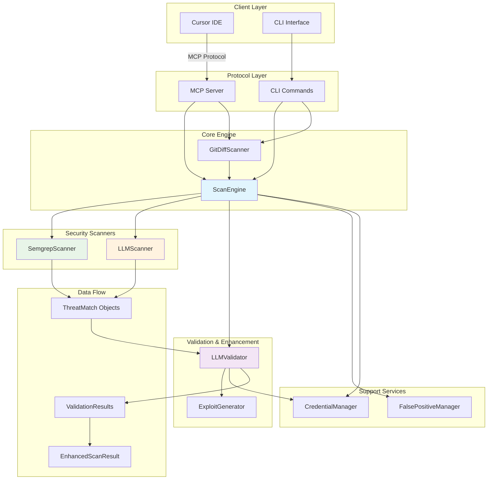

# Adversary MCP Server - Architecture

## System Overview

The Adversary MCP Server features a **hybrid multi-engine architecture** with integrated validation for comprehensive security analysis. The system combines static analysis, AI-powered detection, and intelligent validation to provide accurate threat detection with minimal false positives.

## 🏗️ System Architecture



## Core Components

### 1. MCP Server Layer (`server.py`)

**Purpose**: Protocol adapter between MCP clients and security analysis engine

**Key Responsibilities**:
- Handle MCP protocol messages
- Validate tool requests and parameters
- Route requests to appropriate handlers
- Format responses for MCP clients
- Manage server lifecycle and resources

**MCP Tools Exposed**:
```python
# Security Analysis Tools
adv_scan_code       # Analyze code snippets
adv_scan_file       # Scan individual files
adv_diff_scan       # Git diff-aware scanning
adv_generate_exploit# Generate proof-of-concept exploits

# False Positive Management
adv_mark_false_positive    # Mark findings as false positives
adv_unmark_false_positive  # Remove false positive marking
adv_list_false_positives   # List all false positives
```

### 2. Scan Engine Layer (`scan_engine.py`)

**Purpose**: Orchestrates security scanners and aggregates results from Semgrep and LLM analysis

**Key Components**:

#### ScanEngine
```python
class ScanEngine:
    def __init__(self, credential_manager):
        self.credential_manager = credential_manager
        self.semgrep_scanner = SemgrepScanner()          # Static analysis
        self.llm_analyzer = LLMScanner()                 # AI-powered analysis
        self.false_positive_manager = FalsePositiveManager()

        # Configuration
        self.enable_llm_analysis = True      # LLM enabled by default
        self.enable_semgrep_analysis = True  # Semgrep enabled by default
```

#### EnhancedScanResult
```python
@dataclass
class EnhancedScanResult:
    file_path: str
    language: Language
    llm_threats: list[ThreatMatch]      # LLM scanner results
    semgrep_threats: list[ThreatMatch]  # Semgrep scanner results
    scan_metadata: dict[str, Any]       # Execution metadata

    @property
    def all_threats(self) -> list[ThreatMatch]:
        """Aggregated and deduplicated threats from both scanners"""
```

### 3. Security Scanner Components

#### LLM Scanner (`llm_scanner.py`)
- **Technology**: Client-based LLM analysis through prompts
- **Strengths**: Context-aware, business logic understanding, novel vulnerability detection
- **Use Cases**: Complex vulnerabilities, code review, contextual analysis
- **Analysis Flow**:
  ```
  Code Input → Prompt Generation → Client LLM → Result Parsing → ThreatMatch Objects
  ```
- **Key Features**:
  - Generates structured prompts for client LLMs
  - Parses JSON responses into security findings
  - Comprehensive vulnerability coverage (25+ types)
  - Confidence scoring and CWE mapping

#### Semgrep Scanner (`semgrep_scanner.py`)
- **Technology**: Semgrep static analysis engine
- **Strengths**: Industry-standard rules, comprehensive coverage, performance
- **Use Cases**: Compliance scanning, comprehensive security assessment
- **Optimization Features**:
  - Async subprocess execution
  - Timeout management
  - Result caching
  - Error recovery
  - Language-specific rule selection

### 4. Support Components

#### False Positive Manager (`false_positive_manager.py`)
- **Purpose**: Manages false positive findings to reduce noise
- **Features**:
  - UUID-based finding tracking
  - Persistent storage (SQLite)
  - Reviewer attribution
  - Batch operations
  - Integration with all scanners

#### Exploit Generator (`exploit_generator.py`)
- **Purpose**: Generate educational proof-of-concept exploits
- **Features**:
  - Template-based exploit generation
  - LLM-powered exploit creation
  - Safety filtering and sanitization
  - Multiple exploit variations
  - Educational warnings and context

#### Git Diff Scanner (`diff_scanner.py`)
- **Purpose**: Analyze only changed code in git commits/branches
- **Features**:
  - Git diff parsing and analysis
  - Line-accurate threat reporting
  - Branch comparison support
  - CI/CD pipeline integration
  - Reduced false positives from existing code

## Data Flow Architecture

### 1. Single File Scan Flow

```
Input File → Language Detection → Parallel Scanning
                                      ↓
┌─────────────────┐              │              ┌─────────────────┐
│  Semgrep Scan   │              │              │   LLM Analysis  │
│                 │              │              │                 │
│ • Rule matching │              │              │ • Prompt gen    │
│ • Static analysis│              │              │ • Client LLM    │
│ • Fast execution│              │              │ • JSON parsing  │
└─────────────────┘              │              └─────────────────┘
        ↓                        │                       ↓
  Semgrep Results                │                 LLM Results
        ↓                        │                       ↓
        └────────────────────────┼───────────────────────┘
                                 ↓
                      Result Aggregation & Deduplication
                                 ↓
                         Enhanced Scan Result
                                 ↓
                     False Positive Filtering
                                 ↓
                          Final Results
```

### 2. Git Diff Scan Flow

```
Git Branches → Diff Extraction → Changed Lines Identification
                                         ↓
                           Only Scan Added Lines
                                         ↓
                              Apply Normal Scan Flow
                                         ↓
                           Map Results to Original Line Numbers
                                         ↓
                              Final Diff Results
```

## Performance Characteristics

### Scan Engine Performance

| Component | Execution Model | Typical Speed | Memory Usage |
|-----------|----------------|---------------|--------------|
| Semgrep Scanner | Subprocess | ~2-5s per file | Low (50-100MB) |
| LLM Scanner | Client-based prompts | Variable | Minimal (client-side) |
| Result Aggregation | Synchronous | <100ms | Low (10-50MB) |

### Optimization Strategies

1. **Parallel Execution**: Semgrep and LLM analysis run concurrently
2. **Language Detection**: Skip unsupported files early
3. **Diff-Aware Scanning**: Only analyze changed code
4. **Result Caching**: Cache Semgrep results where applicable
5. **False Positive Management**: Filter known false positives

## Error Handling & Resilience

### Graceful Degradation
- If Semgrep unavailable: Fall back to LLM-only analysis
- If LLM unavailable: Continue with Semgrep-only analysis
- Timeout handling for all external processes
- Comprehensive logging and error reporting

### Input Validation
- File type validation
- Size limits enforcement
- Language detection verification
- Branch/commit validation for diff scans

## Configuration Management

### Security Configuration (`security_config.py`)
```python
@dataclass
class SecurityConfig:
    # Scanner Configuration
    enable_llm_analysis: bool = True
    enable_semgrep_scanning: bool = True

    # Semgrep Configuration
    semgrep_timeout: int = 60
    semgrep_api_key: str | None = None

    # Analysis Limits
    max_file_size_mb: int = 10
    timeout_seconds: int = 300
    severity_threshold: str = "medium"

    # Safety Configuration
    exploit_safety_mode: bool = True
```

## Integration Points

### MCP Protocol Integration
- **Client**: Claude Code IDE
- **Protocol**: Model Context Protocol
- **Transport**: JSON-RPC over stdio
- **Tools**: 7 exposed security analysis tools

### CLI Integration
- **Interface**: Rich-based command line interface
- **Commands**: configure, status, scan, demo, false-positive management
- **Output**: Formatted tables, JSON export, colored output

### Git Integration
- **Diff Analysis**: Branch comparison and commit analysis
- **Working Directory**: Flexible path configuration
- **Branch Validation**: Automatic branch existence checking

## Extensibility

### Adding New Scanners
The architecture supports adding new scanners by:
1. Implementing the scanner interface
2. Adding to ScanEngine initialization
3. Updating result aggregation logic
4. Adding configuration options

### Custom Security Rules
While the AST/Rules engine was removed, custom security analysis can be added through:
1. **Semgrep Rules**: Custom semgrep rule configuration
2. **LLM Prompts**: Enhanced prompts for specific security concerns
3. **Exploit Templates**: Custom exploit generation templates

## Security Considerations

### Safe Operation
- No external network calls (except Semgrep updates)
- Client-based LLM analysis (no API keys transmitted)
- Exploit generation includes safety warnings
- File access limited to specified directories

### Data Handling
- No persistent storage of scanned code
- False positive data stored locally
- Configuration data encrypted where sensitive
- Comprehensive audit logging

## Future Architecture Considerations

### Potential Enhancements
1. **Plugin System**: Dynamic scanner loading
2. **Distributed Scanning**: Multiple node support
3. **Web Interface**: Browser-based management
4. **CI/CD Integration**: Enhanced pipeline support
5. **Custom Rule Engine**: Lightweight replacement for AST engine

### Scalability
- Current design optimized for single-user development
- Can be extended for team/organization use
- Stateless design supports horizontal scaling
- Database backend could replace SQLite for larger deployments
