# CLAUDE.md

This file provides guidance to Claude Code (claude.ai/code) when working with code in this repository.

## Virtual Environment

**IMPORTANT**: This repository uses a virtual environment located at `.venv` in the repo root. Always activate it before running any commands:

```bash
source .venv/bin/activate
```

## Development Commands

### Testing
- `make test` - Run full test suite with coverage (must pass 75% threshold)
- `make test-fast` - Quick test run without coverage reporting
- `make test-unit` - Run only unit tests (exclude integration tests)
- `make test-integration` - Run only integration tests
- `make test-security` - Run security-specific tests
- `pytest tests/test_specific_module.py` - Run tests for specific module

### Code Quality
- `make lint` - Run all linting (ruff, mypy, black)
- `make format` - Auto-format code with black and isort
- `make mypy` - Type checking only
- `make ruff` - Linting only
- `make ruff-fix` - Auto-fix linting issues
- `make security-scan` - Run bandit and semgrep security analysis

### Development Setup
- `make dev-setup-uv` - Setup development environment with uv (recommended)
- `make dev-setup` - Setup development environment with pip
- `uv venv && source .venv/bin/activate` - Create and activate virtual environment
- `uv pip install -e ".[dev]"` - Install in development mode

### Building and Distribution
- `make build` - Build package for distribution
- `make clean` - Clean build artifacts and cache files

## Clean Architecture Overview

This is a security analysis MCP (Model Context Protocol) server that provides vulnerability scanning capabilities through Cursor IDE integration. The system follows **Clean Architecture principles** with a **hybrid multi-engine approach** combining static analysis (Semgrep), AI-powered analysis (LLM), and intelligent validation for comprehensive security scanning.

## Clean Architecture Structure

The system is organized in layers following Clean Architecture principles:

### 🔵 **Domain Layer** (Core Business Logic)
- **Entities**: `ScanRequest`, `ScanResult`, `ThreatMatch` - Rich domain objects with business behavior
- **Value Objects**: `ScanContext`, `SeverityLevel`, `ConfidenceScore`, `FilePath` - Immutable domain concepts
- **Domain Services**: `ScanOrchestrator`, `ThreatAggregator`, `ValidationService` - Pure business orchestration
- **Interfaces**: `IScanStrategy`, `IValidationStrategy`, `IThreatAggregator` - Domain contracts

### 🟢 **Application Layer** (Use Cases & Coordination)
- **Adapters**: `SemgrepScanStrategy`, `LLMScanStrategy`, `LLMValidationStrategy` - Infrastructure adapters
- **Bootstrap**: `CleanArchitectureBootstrap` - Dependency injection and service configuration
- **MCP Server**: `CleanMCPServer` - Model Context Protocol implementation
- **CLI**: `CleanCLI` - Command-line interface implementation

### 🟡 **Infrastructure Layer** (External Concerns)
- **Scanners**: `SemgrepScanner`, `LLMScanner` - External security analysis engines
- **Validators**: `LLMValidator` - AI-powered validation services
- **Storage**: Database, cache, and persistence implementations
- **External APIs**: Credential management, telemetry, logging

## Clean Architecture Data Flow

```mermaid
graph TB
    subgraph "🔵 Domain Layer (Core)"
        subgraph "Domain Entities"
            DE1[ScanRequest]
            DE2[ScanResult]
            DE3[ThreatMatch]
        end

        subgraph "Domain Services"
            DS1[ScanOrchestrator]
            DS2[ThreatAggregator]
            DS3[ValidationService]
        end

        subgraph "Domain Interfaces"
            DI1[IScanStrategy]
            DI2[IValidationStrategy]
            DI3[IThreatAggregator]
        end
    end

    subgraph "🟢 Application Layer (Use Cases)"
        subgraph "Adapters"
            A1[SemgrepScanStrategy]
            A2[LLMScanStrategy]
            A3[LLMValidationStrategy]
        end

        subgraph "Application Services"
            AS1[CleanMCPServer]
            AS2[CleanCLI]
            AS3[Bootstrap]
        end
    end

    subgraph "🟡 Infrastructure Layer (External)"
        subgraph "Security Engines"
            I1[SemgrepScanner]
            I2[LLMScanner]
            I3[LLMValidator]
        end

        subgraph "External Services"
            I4[Database]
            I5[FileSystem]
            I6[CredentialManager]
        end
    end

    subgraph "🔴 Interface Layer (Entry Points)"
        INT1[Cursor IDE via MCP]
        INT2[Command Line]
        INT3[Direct API]
    end

    %% Interface to Application
    INT1 --> AS1
    INT2 --> AS2
    INT3 --> AS3

    %% Application to Domain (via Interfaces)
    AS1 --> DS1
    AS2 --> DS1
    A1 -.->|implements| DI1
    A2 -.->|implements| DI1
    A3 -.->|implements| DI2

    %% Domain Services Coordination
    DS1 --> DS2
    DS1 --> DS3
    DS1 --> DE1
    DS1 --> DE2
    DS2 --> DE3
    DS3 --> DE3

    %% Adapters to Infrastructure
    A1 --> I1
    A2 --> I2
    A3 --> I3

    %% Infrastructure Dependencies
    I1 --> I5
    I2 --> I6
    I3 --> I6
    AS3 --> I4

    style DE1 fill:#e3f2fd
    style DE2 fill:#e3f2fd
    style DE3 fill:#e3f2fd
    style DS1 fill:#1976d2,color:#fff
    style DS2 fill:#1976d2,color:#fff
    style DS3 fill:#1976d2,color:#fff
    style A1 fill:#4caf50,color:#fff
    style A2 fill:#4caf50,color:#fff
    style A3 fill:#4caf50,color:#fff
```



## Clean Architecture Implementation Details

### 🔵 **Domain Layer Components** (Pure Business Logic)

#### **Domain Entities** (`src/adversary_mcp_server/domain/entities/`)
Rich objects with business behavior and invariants:

- **`ScanRequest`** - Encapsulates scan parameters and context with validation rules
- **`ScanResult`** - Aggregates scan results with statistics and domain methods
- **`ThreatMatch`** - Domain model for security vulnerabilities with business operations

#### **Value Objects** (`src/adversary_mcp_server/domain/value_objects/`)
Immutable domain concepts with built-in validation:

- **`ScanContext`** - Complete scan context with factory methods for different scan types
- **`SeverityLevel`** - Type-safe severity levels with comparison and threshold operations
- **`ConfidenceScore`** - Confidence scoring with quality levels and threshold checking
- **`FilePath`** - Path handling with validation, normalization, and security checks
- **`ScanMetadata`** - Structured metadata with execution statistics and target information

#### **Domain Services** (`src/adversary_mcp_server/domain/services/`)
Pure business logic orchestration without infrastructure dependencies:

- **`ScanOrchestrator`** - Coordinates multiple scan strategies following domain rules
- **`ThreatAggregator`** - Aggregates and deduplicates threats using configurable strategies
- **`ValidationService`** - Orchestrates threat validation with confidence filtering

#### **Domain Interfaces** (`src/adversary_mcp_server/domain/interfaces.py`)
Contracts defining behavior without implementation details:

- **`IScanStrategy`** - Contract for security analysis strategies (Semgrep, LLM, etc.)
- **`IValidationStrategy`** - Contract for threat validation implementations
- **`IThreatAggregator`** - Contract for threat aggregation and deduplication

### 🟢 **Application Layer Components** (Use Cases & Coordination)

#### **Adapters** (`src/adversary_mcp_server/application/adapters/`)
Bridge domain interfaces with infrastructure implementations:

- **`SemgrepScanStrategy`** - Adapts SemgrepScanner to domain IScanStrategy interface
- **`LLMScanStrategy`** - Adapts LLMScanner to domain IScanStrategy interface
- **`LLMValidationStrategy`** - Adapts LLMValidator to domain IValidationStrategy interface
- **`TelemetryAdapter`** - Extracts telemetry from domain objects for metrics collection

#### **Application Services** (`src/adversary_mcp_server/application/`)
Coordinate use cases and handle cross-cutting concerns:

- **`ScanApplicationService`** - Core scanning orchestration using domain services
- **`ScanResultPersistenceService`** - Automatic scan result persistence with multi-format support
- **`FalsePositiveService`** - Clean Architecture false positive management
- **`CleanMCPServer`** (`mcp/clean_server.py`) - MCP protocol implementation using Clean Architecture
- **`CleanCLI`** (`cli/clean_cli.py`) - Command-line interface using domain services
- **`CleanArchitectureBootstrap`** (`bootstrap_clean.py`) - Dependency injection configuration

### 🟡 **Infrastructure Layer Components** (External Systems)

#### **Security Analysis Engines** (`src/adversary_mcp_server/scanner/`)
External tools wrapped by adapters:

- **`SemgrepScanner`** - Static analysis using Semgrep with Pro/Community rule detection
- **`LLMScanner`** - AI-powered analysis with client-side LLM integration
- **`LLMValidator`** - AI validation for false positive reduction and threat enhancement

#### **External Services Integration**
- **Database Layer** - SQLite/SQLAlchemy for persistence (false positive tracking, telemetry)
- **File System** - Secure file access with path validation and permission checking
- **Credential Management** - API key and secret management for external services
- **Telemetry Services** - Metrics collection and performance monitoring

### **Clean Architecture Benefits Achieved**

#### ✅ **Dependency Inversion**
- Domain layer has no dependencies on external frameworks
- Infrastructure depends on domain interfaces, not concrete implementations
- Adapters translate between domain concepts and external systems

#### ✅ **Separation of Concerns**
- Business rules isolated in domain services
- Infrastructure concerns separated from business logic
- UI/API concerns handled at application boundaries

#### ✅ **Testability**
- Domain logic tested independently with unit tests
- Integration tests validate adapter and infrastructure layers
- Mock strategies enable fast, reliable testing

#### ✅ **Flexibility & Maintainability**
- Easy to swap infrastructure implementations (different scanners, databases)
- Domain logic changes don't require infrastructure modifications
- Clear boundaries make understanding and modification easier

### Data Flow Architecture

#### Standard Scanning Workflow
1. **Input Processing**: Code/file received via MCP tool or CLI
2. **Parallel Analysis**: SemgrepScanner and LLMScanner execute concurrently
3. **Result Collection**: ThreatMatch objects collected from both scanners
4. **Validation Processing**: LLMValidator analyzes findings for legitimacy
5. **False Positive Filtering**: Validated results filtered by confidence threshold
6. **Exploit Generation**: Confirmed vulnerabilities enhanced with POCs
7. **Result Synthesis**: EnhancedScanResult with metadata and statistics
8. **Client Response**: Formatted results returned to Cursor IDE or CLI

#### Git Diff-Aware Scanning
1. **Branch Analysis**: GitDiffScanner extracts changed lines between branches
2. **Context Building**: Full file context built around changed lines
3. **Targeted Scanning**: Only new/modified code analyzed by scan engines
4. **Line Mapping**: Results mapped back to original file line numbers
5. **Validation & Enhancement**: Same validation workflow as standard scanning

#### LLM Validation Workflow
1. **Finding Collection**: Threats from all scanners aggregated
2. **Prompt Generation**: Structured validation prompts created
3. **Client Analysis**: Prompts sent to client-side LLM for analysis
4. **Result Parsing**: JSON responses parsed into ValidationResult objects
5. **Confidence Filtering**: Findings below threshold marked as false positives
6. **Enhancement**: Legitimate findings enhanced with exploitation details

### Key Features

#### Multi-Engine Analysis
- **Complementary Coverage**: Static analysis + AI reasoning + validation
- **Intelligent Deduplication**: Similar findings merged across engines
- **Confidence Scoring**: Each finding assigned reliability metrics
- **Smart Result Merging**: Best-of-breed approach for maximum accuracy

#### Advanced Validation System
- **False Positive Reduction**: LLMValidator filters noise with 70% default confidence threshold
- **Exploitation Analysis**: Confirmed vulnerabilities include attack vectors
- **Severity Adjustment**: Validator can modify threat severity based on context
- **Educational Enhancement**: Detailed remediation advice and exploit examples

#### Developer Experience
- **Real-Time Analysis**: Background scanning in Cursor IDE
- **Git Integration**: Diff-aware scanning for efficient CI/CD
- **CLI Flexibility**: Full command-line interface with validation controls
- **Rich Output**: Structured JSON results with comprehensive metadata

#### Automatic Scan Result Persistence
- **Multi-Format Support**: Automatically saves scan results in JSON, Markdown, and CSV formats
- **Smart File Placement**: Context-aware automatic placement logic
  - **File scans**: `.adversary.*` files placed in same directory as scanned file
  - **Directory scans**: `.adversary.*` files placed in the scanned directory
  - **Code scans**: `.adversary.*` files placed in current working directory
- **Conflict Resolution**: Automatic incremental suffixes (`adversary-1.json`, etc.) when files exist
- **MCP Integration**: All MCP tools support `output_format` parameter (`json`, `md`, `markdown`, `csv`)
- **CLI Integration**: Automatic persistence in all CLI scan commands with verbose reporting
- **Error Resilience**: Scans continue successfully even if persistence fails
- **Clean Architecture**: Built using domain services with proper dependency injection

#### False Positive Management (Clean Architecture)
- **Domain-Driven Design**: `FalsePositiveInfo` value object with immutable validation rules
- **Repository Pattern**: `IFalsePositiveRepository` interface with JSON file adapter
- **Application Service**: `FalsePositiveService` provides business logic for marking/unmarking
- **MCP Tool Support**: `adv_mark_false_positive` and `adv_unmark_false_positive` tools
- **Data Persistence**: False positive information stored directly in `.adversary.json` files
- **Performance Optimization**: Intelligent caching with automatic cache invalidation
- **Statistics & Reporting**: Comprehensive false positive analytics and reporting

### Testing Strategy

- **Unit Tests**: Individual component testing with mocks
- **Integration Tests**: Full workflow testing with real files
- **Security Tests**: Validate detection accuracy and exploit safety
- **Validation Tests**: Comprehensive LLMValidator functionality testing
- **Coverage**: Maintain 75%+ test coverage requirement
- **Markers**: Tests marked as `unit`, `integration`, `security`, `slow`

### Development Guidelines

#### Code Organization
- All source code in `src/adversary_mcp_server/`
- Comprehensive type hints required (mypy strict mode)
- Follow black formatting and isort import organization
- Use pydantic for data validation and serialization

#### Security Considerations
- This is a **defensive security tool** only
- Exploit generation includes safety warnings and educational context
- All analysis focuses on vulnerability detection and remediation
- No malicious code generation or attack facilitation
- LLM validation runs client-side (no API keys transmitted)

#### Error Handling
- Use `AdversaryToolError` for tool-specific failures
- Comprehensive logging with structured messages
- Graceful degradation when LLM analysis unavailable
- Input validation using pydantic models
- Fail-safe validation (unknown findings kept when validation fails)

#### SSL/TLS and Corporate Environment Support
- **Truststore Integration**: Both CLI and MCP entry points inject `truststore.inject_into_ssl()` for corporate CA support
- **Netskope Compatibility**: Automatic SSL context injection handles corporate SSL inspection tools
- **Entry Point Coverage**:
  - CLI (`clean_cli.py::main()`) - Injected before any CLI operations
  - MCP Server (`sync_main.py::main()`) - Injected before MCP server startup
- **Graceful Fallback**: Missing truststore package falls back to system SSL configuration
- **Network Client Support**: All OpenAI/Anthropic API calls inherit the enhanced SSL context
- **Error Resilience**: Failed truststore injection logs debug messages but doesn't block execution

### MCP Integration

The server provides tools for Cursor IDE through the MCP protocol:
- Configure in `.cursor/mcp.json` with Python path and environment variables
- Tools accept structured parameters with validation
- Results include detailed findings, metadata, and remediation guidance
- Validation can be enabled/disabled per scan operation
- **Automatic Persistence**: All scan tools automatically create `.adversary.*` files alongside scanned code
- **Multi-Format Support**: `output_format` parameter supports `json`, `md`, `markdown`, `csv` formats
- **Persistence Metadata**: MCP responses include persistence information (file path, format, success status)
- Hot-reload capability for real-time rule updates during development

### MCP Tool Design Patterns

**IMPORTANT**: Each MCP tool has a unique workflow and should NOT be implemented as abstractions of each other:

#### Directory Scan (`adv_scan_directory`)
- **Purpose**: Directory-level security analysis
- **Workflow**: Scan entire directory as single unit, return directory-level results
- **Implementation**: Uses `semgrep.scan_directory()` and `llm.analyze_directory()` directly
- **Output**: Single `EnhancedScanResult` with directory-level threats and metadata
- **DO NOT**: Process files individually within directory scan workflow

#### File Scan (`adv_scan_file`)
- **Purpose**: Individual file security analysis
- **Workflow**: Scan single file, return file-level results
- **Implementation**: Uses `semgrep.scan_file()` and `llm.analyze_file()` directly
- **Output**: Single `EnhancedScanResult` with file-level threats and metadata
- **DO NOT**: Iterate through directories within file scan workflow

#### Code Scan (`adv_scan_code`)
- **Purpose**: Code snippet security analysis
- **Workflow**: Scan code string, return code-level results
- **Implementation**: Uses `semgrep.scan_code()` and `llm.analyze_code()` directly
- **Output**: Single `EnhancedScanResult` with code-level threats and metadata
- **DO NOT**: Persist code to files or abstract to file/directory scanning

**Anti-Pattern**: Directory scan calling file scan repeatedly, or file scan abstracting to code scan. Each tool should have its own complete, optimized workflow for maximum performance and clarity.

### CLI Integration

Full command-line interface with validation support:
- `--use-validation/--no-validation` flags control LLM validation
- `--use-llm/--no-llm` and `--use-semgrep/--no-semgrep` control scan engines
- **Automatic Persistence**: All CLI scan commands automatically create `.adversary.*` files alongside scanned code
- **Multi-Format Support**: `--output-format` parameter supports `json`, `markdown`, `csv` formats
- **Verbose Reporting**: `--verbose` flag shows persistence file locations and status
- Status command shows validation availability and configuration
- Git diff scanning fully supported with validation
- JSON output includes validation statistics and metadata

- I want to define something called a symmetry test. I want the symmetry test, when I ask for it, to test both the MCP tool as well as the scan tool and ensure that both of the scan results with the same configuration come back symmetrical. This way we know that the CLI interface and the MCP tool interface are both getting the same results back to the user. I want to do this for the file tool and the scan file logic in the CLI, and I want to do it for the folder tool and the scan subcommand in the CLI pointing to that folder. Can you help remember so that when I say symmetry test, you know to perform these things?
- Make sure that when I call for a symmetry test, we target the examples/ subfolder in the project. Pick any file within that folder for your file testing.
- use your Bash and my MCP tools as part of the testing when I call for a symmetry test.

- Please do not use any inline import statement. All imports should go at the top of the file and be ordered with pythonic order.

- No raw SQL statements are allowed in this codebase. every database interaction must use sqlalchemy.
