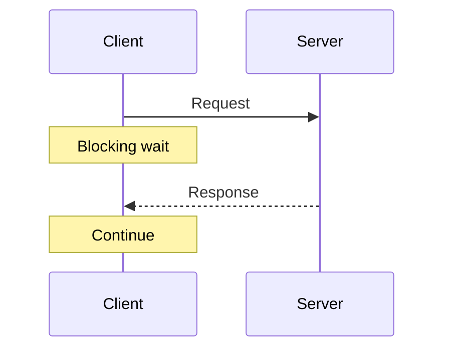
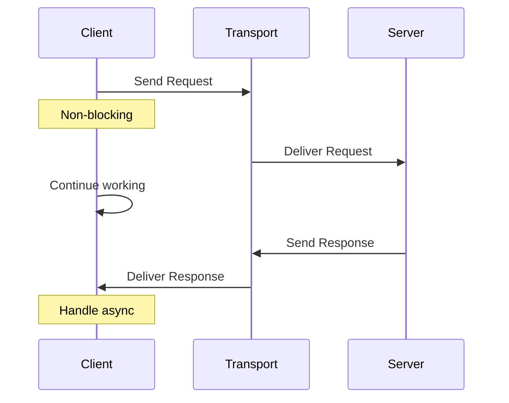

asyncmcp provides custom transport implementations for the Model Context Protocol that enable non-blocking, queue-based, and webhook-driven communication patterns.

## Why Async Transports?

### Traditional MCP Limitations

Standard MCP transports (stdio, Streamable HTTP) follow a synchronous request-response pattern:



This works well for immediate operations but becomes problematic for:
- Long-running computations
- Batch processing jobs
- External API calls with variable latency
- Resource-intensive operations

### Async Transport Benefits

<CardGroup cols={2}>
  <Card title="Non-Blocking" icon="bolt">
    Clients can send requests and continue working while servers process asynchronously
  </Card>
  
  <Card title="Scalability" icon="chart-line">
    Distribute work across multiple workers and scale horizontally based on load
  </Card>
  
  <Card title="Reliability" icon="shield">
    Built-in message persistence and retry mechanisms ensure delivery
  </Card>
  
  <Card title="Decoupling" icon="link-slash">
    Clients and servers don't need direct connections, reducing dependencies
  </Card>
</CardGroup>

## How Async Transports Work

Async transports separate request submission from response delivery:



## How asyncmcp Implements MCP Transports

### Custom Initialization Protocol

asyncmcp implements custom initialization protocols to establish async transport connections. Each transport uses the `params` field in the initialize request to communicate transport-specific configuration:

<Tabs>
  <Tab title="SQS">
    The client includes its response queue URL in the initialize request:
    ```json
    {
      "jsonrpc": "2.0",
      "method": "initialize",
      "params": {
        "response_queue_url": "https://sqs.region.amazonaws.com/account/client-responses",
        "clientInfo": {
          "name": "example-client",
          "version": "1.0.0"
        }
      }
    }
    ```
    The server extracts this URL to send responses back to the client's specific queue.
  </Tab>
  
  <Tab title="SNS+SQS">
    The client provides its SNS topic ARN for response routing:
    ```json
    {
      "jsonrpc": "2.0",
      "method": "initialize",
      "params": {
        "client_topic_arn": "arn:aws:sns:region:account:client-topic",
        "clientInfo": {
          "name": "example-client",
          "version": "1.0.0"
        }
      }
    }
    ```
    The server publishes responses to this topic, which the client's SQS queue subscribes to.
  </Tab>
  
  <Tab title="Webhook">
    The client specifies its webhook endpoint URL via the `_meta` field:
    ```json
    {
      "jsonrpc": "2.0",
      "method": "initialize",
      "params": {
        "_meta": {
          "webhookUrl": "https://client.example.com/webhook/responses"
        },
        "clientInfo": {
          "name": "example-client",
          "version": "1.0.0"
        }
      }
    }
    ```
    The server POSTs responses to this webhook URL for async delivery.
  </Tab>
  
  <Tab title="StreamableHTTP + Webhook">
    The hybrid transport also uses `_meta` to provide the webhook URL for async operations:
    ```json
    {
      "jsonrpc": "2.0",
      "method": "initialize",
      "params": {
        "_meta": {
          "webhookUrl": "https://client.example.com/webhook/async-responses"
        },
        "clientInfo": {
          "name": "hybrid-client",
          "version": "1.0.0"
        }
      }
    }
    ```
    The server uses SSE for immediate responses and webhooks for long-running tool calls.
  </Tab>
</Tabs>

### Session Management

Each transport maintains session state through:
- **Session IDs**: Unique identifiers for each client connection
- **Client IDs**: Persistent identifiers across reconnections
- **Protocol versioning**: Ensures compatibility between client and server

These are transmitted via transport-specific message attributes (SQS/SNS) or HTTP headers (Webhook).


## Next Steps

<CardGroup cols={2}>
  {/* <Card title="Session Management" icon="users" href="/concepts/session-management">
    Learn how sessions work in async transports
  </Card> */}
  
  <Card title="SQS Transport" icon="inbox" href="/transports/sqs">
    Queue-based async messaging
  </Card>
  
  <Card title="Examples" icon="code" href="/examples/basic-examples">
    See async transports in action
  </Card>
  
  <Card title="Proxy Server" icon="server" href="/proxy">
    Bridge standard clients with async transports
  </Card>
</CardGroup>