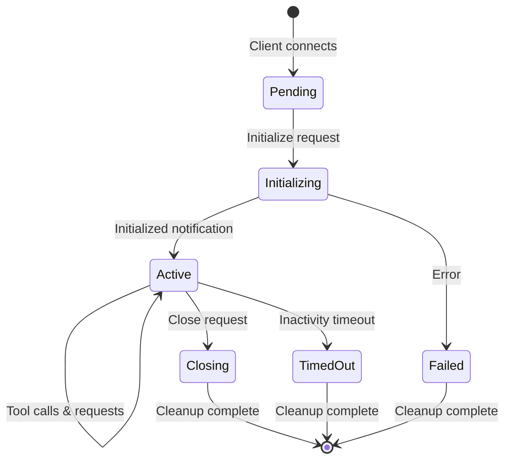

## Overview

Session management is critical in asyncmcp for maintaining client state, routing responses, and ensuring proper resource cleanup across asynchronous transport boundaries.

## Session Lifecycle



## Session States

<Tabs>
  <Tab title="INIT_PENDING">
    **Initial state when client connects**
    
    - Session created but not initialized
    - Waiting for `initialize` request
    - Response endpoint not yet established
    - Timeout: 30 seconds (configurable)
  </Tab>
  
  <Tab title="INITIALIZED">
    **Active session ready for requests**
    
    - Client fully connected and authenticated
    - Response endpoint configured
    - Can process tool calls and other requests
    - Activity timeout: 5 minutes (configurable)
  </Tab>
  
  <Tab title="CLOSING">
    **Session terminating gracefully**
    
    - Close request received
    - Finishing pending operations
    - Cleaning up resources
    - No new requests accepted
  </Tab>
  
  <Tab title="TIMED_OUT">
    **Session expired due to inactivity**
    
    - No activity within timeout period
    - Resources being reclaimed
    - Client must reconnect
    - Pending operations cancelled
  </Tab>
</Tabs>

## Session Identification

### Session ID Generation

```python
import uuid
from datetime import datetime

def generate_session_id() -> str:
    """Generate unique session identifier."""
    # Format: prefix_timestamp_uuid
    timestamp = datetime.utcnow().strftime('%Y%m%d%H%M%S')
    unique_id = str(uuid.uuid4())[:8]
    return f"mcp_{timestamp}_{unique_id}"

# Example: mcp_20240315143022_a1b2c3d4
```

### Session ID in Messages

<CodeGroup>
```json Initialize Request
{
  "jsonrpc": "2.0",
  "id": 1,
  "method": "initialize",
  "params": {
    "protocolVersion": "2024-11-05",
    "capabilities": {},
    "clientInfo": {
      "name": "my-client",
      "version": "1.0.0"
    },
    "_meta": {
      "session_id": "mcp_20240315143022_a1b2c3d4",
      "response_queue_url": "https://sqs.../client-queue"
    }
  }
}
```

```json Subsequent Request
{
  "jsonrpc": "2.0",
  "id": 2,
  "method": "tools/call",
  "params": {
    "name": "fetch",
    "arguments": {"url": "https://example.com"}
  },
  "_meta": {
    "session_id": "mcp_20240315143022_a1b2c3d4"
  }
}
```
</CodeGroup>

## Session Storage

### In-Memory Storage

```python
from dataclasses import dataclass
from typing import Dict, Optional
from datetime import datetime

@dataclass
class SessionData:
    """Session information storage."""
    session_id: str
    client_info: dict
    response_endpoint: str  # Queue URL or webhook URL
    state: SessionState
    created_at: datetime
    last_activity: datetime
    metadata: dict = None

class SessionStore:
    """In-memory session storage."""
    
    def __init__(self):
        self._sessions: Dict[str, SessionData] = {}
        self._lock = asyncio.Lock()
    
    async def create_session(self, session_id: str, data: SessionData) -> None:
        async with self._lock:
            self._sessions[session_id] = data
    
    async def get_session(self, session_id: str) -> Optional[SessionData]:
        return self._sessions.get(session_id)
    
    async def update_activity(self, session_id: str) -> None:
        if session := self._sessions.get(session_id):
            session.last_activity = datetime.utcnow()
    
    async def remove_session(self, session_id: str) -> None:
        async with self._lock:
            self._sessions.pop(session_id, None)
```

### Persistent Storage (Optional)

<Tabs>
  <Tab title="Redis">
    ```python
    import redis.asyncio as redis
    import json
    
    class RedisSessionStore:
        def __init__(self, redis_client: redis.Redis):
            self.redis = redis_client
        
        async def create_session(self, session_id: str, data: SessionData):
            await self.redis.setex(
                f"session:{session_id}",
                300,  # 5 minute TTL
                json.dumps(asdict(data), default=str)
            )
        
        async def get_session(self, session_id: str) -> Optional[SessionData]:
            if data := await self.redis.get(f"session:{session_id}"):
                return SessionData(**json.loads(data))
            return None
    ```
  </Tab>
  
  <Tab title="DynamoDB">
    ```python
    import boto3
    from boto3.dynamodb.conditions import Key
    
    class DynamoDBSessionStore:
        def __init__(self, table_name: str):
            self.table = boto3.resource('dynamodb').Table(table_name)
        
        async def create_session(self, session_id: str, data: SessionData):
            self.table.put_item(
                Item={
                    'session_id': session_id,
                    'data': asdict(data),
                    'ttl': int(time.time()) + 300  # 5 minute TTL
                }
            )
    ```
  </Tab>
</Tabs>

## Response Routing

### Endpoint Discovery

Each transport discovers client endpoints differently:

<AccordionGroup>
  <Accordion title="SQS Transport">
    ```python
    # Client provides response queue URL in initialize
    def extract_response_endpoint(self, initialize_params: dict) -> str:
        return initialize_params.get('response_queue_url')
    
    # Or use dynamic queue creation
    async def create_response_queue(self, session_id: str) -> str:
        response = await self.sqs_client.create_queue(
            QueueName=f"mcp-response-{session_id}"
        )
        return response['QueueUrl']
    ```
  </Accordion>
  
  <Accordion title="SNS+SQS Transport">
    ```python
    # Client subscribes to response topic
    def setup_response_routing(self, session_id: str, client_queue: str):
        self.sns_client.subscribe(
            TopicArn=self.response_topic_arn,
            Protocol='sqs',
            Endpoint=client_queue,
            Attributes={
                'FilterPolicy': json.dumps({
                    'session_id': [session_id]
                })
            }
        )
    ```
  </Accordion>
  
  <Accordion title="Webhook Transport">
    ```python
    # Client provides webhook URL in metadata
    def extract_webhook_url(self, initialize_params: dict) -> str:
        meta = initialize_params.get('_meta', {})
        return meta.get('webhook_url')
    
    # Validate webhook is reachable
    async def validate_webhook(self, url: str) -> bool:
        async with httpx.AsyncClient() as client:
            response = await client.head(url)
            return response.status_code == 200
    ```
  </Accordion>
</AccordionGroup>

### Message Routing

```python
class MessageRouter:
    """Routes responses to correct client endpoints."""
    
    async def route_response(self, session_id: str, response: dict) -> None:
        """Send response to client's endpoint."""
        
        # Get session data
        session = await self.session_store.get_session(session_id)
        if not session:
            raise SessionNotFoundError(session_id)
        
        # Add session metadata
        response['_meta'] = {
            'session_id': session_id,
            'timestamp': datetime.utcnow().isoformat()
        }
        
        # Route based on transport type
        if session.response_endpoint.startswith('https://sqs'):
            await self.send_to_sqs(session.response_endpoint, response)
        elif session.response_endpoint.startswith('http'):
            await self.send_to_webhook(session.response_endpoint, response)
        else:
            raise UnsupportedEndpointError(session.response_endpoint)
```

## Session Timeout Management

### Activity Tracking

```python
class SessionTimeoutManager:
    """Manages session timeouts and cleanup."""
    
    def __init__(self, timeout_seconds: int = 300):
        self.timeout_seconds = timeout_seconds
        self._cleanup_task = None
    
    async def start(self):
        """Start timeout monitoring."""
        self._cleanup_task = asyncio.create_task(self._cleanup_loop())
    
    async def _cleanup_loop(self):
        """Periodically check for timed-out sessions."""
        while True:
            await asyncio.sleep(30)  # Check every 30 seconds
            await self._cleanup_expired_sessions()
    
    async def _cleanup_expired_sessions(self):
        """Remove sessions that have timed out."""
        now = datetime.utcnow()
        expired = []
        
        for session_id, session in self.session_store.items():
            if (now - session.last_activity).seconds > self.timeout_seconds:
                expired.append(session_id)
        
        for session_id in expired:
            await self.terminate_session(session_id, reason="timeout")
```

### Keepalive Mechanism

<CodeGroup>
```python Server Side
# Handle keepalive messages
@app.handle_notification("keepalive")
async def handle_keepalive(params: dict):
    session_id = params.get('_meta', {}).get('session_id')
    if session_id:
        await session_store.update_activity(session_id)
        return {"status": "alive", "session_id": session_id}
```

```python Client Side
# Send periodic keepalive
async def keepalive_loop(session: ClientSession):
    while session.is_connected:
        await session.send_notification(
            "keepalive",
            {"_meta": {"session_id": session.session_id}}
        )
        await asyncio.sleep(60)  # Every minute
```
</CodeGroup>

## Concurrent Session Limits

<Warning>
Set appropriate session limits to prevent resource exhaustion.
</Warning>

```python
class SessionLimiter:
    """Enforces concurrent session limits."""
    
    def __init__(self, max_sessions: int = 1000):
        self.max_sessions = max_sessions
        self.active_sessions = 0
        self._lock = asyncio.Lock()
    
    async def acquire_slot(self) -> bool:
        """Try to acquire a session slot."""
        async with self._lock:
            if self.active_sessions >= self.max_sessions:
                return False
            self.active_sessions += 1
            return True
    
    async def release_slot(self):
        """Release a session slot."""
        async with self._lock:
            self.active_sessions = max(0, self.active_sessions - 1)
```

## Session Recovery

### Handling Disconnections

```python
class SessionRecovery:
    """Handles session recovery after disconnections."""
    
    async def attempt_recovery(self, session_id: str) -> bool:
        """Try to recover a disconnected session."""
        
        # Check if session exists and is recoverable
        session = await self.session_store.get_session(session_id)
        if not session:
            return False
        
        # Check if within recovery window (e.g., 60 seconds)
        if (datetime.utcnow() - session.last_activity).seconds > 60:
            return False
        
        # Restore session state
        session.state = SessionState.INITIALIZED
        await self.session_store.update_activity(session_id)
        
        # Re-establish transport connections if needed
        await self.reconnect_transport(session)
        
        return True
```

### Session Persistence

<Tabs>
  <Tab title="Checkpoint Strategy">
    ```python
    # Save session state periodically
    async def checkpoint_session(session_id: str):
        session = await session_store.get_session(session_id)
        await persistent_store.save(
            key=f"checkpoint:{session_id}",
            data=session.to_dict(),
            ttl=3600  # 1 hour
        )
    ```
  </Tab>
  
  <Tab title="Event Sourcing">
    ```python
    # Store session events for replay
    async def record_event(session_id: str, event: dict):
        await event_store.append(
            stream=f"session:{session_id}",
            event={
                'type': event['type'],
                'data': event['data'],
                'timestamp': datetime.utcnow()
            }
        )
    ```
  </Tab>
</Tabs>

## Best Practices

<Steps>
  <Step title="Use Appropriate Timeouts">
    Set timeouts based on your use case:
    - Interactive: 5-10 minutes
    - Batch processing: 30-60 minutes
    - Long-running: Consider disabling timeouts
  </Step>
  
  <Step title="Implement Graceful Shutdown">
    Always clean up sessions on shutdown:
    ```python
    async def shutdown():
        for session_id in list(session_store.keys()):
            await terminate_session(session_id, "shutdown")
    ```
  </Step>
  
  <Step title="Monitor Session Metrics">
    Track key metrics:
    - Active session count
    - Session duration
    - Timeout rate
    - Recovery success rate
  </Step>
  
  <Step title="Handle Edge Cases">
    Plan for:
    - Duplicate session IDs
    - Malformed session data
    - Network partitions
    - Resource limits
  </Step>
</Steps>

## Troubleshooting

<AccordionGroup>
  <Accordion title="Session Not Found Errors">
    **Symptoms**: Client receives "session not found" errors
    
    **Causes**:
    - Session timed out
    - Server restarted
    - Session limit reached
    
    **Solutions**:
    - Implement session recovery
    - Increase timeout values
    - Add persistent session storage
  </Accordion>
  
  <Accordion title="Response Routing Failures">
    **Symptoms**: Client doesn't receive responses
    
    **Causes**:
    - Incorrect endpoint URL
    - Network connectivity issues
    - Permission problems
    
    **Solutions**:
    - Validate endpoints on initialization
    - Implement retry logic
    - Check IAM permissions (for AWS)
  </Accordion>
  
  <Accordion title="Session Leaks">
    **Symptoms**: Memory usage grows over time
    
    **Causes**:
    - Sessions not cleaned up properly
    - Timeout mechanism not working
    - Error handling issues
    
    **Solutions**:
    - Audit session lifecycle
    - Add monitoring for orphaned sessions
    - Implement forced cleanup
  </Accordion>
</AccordionGroup>

## Next Steps

<CardGroup cols={2}>
  <Card title="Transports" icon="route" href="/transports/sqs">
    Learn about transport-specific session handling
  </Card>
  
  
  <Card title="Local Development" icon="laptop" href="/guides/local-development">
    Set up development environment
  </Card>
  
  {/* <Card title="Examples" icon="code" href="/examples/basic-examples">
    See code examples
  </Card> */}
</CardGroup>