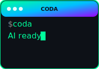

<div align="center">
  
  
  # Coda - AI Code Assistant
  
  A powerful, modular AI code assistant that brings the best of AI-powered development directly to your terminal.
</div>

---

[](https://opensource.org/licenses/MIT)
[](https://www.python.org/downloads/)
[](https://github.com/psf/black)

## ✨ What is Coda?

Coda is your AI pair programmer that lives in your terminal, built with a modular architecture that supports multiple AI providers including Oracle OCI GenAI, OpenAI, Anthropic, Google, and 100+ more via LiteLLM.

## 🏗️ Modular Architecture

Coda is built with a clean, three-layer architecture:

```
┌─────────────────────────────────────────────────┐
│                    Apps Layer                    │
│         (CLI, Web UI, Plugins, Custom)          │
├─────────────────────────────────────────────────┤
│                 Services Layer                   │
│    (Integration, Orchestration, Workflows)       │
├─────────────────────────────────────────────────┤
│                   Base Layer                     │
│ (Config, Theme, Providers, Session, Search, etc) │
└─────────────────────────────────────────────────┘
```

### Base Modules

- **🔧 Config**: Unified configuration management
- **🎨 Theme**: Terminal UI and formatting
- **🤖 Providers**: AI integration
- **💬 Session**: Conversation persistence
- **🔍 Search**: Semantic code search
- **📊 Observability**: Logging and metrics

## 🚀 Quick Start

### Try without installing

```bash
# Run directly with uvx (no installation needed!)
uvx --from coda-code-assistant coda
```

### Install from PyPI

```bash
# Install with pip
pip install coda-code-assistant

# Or install with uv
uv pip install coda-code-assistant

# Run Coda
coda
```

### Install from source

```bash
# Clone the repository with submodules
git clone --recursive https://github.com/djvolz/coda-code-assistant.git
cd coda-code-assistant

# Install with uv (recommended)
uv sync

# Run Coda
uv run coda
```

### Using Individual Modules

```python
from coda.base.config import Config
from coda.base.providers import ProviderFactory

# Initialize configuration
config = Config()

# Create a provider
factory = ProviderFactory(config.to_dict())
provider = factory.create("openai")

# Start chatting
response = provider.chat(
    messages=[{"role": "user", "content": "Hello!"}],
    model="gpt-4"
)
print(response["content"])
```

## 📖 Documentation

### In-Repository Docs
- [Integration Guide](docs/integration-guide.md) - How to use modules together
- [Module Documentation](coda/base/) - Individual module READMEs
- [Example Applications](tests/examples/) - Working examples
- [Diagram Rendering Guide](docs/guides/diagram-rendering.md) - How to create diagrams

### Wiki Documentation
For comprehensive documentation, visit our **[Wiki](https://github.com/djvolz/coda-code-assistant/wiki)**:

- **[Getting Started Guide](https://github.com/djvolz/coda-code-assistant/wiki/Getting-Started)** - Installation and setup
- **[AI Modes](https://github.com/djvolz/coda-code-assistant/wiki/AI-Modes)** - Specialized AI personalities
- **[Development Guide](https://github.com/djvolz/coda-code-assistant/wiki/Development-Guide)** - Contributing and development workflow
- **[Architecture Guide](https://github.com/djvolz/coda-code-assistant/wiki/Architecture)** - Deep dive into the modular design
- **[Troubleshooting](https://github.com/djvolz/coda-code-assistant/wiki/Troubleshooting)** - Common issues and solutions

## 🎯 Key Features

- 🌐 **Provider Support**: Works with Oracle OCI GenAI, Ollama, OpenAI, Anthropic, Google, and 100+ providers
- 🧩 **Modular Design**: Use only the components you need
- 💻 **Terminal-First**: Designed for developers who live in the command line
- 🧠 **Smart AI Modes**: Specialized modes for coding, debugging, explaining, and reviewing
- 💾 **Session Management**: Save, resume, and branch conversations
- 🎨 **Beautiful Interface**: Rich terminal UI with syntax highlighting
- 🔧 **Tool Integration**: File operations, web search, and more via MCP
- 📊 **Diagram Rendering**: Create flowcharts, UML diagrams, and graphs with [diagram-renderer](https://github.com/djvolz/diagram-renderer)
- 🧪 **Well-Tested**: Comprehensive test suite ensures reliability

## 🛠️ Example Applications

Check out our [example applications](tests/examples/) to see Coda modules in action:

- **[Simple Chatbot](tests/examples/simple_chatbot/)** - Basic provider usage
- **[Session Manager](tests/examples/session_manager/)** - Persistent conversations
- **[Code Analyzer](tests/examples/code_analyzer/)** - AI-powered code analysis

## 🤝 Contributing

We welcome contributions! Please see our [Contributing Guide](CONTRIBUTING.md) for details.

### Development

```bash
# Install development dependencies
uv sync --dev

# Run tests
uv run pytest

# Run type checks
uv run mypy coda

# Format code
uv run black .
uv run ruff check --fix
```

## 📄 License

This project is licensed under the MIT License - see the [LICENSE](LICENSE) file for details.

## 🔗 Links

- [Full Documentation](https://github.com/djvolz/coda-code-assistant/wiki)
- [Issue Tracker](https://github.com/djvolz/coda-code-assistant/issues)
- [Discussions](https://github.com/djvolz/coda-code-assistant/discussions)
- [Roadmap](https://github.com/djvolz/coda-code-assistant/blob/main/ROADMAP.md)
- [Architecture Documentation](docs/architecture/)

---

<p align="center">Made with ❤️ by the Coda community</p>