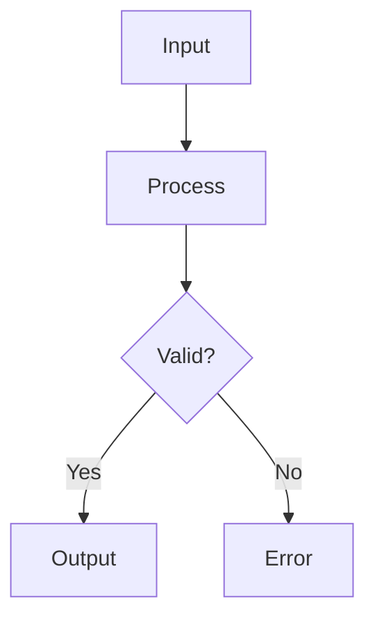
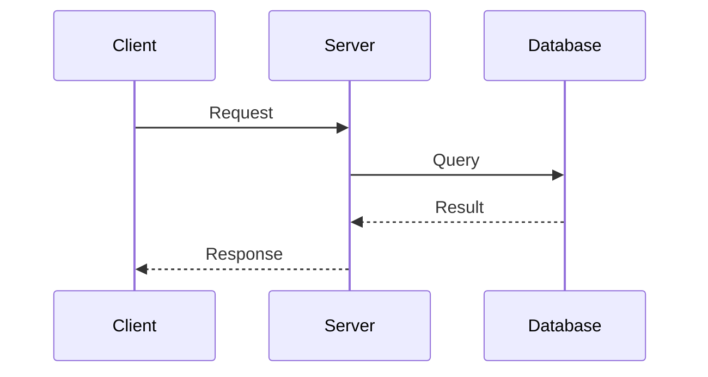
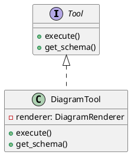

# Diagram Rendering Integration

Coda now includes diagram rendering capabilities through the [diagram-renderer](https://github.com/djvolz/diagram-renderer) library, which is integrated as a git submodule.

## Overview

The diagram rendering tool supports three major diagram formats:
- **Mermaid** - Flowcharts, sequence diagrams, class diagrams, and more
- **PlantUML** - UML diagrams, network diagrams, mind maps
- **Graphviz** - DOT language diagrams, directed/undirected graphs

## Installation

The diagram-renderer is included as a git submodule. When cloning the repository, ensure you initialize submodules:

```bash
git clone --recursive https://github.com/your-repo/coda.git
# or if already cloned:
git submodule update --init --recursive
```

## Usage

### In the Web UI

The Streamlit web interface automatically detects and renders diagrams in chat conversations:

1. Start the web UI: `uv run streamlit run coda/apps/web/app.py`
2. Navigate to the Chat page
3. When the AI generates diagram code blocks (Mermaid, PlantUML, or Graphviz), they will be automatically rendered as interactive diagrams
4. Diagrams appear in expandable sections with full zoom/pan capabilities

Example prompts to try:
- "Create a flowchart showing the login process"
- "Draw a class diagram for a user authentication system"
- "Generate a sequence diagram for an API request"

### As a Tool

The `render_diagram` tool is available in the tool registry:

```python
from coda.services.tools import execute_tool

# Render a Mermaid flowchart
result = await execute_tool("render_diagram", {
    "code": """
    flowchart TD
        A[Start] --> B{Decision}
        B -->|Yes| C[Process]
        B -->|No| D[End]
    """,
    "output_path": "flowchart.html"
})

# Render a PlantUML class diagram
result = await execute_tool("render_diagram", {
    "code": """
    @startuml
    class User {
        +name: String
        +email: String
        +login()
    }
    @enduml
    """,
    "output_path": "class_diagram.html"
})

# Render a Graphviz graph
result = await execute_tool("render_diagram", {
    "code": """
    digraph G {
        A -> B -> C;
        B -> D;
    }
    """,
    "output_path": "graph.html"
})
```

### Tool Parameters

- `code` (required): The diagram code in Mermaid, PlantUML, or Graphviz format
- `output_path` (optional): Path to save the rendered HTML file
- `return_html` (optional, default: True): Whether to return the HTML content in the result

### In AI Conversations

When using Coda's AI assistant, you can request diagram generation:

```
User: Create a flowchart showing the login process
Assistant: I'll create a flowchart for the login process using the diagram rendering tool.

[Uses render_diagram tool with appropriate Mermaid code]
```

## Output Format

The tool generates self-contained HTML files that include:
- Interactive zoom and pan controls
- Responsive design
- PNG export functionality
- All JavaScript libraries embedded (no external dependencies)

## Architecture

The integration consists of:
1. **Git Submodule**: `coda/base/diagram_renderer/` - The diagram-renderer library
2. **Tool Integration**: `coda/services/tools/diagram_tools.py` - MCP tool wrapper
3. **Web UI Integration**: `coda/apps/web/components/chat_widget.py` - Automatic diagram detection and rendering
4. **Automatic Registration**: The tool is automatically registered when the module loads

### Web UI Implementation

The web interface enhances the chat experience by:
- Automatically detecting diagram code blocks (mermaid, plantuml, dot, graphviz, uml)
- Rendering diagrams inline using Streamlit components
- Providing fallback to code blocks if rendering fails
- Supporting all diagram types that diagram-renderer supports

## Examples

### Simple Flowchart


### Sequence Diagram


### Class Diagram (PlantUML)


## Troubleshooting

If you encounter issues:

1. **Submodule not initialized**: Run `git submodule update --init --recursive`
2. **Import errors**: Ensure the diagram_renderer submodule is properly cloned
3. **Rendering failures**: Check that the diagram syntax is valid for the detected type

## Further Reading

- [diagram-renderer documentation](https://github.com/djvolz/diagram-renderer)
- [Mermaid syntax](https://mermaid.js.org/syntax/syntax.html)
- [PlantUML guide](https://plantuml.com/guide)
- [Graphviz documentation](https://graphviz.org/documentation/)