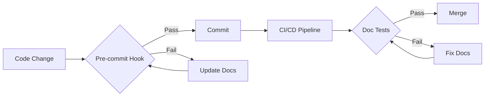

# Architecture Design Documentation Implementation Plan

## Executive Summary

This document outlines a comprehensive plan for creating and maintaining architecture design documentation for the Coda Code Assistant codebase. These design documents describe the system's architecture, design decisions, patterns, and structure. The documentation will be integrated directly into the wiki submodule, utilizing PlantUML and Mermaid diagrams extensively to enhance understanding. The plan includes automated validation to ensure design documentation stays current with code evolution.

## Goals

1. **Comprehensive Understanding**: Enable developers to fully understand the system design and architecture
2. **Visual Communication**: Use diverse diagram types (PlantUML/Mermaid) to illustrate design concepts
3. **Living Documentation**: Establish processes to keep design documentation synchronized with code evolution
4. **Developer Experience**: Make design documentation discoverable and actionable
5. **Evidence-Based Design**: All design documentation MUST be based on actual implementation with citations
6. **Design Rationale**: Document the "why" behind architectural decisions, not just the "what"

## Documentation Principles

### Design Documentation Philosophy
These are **design documents**, not implementation guides. They should:
- **Describe the architecture** and high-level structure
- **Explain design decisions** and trade-offs
- **Document patterns** and architectural principles
- **Illustrate relationships** between components
- **Provide context** for understanding the system

### Evidence-Based Approach
- **Every design claim must be verifiable** in the actual codebase
- **Include file paths and line numbers** as citations where applicable
- **No speculative features** - only document implemented designs
- **Regular verification** - re-check that design docs match code reality

### Citation Format
```markdown
<!-- Example citation format -->
The command registry pattern is implemented in `coda/cli/command_registry.py:45-89`
```

### Verification Process
1. **Pre-writing**: Analyze actual code before writing
2. **While writing**: Include specific file/line references
3. **Post-writing**: Verify all claims against codebase
4. **Review**: Cross-check documentation with code during reviews

## Progress Tracking

### Completed Tasks ✅
- **Phase 1.1**: Documentation structure setup in wiki
- **Phase 1.1.1**: Created module architecture template with evidence-based approach
- **Phase 1.1.2**: Established wiki naming convention (Architecture.md, Architecture-{#}-{Module}.md)
- **Phase 1.1.3**: Implemented proper documentation structure
- **Phase 1.2**: Created Architecture Overview document with code references
- **Phase 2.1**: Completed module documentation for:
  - CLI Module (Architecture-1-CLI.md)
  - Agents Module (Architecture-2-Agents.md)
  - Providers Module (Architecture-3-Providers.md)
  - Tools Module (Architecture-4-Tools.md)

### In Progress 🚧
- **Phase 2.1**: Session Module documentation
- **Phase 1.3**: Initial diagrams (C4, component, deployment)

### Remaining Tasks 📋
- Complete Session module documentation
- Create system diagrams
- Phase 3: Integration documentation
- Phase 4: Automation and maintenance setup
- Phase 5: Developer tools

## Phase 1: Foundation (Week 1-2)

### 1.1 Documentation Structure Setup
- Create architecture documentation directory structure in `docs/wiki/architecture/`
- Establish documentation standards and templates with citation requirements
- Set up PlantUML and Mermaid rendering pipeline
- Create verification checklist template for all documentation

### 1.1.1 Documentation Template
The module architecture template is maintained in `docs/templates/MODULE_ARCHITECTURE_TEMPLATE.md`. Every architecture document must include:

### 1.1.2 Wiki File Naming Convention
To ensure proper wiki navigation and URLs:
- Overview page: `Architecture.md` (no suffix ensures it sorts first)
- Module pages: `Architecture-{#}-{Module}.md` (e.g., `Architecture-1-CLI.md`)
- Numbers control display order in wiki sidebar (1=CLI, 2=Agents, etc.)
- This pattern groups all architecture docs together while maintaining order
- Avoid using `README.md` in wiki as it creates confusing URLs
- Verify wiki URLs after each push to ensure proper linking

### 1.1.3 Documentation Structure in Wiki
```
architecture/
├── Architecture.md              # Overview (sorts first)
├── Architecture-1-CLI.md        # CLI module
├── Architecture-2-Agents.md     # Agents module
├── Architecture-3-Providers.md  # Providers module
├── Architecture-4-Tools.md      # Tools module
├── Architecture-5-Session.md    # Session module
└── integration/
    ├── Provider-Integration.md
    ├── Tool-Development.md
    └── Agent-Creation.md
```

Note: GitHub Wiki sorts pages alphabetically in the sidebar. Using `Architecture.md` for the overview ensures it appears first, followed by numbered module pages in logical order.

Every architecture document must include:
```markdown
# [Module Name] Architecture

## Code References
<!-- List all primary files analyzed for this documentation -->
- Primary implementation: `path/to/file.py`
- Tests: `tests/path/to/test_file.py`
- Configuration: `path/to/config.py`

## Overview
[Description with specific code references]

## Implementation Details
<!-- All claims must reference specific code locations -->
The [feature] is implemented in `file.py:line_start-line_end`...

## Verification Checklist
- [ ] All file paths verified to exist
- [ ] All line numbers checked for accuracy
- [ ] All class/function names validated
- [ ] Code snippets tested for accuracy
- [ ] Diagrams match actual code structure
```

### 1.2 High-Level Architecture Overview
- Create main architecture overview document
- Develop system context diagram (C4 model level 1)
- Document core design principles and patterns
- Create technology stack overview

### 1.3 Initial Diagrams
- **System Context Diagram** (PlantUML C4)
- **High-Level Component Diagram** (Mermaid)
- **Deployment Architecture** (PlantUML)

## Phase 2: Module Deep Dives (Week 3-5)

### 2.1 Core Modules Documentation

#### CLI Module (`coda/cli/`)
- Command flow sequence diagrams (Mermaid)
- Interactive mode state machine (PlantUML)
- Command registry class diagram (PlantUML)
- Session management flow (Mermaid)

#### Agents Module (`coda/agents/`)
- Agent architecture overview
- Tool integration patterns (PlantUML class diagram)
- Agent lifecycle sequence diagram (Mermaid)
- Decorator pattern implementation

#### Providers Module (`coda/providers/`)
- Provider interface hierarchy (PlantUML)
- Provider registry pattern (Mermaid)
- Integration flow diagrams for each provider
- Mock provider testing architecture

#### Tools Module (`coda/tools/`)
- Tool execution pipeline (Mermaid sequence)
- MCP integration architecture (PlantUML)
- Permission system flowchart (Mermaid)
- Tool registration process

#### Session Module (`coda/session/`)
- Database schema diagram (PlantUML)
- Session lifecycle state machine (Mermaid)
- Context management flow
- Autosave mechanism sequence diagram

### 2.2 Diagram Types for Each Module
- **Class Diagrams**: Show relationships and hierarchies
- **Sequence Diagrams**: Illustrate interaction flows
- **State Diagrams**: Document state machines
- **Activity Diagrams**: Show process flows
- **Component Diagrams**: Display module dependencies
- **ER Diagrams**: For database schemas

## Phase 3: Integration Documentation (Week 6-7)

### 3.1 Cross-Module Interactions
- End-to-end flow diagrams for common operations
- Integration points documentation
- Event flow and data flow diagrams
- Error handling pathways

### 3.2 External Integrations
- OCI GenAI integration architecture
- Ollama provider integration
- MCP server communication protocols
- LiteLLM adapter patterns

## Phase 4: Automation and Maintenance (Week 8-9)

### 4.1 Documentation Validation System

#### Pre-commit Hooks
```yaml
- id: check-architecture-docs
  name: Validate Architecture Documentation
  entry: scripts/validate_architecture_docs.py
  language: python
  files: \.py$
  stages: [commit]
```

#### Validation Script Features
- Detect new modules without documentation
- Check for outdated diagrams (based on code timestamps)
- Validate diagram syntax (PlantUML/Mermaid)
- Ensure cross-references are valid
- **Verify code citations**: Check that referenced files/lines exist
- **Validate code snippets**: Ensure example code matches actual implementation
- **Cross-reference validation**: Verify class/function names mentioned exist in code
- **Dead link detection**: Find references to removed/renamed code elements

### 4.2 Documentation Update Workflow

#### Automated Checks
1. **Module Addition Detection**
   - Scan for new Python modules
   - Alert if documentation is missing
   - Generate documentation templates

2. **API Change Detection**
   - Monitor public interface changes
   - Flag outdated sequence diagrams
   - Update class diagrams automatically

3. **Dependency Updates**
   - Track import changes
   - Update component diagrams
   - Maintain dependency graphs

#### Manual Review Process
1. **Pull Request Template**
   ```markdown
   ## Documentation Updates
   - [ ] Architecture diagrams updated
   - [ ] Module documentation current
   - [ ] Integration points documented
   - [ ] Examples updated
   ```

2. **Documentation Review Checklist**
   - Accuracy of technical details
   - Diagram clarity and correctness
   - Cross-reference validity
   - Example code functionality
   - Wiki URL verification (check generated URLs match expected format)
   - Module names properly formatted in wiki navigation

## Phase 5: Developer Tools (Week 10)

### 5.1 Documentation Generation Tools
- Script to generate module documentation templates
- Diagram generation from code analysis
- Documentation coverage reports
- Interactive documentation browser

### 5.2 IDE Integration
- VS Code extension for diagram preview
- Documentation quick links in code
- Automated diagram updates on save
- Documentation linting

## Maintenance Strategy

### Regular Updates
1. **Weekly Reviews**
   - Check documentation coverage metrics
   - Review recent code changes
   - Update diagrams as needed

2. **Monthly Audits**
   - Full architecture review
   - Diagram accuracy validation
   - Documentation gap analysis

3. **Quarterly Overhauls**
   - Major architecture updates
   - Technology stack reviews
   - Documentation reorganization

### Automation Pipeline


## Success Metrics

1. **Coverage Metrics**
   - 100% of modules documented
   - All public APIs documented
   - Integration points mapped

2. **Quality Metrics**
   - Documentation review scores
   - Developer satisfaction surveys
   - Time to understand new modules

3. **Maintenance Metrics**
   - Documentation update frequency
   - Automation success rate
   - Documentation drift detection

## Implementation Timeline

| Week | Phase | Deliverables |
|------|-------|--------------|
| 1-2  | Foundation | Structure, templates, overview |
| 3-5  | Module Deep Dives | All module documentation |
| 6-7  | Integration | Cross-module documentation |
| 8-9  | Automation | Validation system, workflows |
| 10   | Developer Tools | Generation tools, IDE integration |

## Required Resources

### Tools
- PlantUML server or CLI
- Mermaid renderer
- Python AST parser for code analysis
- Documentation site generator (MkDocs/Sphinx)

### Team Effort
- Architecture documentation lead
- Module owners for reviews
- DevOps for automation setup
- QA for validation testing

## Conclusion

This phased approach ensures comprehensive architecture documentation while establishing sustainable maintenance practices. The heavy use of visual diagrams will significantly improve understanding, and the automation strategy will keep documentation synchronized with code evolution.

## Progress Tracking

### Phase 1: Foundation - COMPLETED ✓
- [x] Template created (`docs/templates/MODULE_ARCHITECTURE_TEMPLATE.md`)
- [x] Architecture overview created (`docs/wiki/architecture/Architecture.md`)
- [x] Wiki structure established with proper naming conventions

### Phase 2: Module Documentation - COMPLETED ✓
- [x] CLI Module (`Architecture-1-CLI.md`)
- [x] Agents Module (`Architecture-2-Agents.md`)
- [x] Providers Module (`Architecture-3-Providers.md`)
- [x] Tools Module (`Architecture-4-Tools.md`)
- [x] Session Module (`Architecture-5-Session.md`)

### Phase 3: Integration Documentation - PENDING
- [ ] Create system context diagram (C4 level 1)
- [ ] Create deployment architecture diagram
- [ ] Document inter-module communication patterns
- [ ] Create integration guides

### Phase 4: Automation & Validation - PENDING
- [ ] Set up documentation validation
- [ ] Create automated link checking
- [ ] Implement diagram generation scripts

### Phase 5: Developer Tools - PENDING
- [ ] Documentation generation tools
- [ ] IDE integration for docs

### Key Implementation Notes
1. All module documentation follows evidence-based approach
2. Line numbers are hidden in HTML comments to prevent drift
3. All file paths link to GitHub repository
4. Wiki naming convention: `Architecture-{number}-{Module}.md`
5. Overview page named `Architecture.md` for proper ordering

### Last Updated: 2025-01-09