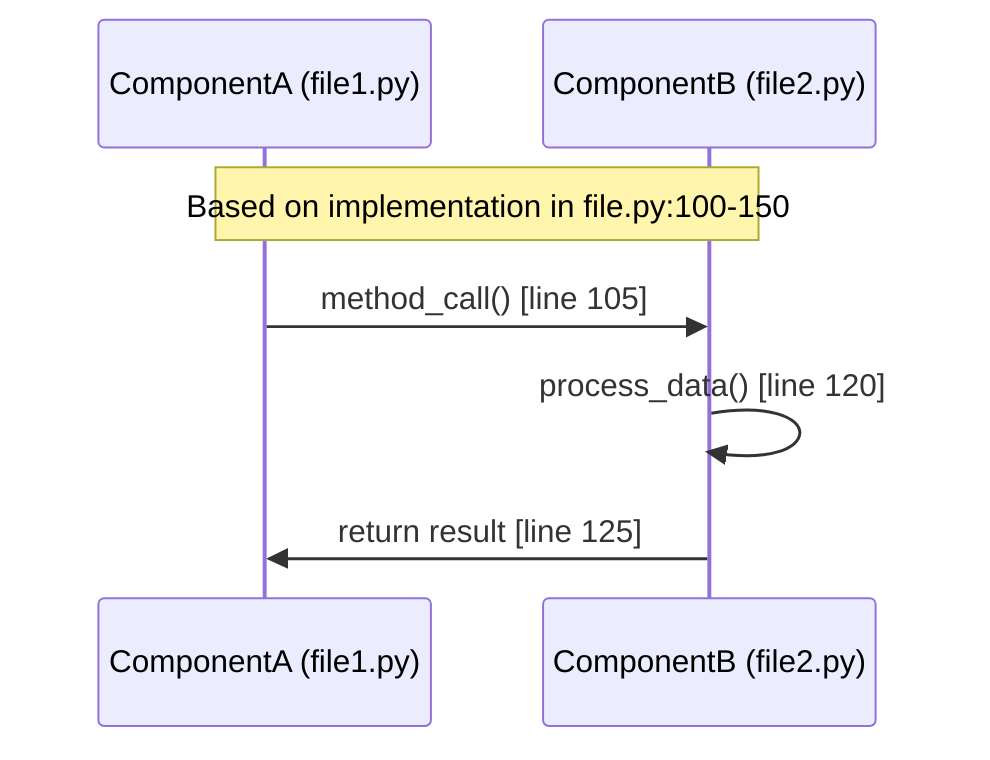
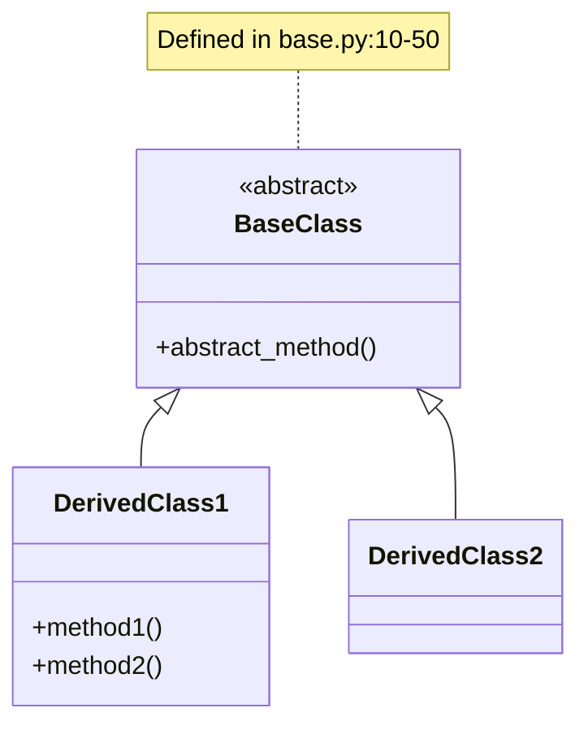

# Architecture: [Module Name]

<!-- This is a DESIGN DOCUMENT describing the architecture and design decisions of this module -->

<!-- TEMPLATE INSTRUCTIONS:
1. Follow the naming convention: 
   - Overview: Architecture.md
   - Modules: Architecture-{#}-{Module}.md (e.g., Architecture-1-CLI.md)
2. IMPORTANT: Link ALL file references to actual GitHub files: https://github.com/djvolz/coda-code-assistant/blob/main/{path}
   - Example: [`coda/cli/main.py`](https://github.com/djvolz/coda-code-assistant/blob/main/coda/cli/main.py)
   - For test directories: https://github.com/djvolz/coda-code-assistant/tree/main/{path}
3. Hide specific line numbers in HTML comments - they drift quickly
4. Focus on design decisions and architecture, not implementation details
5. Remove instruction comments before publishing
-->

## Design Document Purpose

This document describes the architectural design of the [Module Name] module, including:
- High-level architecture and structure
- Design decisions and rationale
- Patterns and principles employed
- Component relationships and interactions

## Code References
<!-- List all primary files analyzed for this documentation -->
<!-- Link all files to https://github.com/djvolz/coda-code-assistant/blob/main/{path} -->
- Primary implementation: [`path/to/main/file.py`](https://github.com/djvolz/coda-code-assistant/blob/main/path/to/main/file.py)
- Tests: [`tests/path/to/test_file.py`](https://github.com/djvolz/coda-code-assistant/blob/main/tests/path/to/test_file.py)
- Configuration: [`path/to/config.py`](https://github.com/djvolz/coda-code-assistant/blob/main/path/to/config.py)
- Related modules: [`path/to/related.py`](https://github.com/djvolz/coda-code-assistant/blob/main/path/to/related.py)

## Overview
<!-- Provide high-level architectural description -->
<!-- Include specific file references but not line numbers in visible text -->

The [Module Name] module is responsible for [purpose]. The architecture centers around the `[ClassName]` class located in [`path/to/file.py`](https://github.com/djvolz/coda-code-assistant/blob/main/path/to/file.py).

<!-- Line number references for maintainer use only - these are subject to drift:
     Main class: path/to/file.py:45-89
     Key method: path/to/file.py:92-120
-->

## Module Structure

```
module_name/
├── __init__.py          # Module initialization and exports
├── main.py              # Primary implementation
├── models.py            # Data models
└── utils.py             # Helper functions
```

## Key Components

### Component 1: [Name]
**Location**: [`path/to/component.py`](https://github.com/djvolz/coda-code-assistant/blob/main/path/to/component.py)

**Purpose**: [Description based on code analysis]

**Key Classes/Functions**:
- `ClassName`: [Purpose from docstring/implementation]
- `function_name()`: [Purpose from docstring/implementation]

<!-- Line references: component.py:45-89 for ClassName, component.py:92-120 for function_name -->

### Component 2: [Name]
**Location**: `path/to/component.py:line_start-line_end`

[Continue pattern...]

## Implementation Details

### Design Patterns Used

#### Pattern Name
**Implementation**: [`file.py`](https://github.com/djvolz/coda-code-assistant/blob/main/path/to/file.py)

**Why this pattern**: [Explain the design rationale - why was this pattern chosen?]

```python
class ExampleClass:
    def example_method(self):
        pass
```

<!-- Implementation at file.py:42-44 -->

### Data Flow

<!-- REQUIREMENT: Diagram must reflect actual code flow -->


### Class Hierarchy

<!-- REQUIREMENT: Must match actual inheritance in code -->


## API Reference

### Public Functions

#### `function_name(param1: Type, param2: Type) -> ReturnType`
**Location**: [`file.py`](https://github.com/djvolz/coda-code-assistant/blob/main/path/to/file.py)

**Purpose**: [From docstring]

**Parameters**:
- `param1` (Type): [From docstring/type hints]
- `param2` (Type): [From docstring/type hints]

**Returns**: [From docstring/implementation]

**Example**:
```python
result = function_name(value1, value2)
```
<!-- Example from test_file.py:line_number -->

### Public Classes

#### `ClassName`
**Location**: `file.py:line_start-line_end`

**Purpose**: [From class docstring]

**Methods**:
- `__init__(self, ...)`: Constructor (line X)
- `public_method(self, ...)`: [Purpose] (line Y)

## Design Decisions

### Key Architectural Choices

#### Decision 1: [Design Choice Name]
**Context**: [What problem or requirement led to this decision?]
**Decision**: [What was decided?]
**Rationale**: [Why was this chosen over alternatives?]
**Trade-offs**: [What are the pros and cons?]
**Implementation**: See `file.py:line_start-line_end`

#### Decision 2: [Design Choice Name]
[Continue pattern...]

### Design Principles
<!-- List the key principles that guided this module's design -->
1. **Principle**: [Explanation of how it's applied]
2. **Principle**: [Explanation of how it's applied]

## Configuration

<!-- REQUIREMENT: Must reference actual config usage -->
**Config File**: `path/to/config.file`
**Config Class**: `path/to/config.py:ClassName`

### Configuration Options
| Option | Type | Default | Description | Used In |
|--------|------|---------|-------------|---------|
| option_name | type | value | description | file.py:line |

## Dependencies

### Internal Dependencies
<!-- REQUIREMENT: Based on actual imports -->
- `coda.other_module`: Used for [purpose] in `file.py:line`
- `coda.another_module`: Used for [purpose] in `file.py:line`

### External Dependencies
<!-- REQUIREMENT: From requirements.txt or pyproject.toml -->
- `external_package==version`: Used for [purpose]

## Testing

### Test Coverage
<!-- REQUIREMENT: Based on actual test files -->
- Unit tests: `tests/unit/test_module.py`
- Integration tests: `tests/integration/test_module_integration.py`

### Key Test Cases
1. **Test Case Name** (`test_file.py:line`): Tests [what it tests]
2. **Test Case Name** (`test_file.py:line`): Tests [what it tests]

## Error Handling

### Exception Types
<!-- REQUIREMENT: Based on actual exception definitions -->
- `CustomException` (`errors.py:line`): Raised when [condition]
- `AnotherException` (`errors.py:line`): Raised when [condition]

### Error Flow
```python
# From file.py:line_start-line_end
try:
    operation()
except SpecificError as e:
    handle_error(e)  # Handling defined in utils.py:line
```

## Performance Considerations

<!-- REQUIREMENT: Based on actual implementation -->
1. **Caching**: Implemented in `file.py:line` using [method]
2. **Lazy Loading**: Pattern used in `file.py:line`
3. **Connection Pooling**: Managed by `class.py:line`

## Security Considerations

<!-- REQUIREMENT: Based on actual security measures in code -->
1. **Input Validation**: Performed in `validator.py:line`
2. **Authentication**: Handled by `auth.py:line`
3. **Permissions**: Checked in `permissions.py:line`

## Examples

### Basic Usage
<!-- REQUIREMENT: Example must work with actual code -->
```python
# Working example based on test_file.py:line
from coda.module import MainClass

instance = MainClass(config)
result = instance.process(data)
```

### Advanced Usage
```python
# From examples/example_file.py:line
# [More complex example from actual code/tests]
```

## Integration Points

### With Other Modules
<!-- REQUIREMENT: Based on actual module imports/usage -->
1. **Module A Integration**: Called from `module_a/file.py:line`
2. **Module B Integration**: Calls into `module_b/file.py:line`

### Extension Points
<!-- REQUIREMENT: Based on actual abstract classes/interfaces -->
1. **Custom Implementations**: Extend `BaseClass` (`base.py:line`)
2. **Plugin Interface**: Implement `PluginInterface` (`interfaces.py:line`)

## Known Limitations

<!-- REQUIREMENT: Based on code comments, TODOs, or design constraints -->
1. **Limitation**: [Description] (see `file.py:line` comment)
2. **TODO**: [Pending feature] (marked in `file.py:line`)

<!-- Verification Checklist for Maintainers
- [ ] All file paths verified to exist
- [ ] All line numbers checked for accuracy  
- [ ] All class/function names validated
- [ ] Code snippets copied exactly from source
- [ ] Diagrams match actual code structure
- [ ] Examples tested to ensure they work
- [ ] Cross-references to other modules verified
- [ ] Configuration options match actual usage
- [ ] Test references are accurate
- [ ] GitHub links are correct
-->

## References

### Related Documentation
- [Architecture Overview](../Architecture-Overview.md)
- [Related Module Doc](../other_module/README.md)

### Source Files
<!-- Auto-generated list of all files referenced -->
<!-- This helps quickly verify all citations -->
```
All files referenced in this document:
- path/to/file1.py
- path/to/file2.py
- tests/test_file.py
[etc...]
```