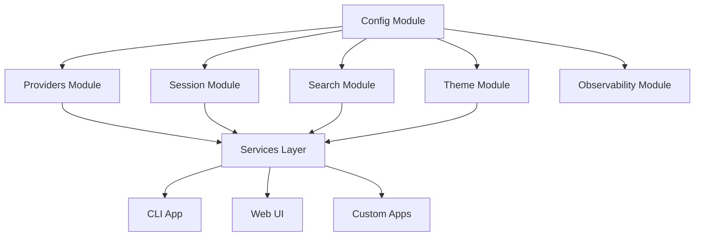

# Coda Module Integration Guide

## Table of Contents

1. [Overview](#overview)
2. [Architecture](#architecture)
3. [Core Concepts](#core-concepts)
4. [Module Integration Patterns](#module-integration-patterns)
5. [Common Workflows](#common-workflows)
6. [Best Practices](#best-practices)
7. [Example Applications](#example-applications)
8. [Troubleshooting](#troubleshooting)
9. [Performance Considerations](#performance-considerations)
10. [Advanced Topics](#advanced-topics)

## Overview

The Coda modular architecture provides a flexible foundation for building AI-powered applications. This guide demonstrates how to combine Coda's base modules to create powerful, maintainable applications.

### Why Modular Architecture?

Traditional monolithic AI applications often suffer from:
- **Tight Coupling**: Changes in one area affect others
- **Testing Challenges**: Difficult to test components in isolation
- **Vendor Lock-in**: Hard to switch AI providers
- **Scalability Issues**: All-or-nothing deployment

Coda's modular approach addresses these issues by:
- **Separation of Concerns**: Each module has a single responsibility
- **Zero Dependencies**: Base modules don't depend on each other
- **Pluggable Providers**: Easy to switch or combine AI models
- **Flexible Composition**: Use only what you need

## Architecture

### Three-Layer Architecture

```
┌─────────────────────────────────────────────────┐
│                    Apps Layer                    │
│  (CLI, Web UI, Plugins, Custom Applications)    │
├─────────────────────────────────────────────────┤
│                 Services Layer                   │
│    (Integration, Orchestration, Workflows)       │
├─────────────────────────────────────────────────┤
│                   Base Layer                     │
│ (Config, Theme, Providers, Session, Search, etc) │
└─────────────────────────────────────────────────┘
```

### Module Relationships



## Core Concepts

### 1. Configuration Management

The Config module is the foundation of all Coda applications. It handles:

- **Settings Loading**: From files, environment variables, or code
- **Provider Configuration**: API keys, endpoints, model preferences
- **Feature Flags**: Enable/disable functionality
- **Environment Management**: Dev, staging, production configs

```python
from coda.base.config import Config

# Load from default locations
config = Config()

# Load from specific file
config = Config(config_path="/path/to/config.toml")

# Override with environment variables
# CODA_OPENAI_API_KEY=sk-... python your_app.py

# Access configuration
api_key = config.get("openai.api_key")
default_model = config.get("openai.default_model", "gpt-4")
```

### 2. Provider Abstraction

The Provider system allows seamless switching between AI models:

```python
from coda.base.providers import ProviderFactory

factory = ProviderFactory(config.to_dict())

# Create specific provider
openai_provider = factory.create("openai")
anthropic_provider = factory.create("anthropic")

# Use providers interchangeably
for provider in [openai_provider, anthropic_provider]:
    response = provider.chat(
        messages=[{"role": "user", "content": "Hello"}],
        model=provider.get_models()[0]["id"]
    )
    print(f"{provider.name}: {response['content']}")
```

### 3. Session Management

Sessions provide conversation persistence and history:

```python
from coda.base.session import SessionManager

session_manager = SessionManager(config.to_dict())

# Create or resume session
session = session_manager.create_session("project-chat")

# Add messages
session.add_message({"role": "user", "content": "What is Python?"})
session.add_message({"role": "assistant", "content": "Python is..."})

# Get conversation history
history = session.get_messages()

# Save session
session_manager.save_session(session)
```

### 4. Semantic Search

The Search module enables AI-powered code understanding:

```python
from coda.base.search import SearchManager

search_manager = SearchManager(config.to_dict())

# Index a codebase
await search_manager.index_directory("/path/to/code")

# Search semantically
results = await search_manager.search("error handling patterns")

# Use results as context
context = "\n".join([r["content"] for r in results[:5]])
```

## Module Integration Patterns

### Pattern 1: Simple Chatbot

The most basic integration combines Config and Providers:

```python
from coda.base.config import Config
from coda.base.providers import ProviderFactory

def create_simple_chatbot():
    # Initialize configuration
    config = Config()
    
    # Create provider
    factory = ProviderFactory(config.to_dict())
    provider = factory.create("openai")
    
    # Chat loop
    messages = []
    while True:
        user_input = input("You: ")
        if user_input.lower() == "quit":
            break
            
        messages.append({"role": "user", "content": user_input})
        
        response = provider.chat(
            messages=messages,
            model="gpt-4",
            temperature=0.7
        )
        
        assistant_message = response["content"]
        messages.append({"role": "assistant", "content": assistant_message})
        
        print(f"Assistant: {assistant_message}")
```

### Pattern 2: Persistent Conversations

Add session management for conversation history:

```python
from coda.base.config import Config
from coda.base.providers import ProviderFactory
from coda.base.session import SessionManager

class PersistentChatbot:
    def __init__(self, session_name: str):
        self.config = Config()
        self.factory = ProviderFactory(self.config.to_dict())
        self.provider = self.factory.create("openai")
        self.session_manager = SessionManager(self.config.to_dict())
        self.session = self.session_manager.create_session(session_name)
        
    def chat(self, user_input: str) -> str:
        # Add user message
        self.session.add_message({"role": "user", "content": user_input})
        
        # Get response
        response = self.provider.chat(
            messages=self.session.get_messages(),
            model="gpt-4"
        )
        
        # Save assistant response
        assistant_message = response["content"]
        self.session.add_message({
            "role": "assistant", 
            "content": assistant_message
        })
        
        # Persist session
        self.session_manager.save_session(self.session)
        
        return assistant_message
```

### Pattern 3: Provider Comparison

Compare responses from different AI providers:

```python
from coda.base.config import Config
from coda.base.providers import ProviderFactory
import asyncio

class MultiProviderChat:
    def __init__(self):
        self.config = Config()
        self.factory = ProviderFactory(self.config.to_dict())
        self.providers = {
            name: self.factory.create(name)
            for name in ["openai", "anthropic", "groq"]
            if self.factory.has_provider(name)
        }
        
    async def compare_responses(self, prompt: str) -> dict:
        """Get responses from all providers concurrently."""
        tasks = []
        
        for name, provider in self.providers.items():
            task = self._get_response(name, provider, prompt)
            tasks.append(task)
            
        results = await asyncio.gather(*tasks)
        return dict(results)
        
    async def _get_response(self, name: str, provider, prompt: str):
        try:
            response = provider.chat(
                messages=[{"role": "user", "content": prompt}],
                model=provider.get_models()[0]["id"]
            )
            return (name, response["content"])
        except Exception as e:
            return (name, f"Error: {str(e)}")
```

### Pattern 4: Code Intelligence Assistant

Combine search with AI for code understanding:

```python
from coda.base.config import Config
from coda.base.providers import ProviderFactory
from coda.base.search import SearchManager
import asyncio

class CodeAssistant:
    def __init__(self, codebase_path: str):
        self.config = Config()
        self.factory = ProviderFactory(self.config.to_dict())
        self.provider = self.factory.create("openai")
        self.search = SearchManager(self.config.to_dict())
        self.codebase_path = codebase_path
        self._indexed = False
        
    async def initialize(self):
        """Index the codebase for searching."""
        if not self._indexed:
            await self.search.index_directory(self.codebase_path)
            self._indexed = True
            
    async def answer_code_question(self, question: str) -> str:
        """Answer questions about the codebase."""
        # Search for relevant code
        results = await self.search.search(question)
        
        # Build context from search results
        context_parts = []
        for result in results[:5]:  # Top 5 results
            context_parts.append(f"File: {result['file']}\n{result['content']}")
            
        context = "\n---\n".join(context_parts)
        
        # Create prompt with context
        prompt = f"""Based on the following code context, answer this question: {question}

Code Context:
{context}

Please provide a clear, concise answer based on the code shown."""
        
        # Get AI response
        response = self.provider.chat(
            messages=[{"role": "user", "content": prompt}],
            model="gpt-4",
            temperature=0.3  # Lower temperature for factual answers
        )
        
        return response["content"]
```

### Pattern 5: Themed CLI Application

Add visual theming to console applications:

```python
from coda.base.config import Config
from coda.base.theme import ThemeManager
from coda.base.providers import ProviderFactory

class ThemedChatbot:
    def __init__(self):
        self.config = Config()
        self.theme = ThemeManager(self.config.to_dict())
        self.factory = ProviderFactory(self.config.to_dict())
        self.provider = self.factory.create("openai")
        
    def run(self):
        # Display welcome message
        self.theme.display_header("Welcome to Coda Chat")
        
        messages = []
        while True:
            # Get user input with theme
            user_input = self.theme.prompt_user("You")
            
            if user_input.lower() in ["quit", "exit"]:
                self.theme.display_info("Goodbye!")
                break
                
            messages.append({"role": "user", "content": user_input})
            
            # Show thinking indicator
            with self.theme.progress_indicator("Thinking..."):
                response = self.provider.chat(
                    messages=messages,
                    model="gpt-4"
                )
                
            assistant_message = response["content"]
            messages.append({"role": "assistant", "content": assistant_message})
            
            # Display response with theme
            self.theme.display_message("Assistant", assistant_message)
```

## Common Workflows

### Workflow 1: Building a Production Chatbot

1. **Initialize Configuration**
   ```python
   config = Config()
   # Validate required settings
   if not config.get("openai.api_key"):
       raise ValueError("OpenAI API key not configured")
   ```

2. **Set Up Observability**
   ```python
   from coda.base.observability import Logger
   logger = Logger(config.to_dict())
   logger.info("Starting chatbot application")
   ```

3. **Create Provider with Error Handling**
   ```python
   try:
       factory = ProviderFactory(config.to_dict())
       provider = factory.create("openai")
   except Exception as e:
       logger.error(f"Failed to create provider: {e}")
       raise
   ```

4. **Initialize Session Management**
   ```python
   session_manager = SessionManager(config.to_dict())
   session = session_manager.create_session("main-chat")
   ```

5. **Implement Chat Loop with Recovery**
   ```python
   while True:
       try:
           user_input = input("You: ")
           response = provider.chat(messages=session.get_messages())
           session.add_message({"role": "assistant", "content": response["content"]})
       except Exception as e:
           logger.error(f"Chat error: {e}")
           print("Sorry, an error occurred. Please try again.")
   ```

### Workflow 2: Migrating Between Providers

1. **Abstract Provider Interface**
   ```python
   class ChatInterface:
       def __init__(self, provider_name: str):
           config = Config()
           factory = ProviderFactory(config.to_dict())
           self.provider = factory.create(provider_name)
           
       def chat(self, message: str) -> str:
           response = self.provider.chat(
               messages=[{"role": "user", "content": message}],
               model=self.provider.get_models()[0]["id"]
           )
           return response["content"]
   ```

2. **Switch Providers Seamlessly**
   ```python
   # Start with OpenAI
   chat = ChatInterface("openai")
   
   # Switch to Anthropic
   chat = ChatInterface("anthropic")
   
   # Switch to local model
   chat = ChatInterface("ollama")
   ```

### Workflow 3: Building a Code Review Assistant

1. **Index Repository**
   ```python
   search = SearchManager(config.to_dict())
   await search.index_directory("./src")
   ```

2. **Analyze Code Changes**
   ```python
   # Get changed files (from git or other source)
   changed_files = get_changed_files()
   
   # Search for related code
   context = []
   for file in changed_files:
       results = await search.search(f"functions that call {file}")
       context.extend(results[:3])
   ```

3. **Generate Review Comments**
   ```python
   prompt = f"""Review these code changes:
   
   Changed Files: {changed_files}
   Related Code: {context}
   
   Provide feedback on:
   1. Potential bugs
   2. Performance issues
   3. Code style
   4. Test coverage needs
   """
   
   review = provider.chat(messages=[{"role": "user", "content": prompt}])
   ```

## Best Practices

### 1. Configuration Management

**DO:**
- Use environment variables for sensitive data
- Provide sensible defaults
- Validate configuration at startup
- Use typed configuration classes

**DON'T:**
- Hard-code API keys or secrets
- Assume configuration exists
- Mix configuration with business logic

**Example:**
```python
class AppConfig:
    def __init__(self):
        self.config = Config()
        self._validate()
        
    def _validate(self):
        required = ["openai.api_key", "app.name"]
        for key in required:
            if not self.config.get(key):
                raise ValueError(f"Missing required config: {key}")
                
    @property
    def api_key(self) -> str:
        return self.config.get("openai.api_key")
        
    @property
    def app_name(self) -> str:
        return self.config.get("app.name")
```

### 2. Error Handling

**DO:**
- Catch specific exceptions
- Provide meaningful error messages
- Log errors for debugging
- Implement retry logic for transient failures

**DON'T:**
- Catch all exceptions blindly
- Expose internal errors to users
- Ignore errors silently

**Example:**
```python
from typing import Optional
import time

class RobustChat:
    def __init__(self):
        self.config = Config()
        self.logger = Logger(self.config.to_dict())
        
    def chat_with_retry(self, message: str, max_retries: int = 3) -> Optional[str]:
        for attempt in range(max_retries):
            try:
                response = self.provider.chat(
                    messages=[{"role": "user", "content": message}]
                )
                return response["content"]
                
            except RateLimitError as e:
                wait_time = 2 ** attempt  # Exponential backoff
                self.logger.warning(f"Rate limited, waiting {wait_time}s")
                time.sleep(wait_time)
                
            except AuthenticationError as e:
                self.logger.error("Authentication failed")
                raise  # Don't retry auth errors
                
            except Exception as e:
                self.logger.error(f"Unexpected error: {e}")
                if attempt == max_retries - 1:
                    raise
                    
        return None
```

### 3. Performance Optimization

**DO:**
- Use async/await for I/O operations
- Batch requests when possible
- Cache frequently accessed data
- Monitor resource usage

**DON'T:**
- Block on I/O operations
- Make unnecessary API calls
- Store large objects in memory

**Example:**
```python
import asyncio
from functools import lru_cache

class OptimizedAssistant:
    def __init__(self):
        self.config = Config()
        self.cache = {}
        
    @lru_cache(maxsize=100)
    def get_model_info(self, model_name: str):
        """Cache model information to avoid repeated lookups."""
        return self.provider.get_model_details(model_name)
        
    async def batch_process(self, prompts: list[str]) -> list[str]:
        """Process multiple prompts concurrently."""
        tasks = [
            self._process_single(prompt) 
            for prompt in prompts
        ]
        return await asyncio.gather(*tasks)
        
    async def _process_single(self, prompt: str) -> str:
        # Check cache first
        if prompt in self.cache:
            return self.cache[prompt]
            
        response = await self.provider.chat_async(
            messages=[{"role": "user", "content": prompt}]
        )
        
        # Cache the result
        self.cache[prompt] = response["content"]
        return response["content"]
```

### 4. Testing Strategies

**DO:**
- Mock external dependencies
- Test each module in isolation
- Use integration tests for workflows
- Test error conditions

**DON'T:**
- Make real API calls in unit tests
- Test implementation details
- Ignore edge cases

**Example:**
```python
import unittest
from unittest.mock import Mock, patch

class TestChatbot(unittest.TestCase):
    def setUp(self):
        self.mock_config = Mock()
        self.mock_provider = Mock()
        
    def test_simple_chat(self):
        # Arrange
        self.mock_provider.chat.return_value = {
            "content": "Hello!",
            "tokens": 10
        }
        
        chatbot = SimpleChatbot(
            config=self.mock_config,
            provider=self.mock_provider
        )
        
        # Act
        response = chatbot.chat("Hi")
        
        # Assert
        self.assertEqual(response, "Hello!")
        self.mock_provider.chat.assert_called_once()
        
    def test_handles_api_error(self):
        # Arrange
        self.mock_provider.chat.side_effect = Exception("API Error")
        
        chatbot = SimpleChatbot(
            config=self.mock_config,
            provider=self.mock_provider
        )
        
        # Act & Assert
        with self.assertRaises(Exception):
            chatbot.chat("Hi")
```

### 5. Security Considerations

**DO:**
- Sanitize user inputs
- Use secure storage for secrets
- Implement rate limiting
- Log security events

**DON'T:**
- Trust user input blindly
- Store secrets in code
- Expose internal errors
- Skip authentication

**Example:**
```python
import re
from typing import Dict

class SecureChat:
    def __init__(self):
        self.config = Config()
        self.rate_limiter = RateLimiter()
        
    def sanitize_input(self, user_input: str) -> str:
        """Remove potentially harmful content."""
        # Remove control characters
        cleaned = re.sub(r'[\x00-\x1f\x7f-\x9f]', '', user_input)
        
        # Limit length
        max_length = self.config.get("security.max_input_length", 1000)
        cleaned = cleaned[:max_length]
        
        return cleaned
        
    def process_request(self, user_id: str, message: str) -> str:
        # Check rate limit
        if not self.rate_limiter.allow(user_id):
            raise RateLimitExceeded("Too many requests")
            
        # Sanitize input
        safe_message = self.sanitize_input(message)
        
        # Process with provider
        response = self.provider.chat(
            messages=[{"role": "user", "content": safe_message}]
        )
        
        return response["content"]
```

## Example Applications

### Example 1: Simple Console Chatbot

Location: `tests/examples/simple_chatbot/`

```python
#!/usr/bin/env python3
"""
Simple chatbot using Coda modules.

This example demonstrates:
- Basic configuration usage
- Provider initialization
- Simple chat loop
"""

from coda.base.config import Config
from coda.base.providers import ProviderFactory

def main():
    # Initialize
    config = Config()
    factory = ProviderFactory(config.to_dict())
    
    # Let user choose provider
    available = factory.get_available_providers()
    print("Available providers:", ", ".join(available))
    
    provider_name = input("Choose provider: ").strip()
    if provider_name not in available:
        print(f"Provider {provider_name} not available")
        return
        
    provider = factory.create(provider_name)
    
    # Chat loop
    print(f"\nChatting with {provider_name}. Type 'quit' to exit.\n")
    
    messages = []
    while True:
        user_input = input("You: ").strip()
        
        if user_input.lower() == 'quit':
            break
            
        messages.append({"role": "user", "content": user_input})
        
        try:
            response = provider.chat(
                messages=messages,
                model=provider.get_models()[0]["id"]
            )
            
            assistant_response = response["content"]
            messages.append({"role": "assistant", "content": assistant_response})
            
            print(f"\nAssistant: {assistant_response}\n")
            
        except Exception as e:
            print(f"Error: {e}")
            
if __name__ == "__main__":
    main()
```

### Example 2: Session Manager Demo

Location: `tests/examples/session_manager/`

```python
#!/usr/bin/env python3
"""
Session management example.

This example demonstrates:
- Creating and loading sessions
- Conversation persistence
- Session branching
"""

from coda.base.config import Config
from coda.base.providers import ProviderFactory
from coda.base.session import SessionManager
import json

class SessionDemo:
    def __init__(self):
        self.config = Config()
        self.factory = ProviderFactory(self.config.to_dict())
        self.provider = self.factory.create("openai")
        self.session_manager = SessionManager(self.config.to_dict())
        
    def list_sessions(self):
        """Show all available sessions."""
        sessions = self.session_manager.list_sessions()
        if not sessions:
            print("No sessions found.")
            return
            
        print("\nAvailable sessions:")
        for session in sessions:
            print(f"  - {session['name']} (messages: {session['message_count']})")
            
    def start_session(self, name: str):
        """Start or resume a session."""
        session = self.session_manager.create_session(name)
        print(f"\nSession '{name}' loaded with {len(session.get_messages())} messages")
        
        while True:
            user_input = input("\nYou: ").strip()
            
            if user_input.lower() == 'quit':
                break
            elif user_input.lower() == 'history':
                self.show_history(session)
                continue
            elif user_input.lower() == 'save':
                self.session_manager.save_session(session)
                print("Session saved.")
                continue
                
            # Add user message
            session.add_message({"role": "user", "content": user_input})
            
            # Get AI response
            response = self.provider.chat(
                messages=session.get_messages(),
                model="gpt-4"
            )
            
            # Add assistant message
            assistant_response = response["content"]
            session.add_message({"role": "assistant", "content": assistant_response})
            
            print(f"\nAssistant: {assistant_response}")
            
        # Auto-save on exit
        self.session_manager.save_session(session)
        print(f"\nSession '{name}' saved.")
        
    def show_history(self, session):
        """Display conversation history."""
        messages = session.get_messages()
        print("\n--- Conversation History ---")
        for msg in messages:
            role = msg["role"].capitalize()
            content = msg["content"][:100] + "..." if len(msg["content"]) > 100 else msg["content"]
            print(f"{role}: {content}")
        print("--- End History ---")
        
def main():
    demo = SessionDemo()
    
    while True:
        print("\n=== Session Manager Demo ===")
        print("1. List sessions")
        print("2. Start/resume session")
        print("3. Quit")
        
        choice = input("\nChoice: ").strip()
        
        if choice == "1":
            demo.list_sessions()
        elif choice == "2":
            name = input("Session name: ").strip()
            demo.start_session(name)
        elif choice == "3":
            break
        else:
            print("Invalid choice")
            
if __name__ == "__main__":
    main()
```

### Example 3: Code Analyzer

Location: `tests/examples/code_analyzer/`

```python
#!/usr/bin/env python3
"""
Code analysis assistant using search and AI.

This example demonstrates:
- Semantic code search
- Context-aware responses
- Code explanation and review
"""

import asyncio
from pathlib import Path
from coda.base.config import Config
from coda.base.providers import ProviderFactory
from coda.base.search import SearchManager

class CodeAnalyzer:
    def __init__(self, repo_path: str):
        self.repo_path = Path(repo_path)
        self.config = Config()
        self.factory = ProviderFactory(self.config.to_dict())
        self.provider = self.factory.create("openai")
        self.search = SearchManager(self.config.to_dict())
        self._indexed = False
        
    async def index_repository(self):
        """Index the repository for searching."""
        print(f"Indexing {self.repo_path}...")
        await self.search.index_directory(str(self.repo_path))
        self._indexed = True
        print("Indexing complete!")
        
    async def analyze_code(self, query: str):
        """Analyze code based on a query."""
        if not self._indexed:
            await self.index_repository()
            
        # Search for relevant code
        print(f"\nSearching for: {query}")
        results = await self.search.search(query, limit=5)
        
        if not results:
            print("No relevant code found.")
            return
            
        # Build context
        context_parts = []
        for i, result in enumerate(results, 1):
            context_parts.append(
                f"### Result {i} - {result['file']}:{result.get('line', '?')}\n"
                f"```{result.get('language', '')}\n{result['content']}\n```"
            )
            
        context = "\n\n".join(context_parts)
        
        # Create analysis prompt
        prompt = f"""Analyze the following code related to: "{query}"

{context}

Please provide:
1. A summary of how this code works
2. Any potential issues or improvements
3. Best practices that apply
4. Suggestions for better implementation
"""
        
        # Get AI analysis
        print("\nAnalyzing code...")
        response = self.provider.chat(
            messages=[{"role": "user", "content": prompt}],
            model="gpt-4",
            temperature=0.3
        )
        
        print("\n=== Analysis ===")
        print(response["content"])
        
    async def explain_function(self, function_name: str):
        """Explain a specific function."""
        if not self._indexed:
            await self.index_repository()
            
        # Search for function definition
        results = await self.search.search(f"def {function_name} function")
        
        if not results:
            print(f"Function '{function_name}' not found.")
            return
            
        # Get the function code
        func_code = results[0]['content']
        
        prompt = f"""Explain this function in detail:

```python
{func_code}
```

Include:
1. Purpose and functionality
2. Parameters and return values
3. Example usage
4. Any side effects or dependencies
"""
        
        response = self.provider.chat(
            messages=[{"role": "user", "content": prompt}],
            model="gpt-4"
        )
        
        print(f"\n=== Explanation of {function_name} ===")
        print(response["content"])
        
    async def find_similar_code(self, code_snippet: str):
        """Find code similar to a given snippet."""
        if not self._indexed:
            await self.index_repository()
            
        print(f"\nSearching for code similar to:\n{code_snippet}\n")
        
        results = await self.search.search(code_snippet, limit=3)
        
        if not results:
            print("No similar code found.")
            return
            
        print("=== Similar Code Found ===")
        for i, result in enumerate(results, 1):
            print(f"\n{i}. {result['file']}:{result.get('line', '?')}")
            print(f"```\n{result['content']}\n```")
            print(f"Similarity: {result.get('score', 'N/A')}")

async def main():
    # Get repository path
    repo_path = input("Enter repository path: ").strip()
    if not Path(repo_path).exists():
        print(f"Path '{repo_path}' does not exist.")
        return
        
    analyzer = CodeAnalyzer(repo_path)
    
    # Index the repository
    await analyzer.index_repository()
    
    # Interactive analysis loop
    while True:
        print("\n=== Code Analyzer ===")
        print("1. Analyze code by query")
        print("2. Explain a function")
        print("3. Find similar code")
        print("4. Re-index repository")
        print("5. Quit")
        
        choice = input("\nChoice: ").strip()
        
        if choice == "1":
            query = input("Enter search query: ").strip()
            await analyzer.analyze_code(query)
            
        elif choice == "2":
            func_name = input("Enter function name: ").strip()
            await analyzer.explain_function(func_name)
            
        elif choice == "3":
            print("Enter code snippet (end with '---' on a new line):")
            lines = []
            while True:
                line = input()
                if line.strip() == "---":
                    break
                lines.append(line)
            snippet = "\n".join(lines)
            await analyzer.find_similar_code(snippet)
            
        elif choice == "4":
            await analyzer.index_repository()
            
        elif choice == "5":
            break
            
        else:
            print("Invalid choice")

if __name__ == "__main__":
    asyncio.run(main())
```

### Example 4: Provider Benchmark

Location: `examples/provider-comparison/`

```python
#!/usr/bin/env python3
"""
Benchmark multiple AI providers.

This example demonstrates:
- Concurrent provider calls
- Response time measurement
- Quality comparison
- Cost estimation
"""

import asyncio
import time
from typing import Dict, List
from coda.base.config import Config
from coda.base.providers import ProviderFactory

class ProviderBenchmark:
    def __init__(self):
        self.config = Config()
        self.factory = ProviderFactory(self.config.to_dict())
        self.providers = self._init_providers()
        
    def _init_providers(self) -> Dict[str, any]:
        """Initialize all available providers."""
        providers = {}
        for name in self.factory.get_available_providers():
            try:
                providers[name] = self.factory.create(name)
                print(f"✓ Initialized {name}")
            except Exception as e:
                print(f"✗ Failed to initialize {name}: {e}")
        return providers
        
    async def benchmark_prompt(self, prompt: str, model_map: Dict[str, str] = None):
        """Benchmark a prompt across all providers."""
        if not model_map:
            model_map = self._get_default_models()
            
        tasks = []
        for provider_name, provider in self.providers.items():
            model = model_map.get(provider_name)
            if model:
                task = self._benchmark_single(provider_name, provider, prompt, model)
                tasks.append(task)
                
        results = await asyncio.gather(*tasks, return_exceptions=True)
        return {name: result for name, result in zip(self.providers.keys(), results)}
        
    async def _benchmark_single(self, name: str, provider, prompt: str, model: str):
        """Benchmark a single provider."""
        start_time = time.time()
        
        try:
            response = provider.chat(
                messages=[{"role": "user", "content": prompt}],
                model=model
            )
            
            end_time = time.time()
            
            return {
                "success": True,
                "model": model,
                "response": response["content"],
                "latency": end_time - start_time,
                "tokens": response.get("usage", {}).get("total_tokens", 0)
            }
            
        except Exception as e:
            return {
                "success": False,
                "error": str(e),
                "latency": time.time() - start_time
            }
            
    def _get_default_models(self) -> Dict[str, str]:
        """Get default model for each provider."""
        models = {}
        for name, provider in self.providers.items():
            try:
                available_models = provider.get_models()
                if available_models:
                    models[name] = available_models[0]["id"]
            except:
                pass
        return models
        
    def compare_responses(self, results: Dict[str, dict]):
        """Display comparison of responses."""
        print("\n=== Provider Comparison ===\n")
        
        for provider, result in results.items():
            print(f"## {provider}")
            
            if isinstance(result, Exception):
                print(f"  Error: {result}")
                continue
                
            if not result["success"]:
                print(f"  Error: {result['error']}")
                continue
                
            print(f"  Model: {result['model']}")
            print(f"  Latency: {result['latency']:.2f}s")
            print(f"  Tokens: {result['tokens']}")
            print(f"  Response preview: {result['response'][:100]}...")
            print()
            
    async def test_capabilities(self):
        """Test various capabilities across providers."""
        test_prompts = {
            "Simple Q&A": "What is 2+2?",
            "Code Generation": "Write a Python function to calculate fibonacci numbers",
            "Creative Writing": "Write a haiku about programming",
            "Analysis": "Explain the pros and cons of microservices architecture",
            "Language": "Translate 'Hello, how are you?' to French, Spanish, and Japanese"
        }
        
        for test_name, prompt in test_prompts.items():
            print(f"\n{'='*50}")
            print(f"Testing: {test_name}")
            print(f"{'='*50}")
            
            results = await self.benchmark_prompt(prompt)
            self.compare_responses(results)
            
            # Brief pause between tests
            await asyncio.sleep(1)

async def main():
    benchmark = ProviderBenchmark()
    
    while True:
        print("\n=== Provider Benchmark ===")
        print("1. Benchmark custom prompt")
        print("2. Run capability tests")
        print("3. Compare specific models")
        print("4. Quit")
        
        choice = input("\nChoice: ").strip()
        
        if choice == "1":
            prompt = input("Enter prompt: ").strip()
            results = await benchmark.benchmark_prompt(prompt)
            benchmark.compare_responses(results)
            
        elif choice == "2":
            await benchmark.test_capabilities()
            
        elif choice == "3":
            print("\nAvailable providers:")
            for i, name in enumerate(benchmark.providers.keys(), 1):
                print(f"{i}. {name}")
                
            # Let user select providers and models
            selected = input("Select providers (comma-separated numbers): ").strip()
            # Implementation left as exercise
            
        elif choice == "4":
            break
            
        else:
            print("Invalid choice")

if __name__ == "__main__":
    asyncio.run(main())
```

## Troubleshooting

### Common Issues and Solutions

#### 1. Provider Authentication Errors

**Problem**: "Authentication failed" or "Invalid API key"

**Solutions**:
1. Check environment variables:
   ```bash
   echo $CODA_OPENAI_API_KEY
   echo $CODA_ANTHROPIC_API_KEY
   ```

2. Verify config file:
   ```python
   config = Config()
   print(config.get("openai.api_key"))
   ```

3. Test provider directly:
   ```python
   import openai
   openai.api_key = "your-key"
   response = openai.ChatCompletion.create(
       model="gpt-3.5-turbo",
       messages=[{"role": "user", "content": "test"}]
   )
   ```

#### 2. Import Errors

**Problem**: "ModuleNotFoundError: No module named 'coda'"

**Solutions**:
1. Install in development mode:
   ```bash
   pip install -e .
   ```

2. Add to Python path:
   ```python
   import sys
   sys.path.insert(0, '/path/to/coda')
   ```

3. Check virtual environment:
   ```bash
   which python
   pip list | grep coda
   ```

#### 3. Configuration Not Found

**Problem**: "Config file not found"

**Solutions**:
1. Create default config:
   ```bash
   mkdir -p ~/.config/coda
   cp config.example.toml ~/.config/coda/config.toml
   ```

2. Specify config path:
   ```python
   config = Config(config_path="/path/to/config.toml")
   ```

3. Use environment override:
   ```bash
   export CODA_CONFIG_PATH=/my/config.toml
   ```

#### 4. Session Persistence Issues

**Problem**: "Sessions not saving" or "Can't load session"

**Solutions**:
1. Check session directory permissions:
   ```bash
   ls -la ~/.local/share/coda/sessions/
   ```

2. Verify session manager config:
   ```python
   sm = SessionManager(config.to_dict())
   print(sm.session_dir)
   ```

3. Manually save session:
   ```python
   session = sm.create_session("test")
   sm.save_session(session)
   ```

#### 5. Search Index Errors

**Problem**: "Search returns no results" or "Indexing fails"

**Solutions**:
1. Check file permissions:
   ```bash
   find /path/to/code -type f -not -readable
   ```

2. Verify supported file types:
   ```python
   search = SearchManager(config.to_dict())
   print(search.supported_extensions)
   ```

3. Re-index with verbose logging:
   ```python
   import logging
   logging.basicConfig(level=logging.DEBUG)
   await search.index_directory("/path", force=True)
   ```

### Debugging Techniques

#### 1. Enable Debug Logging

```python
from coda.base.observability import Logger

# Set up debug logging
logger = Logger({"log_level": "DEBUG"})

# Use in your code
logger.debug("Provider response", extra={"response": response})
```

#### 2. Provider Response Inspection

```python
# Get raw response
response = provider.chat(messages, return_raw=True)
print(json.dumps(response, indent=2))

# Check rate limits
headers = response.get("headers", {})
print(f"Rate limit: {headers.get('x-ratelimit-remaining')}")
```

#### 3. Performance Profiling

```python
import cProfile
import pstats

def profile_code():
    # Your code here
    pass

# Profile execution
cProfile.run('profile_code()', 'profile_stats')

# Analyze results
stats = pstats.Stats('profile_stats')
stats.sort_stats('cumulative')
stats.print_stats(10)
```

## Performance Considerations

### 1. Async Operations

Use async operations for better performance:

```python
# Synchronous (slow)
results = []
for prompt in prompts:
    response = provider.chat(messages=[{"role": "user", "content": prompt}])
    results.append(response)

# Asynchronous (fast)
async def process_prompts(prompts):
    tasks = [
        provider.chat_async(messages=[{"role": "user", "content": p}])
        for p in prompts
    ]
    return await asyncio.gather(*tasks)
```

### 2. Caching Strategies

Implement caching for repeated operations:

```python
from functools import lru_cache
import hashlib

class CachedProvider:
    def __init__(self, provider):
        self.provider = provider
        self.cache = {}
        
    def _cache_key(self, messages, **kwargs):
        # Create cache key from messages and parameters
        content = json.dumps({"messages": messages, **kwargs}, sort_keys=True)
        return hashlib.md5(content.encode()).hexdigest()
        
    def chat(self, messages, **kwargs):
        key = self._cache_key(messages, **kwargs)
        
        if key in self.cache:
            return self.cache[key]
            
        response = self.provider.chat(messages, **kwargs)
        self.cache[key] = response
        
        return response
```

### 3. Batch Processing

Process multiple items efficiently:

```python
class BatchProcessor:
    def __init__(self, provider, batch_size=10):
        self.provider = provider
        self.batch_size = batch_size
        
    async def process_batch(self, items):
        """Process items in batches."""
        results = []
        
        for i in range(0, len(items), self.batch_size):
            batch = items[i:i + self.batch_size]
            batch_results = await self._process_single_batch(batch)
            results.extend(batch_results)
            
        return results
        
    async def _process_single_batch(self, batch):
        tasks = [self._process_item(item) for item in batch]
        return await asyncio.gather(*tasks)
```

### 4. Memory Management

Manage memory for large operations:

```python
class MemoryEfficientSearch:
    def __init__(self, search_manager):
        self.search = search_manager
        
    async def search_large_codebase(self, query, chunk_size=1000):
        """Search large codebase in chunks."""
        offset = 0
        all_results = []
        
        while True:
            # Get chunk of results
            results = await self.search.search(
                query, 
                limit=chunk_size,
                offset=offset
            )
            
            if not results:
                break
                
            # Process chunk
            processed = self._process_results(results)
            all_results.extend(processed)
            
            # Clear original results to free memory
            results.clear()
            
            offset += chunk_size
            
            # Yield control to prevent blocking
            await asyncio.sleep(0)
            
        return all_results
```

## Advanced Topics

### 1. Custom Providers

Create your own provider:

```python
from coda.base.providers.base import BaseProvider

class CustomProvider(BaseProvider):
    def __init__(self, config: dict):
        super().__init__(config)
        self.api_key = config.get("api_key")
        self.endpoint = config.get("endpoint")
        
    def chat(self, messages: list, **kwargs) -> dict:
        # Implement your chat logic
        response = self._call_api(messages, **kwargs)
        
        return {
            "content": response["text"],
            "usage": {
                "prompt_tokens": response["input_tokens"],
                "completion_tokens": response["output_tokens"],
                "total_tokens": response["total_tokens"]
            }
        }
        
    def get_models(self) -> list:
        return [
            {"id": "custom-model-1", "name": "Custom Model 1"},
            {"id": "custom-model-2", "name": "Custom Model 2"}
        ]
```

### 2. Middleware Pattern

Add functionality via middleware:

```python
class MiddlewareProvider:
    def __init__(self, provider):
        self.provider = provider
        self.middleware = []
        
    def add_middleware(self, middleware):
        self.middleware.append(middleware)
        
    def chat(self, messages, **kwargs):
        # Pre-process
        for mw in self.middleware:
            messages, kwargs = mw.pre_process(messages, kwargs)
            
        # Call provider
        response = self.provider.chat(messages, **kwargs)
        
        # Post-process
        for mw in reversed(self.middleware):
            response = mw.post_process(response)
            
        return response

# Example middleware
class LoggingMiddleware:
    def pre_process(self, messages, kwargs):
        print(f"Request: {len(messages)} messages")
        return messages, kwargs
        
    def post_process(self, response):
        print(f"Response: {len(response['content'])} chars")
        return response
```

### 3. Event-Driven Architecture

Build event-driven applications:

```python
from typing import Callable
import asyncio

class EventBus:
    def __init__(self):
        self.handlers = {}
        
    def on(self, event: str, handler: Callable):
        if event not in self.handlers:
            self.handlers[event] = []
        self.handlers[event].append(handler)
        
    async def emit(self, event: str, data: any):
        if event in self.handlers:
            for handler in self.handlers[event]:
                if asyncio.iscoroutinefunction(handler):
                    await handler(data)
                else:
                    handler(data)

class ChatApplication:
    def __init__(self):
        self.bus = EventBus()
        self.setup_handlers()
        
    def setup_handlers(self):
        self.bus.on("message.received", self.on_message)
        self.bus.on("response.generated", self.on_response)
        self.bus.on("error.occurred", self.on_error)
        
    async def process_message(self, message: str):
        await self.bus.emit("message.received", {"content": message})
        
        try:
            response = await self.generate_response(message)
            await self.bus.emit("response.generated", {"content": response})
        except Exception as e:
            await self.bus.emit("error.occurred", {"error": str(e)})
```

### 4. Plugin System

Create extensible applications:

```python
from abc import ABC, abstractmethod
import importlib

class Plugin(ABC):
    @abstractmethod
    def initialize(self, app):
        pass
        
    @abstractmethod
    def process(self, data):
        pass

class PluginManager:
    def __init__(self):
        self.plugins = []
        
    def load_plugin(self, module_path: str):
        """Load a plugin from module path."""
        module = importlib.import_module(module_path)
        
        for attr_name in dir(module):
            attr = getattr(module, attr_name)
            if (isinstance(attr, type) and 
                issubclass(attr, Plugin) and 
                attr != Plugin):
                plugin = attr()
                self.plugins.append(plugin)
                
    def initialize_all(self, app):
        for plugin in self.plugins:
            plugin.initialize(app)
            
    def process_all(self, data):
        results = []
        for plugin in self.plugins:
            result = plugin.process(data)
            results.append(result)
        return results

# Example plugin
class TranslationPlugin(Plugin):
    def initialize(self, app):
        self.app = app
        self.languages = ["es", "fr", "de"]
        
    def process(self, data):
        if data.get("type") == "translate":
            text = data["text"]
            translations = {}
            
            for lang in self.languages:
                prompt = f"Translate to {lang}: {text}"
                response = self.app.provider.chat(
                    messages=[{"role": "user", "content": prompt}]
                )
                translations[lang] = response["content"]
                
            return translations
```

## Conclusion

The Coda modular architecture provides a flexible foundation for building AI-powered applications. By understanding how to combine the base modules effectively, you can create powerful, maintainable applications that scale with your needs.

### Key Takeaways

1. **Start Simple**: Begin with basic module combinations and add complexity as needed
2. **Use Composition**: Combine modules to create more powerful functionality
3. **Handle Errors**: Always implement proper error handling and recovery
4. **Think Async**: Use async operations for better performance
5. **Cache Wisely**: Cache expensive operations but manage memory
6. **Test Thoroughly**: Test each module and integration point
7. **Document Well**: Keep documentation close to code

### Next Steps

1. **Explore Examples**: Run the example applications to see modules in action
2. **Build Something**: Create your own application using the modules
3. **Contribute**: Share your patterns and improvements with the community
4. **Stay Updated**: Check for new modules and features

### Resources

- **API Documentation**: See `/docs/api/` for detailed API reference
- **Example Code**: Browse `/examples/` for working applications
- **Community**: Join discussions and get help
- **Contributing**: See CONTRIBUTING.md for how to contribute

Happy coding with Coda modules!