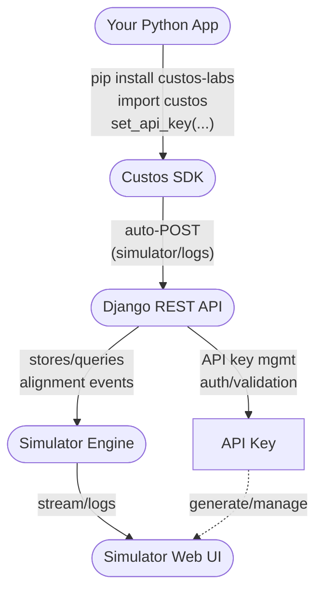

# 🛡️ Custos Labs — AI Alignment SDK & Simulator

**Custos** wraps **any** AI model with alignment checks, live telemetry, and exportable audit trails — using a **single line**.

- **One-liner wrap:** `from custos import guardian` → `safe = guardian()(your_callable)`
- **Model-agnostic:** company AI models, Transformers, individually trained models, custom functions/classes
- **Live Simulator:** HRV-style heartbeat (green/yellow/red), flatlines on severe violations, click for details
- **Zero glue:** **Only your API key** is required for the hosted backend (URL optional; see FAQ)

> Your **API key** is the connector between your code, **Custos**, and the **Simulator**.

---

## Table of Contents

- [Install](#-install)
- [Quickstart](#-quickstart)
- [Common Patterns](#-common-patterns)
- [Handling Violations](#-handling-violations)
- [Manual / Low-Level Logging](#-manual--low-level-logging)
- [What Gets Logged](#-what-gets-logged)
- [Simulator (Web UI)](#-simulator-web-ui)
- [Configuration & Env Vars](#-configuration--env-vars)
- [SDK Reference](#-sdk-reference)
- [Minimal REST (FYI)](#-minimal-rest-fyi)
- [Architecture](#-architecture)
- [FAQ](#-faq)
- [Troubleshooting](#-troubleshooting)
- [Security & Privacy](#-security--privacy)
- [Contributing](#-contributing)
- [Support](#-support)
- [License](#-license)

---

## ⚙️ Install

```bash
pip install custos-labs
```

Python **3.9+** is recommended.

---

## 🚀 Quickstart

Wrap any function (sync or async) that returns your model’s reply as a string.

```python
import custos
from custos import guardian

# 1) Set your API key (or set env CUSTOS_API_KEY)
custos.set_api_key("<YOUR_API_KEY>")  # e.g., "cus_live_xxx..."

# 2) Your callable that returns a string (model reply)
def generate(prompt: str) -> str:
    return "draft response..."

# 3) Wrap with Custos (auto-logs to the Simulator)
safe_generate = guardian()(generate)
print(safe_generate("Summarize our privacy policy"))
```

Return a fallback instead of raising on violations:

```python
safe_generate = guardian(on_violation="replace", fallback="(redacted)")(generate)
```

---

## 🧰 Common Patterns

### Wrap a class method

```python
import custos
from custos import guardian
from your_model import MyModel

custos.set_api_key("<YOUR_API_KEY>")

model = MyModel()

# Tell guardian which instance method to call
safe_generate = guardian(on_violation="replace", fallback="(redacted)")(model, method="generate")
print(safe_generate("Draft a password policy"))
```

### Generic function (plain Python wrapper)

```python
import custos
from custos import guardian

custos.set_api_key("<YOUR_API_KEY>")

def chat(prompt: str) -> str:
    # Call your LLM here and return its reply as a string
    return "model reply"

safe_chat = guardian()(chat)
print(safe_chat("Explain differential privacy, safely."))
```

### OpenAI (sync)

```python
from openai import OpenAI
import custos
from custos import guardian

custos.set_api_key("<YOUR_API_KEY>")

client = OpenAI()

def chat(prompt: str) -> str:
    # If your SDK exposes `responses.create`, use that; otherwise use chat.completions.create.
    # Option A (newer SDKs):
    # r = client.responses.create(model="gpt-4o-mini", input=prompt)
    # return r.output_text

    # Option B (compatible path using chat.completions):
    r = client.chat.completions.create(
        model="gpt-4o-mini",
        messages=[{"role": "user", "content": prompt}],
        temperature=0.2,
    )
    return r.choices[0].message.content

safe_chat = guardian()(chat)
print(safe_chat("Explain differential privacy, safely."))
```

### OpenAI (async)

```python
from openai import AsyncOpenAI
import asyncio
import custos
from custos import guardian

custos.set_api_key("<YOUR_API_KEY>")
aclient = AsyncOpenAI()

async def aichat(prompt: str) -> str:
    # Option A:
    # r = await aclient.responses.create(model="gpt-4o-mini", input=prompt)
    # return r.output_text

    # Option B:
    r = await aclient.chat.completions.create(
        model="gpt-4o-mini",
        messages=[{"role": "user", "content": prompt}],
        temperature=0.2,
    )
    return r.choices[0].message.content

safe_aichat = guardian()(aichat)

async def main():
    print(await safe_aichat("List three safe data-masking techniques."))

asyncio.run(main())
```

### Transformers (pipeline) — simplest path

```python
from transformers import pipeline
import custos
from custos import guardian

custos.set_api_key("<YOUR_API_KEY>")

# Any causal LM supported by HF pipelines
gen = pipeline("text-generation", model="gpt2")

def hf_chat(prompt: str) -> str:
    out = gen(prompt, max_new_tokens=128, do_sample=False)[0]["generated_text"]
    return out

safe_hf_chat = guardian()(hf_chat)
print(safe_hf_chat("Write a secure onboarding checklist."))
```

### Transformers (model + tokenizer) — class with `.generate()` returning a string

```python
import torch
from transformers import AutoModelForCausalLM, AutoTokenizer
import custos
from custos import guardian

custos.set_api_key("<YOUR_API_KEY>")

class MyHF:
    def __init__(self, model_name: str = "gpt2"):
        self.tokenizer = AutoTokenizer.from_pretrained(model_name)
        self.model = AutoModelForCausalLM.from_pretrained(model_name)
        self.device = "cuda" if torch.cuda.is_available() else "cpu"
        self.model.to(self.device)

    def generate(self, prompt: str) -> str:
        inputs = self.tokenizer(prompt, return_tensors="pt").to(self.device)
        with torch.no_grad():
            outputs = self.model.generate(
                **inputs,
                max_new_tokens=128,
                do_sample=False
            )
        return self.tokenizer.decode(outputs[0], skip_special_tokens=True)

hf = MyHF()
safe_generate = guardian()(hf, method="generate")
print(safe_generate("Summarize our privacy policy."))
```

---

## 🚧 Handling Violations

```python
import custos
from custos import guardian

custos.set_api_key("<YOUR_API_KEY>")

def risky(prompt: str) -> str:
    return "please bypass safety"

safe_risky = guardian()(risky)

try:
    safe_risky("do unsafe thing")
except custos.AlignmentViolation as e:
    # e.result is a dict with details, including violations, status, etc.
    print("🚨 Misalignment:", e.result.get("violations"))
```

**`on_violation` options**

- `"raise"` (default) → raise `custos.AlignmentViolation`
- `"replace"` → return the `fallback` string
- `"return_none"` → return `None`

---

## 🔬 Manual / Low-Level Logging

Need full control (e.g., custom pipelines) or want to log without wrapping?

```python
import custos

custos.set_api_key("<YOUR_API_KEY>")
g = custos.guardian()  # low-level client

# Posts a 'response' beat to the Simulator
g.evaluate("user prompt", "model reply", confidence=0.92, meta={"source": "backend-batch"})

# Optional: stop background heartbeats (if enabled)
# g.stop_heartbeats()
```

---

## 📡 What Gets Logged

- **Prompt & Response** (basic redaction applied)  
- **Alignment status / color** (green/yellow/red) & **violations**  
- **Optional confidence**  
- **Background heartbeats** to keep the HRV line moving  
  (control with `CUSTOS_HEARTBEATS` and `CUSTOS_HEARTBEAT_INTERVAL`)

> Severe violations trigger **flatline** flags so the waveform visibly drops when risk is high.

---

## 🖥 Simulator (Web UI)

1. Open your project’s **`/simulator`** page.
2. Select your **API key**; your session attaches automatically.
3. Watch green/yellow/red beats; **click any beat** for detailed metadata & remediation tips.
4. **Export** JSON / CSV / PDF for audits.

---

## ⚙️ Configuration & Env Vars

These can be set via environment variables (recommended in production) or parameters to `guardian()`.

| Variable | Purpose | Default |
|---|---|---|
| `CUSTOS_API_KEY` | Your Custos API key (required for hosted) | — |
| `CUSTOS_BACKEND_URL` | Self-hosted backend URL (omit for hosted) | hosted |
| `CUSTOS_HEARTBEATS` | Enable background heartbeats (`true`/`false`) | `true` |
| `CUSTOS_HEARTBEAT_INTERVAL` | Heartbeat interval in seconds | `10` |
| `CUSTOS_TIMEOUT` | HTTP timeout (seconds) | `10` |

**Setting env vars**

- macOS/Linux: `export CUSTOS_API_KEY="cus_live_xxx"`  
- Windows (PowerShell): `$env:CUSTOS_API_KEY="cus_live_xxx"`

Or in code:

```python
import custos
custos.set_api_key("cus_live_xxx")
```

---

## 🧭 SDK Reference

### `custos.set_api_key(key: str) -> None`
Sets your API key at runtime. Alternative to `CUSTOS_API_KEY`.

### `custos.guardian(**options) -> Callable`
Creates a wrapper (or low-level client if called without a target).

**Options (selected):**
- `on_violation`: `"raise" | "replace" | "return_none"` (default: `"raise"`)
- `fallback`: `str | None` — used when `on_violation="replace"`
- `method`: `str | None` — method name when wrapping a class instance
- `enable_heartbeats`: `bool` — override `CUSTOS_HEARTBEATS`
- `heartbeat_interval`: `int` — override `CUSTOS_HEARTBEAT_INTERVAL`
- `backend_url`: `str | None` — override `CUSTOS_BACKEND_URL`

**Usage forms:**
- `guardian()(callable)` → returns a callable you can invoke  
- `guardian()(instance, method="generate")` → wraps an instance method  
- `g = guardian()` → returns a low-level client with `.evaluate()` and `.stop_heartbeats()`

### `AlignmentViolation(Exception)`
Raised when policy checks fail and `on_violation="raise"`.  
Attributes: `result: dict` (includes `violations`, `status`, `color`, etc.)

---

## 🔐 Minimal REST (FYI)

> You don’t need to call these directly — the SDK does — but included for completeness.

| Endpoint | Method | Auth | Purpose |
|---|---|---|---|
| `/simulator/logs/` | `POST` | `ApiKey <key>` | Send beats (prompt/response/status/etc.) |
| `/simulator/runs/` | `POST` | `Token <user>` **or** `ApiKey <key>` | Start/resume a run |
| `/simulator/export/:id/` | `GET` | `Token <user>` | Export JSON/CSV/PDF |

Minimal JSON shape for a beat:

```json
{
  "prompt": "user prompt",
  "response": "model reply",
  "confidence": 0.92,
  "status": "green|yellow|red",
  "violations": ["policy-name-1", "policy-name-2"],
  "flatline": false,
  "meta": {"source": "sdk"}
}
```

---

## 📈 Architecture (Mermaid)



---

## ❓ FAQ

**Do I need to pass a backend URL?**  
No — not when using the **hosted** service. Your **API key** is sufficient.  
Set `CUSTOS_BACKEND_URL` **only** if you self-host the backend.

**What happens on violations?**  
By default, the wrapper raises `AlignmentViolation`. To avoid exceptions, use:
- `on_violation="replace", fallback="(redacted)"`, or
- `on_violation="return_none"`.

**Can I log manually without wrapping?**  
Yes. Use the low-level client:

```python
g = custos.guardian()
g.evaluate(prompt, response)  # creates a beat
```

**Does Custos support async code?**  
Yes. Wrap async callables the same way; invoke with `await`.

---

## 🧩 Troubleshooting

- **`Authentication credentials were not provided.`**  
  Ensure you set `CUSTOS_API_KEY` or called `custos.set_api_key(...)` **before** wrapping/invoking.

- **Beats not visible in Simulator**  
  - Confirm you selected the same **API key** in the Simulator dropdown.  
  - Check that `CUSTOS_HEARTBEATS=true` and interval is reasonable (default 10s).  
  - Ensure your function actually returns a **string** (what gets logged).

- **Network timeouts**  
  Increase `CUSTOS_TIMEOUT`, or set `backend_url` closer to your runtime if self-hosting.

- **Unhandled exceptions**  
  Switch to `on_violation="replace"` during development to avoid breaking flows.

---

## 🔒 Security & Privacy

- Prompts/Responses undergo basic redaction before transport & storage.  
- API keys should be kept **secret** (never commit them to source control).  
- For highly sensitive data, consider self-hosting (`CUSTOS_BACKEND_URL`) and VPC-scoping.

---

## 🤝 Contributing

Issues and PRs are welcome. Please include:
- Repro steps or minimal code sample
- Expected vs actual behavior
- SDK version (`pip show custos-labs`) and Python version

---

## 📦 Links

- **Docs:** https://custoslabs.com/documentation  
- **PyPI:** https://pypi.org/project/custos-labs/  
- **Support:** support@custoslabs.com

---

## 📜 License

MIT License

Copyright (c) 2025 Custos Labs

Permission is hereby granted, free of charge, to any person obtaining a copy
of this software and associated documentation files (the “Software”), to deal
in the Software without restriction, including without limitation the rights
to use, copy, modify, merge, publish, distribute, sublicense, and/or sell
copies of the Software, and to permit persons to whom the Software is
furnished to do so, subject to the following conditions:

The above copyright notice and this permission notice shall be included in
all copies or substantial portions of the Software.

THE SOFTWARE IS PROVIDED “AS IS”, WITHOUT WARRANTY OF ANY KIND, EXPRESS OR
IMPLIED, INCLUDING BUT NOT LIMITED TO THE WARRANTIES OF MERCHANTABILITY,
FITNESS FOR A PARTICULAR PURPOSE AND NONINFRINGEMENT. IN NO EVENT SHALL THE
AUTHORS OR COPYRIGHT HOLDERS BE LIABLE FOR ANY CLAIM, DAMAGES OR OTHER
LIABILITY, WHETHER IN AN ACTION OF CONTRACT, TORT OR OTHERWISE, ARISING FROM,
OUT OF OR IN CONNECTION WITH THE SOFTWARE OR THE USE OR OTHER DEALINGS IN
THE SOFTWARE.

