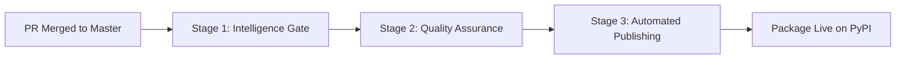

# Release Process Documentation

This document provides comprehensive documentation of the automated release process for `django-allauth-require2fa`.

## 🎯 Overview: Zero-Touch Releases

The project achieves **complete release automation** from developer commit to published PyPI package with zero manual intervention.

**Timeline**: ~5 minutes from merge to published package  
**Quality**: 100% automated testing and security scanning  
**Security**: OIDC trusted publishing with no API keys  

## 🔄 Release Pipeline Architecture

### Three-Stage Pipeline



## 📊 Stage 1: Intelligence Gate (2 minutes)

**Purpose**: Determine if a release should be created based on commit analysis.

### Semantic Analysis Process

1. **Commit Parsing**: Analyzes all commits since last release
2. **Rule Application**: Applies conventional commit rules from `pyproject.toml`
3. **Version Calculation**: Determines new version number or skips release
4. **Quality Pre-check**: Only proceeds if changes warrant release

### Configuration (pyproject.toml)
```toml
[tool.semantic_release.commit_parser_options]
minor_tags = ["feat"]                    # 1.0.0 → 1.1.0
patch_tags = ["fix", "perf", "refactor"] # 1.0.0 → 1.0.1
# docs, chore, ci = no release (excluded)
```

### Decision Logic
```bash
# Command used for analysis
uv run semantic-release version --print --no-commit --no-tag --no-push --no-vcs-release

# Outcomes:
# - New version number (e.g., "1.2.0") → Proceed to Stage 2
# - "0.1.0" or error → Skip release (no significant changes)
```

## 🔍 Stage 2: Quality Assurance (2 minutes)

**Purpose**: Ensure only high-quality, secure code reaches production.

### Quality Gates (All Must Pass)

#### Code Quality Checks
```bash
# Linting (150x faster than traditional tools)
uv run --extra dev ruff check .

# Formatting verification
uv run --extra dev ruff format --check .

# Security scanning
uv run --extra dev bandit -r require2fa/ --exclude require2fa/tests/

# Type checking
uv run --extra dev mypy require2fa/
```

#### Comprehensive Testing
```bash
# Django test suite (15 security tests)
uv run python -m django test require2fa.tests --settings=require2fa.tests.settings --verbosity=2
```

### Test Categories

1. **Security Tests** (5 tests)
   - Path traversal protection
   - URL resolution verification
   - Configuration validation

2. **Integration Tests** (7 tests)
   - Middleware behavior
   - Django compatibility
   - Edge case handling

3. **Regression Tests** (3 tests)
   - Known vulnerability prevention
   - Breaking change detection

### Failure Handling

If **any** quality gate fails:
- ❌ Release is **completely blocked**
- 📧 GitHub Actions provides detailed failure logs
- 🔄 Must fix issues and push again to retry

## 🚀 Stage 3: Automated Publishing (1 minute)

**Purpose**: Securely publish the package to PyPI with professional metadata.

### Version Management
```bash
# Semantic release updates version in pyproject.toml
[project]
version = "1.1.0"  # Automatically bumped

# Git operations
git tag v1.1.0
git push origin v1.1.0
```

### GitHub Release Creation
- **Automated changelog** from conventional commits
- **Professional release notes** with installation instructions
- **Asset linking** to PyPI package
- **Security information** and feature highlights

### PyPI Publishing (OIDC)
```yaml
# Secure publishing without API keys
- name: Publish to PyPI
  uses: pypa/gh-action-pypi-publish@release/v1
  with:
    print-hash: true
    verify-metadata: true
```

**Security Features**:
- **OIDC Authentication** - No stored secrets
- **Metadata Verification** - Package integrity checks
- **Hash Printing** - Audit trail for verification

### Post-Publication
- **Release notes update** with PyPI links
- **Documentation refresh** with new version
- **Notification systems** (if configured)

## 🎛️ Manual Controls

### Workflow Triggers

1. **Automatic** (Primary)
   ```bash
   git push origin master  # Any push to master triggers analysis
   ```

2. **Manual Trigger**
   ```bash
   gh workflow run semantic-release.yml  # Emergency manual trigger
   ```

### Testing Commands

```bash
# Preview what release would happen (safe dry run)
uv run semantic-release version --print --no-commit --no-tag --no-push --no-vcs-release

# Check specific commit for release worthiness
git log --oneline -10  # Review recent commits

# Validate quality locally before pushing
make all  # Full quality + test suite
```

## 📋 Release Requirements

### Commit Message Requirements

**For Release Creation** (PR titles):
- ✅ `feat: add new authentication method` → Minor release
- ✅ `fix: resolve URL parsing vulnerability` → Patch release
- ❌ `docs: update readme` → No release
- ❌ `chore: update dependencies` → No release

### Quality Requirements (All Automated)

1. **Code Quality**
   - Ruff linting: 100% pass rate
   - Ruff formatting: Consistent style
   - Security scan: Zero vulnerabilities
   - Type checking: No type errors

2. **Testing**
   - Unit tests: 100% pass rate
   - Security tests: All 15 tests pass
   - Integration tests: Django compatibility verified

3. **Security**
   - Bandit scan: No security issues
   - Dependency audit: No known vulnerabilities
   - Configuration validation: Safe Django settings

## 🐛 Troubleshooting

### Common Issues

#### "No release created despite feat: commit"
```bash
# Check if commit was properly parsed
uv run semantic-release version --print --no-commit --no-tag --no-push --no-vcs-release

# Possible causes:
# 1. Commit message format incorrect
# 2. Already at calculated version
# 3. Only excluded commit types since last release
```

#### "Quality gate failed"
```bash
# Run locally to debug
make all  # Runs same checks as CI

# Individual checks
make lint     # Ruff linting
make format   # Code formatting
make security # Bandit scan
make mypy     # Type checking
make test     # Django tests
```

#### "PyPI publishing failed"
```bash
# Check workflow logs for:
# 1. OIDC authentication issues
# 2. Package metadata problems
# 3. Version conflicts

# Verify package built correctly
uv build
ls -la dist/
```

### Debug Commands

```bash
# Check recent releases
gh release list

# View specific release
gh release view v1.1.0

# Check workflow runs
gh run list --workflow=semantic-release.yml

# View specific run details
gh run view <run-id>
```

## 📊 Monitoring & Metrics

### Key Performance Indicators

- **Time to Release**: Target <5 minutes from merge to PyPI
- **Quality Gate Pass Rate**: Target 100% (failing builds block release)
- **Security Incident Rate**: Target 0 (automated scanning prevention)
- **Manual Intervention**: Target 0% (fully automated)

### Health Checks

```bash
# Verify automation health
gh workflow list  # All workflows should be active
gh run list --limit 5  # Recent runs should be successful

# Package health
curl -s https://pypi.org/pypi/django-allauth-require2fa/json | jq '.info.version'
```

## 🔒 Security Considerations

### OIDC Trusted Publishing

**Advantages**:
- No API keys stored in GitHub
- Automatic key rotation
- Audit trail for all publishes
- Impossible to steal credentials

**Configuration**:
- PyPI trusted publisher configured for this repository
- GitHub environment protection on `pypi` environment
- Required reviewers for sensitive changes

### Security Scanning Pipeline

**Pre-Release**:
- Bandit security scanner (Python security issues)
- Dependency vulnerability scanning
- Configuration validation

**Post-Release**:
- Package signature verification
- Hash validation and publication
- Security advisory monitoring

## 📈 Future Enhancements

### Planned Improvements

1. **Enhanced Monitoring**
   - PyPI download metrics integration
   - Security advisory automation
   - Performance regression detection

2. **Quality Improvements**
   - Mutation testing integration
   - Property-based test generation
   - Automated dependency updates

3. **Release Features**
   - Multiple Python version testing
   - Pre-release (beta) channel support
   - Rollback automation

### Configuration Evolution

The release configuration is versioned in `pyproject.toml`, allowing:
- **Rule changes** to be tracked in git
- **Rollback capability** for configuration issues
- **Transparency** in release decision logic

---

**Summary**: This release process represents industry-leading automation that ensures consistent, high-quality, secure releases while maintaining developer productivity and project reliability.