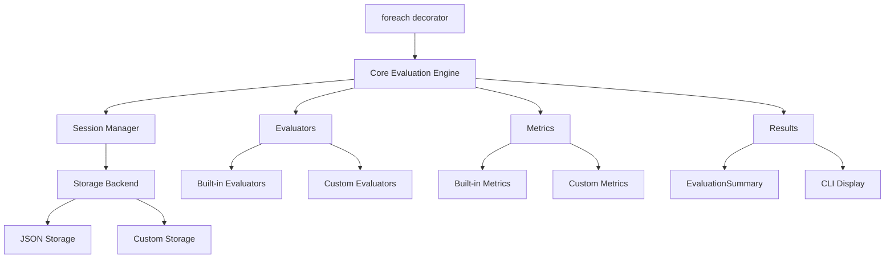

# Reference

This section provides detailed reference documentation for all dotevals features with practical examples.

## Running Evaluations

- **[Interactive Mode](interactive.md)** - Run evaluations programmatically in notebooks and scripts
- **[Pytest Mode](pytest-mode.md)** - Run evaluations in CI/CD pipelines with pytest

## Core Concepts

- **[The @foreach Decorator](foreach.md)** - Transform functions into evaluations that run across datasets
- **[Evaluators](evaluators.md)** - Build custom scoring functions for different evaluation criteria
- **[Metrics](metrics.md)** - Aggregate and analyze evaluation results with built-in and custom metrics
- **[Experiments](experiments.md)** - Manage evaluation state, progress tracking, and resumption
- **[Storage Backends](storage.md)** - Persist evaluation data with built-in and custom storage systems

## Integration Guides

- **[pytest Integration](pytest.md)** - Deep dive into pytest plugin and test execution
- **[Async Evaluations](async.md)** - Scale evaluations with concurrent processing
- **[Data Handling](datasets.md)** - Work with different dataset formats and sources

## Quick Reference

### Common Patterns

```python
# Basic evaluation
@foreach("question,answer", dataset)
def eval_basic(question, answer, model):
    response = model.generate(question)
    return exact_match(response, answer)

# Custom evaluator with metrics
@evaluator(metrics=[accuracy(), custom_metric()])
def custom_evaluator(prediction: str, expected: str) -> bool:
    return advanced_comparison(prediction, expected)

# Async evaluation
@foreach("prompt,expected", async_dataset)
async def eval_async(prompt, expected, async_model):
    response = await async_model.generate_async(prompt)
    return exact_match(response, expected)
```

### Running Evaluations

```bash
# Basic evaluation with experiment
pytest eval_math.py::eval_math --experiment math_baseline

# With custom parameters
pytest eval_math.py --experiment math_test --samples 100 --concurrent

# Resume interrupted evaluation
pytest eval_math.py --experiment math_baseline  # Automatically resumes
```

### Session Management

```bash
# List sessions
dotevals list

# View results
dotevals show math_baseline

# Clean up
dotevals delete old_experiment
```

### Storage Configuration

```bash
# Custom storage location
pytest eval.py --experiment test --storage "json://custom_path"

# Different storage backends
--storage "json://.dotevals"         # Default JSON files
--storage "json://local_evals"      # Custom JSON location
--storage "sqlite://evals.db"       # SQLite database (requires plugin)
```

## Architecture Overview



## Data Flow

1. **Dataset Input** - Iterator of data items (tuples, dicts, etc.)
2. **@foreach Processing** - Maps dataset columns to function parameters
3. **Evaluation Function** - Your custom evaluation logic
4. **Evaluators** - Score model outputs against expected results
5. **Metrics** - Aggregate individual scores into summary statistics
6. **Session Storage** - Persist results for resumption and analysis
7. **Result Display** - CLI and programmatic access to results

## Getting Help

- **API Documentation**: See the [API Reference](../api/index.md) for detailed function signatures
- **CLI Guide**: See [CLI documentation](cli.md) for command-line usage
- **Installation**: Visit [Installation guide](../installation.md) for setup instructions
- **Tutorials**: Check the [tutorial series](../tutorials/01-your-first-evaluation.md) for step-by-step guides
- **How-To Guides**: Visit [How-To Guides](../how-to/index.md) for problem-focused solutions

## See Also

- **[Tutorial 8: Build Production Evaluation Pipeline](../tutorials/08-build-production-evaluation-pipeline.md)** - Production-ready evaluation patterns

## Contributing

Found an issue or want to contribute? See our [contribution guidelines](https://github.com/dottxt-ai/dotevals/blob/main/CONTRIBUTING.md) on GitHub.
