# 🔥🐕 Firehound Firebase Security Scanner

[](https://badge.fury.io/py/firehound-scanner)
[](https://www.python.org/downloads/)

**Automated Firebase security scanner for iOS applications**

Firehound downloads iOS apps from the App Store, extracts Firebase configurations, and systematically tests for security misconfigurations across Realtime Database, Firestore, Storage, Functions, and Hosting services.

## 🚀 Quick Start

### Installation
```bash
# Install from PyPI  
pip install firehound-scanner

# Or with pipx (recommended for tools)
pipx install firehound-scanner
```

### Prerequisites
Install ipatool for App Store downloads:
```bash
# macOS
brew install majd/repo/ipatool

# Linux - download from releases
# https://github.com/majd/ipatool/releases
```

### Setup & Usage
```bash
# 1. One-time setup with Apple ID
ipatool auth login --email your@email.com

# 2. Set environment variables
export FIREHOUND_EMAIL='your@email.com'
export FIREHOUND_KEYCHAIN_PASSPHRASE='your_passphrase'
export FIREHOUND_APPLE_ID_PASSWORD='your_password'

# 3. Start scanning!
firehound --search "banking apps" -l 3      # Search and scan
firehound --bundle-id com.example.app       # Scan specific app
firehound --ids-file app-list.txt           # Batch scan
firehound --directory /path/to/app          # Scan extracted app
```

## 🏗️ How It Works

```mermaid
graph LR
    A[🔍 App Store Search] --> B[📱 Download iOS App]
    B --> C[📋 Extract Firebase Config]
    C --> D[🧪 Test Firebase Services]
    D --> E[📊 Generate Report]
    
    subgraph "Firebase Services"
        F[🔥 Realtime Database]
        G[📄 Firestore]
        H[📦 Storage Buckets]
        I[⚡ Cloud Functions]
        J[🌐 Hosting]
    end
    
    D --> F
    D --> G
    D --> H
    D --> I
    D --> J
```



## ✨ Key Features

- 🔍 **Automated Discovery**: Search App Store or scan specific apps
- 🏗️ **Complete Coverage**: Tests all major Firebase services
- 🔐 **Authentication Testing**: Attempts anonymous and email auth
- 📊 **Detailed Reports**: JSON reports with evidence and proof-of-concept
- ⚡ **Fast & Efficient**: Concurrent testing with smart retries
- 🧹 **Responsible Testing**: Cleans up test data automatically

## 🎯 What It Finds

### 🚨 Critical Issues
- **Public write access** to databases or storage
- **Exposed security rules** configuration
- **Admin endpoints** accessible without auth

### ⚠️ Security Issues  
- **Public read access** to sensitive data
- **Directory listing** enabled on storage
- **Unauthenticated API** endpoints

### Detection Coverage


## 📚 Documentation

- **🌐 Complete Documentation**: https://firehound.covertlabs.io
- **🐛 Issues & Support**: https://github.com/covertlabsaus/firehound/issues

## 🤝 Contributing

1. **Fork** the repository
2. **Create** feature branch: `git checkout -b feature/amazing-feature`
3. **Commit** changes: `git commit -m 'Add amazing feature'`
4. **Push** to branch: `git push origin feature/amazing-feature`
5. **Open** a Pull Request

## ⚖️ Legal & Ethics

- ✅ **Test only apps you own** or have permission to test
- ✅ **Follow responsible disclosure** for found vulnerabilities  
- ✅ **Respect rate limits** and terms of service
- ❌ **Do not test** apps without authorization

## 📄 License

MIT License - see [LICENSE](LICENSE) file for details.

---

**Built with ❤️ for the security community**

### App Store Search Process
