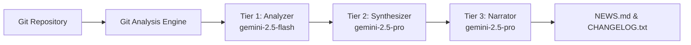

# 🚀 Git AI Reporter (DevSummary AI)

<div align="center">

[](https://www.python.org/downloads/)
[](https://opensource.org/licenses/MIT)
[](https://github.com/astral-sh/ruff)
[](https://mypy-lang.org/)
[](https://pytest.org)
[](https://pypi.org/project/git-ai-reporter/)
[](https://github.com/paudley/git-ai-reporter/actions)
[](https://codecov.io/gh/paudley/git-ai-reporter)

**Transform your Git history into intelligent, audience-aware documentation using AI**

[Features](#-features) • [Quick Start](#-quick-start) • [Documentation](#-documentation) • [Contributing](#-contributing) • [Roadmap](#-roadmap)

</div>

---

## 📖 Overview

**Git AI Reporter** (DevSummary AI) is an AI-driven command-line tool that analyzes Git repository history and automatically generates high-quality development documentation. Using Google's Gemini models and a sophisticated three-tier AI architecture, it transforms raw commit data into polished, audience-specific narratives.

### What It Does

Git AI Reporter solves the critical challenge of development visibility by automatically generating:

- **📰 `NEWS.md`**: Narrative, stakeholder-friendly development summaries
- **📋 `CHANGELOG.txt`**: Structured, [Keep a Changelog](https://keepachangelog.com/) compliant change lists with emoji categorization
- **📅 `DAILY_UPDATES.md`**: Daily development activity summaries

Instead of manually crafting release notes or dumping raw git logs, Git AI Reporter intelligently analyzes your commits, identifies patterns, and creates professional documentation that serves both technical and non-technical audiences.

## ✨ Features

### 🎯 Core Capabilities

- **Multi-Lens Analysis**: Analyzes commits at three granularities (individual, daily, weekly)
- **Intelligent Filtering**: Automatically identifies and excludes trivial commits
- **Context-Aware Summaries**: Groups related changes and identifies development themes
- **Emoji Categorization**: Visual indicators for different change types (✨ Features, 🐛 Fixes, etc.)
- **Configurable Models**: Three-tier AI architecture optimizing for speed, cost, and quality

### 🏗️ Architecture Highlights

- **Clean Architecture**: Strict separation of domain, application, and infrastructure layers
- **Robust JSON Handling**: "Airlock" pattern for handling imperfect LLM outputs
- **Smart Caching**: Minimize API costs with intelligent response caching
- **Type-Safe**: 100% type annotated with strict mypy checking
- **Test Coverage**: Comprehensive test coverage with deterministic testing

## 🚀 Quick Start

### Prerequisites

- Python 3.12 or higher
- Git installed and accessible
- Google Gemini API key

### Installation

#### From PyPI (Recommended)

```bash
# Install from PyPI
pip install git-ai-reporter

# Or using uv
uv pip install git-ai-reporter
```

#### From Source

##### Using uv

```bash
# Clone the repository
git clone https://github.com/paudley/git-ai-reporter.git
cd git-ai-reporter

# Create virtual environment and install
uv venv
source .venv/bin/activate  # On Windows: .venv\Scripts\activate
uv pip install -e .
```

##### Using pip

```bash
# Clone and install
git clone https://github.com/paudley/git-ai-reporter.git
cd git-ai-reporter

# Create virtual environment
python -m venv .venv
source .venv/bin/activate  # On Windows: .venv\Scripts\activate

# Install in development mode
pip install -e .
```

### Configuration

1. **Set up your API key**:

```bash
# Copy the example environment file
cp .env.example .env

# Edit .env and add your Gemini API key
echo 'GEMINI_API_KEY="your-api-key-here"' >> .env
```

2. **Get a Gemini API Key**:
   - Visit [Google AI Studio](https://makersuite.google.com/app/apikey)
   - Create a new API key
   - Add it to your `.env` file

### Basic Usage

```bash
# Analyze the last 4 weeks of the current repository
git-ai-reporter

# Analyze a specific repository for 2 weeks
git-ai-reporter --repo-path /path/to/repo --weeks 2

# Analyze a specific date range
git-ai-reporter --start-date "2024-01-01" --end-date "2024-01-31"

# Debug mode with verbose output
git-ai-reporter --debug

# Skip cache and re-analyze everything
git-ai-reporter --no-cache
```

## 🧠 How It Works

### Three-Tier AI Architecture

Git AI Reporter employs a sophisticated multi-tier AI system that balances performance, cost, and quality:



1. **Tier 1 - Analyzer** (gemini-2.5-flash)
   - High-volume, fast analysis of individual commits
   - Generates concise summaries and categorizations
   - Optimized for speed and cost-efficiency

2. **Tier 2 - Synthesizer** (gemini-2.5-pro)
   - Identifies patterns across multiple commits
   - Groups related changes and finds themes
   - Creates daily and weekly consolidations

3. **Tier 3 - Narrator/Changelogger** (gemini-2.5-pro)
   - Generates polished, audience-specific content
   - Adopts different "personas" for different outputs
   - Ensures format compliance and narrative quality

### Multi-Lens Analysis Strategy

The system analyzes your repository through three complementary lenses:

1. **🔍 Micro View**: Individual commit analysis with intelligent filtering
2. **📊 Mezzo View**: Daily consolidation showing net changes per 24-hour period
3. **🌍 Macro View**: Weekly overview providing complete context for narratives

### Intelligent Commit Filtering

Automatically excludes trivial commits based on:
- Conventional commit prefixes (`chore:`, `docs:`, `style:`)
- File path patterns (documentation, configuration files)
- Change size and complexity thresholds

## 📁 Project Structure

```
git-ai-reporter/
├── src/git_ai_reporter/
│   ├── analysis/           # Git repository analysis engine
│   │   └── git_analyzer.py # Multi-lens commit analysis
│   ├── cache/              # Intelligent caching layer
│   ├── orchestration/      # Pipeline coordination
│   ├── services/           # External service integrations
│   │   └── gemini.py       # Three-tier AI processing
│   ├── summaries/          # Summary generation logic
│   ├── utils/              # Robust JSON handling & utilities
│   └── writing/            # Artifact generation
├── tests/                  # Comprehensive test suite
│   ├── cassettes/          # VCR recordings for deterministic testing
│   ├── snapshots/          # Output validation snapshots
│   └── fixtures/           # Static test data
└── docs/                   # Additional documentation
```

## 🧪 Development

### Setting Up Development Environment

```bash
# Install development dependencies
uv pip install -e .[dev]

# Run the full test suite
pytest

# Run with coverage report
pytest --cov=src/git_ai_reporter --cov-report=html

# Type checking
mypy src/

# Linting and formatting
ruff check .
ruff format .
```

### Testing Philosophy

Git AI Reporter employs a sophisticated testing strategy:

- **Deterministic Testing**: Using pytest-recording for API mocking
- **Snapshot Testing**: Validating output consistency
- **Property-Based Testing**: Using Hypothesis for edge cases
- **Parallel Execution**: Tests run concurrently for speed
- **Comprehensive Test Coverage**: Extensive test coverage for core functionality

### Updating Tests

#### Re-recording API Mocks

```bash
# Delete the old cassette
rm tests/cassettes/test_name.yaml

# Re-run to record new interaction
pytest tests/test_file.py::test_name
```

#### Updating Snapshots

```bash
# Update snapshots after intentional changes
pytest --snapshot-update
```

## 📊 Performance

| Metric | Current | Target | Status |
|--------|---------|--------|--------|
| Core Test Coverage | Comprehensive | Comprehensive | ✅ |
| Type Coverage | Complete | Complete | ✅ |
| API Response Time | ~2s/commit | <500ms | 🟡 |
| Cache Hit Rate | 70% | >80% | 🟡 |
| Memory Usage | <500MB | <200MB | 🟡 |

## 🛣️ Roadmap

See [PENDING.md](PENDING.md) for the detailed enhancement roadmap. Key priorities:

### Phase 1 (Immediate)
- ⚡ Async/await migration for 3-4x performance improvement
- 🔄 Incremental processing for 90% faster regular updates
- ✅ Achieved comprehensive core functionality test coverage

### Phase 2 (Short-term)
- 📦 Batch API processing for 70% cost reduction
- 🧠 Smart caching with 80%+ hit rate
- 🎨 Rich CLI with progress bars and syntax highlighting

### Phase 3 (Medium-term)
- 🔌 Plugin architecture for extensibility
- 🌐 Multi-repository analysis support
- 📈 Context-aware summarization

## 🤝 Contributing

We welcome contributions! Please see our [Contributing Guide](CONTRIBUTING.md) for details.

### Quick Contribution Guide

1. Fork the repository
2. Create a feature branch (`git checkout -b feature/amazing-feature`)
3. Make your changes
4. Run tests (`pytest`)
5. Commit with conventional commits (`feat: add amazing feature`)
6. Push and create a Pull Request

### Development Standards

- **Code Style**: Ruff formatted with 88-character lines
- **Type Hints**: Required for all functions
- **Docstrings**: Google-style for all public APIs
- **Testing**: New features require tests
- **Documentation**: Update relevant docs

## 📚 Documentation

- [Coding Guidelines](docs/CODING_GUIDELINES.md) - Development standards and practices
- [Testing Guidelines](docs/PYTEST_GUIDELINES.md) - Comprehensive testing approach
- [CLAUDE.md](CLAUDE.md) - AI assistant configuration and project context
- [Contributing Guide](CONTRIBUTING.md) - How to contribute to the project

## 🔒 Security

- API keys are never logged or cached
- All external data is validated
- Robust error handling prevents information leakage
- See [SECURITY.md](SECURITY.md) for reporting vulnerabilities

## 📄 License

This project is licensed under the MIT License (SPDX: MIT) - see the [LICENSE](LICENSE) file for details.

All source code files include SPDX license identifiers for automated license detection.

## 🙏 Acknowledgments

- [Keep a Changelog](https://keepachangelog.com/) for changelog standards
- [Conventional Commits](https://www.conventionalcommits.org/) for commit conventions
- Google Gemini team for the excellent AI models
- The Python community for amazing tools and libraries

## 📮 Support

- 🐛 [Report bugs](https://github.com/paudley/git-ai-reporter/issues)
- 💡 [Request features](https://github.com/paudley/git-ai-reporter/discussions)
- 📧 [Contact maintainer](mailto:paudley@blackcat.ca)
- 💬 [Join discussions](https://github.com/paudley/git-ai-reporter/discussions)

## ⭐ Star History

[](https://star-history.com/#paudley/git-ai-reporter&Date)

---

<div align="center">
Made with ❤️ by the Git AI Reporter Team

If you find this project useful, please consider giving it a ⭐!
</div>
