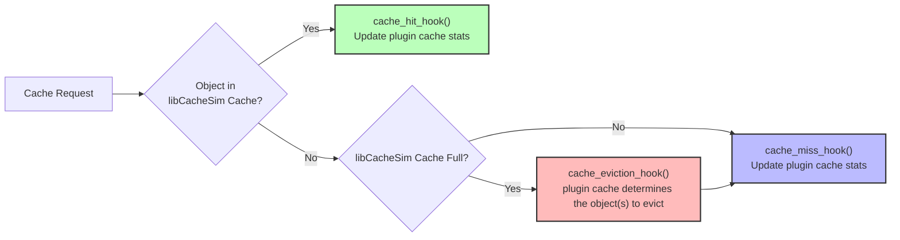

# libCacheSim Plugin System – Quick-Start Guide

> **Audience**: Developers who want to add custom cache–replacement policies to *libCacheSim* without modifying the core library.
>
> **Goal**: Build a shared-library plugin (C/C++) or implement a Python plugin that implements a few well-defined hook functions, then load it at runtime.

---

## 1 . How the Plugin System Works

A series of hook functions defines the behavior of the custom cache during cache hits and misses. In essence, `libCacheSim` maintains a basic cache that tracks whether an object is a hit or miss, whether the cache is full, and provides hooks accordingly. The actual cache management logic—such as deciding which object(s) to evict on a miss—is entirely delegated to the plugin via these hooks.



libCacheSim supports two types of plugins:

### 1.1 C/C++ Plugins

`plugin_cache.c` ships with *libCacheSim* and delegates **all policy-specific logic** to a user-supplied shared library (``.so`` / ``.dylib``).  At run-time the library is

1. loaded with `dlopen()`;
2. each required *hook* is resolved with `dlsym()`; and
3. the hooks are invoked on cache hits, misses, evictions, and removals.

### 1.2 Python Plugins

The Python binding provides `PythonHookCachePolicy` which allows you to implement custom cache replacement algorithms using pure Python functions - **no C/C++ compilation required**. This is perfect for:
- Prototyping new cache algorithms
- Educational purposes and learning
- Research and experimentation
- Custom business logic implementation

Because plugins are completely decoupled from core code you can:
* experiment with new algorithms quickly,
* write plugins in **C, C++, or Python**, and
* distribute them independently from *libCacheSim*.

---

## 2 . C/C++ Plugin Development

### 2.1 Required Hook Functions

Your library **must** export the following C-symbols:

| Hook | Prototype | Called When |
|------|-----------|-------------|
| `cache_init_hook` | `void *cache_init_hook(const common_cache_params_t ccache_params);` | Once at cache creation. Return an opaque pointer to plugin state. |
| `cache_hit_hook` | `void cache_hit_hook(void *data, const request_t *req);` | A requested object is found in the cache. |
| `cache_miss_hook` | `void cache_miss_hook(void *data, const request_t *req);` | A requested object is **not** in the cache *after* insertion. |
| `cache_eviction_hook` | `obj_id_t cache_eviction_hook(void *data, const request_t *req);` | Cache is full – must return the object-ID to evict. |
| `cache_remove_hook` | `void cache_remove_hook(void *data, const obj_id_t obj_id);` | An object is explicitly removed (not necessarily due to eviction). |

The opaque pointer returned by `cache_init_hook` is passed back to every other hook via the `data` parameter, letting your plugin maintain arbitrary state (linked lists, hash maps, statistics, …). For memory safety, your library can export `cache_free_hook` (`void cache_free_hook(void *data);`) to free the resources used by your cache struct according to your demands.

### 2.2 Minimal Plugin Skeleton (C++)

Below is an **abridged** version of the LRU example in `example/plugin_v2/plugin_lru.cpp`.  You can copy this as a starting point for your own policy:

```cpp
#include <libCacheSim.h>   // public headers installed by libCacheSim
#include <unordered_map>

class MyPolicy {
  /* your data structures */
public:
  MyPolicy() {/*init*/}
  void on_hit(obj_id_t id) {/*...*/}
  void on_miss(obj_id_t id, uint64_t size) {/*...*/}
  obj_id_t evict() {/* decide victim */}
  void on_remove(obj_id_t id) {/*...*/}
};

extern "C" {
void *cache_init_hook(const common_cache_params_t /*params*/) {
  return new MyPolicy();
}

void cache_hit_hook(void *data, const request_t *req) {
  static_cast<MyPolicy *>(data)->on_hit(req->obj_id);
}

void cache_miss_hook(void *data, const request_t *req) {
  static_cast<MyPolicy *>(data)->on_miss(req->obj_id, req->obj_size);
}

obj_id_t cache_eviction_hook(void *data, const request_t * /*req*/) {
  return static_cast<MyPolicy *>(data)->evict();
}

void cache_remove_hook(void *data, const obj_id_t obj_id) {
  static_cast<MyPolicy *>(data)->on_remove(obj_id);
}
} // extern "C"
```

*Notes*
1. The plugin can allocate dynamic memory; it will live until the cache is destroyed.
2. Thread safety is up to you – core *libCacheSim* is single-threaded today.

### 2.3 Building the Plugin

#### 2.3.1 Dependencies

* **CMake ≥ 3.12** (recommended)
* A C/C++ compiler (``gcc``, ``clang``)

#### 2.3.2 Sample `CMakeLists.txt`

```cmake
cmake_minimum_required(VERSION 3.12)
project(my_cache_plugin CXX C)

# Tell CMake to create a shared library
add_library(plugin_my_policy SHARED plugin_my_policy.cpp)

# Location of libCacheSim headers – adjust if you installed elsewhere
target_include_directories(plugin_my_policy PRIVATE
  ${CMAKE_CURRENT_SOURCE_DIR}/../../include)

# Position-independent code is implicit for shared libs but keep for clarity
set_property(TARGET plugin_my_policy PROPERTY POSITION_INDEPENDENT_CODE ON)

# Optional: strip symbols & set output name
set_target_properties(plugin_my_policy PROPERTIES
  OUTPUT_NAME "plugin_my_policy_hooks")
```

#### 2.3.3 Build Commands

```bash
mkdir build && cd build
cmake -G Ninja ..   # or "cmake .. && make"
ninja               # produces libplugin_my_policy_hooks.so
```

> On macOS the file extension will be `.dylib` instead of `.so`.

### 2.4 Using the C/C++ Plugin with `cachesim`

1. **Compile** the plugin (`libplugin_my_policy_hooks.so`).
2. **Run** `cachesim` with `pluginCache` **and** supply `plugin_path=`:

```bash
./bin/cachesim data/cloudPhysicsIO.vscsi vscsi pluginCache 0.01 \
  -e "plugin_path=/absolute/path/libplugin_my_policy_hooks.so,cache_name=myPolicy"
```

* Keys after `-e` are comma-separated.  Supported keys today:
  * `plugin_path` (required) – absolute or relative path to the `.so` / `.dylib`.
  * `cache_name`   (optional) – override the cache's display name.
  * `print`        – debug helper: print current parameters and exit.

If you omit `cache_name`, the runtime will default to `pluginCache-<fileName>` for easier identification in logs.

---

## 3 . Python Plugin Development

### 3.1 Required Hook Functions

You need to implement these Python callback functions:

| Hook | Prototype | Called When |
|------|-----------|-------------|
| `init_hook` | `init_hook(cache_size: int) -> Any` | Once at cache creation. Return your data structure. |
| `hit_hook` | `hit_hook(data: Any, obj_id: int, obj_size: int) -> None` | A requested object is found in the cache. |
| `miss_hook` | `miss_hook(data: Any, obj_id: int, obj_size: int) -> None` | A requested object is **not** in the cache *after* insertion. |
| `eviction_hook` | `eviction_hook(data: Any, obj_id: int, obj_size: int) -> int` | Cache is full – must return the object-ID to evict. |
| `remove_hook` | `remove_hook(data: Any, obj_id: int) -> None` | An object is explicitly removed (not necessarily due to eviction). |
| `free_hook` | `free_hook(data: Any) -> None` | [Optional] Final cleanup when cache is destroyed. |

### 3.2 Example: Custom LRU Implementation

```python
import libcachesim as lcs
from collections import OrderedDict

# Create a Python hook-based cache
cache = lcs.PythonHookCachePolicy(cache_size=1024*1024, cache_name="MyLRU")

# Define LRU policy hooks
def init_hook(cache_size):
    return OrderedDict()  # Track access order

def hit_hook(lru_dict, obj_id, obj_size):
    lru_dict.move_to_end(obj_id)  # Move to most recent

def miss_hook(lru_dict, obj_id, obj_size):
    lru_dict[obj_id] = True  # Add to end

def eviction_hook(lru_dict, obj_id, obj_size):
    return next(iter(lru_dict))  # Return least recent

def remove_hook(lru_dict, obj_id):
    lru_dict.pop(obj_id, None)

# Set the hooks
cache.set_hooks(init_hook, hit_hook, miss_hook, eviction_hook, remove_hook)

# Use it like any other cache
req = lcs.Request(obj_id=1, obj_size=100)
hit = cache.get(req)
print(f"Cache hit: {hit}")  # Should be False (miss)
```

### 3.3 Example: Custom FIFO Implementation

```python
import libcachesim as lcs
from collections import deque
from contextlib import suppress

cache = lcs.PythonHookCachePolicy(cache_size=1024, cache_name="CustomFIFO")

def init_hook(cache_size):
    return deque()  # Use deque for FIFO order

def hit_hook(fifo_queue, obj_id, obj_size):
    pass  # FIFO doesn't reorder on hit

def miss_hook(fifo_queue, obj_id, obj_size):
    fifo_queue.append(obj_id)  # Add to end of queue

def eviction_hook(fifo_queue, obj_id, obj_size):
    return fifo_queue[0]  # Return first item (oldest)

def remove_hook(fifo_queue, obj_id):
    with suppress(ValueError):
        fifo_queue.remove(obj_id)

# Set the hooks and test
cache.set_hooks(init_hook, hit_hook, miss_hook, eviction_hook, remove_hook)

req = lcs.Request(obj_id=1, obj_size=100)
hit = cache.get(req)
print(f"Cache hit: {hit}")  # Should be False (miss)
```

### 3.4 Using Python Plugins

Python plugins work directly with the Python binding:

```python
import libcachesim as lcs

# Create your custom cache policy
cache = lcs.PythonHookCachePolicy(cache_size=1024*1024, cache_name="MyCustomCache")

# Set your hook functions
cache.set_hooks(init_hook, hit_hook, miss_hook, eviction_hook, remove_hook)

# Process traces efficiently
reader = lcs.open_trace("./data/cloudPhysicsIO.vscsi", lcs.TraceType.VSCSI_TRACE)
obj_miss_ratio, byte_miss_ratio = cache.process_trace(reader)
print(f"Obj miss ratio: {obj_miss_ratio:.4f}, byte miss ratio: {byte_miss_ratio:.4f}")

# Or process individual requests
req = lcs.Request(obj_id=1, obj_size=100)
hit = cache.get(req)
```

---

## 4 . A full example

A comprehensive C/C++ example lives in `example/plugin_v2`.  After building the example plugin:

For Python examples, see the `libCacheSim-python/README.md` file which contains additional examples and benchmarking code.

---

## 5 . Troubleshooting Checklist

### C/C++ Plugin Issues

* **Plugin not found?** Verify the path passed via `plugin_path=` is correct, you may want to use absolute path.
* **Missing symbols?** Make sure the function names exactly match the prototypes above and are declared `extern "C"` when compiling as C++.
* **Link-time errors?** Pass the same architecture flags (`-m64`, etc.) that *libCacheSim* was built with.
* **Runtime crash inside plugin?** Use `gdb -ex r --args cachesim …` and place breakpoints in your hook functions.

### Python Plugin Issues

* **Import Error**: Make sure libCacheSim C++ library is built first:
  ```bash
  cmake -G Ninja -B build && ninja -C build
  ```
* **Performance Issues**: Use `process_trace()` for large workloads instead of individual `get()` calls for better performance.
* **Memory Usage**: Monitor cache statistics (`cache.occupied_byte`) and ensure proper cache size limits for your system.
* **Custom Cache Issues**: Validate your custom implementation against built-in algorithms using test functions.

---

Happy caching!
