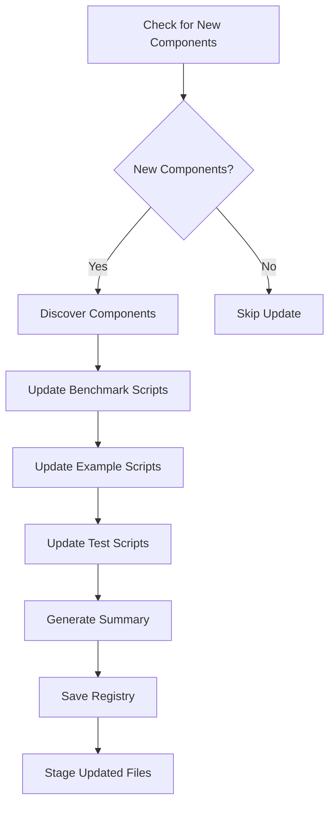

# Auto-Discovery System

## Overview

The Auto-Discovery System automatically detects new estimators and data generators in the DataExploratoryProject and integrates them into benchmarking and example scripts. This ensures that the project remains comprehensive and up-to-date as new components are added.

## Features

### 🔍 **Automatic Component Discovery**
- **Data Generators**: Discovers all classes that inherit from `BaseModel` or have a `generate` method
- **Estimators**: Discovers all classes that have an `estimate` method
- **Neural Components**: Discovers neural network components with `simulate` or `generate` methods
- **High-Performance Components**: Discovers JAX and Numba optimized versions

### 🔄 **Automatic Script Updates**
- **Benchmark Scripts**: Updates `comprehensive_estimator_benchmark.py` with new components
- **Example Scripts**: Updates demo and example scripts in `demos/` and `examples/` directories
- **Test Scripts**: Updates test scripts in `tests/` directory
- **Import Statements**: Automatically adds import statements for new components

### 📊 **Component Registry**
- **JSON Registry**: Saves component information to `component_registry.json`
- **Summary Report**: Generates `COMPONENT_SUMMARY.md` with detailed component information
- **Timestamp Tracking**: Tracks when components were last discovered

### 🚀 **Git Integration**
- **Pre-commit Hook**: Automatically runs discovery when new components are committed
- **File Monitoring**: Detects changes to component files and triggers updates
- **Automatic Staging**: Stages updated files for commit

## System Architecture

### Core Components

1. **AutoDiscoverySystem** (`auto_discovery_system.py`)
   - Main discovery engine
   - Component detection and analysis
   - Script update automation

2. **PreCommitHook** (`pre_commit_hook.py`)
   - Git pre-commit hook
   - Triggers discovery on component changes
   - Manages file staging

3. **Setup Script** (`setup_git_hooks.py`)
   - Installs and configures git hooks
   - Manages hook lifecycle

### Discovery Process



## Usage

### Manual Discovery

Run the auto-discovery system manually:

```bash
python auto_discovery_system.py
```

This will:
1. Discover all available components
2. Update benchmarking and example scripts
3. Generate component summary
4. Save component registry

### Git Hook Setup

Install the pre-commit hook for automatic discovery:

```bash
# Install hooks
python setup_git_hooks.py install

# Remove hooks
python setup_git_hooks.py remove

# Show help
python setup_git_hooks.py help
```

### Pre-commit Hook

The pre-commit hook automatically:
1. Detects staged files that are components
2. Runs the auto-discovery system
3. Updates scripts with new components
4. Stages updated files for commit

## Component Detection

### Data Generators

The system discovers data generators by looking for:

- **File Patterns**: `*_model.py` files in `models/data_models/`
- **Class Features**: Classes with `generate` method or inheriting from `BaseModel`
- **Module Structure**: Organized in subdirectories by model type

**Example Detection**:
```python
# Detected in models/data_models/fbm/fbm_model.py
class FractionalBrownianMotion(BaseModel):
    def generate(self, n: int, seed: Optional[int] = None) -> np.ndarray:
        # Implementation
        pass
```

### Estimators

The system discovers estimators by looking for:

- **File Patterns**: `*_estimator.py` files in `analysis/`
- **Class Features**: Classes with `estimate` method
- **Category Detection**: Determines category from file path

**Example Detection**:
```python
# Detected in analysis/temporal/dfa/dfa_estimator.py
class DFAEstimator(BaseEstimator):
    def estimate(self, data: np.ndarray) -> Dict[str, Any]:
        # Implementation
        pass
```

### Neural Components

The system discovers neural components by looking for:

- **File Patterns**: Python files in `models/data_models/neural_fsde/`
- **Class Features**: Classes with `simulate`, `generate`, or containing 'Neural'/'FSDE'
- **Module Structure**: Neural-specific organization

**Example Detection**:
```python
# Detected in models/data_models/neural_fsde/base_neural_fsde.py
class BaseNeuralFSDE:
    def simulate(self, n_samples: int, dt: float = 0.01) -> np.ndarray:
        # Implementation
        pass
```

## Script Updates

### Benchmark Script Updates

The system automatically updates `comprehensive_estimator_benchmark.py`:

1. **Import Section**: Adds imports for new components
2. **Data Generators**: Updates `_initialize_data_generators()` method
3. **Estimators**: Updates `_initialize_estimators()` method
4. **Availability Checks**: Adds try/except blocks for optional components

**Example Update**:
```python
# Before: Manual imports
from models.data_models.fbm.fbm_model import FractionalBrownianMotion
from analysis.temporal.dfa.dfa_estimator import DFAEstimator

# After: Auto-generated imports
from models.data_models.fbm.fbm_model import FractionalBrownianMotion
from models.data_models.fgn.fgn_model import FractionalGaussianNoise  # New
from analysis.temporal.dfa.dfa_estimator import DFAEstimator
from analysis.temporal.rs.rs_estimator import RSEstimator  # New
```

### Example Script Updates

The system updates example scripts in:
- `demos/` directory
- `examples/` directory
- Any file ending with `_demo.py` or `_example.py`

### Test Script Updates

The system updates test scripts in:
- `tests/` directory
- Any file starting with `test_`

## Component Registry

### Registry File (`component_registry.json`)

The registry contains detailed information about all discovered components:

```json
{
  "timestamp": "2024-01-15T10:30:00",
  "components": {
    "data_generators": {
      "FractionalBrownianMotion": {
        "class_name": "FractionalBrownianMotion",
        "module_name": "models.data_models.fbm.fbm_model",
        "file_path": "models/data_models/fbm/fbm_model.py",
        "constructor_params": {
          "H": {"type": "float", "default": 0.5, "required": false},
          "sigma": {"type": "float", "default": 1.0, "required": false}
        },
        "type": "stochastic",
        "description": "Fractional Brownian Motion model"
      }
    },
    "estimators": {
      "DFAEstimator": {
        "class_name": "DFAEstimator",
        "module_name": "analysis.temporal.dfa.dfa_estimator",
        "file_path": "analysis/temporal/dfa/dfa_estimator.py",
        "constructor_params": {...},
        "category": "temporal",
        "description": "Detrended Fluctuation Analysis estimator"
      }
    }
  },
  "summary": {
    "data_generators": 5,
    "estimators": 13,
    "neural_components": 3
  }
}
```

### Summary Report (`COMPONENT_SUMMARY.md`)

The summary report provides a human-readable overview:

```markdown
# Component Discovery Summary

Generated on: 2024-01-15 10:30:00

## Data Generators

### FractionalBrownianMotion
- **Type**: stochastic
- **Module**: `models.data_models.fbm.fbm_model`
- **File**: `models/data_models/fbm/fbm_model.py`
- **Description**: Fractional Brownian Motion model
- **Parameters**: ['H', 'sigma', 'method']

## Estimators

### DFAEstimator
- **Category**: temporal
- **Module**: `analysis.temporal.dfa.dfa_estimator`
- **File**: `analysis/temporal/dfa/dfa_estimator.py`
- **Description**: Detrended Fluctuation Analysis estimator
- **Parameters**: ['min_box_size', 'max_box_size', 'polynomial_order']
```

## Configuration

### File Patterns

The system recognizes these file patterns:

**Data Generators**:
- `models/data_models/*/`
- `*_model.py`

**Estimators**:
- `analysis/*/`
- `*_estimator.py`

**Neural Components**:
- `models/data_models/neural_fsde/`
- `models/neural/`

**High-Performance**:
- `analysis/high_performance/`

### Component Categories

Estimators are automatically categorized based on file path:

- **temporal**: Contains 'temporal' in path
- **spectral**: Contains 'spectral' in path
- **wavelet**: Contains 'wavelet' in path
- **multifractal**: Contains 'multifractal' in path
- **high_performance**: Contains 'high_performance' in path
- **other**: Default category

## Troubleshooting

### Common Issues

1. **Import Errors**
   - Ensure all dependencies are installed
   - Check that component files follow naming conventions
   - Verify module structure is correct

2. **Hook Not Running**
   - Check that git hooks are properly installed
   - Verify file permissions on hook script
   - Ensure auto-discovery script exists

3. **Script Updates Failing**
   - Check file permissions
   - Verify backup of original scripts
   - Review error logs for specific issues

### Debug Mode

Enable debug logging:

```python
import logging
logging.basicConfig(level=logging.DEBUG)
```

### Manual Override

If automatic updates fail, manually run:

```bash
# Force discovery
python auto_discovery_system.py

# Check component registry
cat component_registry.json

# Review summary
cat COMPONENT_SUMMARY.md
```

## Best Practices

### Adding New Components

1. **Follow Naming Conventions**:
   - Data models: `*_model.py`
   - Estimators: `*_estimator.py`
   - Neural components: Place in `neural_fsde/` directory

2. **Implement Required Methods**:
   - Data generators: `generate()` method
   - Estimators: `estimate()` method
   - Neural components: `simulate()` or `generate()` method

3. **Use Proper Inheritance**:
   - Data models: Inherit from `BaseModel`
   - Estimators: Inherit from `BaseEstimator`

4. **Document Components**:
   - Add docstrings to classes
   - Document constructor parameters
   - Provide usage examples

### Testing New Components

1. **Run Discovery**:
   ```bash
   python auto_discovery_system.py
   ```

2. **Check Registry**:
   ```bash
   cat component_registry.json
   ```

3. **Test Benchmark**:
   ```bash
   python comprehensive_estimator_benchmark.py
   ```

4. **Verify Updates**:
   - Check that imports are added
   - Verify initialization methods are updated
   - Test that components work in benchmarks

## Future Enhancements

### Planned Features

1. **Type Hint Extraction**: Extract type hints from constructor parameters
2. **Dependency Analysis**: Analyze component dependencies
3. **Performance Profiling**: Automatic performance benchmarking
4. **Documentation Generation**: Auto-generate API documentation
5. **Test Generation**: Auto-generate test cases for new components

### Extension Points

The system is designed to be extensible:

1. **Custom Detectors**: Add custom component detection logic
2. **Script Templates**: Customize script update templates
3. **Output Formats**: Add new output formats (HTML, PDF, etc.)
4. **Integration Hooks**: Add integration with CI/CD systems

## Contributing

### Development Setup

1. **Clone Repository**:
   ```bash
   git clone <repository-url>
   cd DataExploratoryProject
   ```

2. **Install Hooks**:
   ```bash
   python setup_git_hooks.py install
   ```

3. **Test System**:
   ```bash
   python auto_discovery_system.py
   ```

### Adding Features

1. **Extend Detection**: Add new component detection patterns
2. **Update Templates**: Modify script update templates
3. **Add Tests**: Create tests for new functionality
4. **Update Documentation**: Keep documentation current

## Conclusion

The Auto-Discovery System ensures that the DataExploratoryProject remains comprehensive and up-to-date as new components are added. By automatically detecting and integrating new estimators and data generators, it reduces manual maintenance and ensures consistency across the project.

The system is designed to be robust, extensible, and easy to use, making it simple to add new components while maintaining the project's high standards for documentation and testing.

