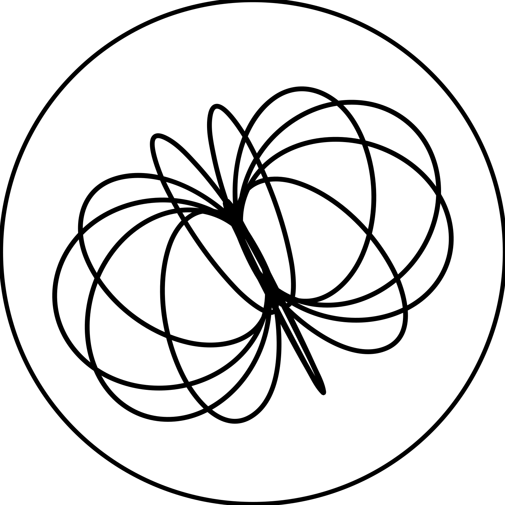

[![Contributors][contributors-shield]][contributors-url]
[![Forks][forks-shield]][forks-url]
[![Stargazers][stars-shield]][stars-url]
[![Issues][issues-shield]][issues-url]


<br />
<div align="center">
  <a href="https://github.com/MarioSieg/magnetron">
    
  </a>

<h3 align="center">magnetron</h3>
  <p align="center">
    Super minimalistic machine-learning framework.
    <br />
    <a href="https://github.com/MarioSieg/magnetron/tree/master/docs"><strong>Explore the docs »</strong></a>
    <br />
    <br />
    <a href="https://github.com/MarioSieg/magnetron/blob/master/examples/gpt2/gpt2.py">View GPT-2 Example</a>
    |
    <a href="https://github.com/MarioSieg/magnetron/issues/new?labels=bug&template=bug-report---.md">Report Bug</a>
    |
    <a href="https://github.com/MarioSieg/magnetron/issues/new?labels=enhancement&template=feature-request---.md">Request Feature</a>
  </p>
</div>

## About

Magnetron is a minimalistic, PyTorch-style machine-learning framework designed for IoT and other resource-limited environments.<br>
The tiny C99 core - wrapped in a modern Python API - gives you dynamic graphs, automatic differentiation and network building blocks without the bloat.<br>
A CUDA backend is also WIP.<br>

### Key features
* **PyTorch-like** Python API  
  → Seamless switch for PyTorch users with familiar syntax and behavior  
* **Automatic differentiation** on dynamic computation graphs  
  → Supports flexible model construction and training workflows  
* High-level **neural-net building blocks**  
  → Includes `nn.Module`, `Linear`, `Sequential`, and more out of the box  
* **Broadcasting-aware operators** with **in-place variants**  
  → Efficient, NumPy-like tensor ops with performance in mind  
* **CPU multithreading** + **SIMD** (SSE4, AVX2/AVX512, ARM NEON)  
  → High performance even without a GPU  
* Multiple **datatypes**: **float32**, **float16**, **int32**, and **boolean**  
  → Flexibility for both training and quantized inference  
* Custom **compressed tensor file formats**  
  → Fast serialization & model loading
* Modern **PRNGs** (**Mersenne Twister**, **PCG**)  
  → Reliable and reproducible randomness
* Clear **validation** and **error messages**  
  → Easier debugging and better developer experience  
* **N-dimensional**, flattened tensors  
  → Simple internal representation with general support for shapes  
* No external **C or Python dependencies** (except **CFFI** for the Python wrapper)  
  → Lightweight and portable – great for embedded or restricted environments

## GPT-2 Inference Example
Run the [GPT-2 example](examples/gpt2/gpt2.py) locally on your machine, purely using Magnetron.<br>
The model data will be downloaded automatically from Hugging Face.<br>
1. **Clone and enter the Magnetron repository:**

    ```bash
    git clone https://github.com/MarioSieg/magnetron && cd magnetron
    ```

3. **Create and activate a virtual environment:**

    ```bash
    python3 -m venv .venv && source .venv/bin/activate
    ```

4. **Install Magnetron**  
   *(Make sure CMake and a C compiler are installed – see [Prerequisites](#prerequisites)):*

    ```bash
    pip install . tiktoken
    ```

5. **Run the GPT-2 inference:**

    ```bash
    python3 examples/gpt2/gpt2.py "What is the answer to the universe?"
    ```

**Example Output**
```
Loading gpt2 with config: GPTHParams(block_size=1024, vocab_size=50257, n_layer=12, n_head=12, n_embd=768, dropout=0.0, bias=True)
Parameter count: 124.0M
Generated in: 4.243197377 seconds
What is the answer to the universe?

The answer could be that late in the creation the Sun may even cause protons to decay, possibly by
...
```

## XOR Training Example
A simple XOR neuronal network (MLP) trained with Magnetron. Copy and paste the code below into a file called `xor.py` and run it with Python.
```python
import magnetron as mag
from magnetron import optim, nn
from matplotlib import pyplot as plt

EPOCHS: int = 2000

# Create the model, optimizer, and loss function
model = nn.Sequential(nn.Linear(2, 2), nn.Tanh(), nn.Linear(2, 1), nn.Tanh())
optimizer = optim.SGD(model.parameters(), lr=1e-1)
criterion = nn.MSELoss()
loss_values: list[float] = []

x = mag.Tensor.of([[0, 0], [0, 1], [1, 0], [1, 1]])
y = mag.Tensor.of([[0], [1], [1], [0]])

# Train the model
for epoch in range(EPOCHS):
    y_hat = model(x)
    loss = criterion(y_hat, y)
    loss.backward()
    optimizer.step()
    optimizer.zero_grad()

    loss_values.append(loss.item())

    if epoch % 100 == 0:
        print(f'Epoch: {epoch}, Loss: {loss.item()}')

# Print the final predictions after the training
print('=== Final Predictions ===')

with mag.no_grad():
    y_hat = model(x)
    for i in range(x.shape[0]):
        print(f'Expected: {y[i]}, Predicted: {y_hat[i]}')

# Plot the loss

plt.figure()
plt.plot(loss_values)
plt.xlabel('Epoch')
plt.ylabel('MSE Loss')
plt.title('Training Loss over Time')
plt.grid(True)
plt.show()
```

This results in the following output:


### Operators
The following table lists all available operators and their properties.

|Mnemonic    |Desc                                |IN |OUT|Params |Flags|Inplace|Backward|Result        |Validation|CPU-Parallel|Type     |
|------------|------------------------------------|---|---|-------|-----|-------|--------|--------------|----------|------------|---------|
|NOP         |no-op                               |0  |0  |N/A    |N/A  |NO     |NO      |N/A           |NO        |NO          |NO-OP    |
|CLONE       |strided copy                        |1  |1  |N/A    |N/A  |NO     |YES     |ISOMORPH      |YES       |NO          |Morph    |
|VIEW        |memory view                         |1  |1  |N/A    |N/A  |NO     |YES     |ISOMORPH      |YES       |NO          |Morph    |
|TRANSPOSE   |𝑥ᵀ                                 |1  |1  |N/A    |N/A  |NO     |YES     |TRANSPOSED    |YES       |NO          |Morph    |
|PERMUTE     |swap axes by index                  |1  |1  |U64 [6]|N/A  |NO     |NO      |PERMUTED      |YES       |NO          |Morph    |
|MEAN        |(∑𝑥) ∕ 𝑛                          |1  |1  |N/A    |N/A  |NO     |YES     |SCALAR/REDUCED|YES       |NO          |Reduction|
|MIN         |min(𝑥)                             |1  |1  |N/A    |N/A  |NO     |NO      |SCALAR/REDUCED|YES       |NO          |Reduction|
|MAX         |max(𝑥)                             |1  |1  |N/A    |N/A  |NO     |NO      |SCALAR/REDUCED|YES       |NO          |Reduction|
|SUM         |∑𝑥                                 |1  |1  |N/A    |N/A  |NO     |YES     |SCALAR/REDUCED|YES       |NO          |Reduction|
|ABS         |&#124;𝑥&#124;                                |1  |1  |N/A    |N/A  |YES    |YES     |ISOMORPH      |YES       |YES         |Unary OP |
|SGN         |𝑥⁄                                 |1  |1  |N/A    |N/A  |YES    |YES     |ISOMORPH      |YES       |YES         |Unary OP |
|NEG         |−𝑥                                 |1  |1  |N/A    |N/A  |YES    |YES     |ISOMORPH      |YES       |YES         |Unary OP |
|LOG         |log₁₀(𝑥)                           |1  |1  |N/A    |N/A  |YES    |YES     |ISOMORPH      |YES       |YES         |Unary OP |
|SQR         |𝑥²                                 |1  |1  |N/A    |N/A  |YES    |YES     |ISOMORPH      |YES       |YES         |Unary OP |
|SQRT        |√𝑥                                 |1  |1  |N/A    |N/A  |YES    |YES     |ISOMORPH      |YES       |YES         |Unary OP |
|SIN         |sin(𝑥)                             |1  |1  |N/A    |N/A  |YES    |YES     |ISOMORPH      |YES       |YES         |Unary OP |
|COS         |cos(𝑥)                             |1  |1  |N/A    |N/A  |YES    |YES     |ISOMORPH      |YES       |YES         |Unary OP |
|STEP        |𝐻(𝑥)                              |1  |1  |N/A    |N/A  |YES    |YES     |ISOMORPH      |YES       |YES         |Unary OP |
|EXP         |𝑒ˣ                                 |1  |1  |N/A    |N/A  |YES    |YES     |ISOMORPH      |YES       |YES         |Unary OP |
|FLOOR       |⌊𝑥⌋                                |1  |1  |N/A    |N/A  |YES    |YES     |ISOMORPH      |YES       |YES         |Unary OP |
|CEIL        |⌈𝑥⌉                                |1  |1  |N/A    |N/A  |YES    |YES     |ISOMORPH      |YES       |YES         |Unary OP |
|ROUND       |𝑥                                |1  |1  |N/A    |N/A  |YES    |YES     |ISOMORPH      |YES       |YES         |Unary OP |
|SOFTMAX     |𝑒ˣⁱ ∕ ∑𝑒ˣʲ                        |1  |1  |N/A    |N/A  |YES    |YES     |ISOMORPH      |YES       |YES         |Unary OP |
|SOFTMAX_DV  |𝑑⁄𝑑𝑥 softmax(𝑥)                 |1  |1  |N/A    |N/A  |YES    |YES     |ISOMORPH      |YES       |YES         |Unary OP |
|SIGMOID     |1 ∕ (1 + 𝑒⁻ˣ)                      |1  |1  |N/A    |N/A  |YES    |YES     |ISOMORPH      |YES       |YES         |Unary OP |
|SIGMOID_DV  |𝑑⁄𝑑𝑥 sigmoid(𝑥)                 |1  |1  |N/A    |N/A  |YES    |YES     |ISOMORPH      |YES       |YES         |Unary OP |
|HARD_SIGMOID|max(0, min(1, 0.2×𝑥 + 0.5))        |1  |1  |N/A    |N/A  |YES    |YES     |ISOMORPH      |YES       |YES         |Unary OP |
|SILU        |𝑥 ∕ (1 + 𝑒⁻ˣ)                     |1  |1  |N/A    |N/A  |YES    |YES     |ISOMORPH      |YES       |YES         |Unary OP |
|SILU_DV     |𝑑⁄𝑑𝑥 silu(𝑥)                    |1  |1  |N/A    |N/A  |YES    |YES     |ISOMORPH      |YES       |YES         |Unary OP |
|TANH        |tanh(𝑥)                            |1  |1  |N/A    |N/A  |YES    |YES     |ISOMORPH      |YES       |YES         |Unary OP |
|TANH_DV     |𝑑⁄𝑑𝑥 tanh(𝑥)                    |1  |1  |N/A    |N/A  |YES    |YES     |ISOMORPH      |YES       |YES         |Unary OP |
|RELU        |max(0, 𝑥)                          |1  |1  |N/A    |N/A  |YES    |YES     |ISOMORPH      |YES       |YES         |Unary OP |
|RELU_DV     |𝑑⁄𝑑𝑥 relu(𝑥)                    |1  |1  |N/A    |N/A  |YES    |YES     |ISOMORPH      |YES       |YES         |Unary OP |
|GELU        |0.5×𝑥×(1 + erf(𝑥 ∕ √2))           |1  |1  |N/A    |N/A  |YES    |YES     |ISOMORPH      |YES       |YES         |Unary OP |
|GELU_DV     |𝑑⁄𝑑𝑥 gelu(𝑥)                    |1  |1  |N/A    |N/A  |YES    |YES     |ISOMORPH      |YES       |YES         |Unary OP |
|ADD         |𝑥 + 𝑦                             |2  |1  |N/A    |N/A  |YES    |YES     |BROADCASTED   |YES       |YES         |Binary OP|
|SUB         |𝑥 − 𝑦                             |2  |1  |N/A    |N/A  |YES    |YES     |BROADCASTED   |YES       |YES         |Binary OP|
|MUL         |𝑥 ⊙ 𝑦                             |2  |1  |N/A    |N/A  |YES    |YES     |BROADCASTED   |YES       |YES         |Binary OP|
|DIV         |𝑥 ∕ 𝑦                             |2  |1  |N/A    |N/A  |YES    |YES     |BROADCASTED   |YES       |YES         |Binary OP|
|MATMUL      |𝑥𝑦                                |2  |1  |N/A    |N/A  |YES    |YES     |MATRIX        |YES       |YES         |Binary OP|
|REPEAT_BACK |gradient broadcast to repeated shape|2  |1  |N/A    |N/A  |YES    |YES     |BROADCASTED   |YES       |NO          |Binary OP|


## Contributing
Contributions are what make the open source community such an amazing place to learn, inspire, and create. Any contributions you make are **greatly appreciated**.
If you have a suggestion that would make this better, please fork the repo and create a pull request. You can also simply open an issue with the tag "enhancement".

## License
(c) 2025 Mario "Neo" Sieg. mario.sieg.64@gmail.com<br>
Distributed under the Apache 2 License. See `LICENSE.txt` for more information.

## Similar Projects

* [GGML](https://github.com/ggerganov/ggml)
* [TINYGRAD](https://github.com/tinygrad/tinygrad)
* [MICROGRAD](https://github.com/karpathy/micrograd)

[contributors-shield]: https://img.shields.io/github/contributors/MarioSieg/magnetron.svg?style=for-the-badge
[contributors-url]: https://github.com/MarioSieg/magnetron/graphs/contributors
[forks-shield]: https://img.shields.io/github/forks/MarioSieg/magnetron.svg?style=for-the-badge
[forks-url]: https://github.com/MarioSieg/magnetron/network/members
[stars-shield]: https://img.shields.io/github/stars/MarioSieg/magnetron.svg?style=for-the-badge
[stars-url]: https://github.com/MarioSieg/magnetron/stargazers
[issues-shield]: https://img.shields.io/github/issues/MarioSieg/magnetron.svg?style=for-the-badge
[issues-url]: https://github.com/MarioSieg/magnetron/issues
[license-shield]: https://img.shields.io/github/license/MarioSieg/magnetron.svg?style=for-the-badge
[license-url]: https://github.com/MarioSieg/magnetron/blob/master/LICENSE.txt
