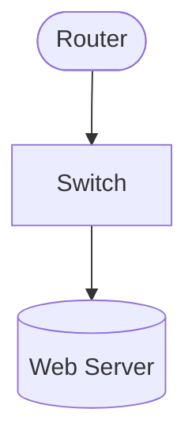

# Network Diagram Feature

This module provides automatic detection and conversion of network diagrams in PDFs to Mermaid.js format.

## Features

- **Automatic Detection**: Identifies network diagrams with confidence scoring
- **Component Recognition**: Detects routers, switches, firewalls, servers, databases, load balancers, cloud services, workstations, and wireless access points
- **Connection Types**: Recognizes ethernet, wireless, VPN, data flow, and redundant connections
- **Zone Detection**: Identifies network zones (DMZ, Internal, External) with subnets
- **Mermaid Generation**: Converts diagrams to Mermaid.js format with proper shapes and styling
- **Icon Support**: Optional Font Awesome icons for visual enhancement

## Usage

Enable network mode when processing PDFs:

```bash
netintel-ocr document.pdf --network-mode
```

### Options

- `--network-mode, -n`: Enable network diagram detection
- `--confidence, -c`: Set confidence threshold (default: 0.7)
- `--use-icons, -i`: Add Font Awesome icons to diagrams

## Output Format

Network diagrams are saved as markdown files with embedded Mermaid code:

```markdown
# Page X - Network Diagram

**Type**: topology
**Detection Confidence**: 0.95
**Components**: 8 detected
**Connections**: 12 detected

## Diagram


```

## Components

### Detector (`detector.py`)
- Analyzes images to identify network diagrams
- Returns confidence score and diagram type
- Handles various response formats from LLM

### Extractor (`extractor.py`)
- Extracts components, connections, and zones
- Validates extracted data
- Provides fallback for malformed responses

### Generator (`mermaid_generator.py`)
- Generates Mermaid code from extracted data
- Supports both LLM-based and rule-based generation
- Handles icon integration

### Validator (`validator.py`)
- Validates Mermaid syntax
- Identifies isolated nodes
- Fixes common formatting issues

## Error Handling

The system includes robust error handling:
- Falls back to text transcription if detection fails
- Uses rule-based generation if LLM fails
- Handles various JSON and Mermaid response formats
- Validates and fixes common Mermaid syntax issues

## Testing

Run tests with:

```bash
python tests/test_network_feature.py
python tests/test_json_parsing.py
```

## Implementation Status

✅ **Completed:**
- Core detection and extraction
- All component types
- Connection types and styles
- Zone grouping
- Mermaid generation
- Validation and error correction
- JSON parsing improvements

⚠️ **Partial:**
- Full metadata JSON output
- Processing optimizations

## Known Issues

- Some models may not properly support `format="json"` parameter (now handled)
- LLM responses may include markdown formatting (now extracted properly)
- Detection confidence may vary based on diagram complexity