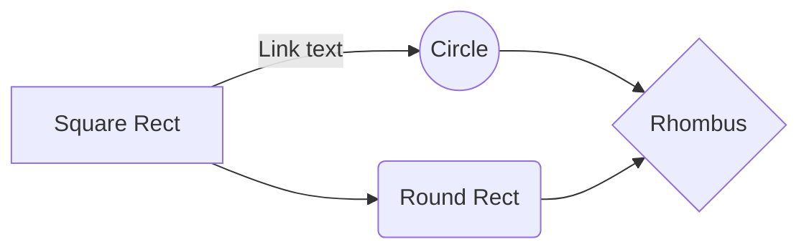

# Overview

plsno429 is a modern Python template for machine learning projects. Built on PyTorch Lightning, Hydra, and uv, it provides ML workflows for NLP, Computer Vision, and Tabular data.

## Key Features

### 🚀 Modern Tool Stack
- **uv**: Fast Python package management and dependency resolution
- **PyTorch Lightning**: Scalable deep learning training workflows
- **Hydra**: Flexible configuration management
- **Typer**: Intuitive CLI interface

### 🧠 Multi-Domain ML Support
- **NLP**: Text classification using HuggingFace Transformers (BoolQ dataset)
- **Computer Vision**: CNN-based image classification (MNIST dataset)
- **Tabular Data**: Neural network-based tabular data classification (Titanic dataset)

### 📁 Organized Project Structure
```
plsno429/
├── src/plsno429/     # Main source code
├── configs/                    # Hydra configuration files
├── data/                       # Data directories
│   ├── raw/                    # Original data
│   ├── processed/              # Processed data
│   ├── interim/                # Intermediate data
│   └── external/               # External data sources
├── docs/                       # Documentation
├── models/                     # Saved models
├── notebooks/                  # Jupyter notebooks
├── reports/                    # Generated reports
├── tests/                      # Tests
└── pyproject.toml              # Project configuration
```

## Supported Features

### CLI Commands
- `plsno429-cli hello`: Configuration loading test
- `plsno429-cli nlp`: Train BERT-based NLP model
- `plsno429-cli tabular`: Train tabular data classification model
- `plsno429-cli vision`: Train MNIST image classification model

### Development Tools
- **Ruff**: Linting and formatting
- **MyPy**: Type checking
- **Pytest**: Unit testing
- **Pre-commit**: Code quality management
- **MkDocs**: Documentation generation

### Deployment Options
- **Docker**: Source code and package-based container images
- **PyPI**: Standard Python package distribution
- **Git-cliff**: Automated release note generation

## Architecture

### Configuration Management
- Hierarchical configuration management through Hydra
- Model and training parameters configured in `configs/` directory
- Dynamic configuration override support via CLI

### Model Training
- Modularized training pipeline based on PyTorch Lightning
- Automatic GPU/CPU detection and distributed training support
- TensorBoard logging and checkpoint management

### Code Quality
- Mandatory use of type hints (enforced by MyPy)
- Google-style docstrings
- Single quotes, 88-character line length coding conventions

### MathJax Suppot

$$\begin{align}
\nabla \cdot u &= 0 \\
\dfrac{\partial \mathbf{u}}{\partial t} + \mathbf{u} \cdot \nabla \mathbf{u} &= - \dfrac{1}{\rho} \nabla p + \mu \nabla^2 \mathbf{u} + \mathbf{g} \\
\end{align}$$

### Mermaid Support

