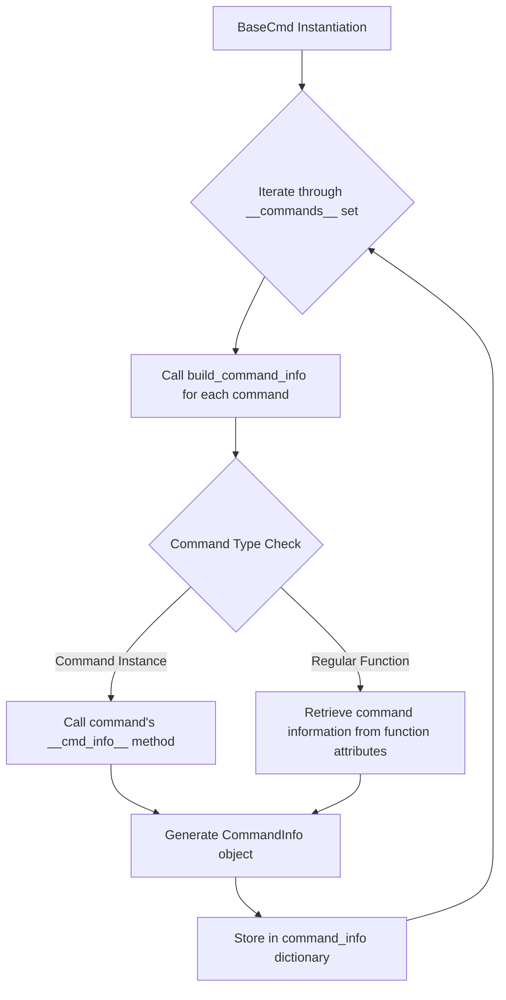
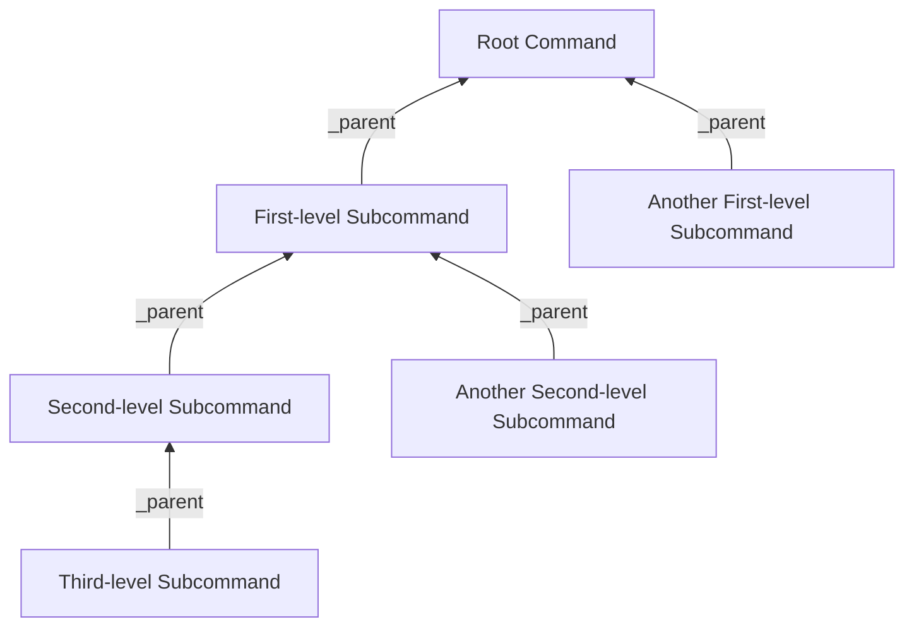
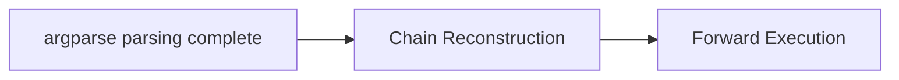

# Commands

To provide automatic command parameter parsing while maintaining compatibility with `cmd`-style manual parsing systems, `ptcmd` employs a multi-level hierarchical command system.

## Command Metadata

Command metadata is the command information directly used by the `BaseCmd` and `Cmd` classes:

```python linenums="1"
class CommandInfo(NamedTuple):
    name: str
    cmd_func: Callable[[List[str]], Any]
    help_func: Optional[HelpGetterFunc] = None
    category: Optional[str] = None
    completer: Optional[Completer] = None
    argparser: Optional[ArgumentParser] = None
    hidden: bool = False
    disabled: bool = False

    def __cmd_info__(self, cmd_ins: "BaseCmd", /) -> "CommandInfo":
        return self
```

### Command Information Collection

Since command names, handler functions, and other metadata depend on the `Cmd` instance's configuration or require direct binding to the instance, command information collection occurs during the final stage of `Cmd` instance initialization.

The command information collection logic works as follows:



- If a `__cmd_info__` method exists, it is called to retrieve command information
- Otherwise, command information is retrieved from function attributes

### Setting Command Information

You can manually set command information using the `set_info` decorator provided by the `ptcmd.info` module:

```python linenums="1"
from argparse import ArgumentParser
from ptcmd import Cmd, set_info

class App(Cmd):
    _hello_parser = ArgumentParser("hello")
    _hello_parser.add_argument("name", nargs="?", default="World", help="Name to greet")

    @set_info(name="hi", help_category="Greeting")
    @set_info(argparser=_hello_parser)
    def do_hello(self, argv: list[str]) -> None:
        ...
```

Alternatively, you can create an instance that implements the `__cmd_info__` method to customize the returned command information. The relevant Protocol definition is:

```python linenums="1"
class CommandInfoGetter(Protocol):
    def __cmd_info__(self, cmd_ins: "BaseCmd", /) -> CommandInfo:
        """Get the command information for this command.

        :param cmd_ins: The instance of the `cmd` class
        :type cmd_ins: "BaseCmd"
        :return: The command information
        """
        ...
```

## Generic Command Wrapper — Command

While manually setting command information provides greater control, we typically prefer a simpler approach for defining standard commands.

`Command` is a generic command wrapper class that implements the `__cmd_info__` method, allowing command information to be set automatically or manually. Compared to directly using `set_info`, the `Command` class provides the following features:

### Declarative Argument Parsing

The `Command` class integrates the argument parsing system, enabling declarative argument parsing through the `@auto_argument` decorator and `Arg` type hints, eliminating boilerplate parameter parsing code.

For more information on argument parsing, see [Argument Parsing System](./argument.md).

### Arbitrary Multi-level Subcommands

`ptcmd` supports adding arbitrary levels of subcommands to a command, making it simple to build complex command hierarchies.

#### Basic Subcommand Usage

Subcommands can be added to a command using the `add_subcommand` method:

```python linenums="1"
from ptcmd import Cmd, auto_argument

class App(Cmd):
    @auto_argument
    def do_server(self):
        """Server management"""

    @do_server.add_subcommand("start")
    def server_start(self):
        """Start the server"""
        self.poutput("Server started")

    @do_server.add_subcommand("stop")
    def server_stop(self):
        """Stop the server"""
        self.poutput("Server stopped")
```

In the example above, `do_server` is the main command, while `server_start` and `server_stop` are its subcommands. Users can invoke these subcommands via `server start` and `server stop`.

#### Multi-level Nested Subcommands

`ptcmd` supports arbitrary levels of subcommand nesting:

```python linenums="1"
from ptcmd import Cmd, auto_argument

class App(Cmd):
    @auto_argument
    def do_server(self):
        """Server management"""

    @do_server.add_subcommand("db")
    def db(self):
        """Database management"""

    @db.add_subcommand("migrate")
    def migrate(self, version: str):
        """Perform database migration"""
        self.poutput(f"Migrating to version {version}...")

    @do_server.add_subcommand("cache")
    def cache(self):
        """Cache management"""

    @cache.add_subcommand("clear")
    def clear(self, confirm: bool = False):
        """Clear cache"""
        if confirm:
            self.poutput("Cache cleared")
        else:
            self.poutput("Please add --confirm to confirm the operation")
```

In this example, we've created a two-level subcommand structure:
- `server` (main command)
  - `db` (subcommand)
    - `migrate` (second-level subcommand)
  - `cache` (subcommand)
    - `clear` (second-level subcommand)

Users can invoke these features with the following commands:
- `server db migrate v1.0`
- `server cache clear --confirm`

#### Implementation Principles

The system implements **command context propagation** through `ArgumentParser`'s `defaults` mechanism:

- **Leaf Node Binding**: During subcommand parser construction, the leaf node command instance is injected into the `defaults` dictionary
- **Override Behavior**: When a subcommand is triggered, it overrides the parent command's `defaults`, naturally forming a reference to the deepest command
- **Parsed Result Association**: The final namespace's `__cmd_ins__` attribute directly references the leaf node command instance

This design cleverly leverages `argparse`'s native mechanism—subcommand parsers override parent command defaults—allowing the system to directly access the terminal command execution context after standard parsing completes, without additional lookups.

The system uses a **lightweight reference chain** to build command hierarchies:



Core mechanisms:

- **Reverse Reference**: Each subcommand instance only stores a reference to its direct parent command
- **Dynamic Construction**: The command tree forms naturally during parsing, without requiring predefined structure
- **Path Reconstruction**: Complete invocation paths can be reconstructed by recursively accessing the `_parent` attribute
- **Low Overhead**: Each command only adds a single reference relationship, avoiding centralized registries

This design fully leverages `argparse`'s subcommand mechanism, implementing arbitrary-depth command nesting through minimal extensions.

Execution flow focuses on **post-parsing processing**:



1. **Chain Reconstruction Phase**:
   - Retrieve the leaf node command instance from `__cmd_ins__`
   - Traverse upward through `_parent` references to build the complete command chain
   - Verify chain integrity and node status

2. **Forward Execution Phase**:
   - Reverse the command chain to root→leaf order
   - Execute each command level sequentially, passing intermediate results
   - Return the leaf node's final execution result

The key value lies in: **fully utilizing standard parsing results**, reconstructing the execution path from the leaf node before forward execution. The system doesn't interfere with `argparse`'s parsing process, only injecting execution logic after parsing completes—maintaining compatibility with the standard library while supporting complex command structures.

## Help System

`ptcmd` provides two complementary help information mechanisms that serve different scenarios:

### ArgumentParser Built-in Help System

This is the standard command-line help system, triggered by `-h`/`--help` parameters, providing detailed command parameter information:

#### Basic Usage
```
command -h
```

#### Working Principle
- Provided by Python's standard library `argparse` module
- Automatically parses command parameter structure and generates formatted help information
- Displays:
  - Command description (from ArgumentParser's description parameter)
  - All available parameters and their explanations
  - Parameter types, default values, and constraints
  - Subcommand list (if applicable)

#### Configuration
Configure help content through the ArgumentParser object:
```python
_hello_parser = ArgumentParser(
    "hello", 
    description="Greet users. Use 'hello [name]' to specify a name",
    epilog="See documentation for more examples"
)

@set_info(argparser=_hello_parser)
def do_hello(self, argv: list[str]) -> None:
    ...
```

#### Multi-level Subcommand Support
- `server -h` displays an overview of the server command and its subcommands
- `server start -h` displays detailed parameter information for the start subcommand

### help Command

This is the advanced command help system provided by `ptcmd`, triggered by the `help` command, offering a more user-friendly interactive help experience:

#### Basic Usage
```
help            # Display overview of all available commands
help command    # Display brief description of a specific command
help command -v # Display detailed parameter information for a specific command
?               # Equivalent to help
?command        # Equivalent to help command
```

#### Help Information Sources
The `ptcmd` help command retrieves information from the following locations:

1. **Command Docstrings**:
   ```python
   def do_hello(self, argv: list[str]) -> None:
       """Greet users. Use 'hello [name]' to specify a name"""
       ...
   ```
   This will serve as the brief description for `help hello`

2. **Dynamic help_<command> Methods**:
   ```python
   def help_hello(self) -> str:
       """Dynamically generate help information for hello command"""
       return "Current user: " + self.current_user + "\nUsage: hello [name]"
   ```
   Takes precedence over docstrings

3. **Command Metadata**:
   ```python
   @set_info(help_category="Greeting")
   def do_hello(self, argv: list[str]) -> None:
       """Greet users"""
       ...
   ```
   Used for organizing command categorization

#### Help Categorization and Organization
- Commands can be grouped using the `help_category` parameter
- Hidden commands (`hidden=True`) won't appear in help output
- Disabled commands (`disabled=True`) will be displayed but marked as unavailable

### Coordination Between Help Systems

| Feature | ArgumentParser (-h) | help Command |
|---------|---------------------|--------------|
| **Primary Purpose** | Detailed parameter reference | Command overview and quick reference |
| **Trigger Method** | `command -h` | `help` or `?` |
| **Content Depth** | Detailed parameter explanations | Brief command descriptions |
| **Dynamic Content** | Limited (primarily static) | Supports dynamic generation |
| **Best Scenario** | When detailed parameter usage is needed | When browsing available commands and basic usage |
