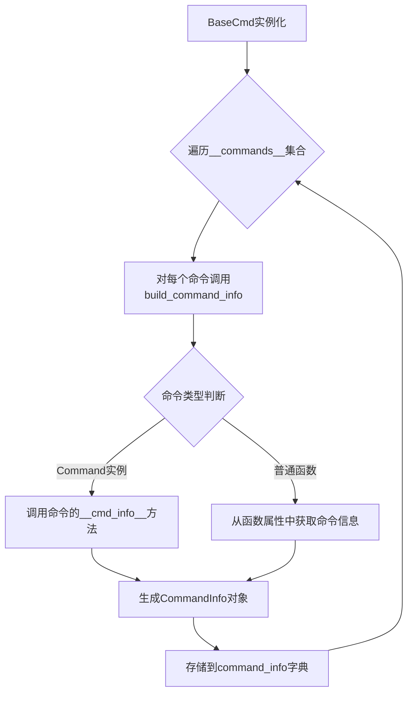
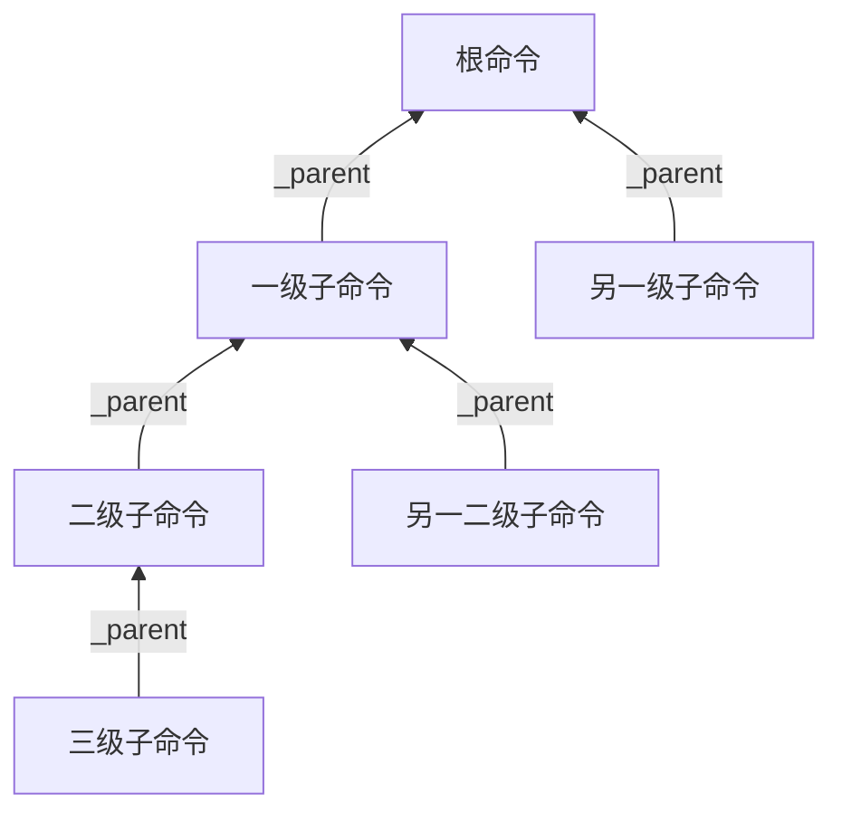
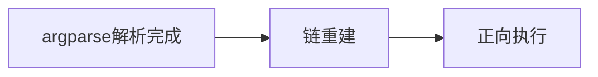

# 命令

为了在兼容类似`cmd`的以手动解析为主的命令系统的同时，提供上层的命令参数自动解析功能，`ptcmd`使用了多级分层的命令系统。

## 命令元信息

命令元信息是直接由`BaseCmd`与`Cmd`类使用的命令信息：

```python linenums="1"
class CommandInfo(NamedTuple):
    name: str
    cmd_func: Callable[[List[str]], Any]
    help_func: Optional[HelpGetterFunc] = None
    category: Optional[str] = None
    completer: Optional[Completer] = None
    argparser: Optional[ArgumentParser] = None
    hidden: bool = False
    disabled: bool = False

    def __cmd_info__(self, cmd_ins: "BaseCmd", /) -> "CommandInfo":
        return self
```

### 命令信息收集

由于命令名称、处理函数等均依赖`Cmd`实例本身的属性配置或直接需要与实例绑定，因此命令信息收集发生在`Cmd`实例初始化阶段最后。

命令信息收集的逻辑如下：



- 如果存在`__cmd_info__`方法，则调用该方法获取命令信息
- 否则，从函数属性中获取命令信息

### 设置命令信息

可以通过`ptcmd.info`模块提供的`set_info`装饰器来手动设置命令信息：

```python linenums="1"
from argparse import ArgumentParser
from ptcmd import Cmd, set_info

class App(Cmd):
    _hello_parser = ArgumentParser("hello")
    _hello_parser.add_argument("name", nargs="?", default="World", help="Name to greet")

    @set_info(name="hi", help_category="Greeting")
    @set_info(argparser=_hello_parser)
    def do_hello(self, argv: list[str]) -> None:
        ...
```

也可以通过创建一个实现了`__cmd_info__`方法的实例来自定义返回的命令信息。相关Protocol定义如下：

```python linenums="1"
class CommandInfoGetter(Protocol):
    def __cmd_info__(self, cmd_ins: "BaseCmd", /) -> CommandInfo:
        """Get the command information for this command.

        :param cmd_ins: The instance of the `cmd` class
        :type cmd_ins: "BaseCmd"
        :return: The command information
        """
        ...
```

## 通用的上层命令封装——Command

手动设置命令信息虽然提供了更强的可控性，但通常来说，我们更希望有一个更加简便的方式来定义一般的命令。

`Command`是一个通用的命令封装类，实现了`__cmd_info__`方法，允许以自动或手动的方式设置命令信息。与直接使用`set_info`相比，`Command`类提供了如下的功能：

### 声明式参数解析

`Command`类集成了参数解析系统，允许通过`@auto_argument`装饰器和`Arg`类型提示提供了声明式参数解析功能，消除了样板参数解析代码。

参数解析相关内容参考[参数解析系统](./argument.md)。

### 任意多级子命令

`ptcmd`支持为一个命令添加任意多级子命令，这使得构建复杂的命令层次结构变得简单。

#### 基础子命令用法

通过`add_subcommand`方法可以为命令添加子命令：

```python linenums="1"
from ptcmd import Cmd, auto_argument

class App(Cmd):
    @auto_argument
    def do_server(self):
        """服务器管理"""

    @do_server.add_subcommand("start")
    def server_start(self):
        """启动服务器"""
        self.poutput("服务器已启动")

    @do_server.add_subcommand("stop")
    def server_stop(self):
        """停止服务器"""
        self.poutput("服务器已停止")
```

在上面的例子中，`do_server`是主命令，`server_start`和`server_stop`是它的子命令。用户可以通过`server start`和`server stop`来调用这些子命令。

#### 多级嵌套子命令

`ptcmd`支持任意层级的子命令嵌套：

```python linenums="1"
from ptcmd import Cmd, auto_argument

class App(Cmd):
    @auto_argument
    def do_server(self):
        """服务器管理"""

    @do_server.add_subcommand("db")
    def db(self):
        """数据库管理"""

    @db.add_subcommand("migrate")
    def migrate(self, version: str):
        """执行数据库迁移"""
        self.poutput(f"正在迁移到版本 {version}...")

    @do_server.add_subcommand("cache")
    def cache(self):
        """缓存管理"""

    @cache.add_subcommand("clear")
    def clear(self, confirm: bool = False):
        """清除缓存"""
        if confirm:
            self.poutput("缓存已清除")
        else:
            self.poutput("请添加--confirm参数确认操作")
```

在这个例子中，我们创建了两级子命令结构：
- `server` (主命令)
  - `db` (子命令)
    - `migrate` (二级子命令)
  - `cache` (子命令)
    - `clear` (二级子命令)

用户可以通过以下命令调用这些功能：
- `server db migrate v1.0`
- `server cache clear --confirm`

#### 实现原理

系统通过`ArgumentParser`的`defaults`机制实现**命令上下文传递**：

- **叶节点绑定**：在构建子命令解析器时，将叶节点命令实例注入`defaults`字典
- **覆盖特性**：当子命令被触发时，会覆盖父命令的`defaults`设置，自然形成指向最深层命令的引用
- **解析结果关联**：最终命名空间的`__cmd_ins__`属性直接关联到叶节点命令实例

这种设计巧妙利用`argparse`的原生机制——子命令解析器会覆盖父命令的默认值，使系统能在标准解析流程结束后，直接获取到终端命令的执行上下文，无需额外查找。

系统采用**轻量级引用链**构建命令层级：



核心机制：

- **反向引用**：每个子命令实例仅保存对其直接父命令的引用
- **动态构建**：命令树在解析过程中自然形成，无需预定义结构
- **路径重建**：通过递归访问`_parent`属性可重建完整调用路径
- **低开销**：每个命令仅增加一个引用关系，避免中心化注册表

这种设计完全基于`argparse`的子命令机制，通过最小化扩展实现了任意深度的命令嵌套。

执行流程聚焦于**解析后处理**：



1. **链重建阶段**：
   - 从`__cmd_ins__`获取叶节点命令实例
   - 通过`_parent`引用向上遍历构建完整命令链
   - 验证链的完整性和节点状态

2. **正向执行阶段**：
   - 将命令链反转为根→叶顺序
   - 依次执行各层级命令，传递中间结果
   - 返回叶节点的最终执行结果

关键价值在于：**充分利用标准解析结果**，通过叶节点重建执行路径后正向执行。系统不干预`argparse`的解析过程，仅在解析完成后注入执行逻辑，既保持与标准库的兼容性，又实现了复杂的命令结构支持。

## 帮助

ptcmd 系统提供两种互补的帮助信息机制，分别服务于不同场景：

### ArgumentParser 内置帮助系统

这是标准的命令行帮助系统，通过 `-h`/`--help` 参数触发，提供详细的命令参数信息：

#### 基本用法
```
command -h
```

#### 工作原理
- 由 Python 标准库 `argparse` 模块提供
- 自动解析命令参数结构并生成格式化的帮助信息
- 详细显示:
  - 命令描述 (ArgumentParser 的 description 参数)
  - 所有可用参数及其说明
  - 参数类型、默认值和约束
  - 子命令列表 (如有)

#### 配置方式
通过 ArgumentParser 对象配置帮助内容:
```python
_hello_parser = ArgumentParser(
    "hello", 
    description="问候用户。使用 'hello [name]' 指定名称",
    epilog="更多示例请参考文档"
)

@set_info(argparser=_hello_parser)
def do_hello(self, argv: list[str]) -> None:
    ...
```

#### 多级子命令支持
- `server -h` 显示 server 命令及其子命令的概览
- `server start -h` 显示 start 子命令的详细参数信息

### help 命令

这是 ptcmd 提供的高级命令帮助系统，通过 `help` 命令触发，提供更友好的交互式帮助：

#### 基本用法
```
help            # 显示所有可用命令概览
help command    # 显示特定命令的简要说明
help command -v # 显示特定命令的详细参数说明
?               # 等同于 help
?command        # 等同于 help command
```

#### 帮助信息来源
ptcmd 的 help 命令从以下位置获取信息:

1. **命令文档字符串**:
   ```python
   def do_hello(self, argv: list[str]) -> None:
       """问候用户。使用 'hello [name]' 指定名称"""
       ...
   ```
   这将作为 `help hello` 的简要说明

2. **动态 help_<command> 方法**:
   ```python
   def help_hello(self) -> str:
       """动态生成 hello 命令的帮助信息"""
       return "当前用户: " + self.current_user + "\n用法: hello [name]"
   ```
   优先级高于文档字符串

3. **命令元数据**:
   ```python
   @set_info(help_category="Greeting")
   def do_hello(self, argv: list[str]) -> None:
       """问候用户"""
       ...
   ```
   用于组织命令分类显示

#### 帮助分类与组织
- 通过 `help_category` 参数对命令进行分组
- 隐藏命令 (`hidden=True`) 不会在 help 输出中显示
- 禁用命令 (`disabled=True`) 会显示但标记为不可用

### 两种帮助系统的协同工作

| 特性 | ArgumentParser (-h) | help 命令 |
|------|---------------------|----------------|
| **主要用途** | 详细参数参考 | 命令概览与快速参考 |
| **触发方式** | `command -h` | `help` 或 `?` |
| **内容深度** | 详细参数说明 | 简要命令描述 |
| **动态内容** | 有限 (主要静态) | 支持动态生成 |
| **最佳场景** | 需要了解具体参数用法时 | 浏览可用命令及基本用法时 |
