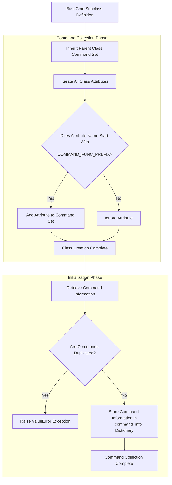

# Core Framework - BaseCmd/Cmd

The `BaseCmd` and `Cmd` classes form the core framework of `ptcmd`, enabling users to create interactive command-line applications through inheritance.

The difference between `BaseCmd` and `Cmd` is that the `Cmd` class provides three built-in commands (`help`, `exit`, and `shell`), while the `BaseCmd` class has no built-in commands and requires users to define all commands themselves.

## Compatibility

Note that `ptcmd` is not compatible with the standard library `cmd`. This mainly depends on the following aspects:

- **Command parameters**: `ptcmd` passes pre-split parameter lists to command methods, while `cmd` passes a string with the command name removed.

!!! ptcmd

    ```python
    from ptcmd import BaseCmd

    class MyApp(BaseCmd):
        def do_hello(self, argv: list[str]) -> None:
            ...
    ```

!!! cmd

    ```python
    from cmd import Cmd

    class MyApp(Cmd):
        def do_hello(self, arg: str) -> None:
            ...
    ```

- **Command collection method**: `cmd` does not pre-collect commands; it searches for and executes commands by reading instance attributes at runtime, allowing dynamic command addition after instance initialization. In contrast, `ptcmd` has a more robust command collection system where all commands must be pre-collected and command information obtained during initialization. Commands cannot be simply added or removed through attribute modifications. See [Command Collection](#command-collection) for details.

If you're looking for an interactive command-line framework compatible with the standard library `cmd`, please use [`cmd2`](https://github.com/python-cmd2/cmd2).

## Command Collection

`BaseCmd` collects commands through method name prefixes defined in the class. By default, all methods starting with `do_` are collected as commands.

Command collection occurs during class creation, so new attributes added after creation will not be collected as commands. To add new commands, for classes you should explicitly modify the `__commands__` attribute, and for instances you need to change the `command_info` attribute.



### Changing Command Prefix

The command prefix is specified by the class attribute `COMMAND_FUNC_PREFIX`:

```python
class BaseCmd(object, metaclass=ABCMeta):
    ...
    COMMAND_FUNC_PREFIX = "do_"
```

You can change the command recognition prefix by modifying the class attribute `COMMAND_FUNC_PREFIX` when creating a subclass.

!!! warning

    This is a dangerous operation. You must ensure:
    
    1. Do not modify the command prefix of existing classes, as this won't change already collected command names and will only cause errors.
    2. When changing the command prefix, avoid inheriting from parent classes that already have commands, as this will cause all parent class commands to become invalid.
    3. In multiple inheritance scenarios, all parent classes must use the same command prefix.

## Input/Output

Input and output are core features of `ptcmd`, allowing users to input commands and receive execution results. `ptcmd` provides rich I/O capabilities including command prompts, auto-completion, history, result formatting, and error handling.

### Output

The `Cmd` object provides the following built-in output methods. When possible, use these to prevent background task output from interrupting interactive input:

- `cmd.stdout`: A `prompt_toolkit` `StdoutProxy` object compatible with `io.TextIOWrapper`, can be used to replace `sys.stdout`.
- `cmd.console`: A `rich.console.Console` object built on `cmd.stdout`, supporting rich text output.
- `cmd.poutput()` series: Simple wrappers around `cmd.console`.

### Non-interactive Input

If the input stream is non-interactive, `BaseCmd` will skip creating the `prompt_toolkit` interactive session and fall back to standard file input logic. This allows `ptcmd` applications to be called via input redirection or pipelines to execute one or multiple commands.

=== "Input Redirection"

    ```sh
    $ python examples/hello.py <<EOF
    > hello
    > hello Alice
    > EOF
    Hello World!
    Hello Alice!
    ```

=== "Pipeline Connection"

    ```sh
    $ echo -e "hello\nhello Alice" | python examples/hello.py 
    Hello, World!
    Hello, Alice!
    ```

### Custom Input/Output Streams

`BaseCmd` uses standard input/output by default but also supports custom streams similar to `cmd.Cmd`.

```python linenums="1"
out = io.StringIO()
cmd = BaseCmd(sys.stdin, out)
cmd.cmdloop()
print(out.getvalue())
```

## Command Sets

Currently `ptcmd` doesn't directly support command sets, but they can be implemented through diamond inheritance.

```python
import sys
from ptcmd import Cmd


class App(Cmd):
    """
    Define common properties and methods
    """


class App1(App):
    """
    Define command set 1
    """
    def do_cmd1(self, argv: list[str]) -> None:
        ...


class App2(App):
    """
    Define command set 2
    """
    def do_cmd2(self, argv: list[str]) -> None:
        ...


class Cli(App1, App2):
    """
    Merge command sets using multiple inheritance
    """


if __name__ == '__main__':
    sys.exit(Cli().cmdloop())
