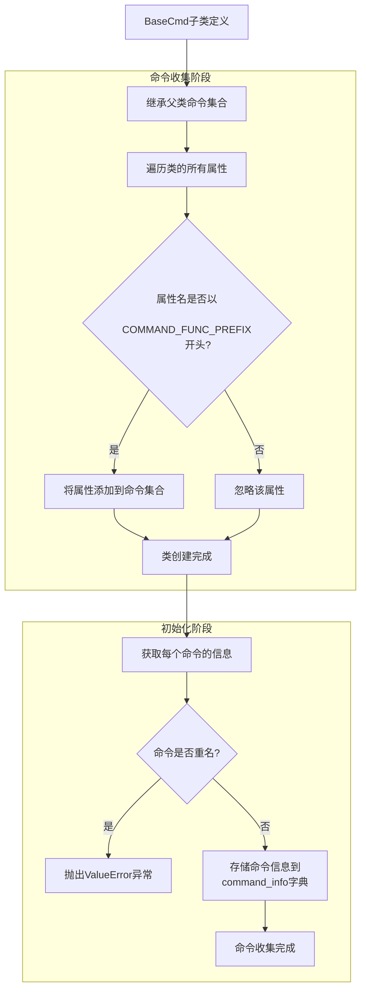

# 核心框架——BaseCmd/Cmd

`BaseCmd`和`Cmd`类是`ptcmd`的核心框架，允许用户通过继承的方式创建交互式命令行应用。

`BaseCmd`与`Cmd`类的区别是`Cmd`类提供了`help`、`exit`和`shell`三个基础命令，而`BaseCmd`类则没有内置命令，需要用户自行定义。

## 兼容性

需要注意的是，`ptcmd`并不与标准库`cmd`兼容。这主要取决于以下几个方面：

- 命令参数：`ptcmd`传递给命令方法的参数是已经分割好的参数列表，而`cmd`传递给命令方法的参数是去除命令名称的字符串。

!!! ptcmd

    ```python
    from ptcmd import BaseCmd

    class MyApp(BaseCmd):
        def do_hello(self, argv: list[str]) -> None:
            ...
    ```

!!! cmd

    ```python
    from cmd import Cmd

    class MyApp(Cmd):
        def do_hello(self, arg: str) -> None:
            ...
    ```

- 命令收集方式：`cmd`不会预先收集命令，只通过运行时读取实例属性列表来搜索并执行命令，可以在实例初始化后通过设置属性来动态添加命令；而`ptcmd`拥有更完善的命令收集方式，所有命令需要预先收集并在初始化时获取命令信息，不允许简单的通过属性修改来增删命令，详细信息见[命令收集](#命令收集)

如果你希望寻找一个与标准库`cmd`兼容的交互式命令行开发框架，请使用[`cmd2`](https://github.com/python-cmd2/cmd2)。

## 命令收集

`BaseCmd`通过类中定义的方法名称前缀来收集命令。默认情况下，所有以`do_`开头的方法都会被收集为命令。

命令的收集发生在类创建过程中，因此在创建后添加的新属性将不会被收集为命令。如果希望添加新的命令，对于类来说应该显示更改`__commands__`属性，对于实例则需要更改`command_info`属性。



### 更改命令前缀

命令前缀由类属性`COMMAND_FUNC_PREFIX`指定：

```python
class BaseCmd(object, metaclass=ABCMeta):
    ...
    COMMAND_FUNC_PREFIX = "do_"
```

可以通过在创建子类时修改类属性`COMMAND_FUNC_PREFIX`来更改命令识别的前缀。

!!! warning

    这是一个危险的操作，你需求确保：

    1. 不应当修改现有类的命令前缀，这并不会改变已经收集到的命令名称，只会带来错误。
    2. 修改命令前缀时最好不要继承已存在命令的父类，这会导致所有父类的命令全部失效。
    3. 在多继承的情况下，所有父类必须拥有同样的命令前缀。


## 输入输出

输入输出是`ptcmd`的核心功能，它允许用户输入命令并获取命令执行结果。`ptcmd`提供了丰富的输入输出功能，包括命令行提示、自动补全、历史记录、命令执行结果格式化、错误处理等。

### 输出

`Cmd`对象提供了如下的内置输出方式，在没有特殊需要的情况下，请尽量使用这些内置输出方式以避免后台任务输出打断交互输入：

- `cmd.stdout`：这是一个`prompt_toolkit`的`StdoutProxy`对象，与`io.TextIOWrapper`兼容，可以直接用于替换`sys.stdout`。
- `cmd.console`：建立在`cmd.stdout`之上的`rich.console.Console`对象，支持富文本输出。
- `cmd.poutput()`系列方法：`cmd.console`的简单封装。

### 非交互式输入

如果输入流不是交互式的，`BaseCmd`将跳过`prompt_toolkit`的交互会话创建，回退到普通的文件输入逻辑。这允许在命令行中通过输入重定向或管道连接的方式调用`ptcmd`应用程序运行一个或多个命令。

=== "输入重定向"

    ```sh
    $ python examples/hello.py <<EOF
    > hello
    > hello Alice
    > EOF
    Hello World!
    Hello Alice!
    ```

=== "管道连接"

    ```sh
    $ echo -e "hello\nhello Alice" | python examples/hello.py 
    Hello, World!
    Hello, Alice!
    ```

### 自定义输入输出流

`BaseCmd`类默认使用标准输入输出，但也支持与`cmd.Cmd`类似的输入输出流自定义。

```python linenums="1"
out = io.StringIO()
cmd = BaseCmd(sys.stdin, out)
cmd.cmdloop()
print(out.getvalue())
```

## 命令集

目前`ptcmd`不直接支持命令集，但可以通过菱形继承的方式实现。

```python
import sys
from ptcmd import Cmd


class App(Cmd):
    """
    定义共有的属性及方法
    """


class App1(App):
    """
    定义命令集1
    """
    def do_cmd1(self, argv: list[str]) -> None:
        ...


class App2(App):
    """
    定义命令集2
    """
    def do_cmd2(self, argv: list[str]) -> None:
        ...


class Cli(App1, App2):
    """
    利用多继承合并命令集
    """


if __name__ == '__main__':
    sys.exit(Cli().cmdloop())
```

