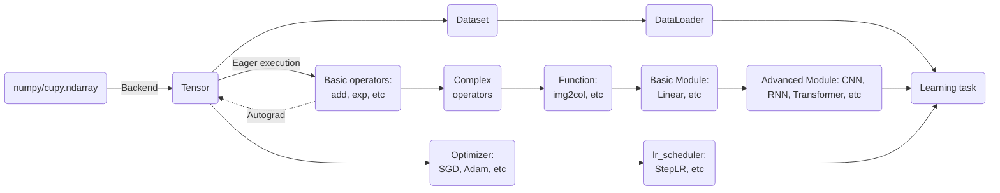

# PyDyNet：NumPy-based Dynamic Deep Learning Framework

Chinese README: [cnREADME.md](./cnREADME.md)

[](https://pepy.tech/project/pydynet)
[](https://pepy.tech/project/pydynet)


## Towards Large Language Model

**In the summer of 2025, I restart the development of PyDyNet after two years.** PyDyNet implemented a pure inference version of Llama3 (6-layer Transformer, vocab-size=32000). The implementation is inspired by the NumPy version and dataset available [here](https://github.com/likejazz/llama3.np). To run it, download the dataset into the `llm/llama` folder and execute:

```bash
>>> python -m llm.llama.infer

There was a boy named Timmy. He loved to play with hi toy and run around outside. One day, Timmy' mom asked him to help her with the laundry. Timmy didn't want to help because he wanted to play. But hi mom said, "Timmy, you need to help me. It' important to help out."
Timmy didn't want to help, but he knew he had to. So, he put on hi shoe and went outside to help hi mom. A they were folding the clothe, Timmy saw a big pile of laundry on the floor. He wanted to help, so he started to pick it up. But then, he accidentally knocked over a pile of clothe and they fell on him. Timmy wa okay, but he felt bad.
Hi mom saw what happened and said, "Timmy, you need to be more careful. You could have hurt yourself." Timmy felt bad and said sorry. Hi mom hugged him and said, "It' okay, accident happen. Let' clean up the laundry together." Timmy learned that it' important to be careful and help out when you need it.

Token count: 262, elapsed: 0.87s, 300 tokens/s
```

We also implemented a pure inference version of CLIP, inspired by the NumPy version and dataset available [NPCLIP](https://github.com/99991/NPCLIP). To run it, imigrate `data` folder of `MPCLIP` into `llm/clip` folder and execute: 

```bash
>>> python -m llm.clip.infer
Label probs: [0.000953   0.48176003 0.51728696]
```

for the following image and query ["a fish", "a dog", "a cat"]


## Overview

PyDyNet is a neural network framework implemented entirely in NumPy (with CuPy support since version 0.0.7, using the same API). Its syntax is inspired by PyTorch, and its structure is as follows:



Dashed lines indicate that users can disable automatic differentiation using `no_grad`.

## Install

```bash
git clone https://github.com/Kaslanarian/PyDyNet
cd PyDyNet
python setup.py install
```

We are actively working on a pip installation option.

## Example

Examples can be found in the [examples/pydynet](./examples/pydynet) directory, with equivalent PyTorch implementations in [examples/pytorch](./examples/pytorch). To run an example, use:

```bash
python -m examples.pydynet.xxx
```

### Automatic Differentiation

The example [autodiff1d.py](examples/pydynet/autodiff1d.py) demonstrates automatic differentiation by performing gradient descent on a one-dimensional convex function:


A multi-variable convex function example is provided in [autodiff2d.py](examples/pydynet/autodiff2d.py):


### MLP & LeNet

The example [mlp_cnn.py](examples/pydynet/mnist.py) uses MLP and LeNet to classify MNIST digits. The training and testing accuracies are shown below:


### Dropout & Batch Normalization

The example [mlp_dropout_bn.py](examples/pydynet/dropout_bn.py) compares the performance of three networks on the `fetch_olivetti_faces` dataset (64×64 pixel images):

1. Three-layer MLP;
2. Three-layer MLP with Dropout;
3. Three-layer MLP with Batch Normalization.


### Recurrent Neural Network (RNN)

The example [ts_prediction.py](examples/pydynet/ts_prediction.py) demonstrates time series prediction using a GRU:


### Transformer

The example [transformer.py](examples/pydynet/transformer.py) shows how to train a text classification model using a Transformer. The training results are as follows:


> Dataset (CoLA) link: <https://nyu-mll.github.io/CoLA/cola_public_1.1.zip>

## Cuda Acceleration

PyDyNet supports CUDA acceleration through CuPy. To use it, simply install CuPy and use the same API as NumPy. We compare the performance of PyDyNet with CuPy and NumPy as follows on **Nvidia GeForce RTX 4090**:

|      Network structure         |      Dataset      | CPU time (s) per epoch | GPU time (s) per epoch |
| :-----------------: | :---------------: | :--------------------: | :--------------------: |
|    3-layer MLP     | MNIST (80000×574) |      7.256±0.138      |       1.203±.0181       |
|        LeNet        | MNIST (80000×574) |     239.664±2.108      |      2.841±0.026      |
| 1-layer Transformer (dim=512, head=4) | CoLA (8551×45×64) |      17.503±0.251      |      1.075±0.002       |
