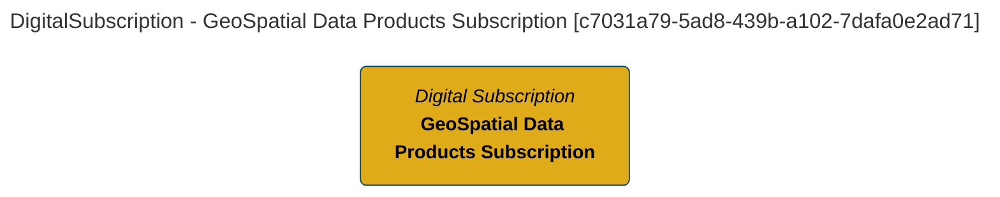
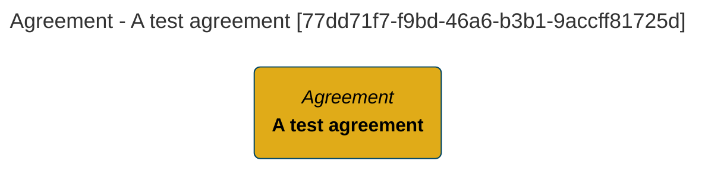
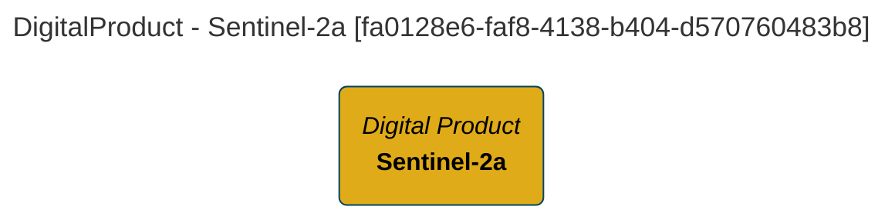
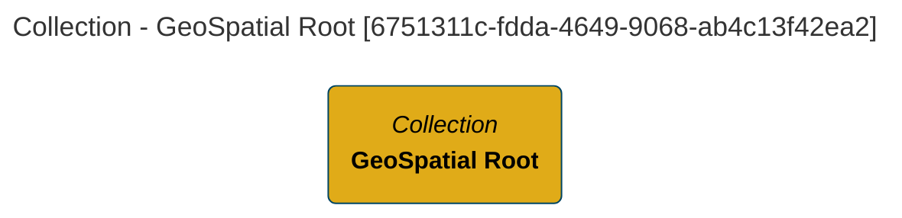
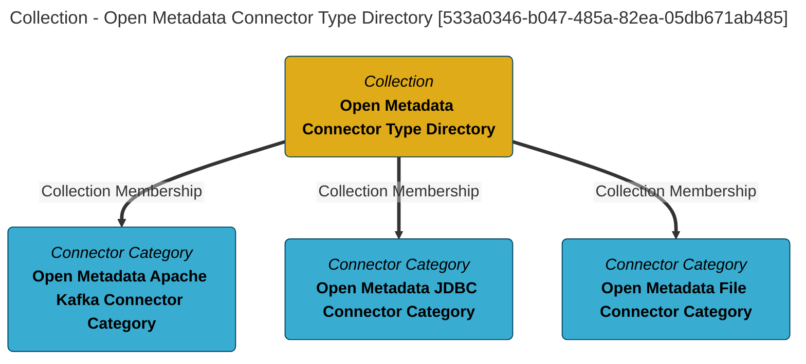

#  Don't Update Root Collection
## Name
GeoSpatial Root

## Qualified Name
Root::GeoSpatial-Root
## Description
This is the root of the GeoSpatial work

## Category
GeoSpatial

____

#  Don't Update Folder
## Name
Digital Products MarketPlace

## Qualified Name
Folder::Digital-Products-MarketPlace
## Description
This is the digital products marketplace.

## Catagory
GeoSpatial

____

#  Don't Create Folder
## Name
GeoSpatial Products

## Qualified Name
Folder::GeoSpatial-Products

## Description
GeoSpatial product offerings.

## Catagory
GeoSpatial
____

#  Don't Create Folder
## Name
Agricultural Products

## Qualified Name
Folder::Agricultural-Products

## Description
Agricultural product offerings.

## Catagory
GeoSpatial
____

#  Don't Create Folder
## Name
Prepared Imagery Products

## Description
Imagry products that are ready for consumption.

## Catagory
GeoSpatial

____

#  Don't Create Folder
## Name
Raw Satellite Imagery Products.

## Qualified Name
Folder::Raw Satellite-Imagery-Products

## Description
Satellite imagery imported from or referenced from external providers.

## Catagory
GeoSpatial

____

#  Don't Create Digital Product
## Name
Sentinel-2a

## Qualified Name
DigitalProduct::Sentinel-2a

## Description
Level 2a (surface level) imagery. Updated

## Product Name
Sentinel Level 2A

## Status
Active

## Product Identifier
sentinel-2a

## Maturity
Mature

## Service Life
Until interest and budget wane.

## Category
GeoSpatial

____

#  Don't Create Folder

## Name
Standard Subscription Agreements Folder

## Qualified Name
Folder::Standard-Subscription-Agreements-Folder

## Description
A folder for digital product subscriptions.

## Catagory
GeoSpatial

____
#  Don't Create Digital Subscription
## Name
GeoSpatial Data Products Subscription

# Qualified Name
Subscription::GeoSpatial-Products-Subscription

## Description
A general subscription agreement for GeoSpatial Data Products

## Identifier
GeoSpatial-Sub-0

## Support Level
Best Effort
____

#  Don't Create Agreement
## Name
A test agreement

# Qualified Name
Agreement::A-test-agreement

## Description
A general agreement for testing and testing

## Identifier
Agreement 1

____

#  Don't Link Agreement Item
##  Agreement Name
Subscription::GeoSpatial-Products-Subscription

## Item Name
DigitalProduct::Sentinel-2a

## Agreement Item Id
Sentinel-2a-Subscription

## Agreement Start
2025-08-01

## Agreement End
2030-12-31

## Entitlements
{ "Data Download" : "Allowed", "Data Sharing" : "Allowed"}

## Obligations
{ "Attribution" : "Required"}

___

#  Don't View Data Sharing Agreements
## Output Format
LIST

___

#  Don't View Data Sharing Agreements
## Output Format
REPORT
___

# `Report` with filter: `*`

# Collection Report - created at 2025-08-19 07:05
	Collection  found from the search string:  `*`

# Collection Name: GeoSpatial Data Products Subscription

## Display Name
GeoSpatial Data Products Subscription

## Qualified Name
[Subscription::GeoSpatial-Data-Products-Subscription](#c7031a79-5ad8-439b-a102-7dafa0e2ad71)

## Type Name
DigitalSubscription

## Created By
erinoverview

## Create Time
2025-08-19T02:31:18.778+00:00

## GUID
c7031a79-5ad8-439b-a102-7dafa0e2ad71

## Mermaid Graph

[[Commons]]
---

# Collection Name: A test agreement

## Display Name
A test agreement

## Qualified Name
[Agreement::A-test-agreement](#77dd71f7-f9bd-46a6-b3b1-9accff81725d)

## Type Name
Agreement

## Created By
erinoverview

## Create Time
2025-08-19T02:31:18.916+00:00

## GUID
77dd71f7-f9bd-46a6-b3b1-9accff81725d

## Mermaid Graph

[[Commons]]
---

# Collection Name: Sentinel-2a

## Display Name
Sentinel-2a

## Qualified Name
[DigitalProduct::Sentinel-2a](#fa0128e6-faf8-4138-b404-d570760483b8)

## Category
GeoSpatial

## Description
Level 2a (surface level) imagery. Updated

## Type Name
DigitalProduct

## Created By
erinoverview

## Create Time
2025-08-19T02:41:24.508+00:00

## GUID
fa0128e6-faf8-4138-b404-d570760483b8

## Mermaid Graph

[[Commons]]
---

# Collection Name: GeoSpatial Root

## Display Name
GeoSpatial Root

## Qualified Name
[Root::GeoSpatial-Root](#6751311c-fdda-4649-9068-ab4c13f42ea2)

## Category
GeoSpatial

## Description
This is the root of the GeoSpatial work

## Type Name
Collection

## Created By
erinoverview

## Create Time
2025-08-19T02:28:06.111+00:00

## GUID
6751311c-fdda-4649-9068-ab4c13f42ea2

## Mermaid Graph

[[Commons]]
---

# Collection Name: Open Metadata Connector Type Directory

## Display Name
Open Metadata Connector Type Directory

## Qualified Name
OpenMetadataConnectorTypeDirectory_09450b83-20ff-4a8b-a8fb-f9b527bbcba6

## Category
GeoSpatial

## Description
Open Metadata standard connector categories and connector types.

## Type Name
Collection

## Classifications
ConnectorTypeDirectory

## Created By
Egeria Project

## Create Time
2025-08-15T18:54:51.675+00:00

## Updated By
Egeria Project

## Containing Members
OpenMetadataKafkaConnectorCategory_09450b83-20ff-4a8b-a8fb-f9b527bbcba6, OpenMetadataJDBCConnectorCategory_09450b83-20ff-4a8b-a8fb-f9b527bbcba6, OpenMetadataFileConnectorCategory_09450b83-20ff-4a8b-a8fb-f9b527bbcba6

## GUID
533a0346-b047-485a-82ea-05db671ab485

## Mermaid Graph

[[Commons]]
# Provenance

* Results from processing file product.md on 2025-08-19 07:05
