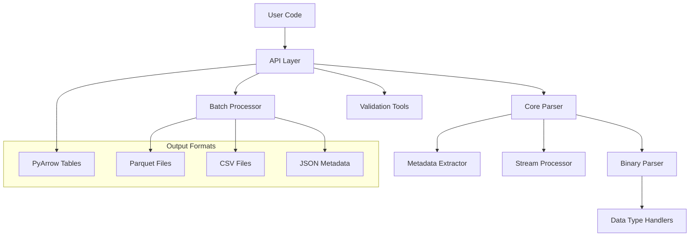

# pyngb - NETZSCH STA File Parser

Welcome to pyngb, a comprehensive Python library for parsing and analyzing NETZSCH TA (Thermal Analysis) NGB files.

## What is pyngb?

pyngb is a high-performance, production-ready library that enables scientists and engineers to:

- **Parse NGB Files**: Extract data and metadata from NETZSCH binary files
- **Analyze Thermal Data**: Work with temperature programs, mass loss, and DSC signals
- **Process in Batches**: Handle multiple files efficiently with parallel processing
- **Validate Data Quality**: Built-in tools for data validation and quality checking
- **Export Results**: Convert to modern formats like Parquet, CSV, and JSON

## Key Features

### 🚀 **High Performance**
- Optimized binary parsing with NumPy and PyArrow
- Memory-efficient processing of large files
- Parallel batch processing capabilities
- Typical parsing speed: 0.1-1 seconds per file

### 📊 **Rich Data Extraction**
- Complete metadata extraction (instrument settings, sample info, conditions)
- Full temperature program details
- All measurement channels (temperature, mass, DSC, gas flows)
- Calibration constants and system parameters

### 🛠️ **Production Ready**
- Comprehensive error handling and validation
- Thread-safe operations
- Command-line interface for automation
- 300+ tests including integration and stress tests

### 🔧 **Flexible APIs**
- Simple functions for common use cases
- Advanced parser configuration options
- Dataset management tools
- Data validation and quality checking

## Quick Example

```python
from pyngb import read_ngb
import polars as pl
import json

# Load NGB file
table = read_ngb("experiment.ngb-ss3")

# Convert to DataFrame for analysis
df = pl.from_arrow(table)
print(f"Loaded {df.height} data points with {df.width} measurements")

# Access metadata
metadata = json.loads(table.schema.metadata[b'file_metadata'])
print(f"Sample: {metadata.get('sample_name', 'Unknown')}")
print(f"Instrument: {metadata.get('instrument', 'Unknown')}")

# Basic analysis
if "sample_temperature" in df.columns:
    temp_range = df["sample_temperature"].min(), df["sample_temperature"].max()
    print(f"Temperature range: {temp_range[0]:.1f} to {temp_range[1]:.1f} °C")

if "mass" in df.columns:
    mass_loss = (df["mass"].max() - df["mass"].min()) / df["mass"].max() * 100
    print(f"Mass loss: {mass_loss:.2f}%")
```

## Use Cases

### Research and Development
- **Data Exploration**: Quick analysis of thermal behavior
- **Method Development**: Validation of temperature programs
- **Quality Control**: Automated data validation
- **Comparative Studies**: Batch analysis of multiple samples

### Production Environments
- **Automated Processing**: CLI integration with production systems
- **Data Pipelines**: Integration with laboratory information systems
- **Quality Assurance**: Automated validation of measurement data
- **Reporting**: Export to standard formats for analysis tools

### Educational Applications
- **Teaching**: Demonstrate thermal analysis concepts
- **Research Training**: Provide tools for student projects
- **Method Comparison**: Compare different analytical approaches

## Architecture Overview

pyngb uses a modular architecture designed for performance, extensibility, and reliability:



### Core Components

- **API Layer**: High-level functions for common use cases
- **Core Parser**: Orchestrates parsing operations
- **Binary Parser**: Low-level binary format handling
- **Metadata Extractor**: Specialized metadata extraction
- **Stream Processor**: Data stream parsing and conversion
- **Batch Processor**: Parallel processing of multiple files
- **Validation Tools**: Data quality checking and validation

## Supported Data

### File Formats
- **Primary**: `.ngb-ss3` and `.ngb-bs3` files from NETZSCH STA instruments
- **Output**: Parquet, CSV, JSON metadata

### Measurement Types
- **Temperature**: Sample and furnace temperatures
- **Mass**: Sample mass (TGA data)
- **Heat Flow**: DSC signals and heat capacity
- **Gas Flows**: Purge and protective gas flows
- **Environmental**: Pressure, acceleration (if available)

### Metadata Categories
- **Instrument**: Model, version, calibration data
- **Sample**: Name, mass, material, crucible information
- **Experimental**: Operator, date, lab, project details
- **Method**: Temperature program, gas settings, acquisition parameters
- **System**: PID settings, MFC configurations

## Getting Started

Ready to start using pyngb? Here are your next steps:

1. **[Installation](installation.md)**: Install pyngb and its dependencies
2. **[Quick Start](quickstart.md)**: Learn the basics with hands-on examples
3. **[API Reference](api.md)**: Detailed documentation of all functions
4. **[Advanced Usage](development.md)**: Custom configurations and extensions

## Performance Characteristics

| Metric | Typical Value |
|--------|---------------|
| **Parse Speed** | 0.1-1 seconds per file |
| **Memory Usage** | ~2x file size |
| **Batch Processing** | 100 files in ~30 seconds (4 cores) |
| **File Size Support** | KB to GB range |
| **Concurrent Operations** | Thread-safe |

## System Requirements

- **Python**: 3.9 or higher
- **Operating System**: Windows, macOS, Linux
- **Memory**: 4GB+ recommended for large files
- **Dependencies**: polars, pyarrow, numpy

## Support and Community

- **Documentation**: Complete API reference and examples
- **Issues**: Report bugs on [GitHub Issues](https://github.com/GraysonBellamy/pyngb/issues)
- **Discussions**: Ask questions on [GitHub Discussions](https://github.com/GraysonBellamy/pyngb/discussions)
- **Contributing**: See our [development guide](development.md)

## License and Disclaimer

pyngb is released under the MIT License. This is an independent project not affiliated with NETZSCH-Gerätebau GmbH.

**⚠️ Disclaimer**: This package and its author are not affiliated with, endorsed by, or approved by NETZSCH-Gerätebau GmbH. NETZSCH is a trademark of NETZSCH-Gerätebau GmbH.

---

*Ready to parse your first NGB file? Head to the [Quick Start Guide](quickstart.md)!*
