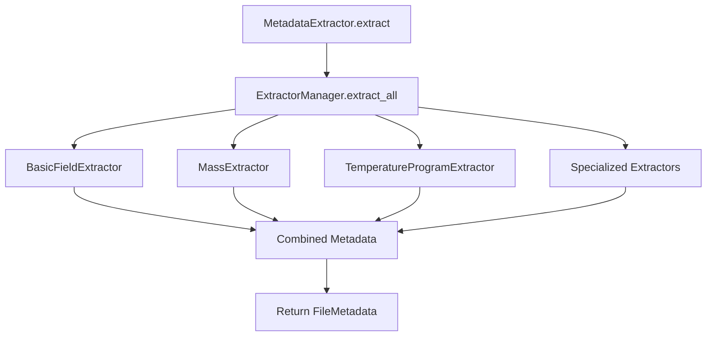
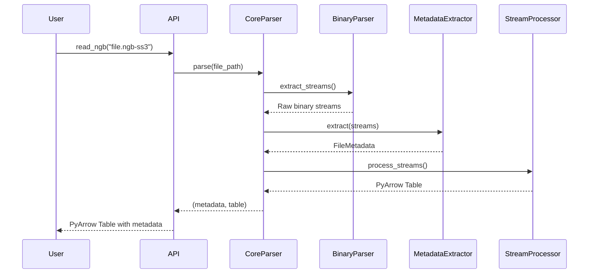
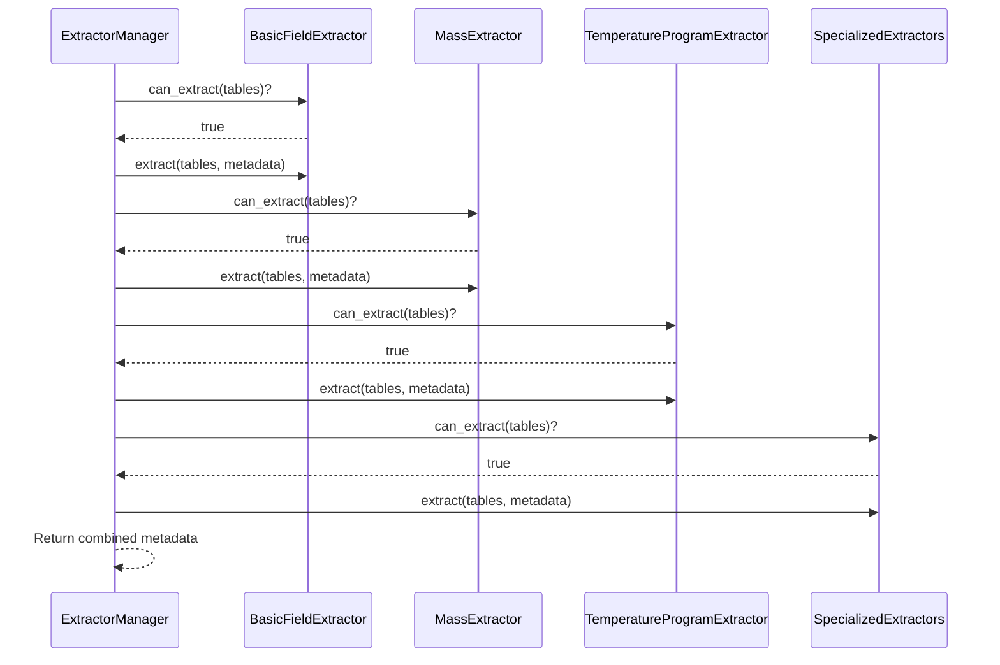

# Architecture Details

This document provides a detailed overview of pyngb's internal architecture, focusing on the modular design principles and component interactions.

## Design Principles

The pyngb architecture is built around several key principles:

### 1. Modular Design
- **Single Responsibility**: Each component has a focused, well-defined purpose
- **Loose Coupling**: Components interact through well-defined interfaces
- **High Cohesion**: Related functionality is grouped together

### 2. Protocol-Based Architecture
- **Extensibility**: New extractors can be added by implementing protocols
- **Type Safety**: Strong typing with Protocol definitions
- **Testability**: Components can be easily mocked and tested

### 3. Performance Focus
- **Memory Efficiency**: Minimal memory overhead with streaming processing
- **Speed Optimization**: Compiled regex patterns and efficient binary parsing
- **Parallel Processing**: Built-in support for concurrent operations

## Core Components

### API Layer (`api/`)
The API layer provides the main entry points for users:

```python
# High-level functions
from pyngb import read_ngb, process_directory, subtract_baseline

# Simple interface for common use cases
table = read_ngb("sample.ngb-ss3")
```

**Key Files:**
- `loaders.py`: Main user-facing functions
- `batch.py`: Batch processing utilities

**Responsibilities:**
- Provide simple, intuitive interfaces
- Handle common error scenarios
- Coordinate with lower-level components

### Core Parser (`core/`)
The core parser orchestrates the parsing process:

```python
# Internal orchestration
parser = NGBParser(config)
metadata, data = parser.parse(file_path)
```

**Key Files:**
- `parser.py`: Main NGBParser class

**Responsibilities:**
- Coordinate parsing operations
- Manage configuration
- Handle file I/O and error recovery

### Binary Parser (`binary/`)
Low-level binary format handling with type-safe data conversion:

```python
# Binary parsing with handlers
parser = BinaryParser()
value = parser.parse_value(data_type, value_bytes)
```

**Key Files:**
- `parser.py`: Core binary parsing logic
- `handlers.py`: Data type-specific parsing handlers

**Responsibilities:**
- Parse binary file structures
- Convert binary data to Python types
- Handle different data type encodings

### Metadata Extraction (`extractors/`)
The metadata extraction system uses a modular, protocol-based architecture:

#### Architecture Overview
```python
# Protocol definition
class MetadataExtractorProtocol(Protocol):
    def can_extract(self, tables: list[bytes]) -> bool: ...
    def extract(self, tables: list[bytes], metadata: FileMetadata) -> None: ...

# Manager coordinates specialized extractors
class MetadataExtractor:
    def __init__(self):
        self.manager = ExtractorManager()
        self._register_extractors()
```

#### Specialized Extractors

**1. BasicFieldExtractor** (`basic_fields.py`)
- **Purpose**: Handles simple metadata fields
- **Fields**: instrument, project, operator, sample_name, etc.
- **Pattern**: Standard regex-based extraction
- **Complexity**: Low

**2. MassExtractor** (`mass.py`)
- **Purpose**: Complex mass field disambiguation
- **Fields**: sample_mass, crucible_mass, reference_mass, reference_crucible_mass
- **Pattern**: Structural binary signature analysis
- **Complexity**: High - uses binary signatures to distinguish sample vs reference

**3. TemperatureProgramExtractor** (`temperature.py`)
- **Purpose**: Temperature program stages extraction
- **Fields**: stage_N with temperature, rate, time data
- **Pattern**: Sequential stage extraction with type 0x0c handling
- **Complexity**: Medium

**4. Specialized Field Extractors** (`specialized.py`)
- **MFCExtractor**: Mass flow controller settings
- **PIDParameterExtractor**: PID control parameters
- **CalibrationExtractor**: Instrument calibration data
- **ApplicationLicenseExtractor**: Software version and licensing

#### Extraction Process


**Key Features:**
- **Order Independence**: Extractors can run in any order
- **Fault Tolerance**: One extractor failure doesn't affect others
- **Extensibility**: New extractors can be added easily
- **Performance**: Only applicable extractors run via `can_extract()`

### Stream Processing (`extractors/streams.py`)
Handles measurement data extraction from binary streams:

**Responsibilities:**
- Parse measurement data channels
- Convert to structured formats
- Handle different channel types

### Data Type System
Type-safe constants and configuration using dataclasses:

```python
@dataclass(frozen=True)
class BinaryProcessing:
    START_DATA_HEADER_OFFSET: int = 2
    TABLE_SPLIT_OFFSET: int = -2
    MIN_FLOAT64_BYTES: int = 8

@dataclass(frozen=True)
class StreamMarkers:
    START_DATA: bytes = b"\x07\x00\x00\x00\x54\x41\x42\x4c\x45"
    END_DATA: bytes = b"\x00\x00\x00\x00"
```

**Benefits:**
- **Type Safety**: mypy can verify usage
- **Immutability**: frozen dataclasses prevent modification
- **Organization**: Related constants grouped together
- **Discoverability**: IDE completion helps find constants

## Data Flow

### File Parsing Flow


### Metadata Extraction Flow


## Error Handling Strategy

### Layered Error Handling
1. **API Layer**: User-friendly error messages and recovery
2. **Core Parser**: File-level error handling and validation
3. **Binary Parser**: Binary format error detection
4. **Extractors**: Field-level error isolation

### Exception Hierarchy
```python
NGBParseError (base)
├── NGBCorruptedFileError
├── NGBUnsupportedVersionError
├── NGBDataTypeError
└── NGBStreamNotFoundError
```

### Fault Tolerance
- **Extractor Independence**: One failed extractor doesn't stop others
- **Partial Success**: Return available data even with some failures
- **Detailed Logging**: Comprehensive debug information
- **Graceful Degradation**: Continue with reduced functionality

## Performance Optimizations

### Memory Management
- **Streaming**: Process data in chunks where possible
- **Lazy Loading**: Only parse needed sections
- **Reference Counting**: Careful memory cleanup
- **PyArrow Integration**: Zero-copy operations where possible

### CPU Optimization
- **Compiled Patterns**: Pre-compile regex patterns
- **Efficient Data Structures**: Use appropriate collections
- **Minimal Conversions**: Reduce type conversions
- **Parallel Processing**: Multi-core batch processing

### I/O Optimization
- **Buffered Reading**: Efficient file reading
- **Minimal File Access**: Read files once when possible
- **Format-Specific**: Optimized for binary formats

## Extension Points

### Adding New Extractors
```python
class CustomExtractor(BaseMetadataExtractor):
    def __init__(self, config: PatternConfig, parser: BinaryParser):
        super().__init__("Custom Fields")
        self.config = config
        self.parser = parser

    def can_extract(self, tables: list[bytes]) -> bool:
        # Check if custom fields are present
        return b"\x99\x99" in b"".join(tables)

    def extract(self, tables: list[bytes], metadata: FileMetadata) -> None:
        # Custom extraction logic
        pass

# Register with manager
extractor = MetadataExtractor(config, parser)
extractor.manager.register(CustomExtractor(config, parser))
```

### Custom Binary Handlers
```python
class CustomHandler(DataTypeHandler):
    def can_handle(self, data_type: bytes) -> bool:
        return data_type == b'\x99'

    def parse(self, data: bytes) -> list:
        # Custom parsing logic
        return parsed_data

# Register with binary parser
parser = BinaryParser()
parser.registry.register(CustomHandler())
```

### Configuration Extensions
```python
# Extend configuration
config = PatternConfig()
config.metadata_patterns["custom_field"] = (b"\x99\x99", b"\x88\x88")
config.column_map["99"] = "custom_column"
```

## Testing Architecture

### Test Categories
- **Unit Tests**: Individual component testing
- **Integration Tests**: Component interaction testing
- **End-to-End Tests**: Full workflow testing
- **Performance Tests**: Speed and memory benchmarks

### Test Isolation
- **Mock Objects**: Isolate components during testing
- **Fixture Data**: Consistent test data across tests
- **Parameterized Tests**: Test multiple scenarios efficiently

## Future Extensibility

The architecture is designed to support:

### New File Formats
- Additional binary format handlers
- Format detection and routing
- Version compatibility management

### Enhanced Analytics
- Statistical analysis modules
- Advanced validation rules
- Custom quality metrics

### Integration Capabilities
- Database connectivity
- Cloud storage support
- External analysis tools

## Summary

The pyngb architecture prioritizes:

1. **Modularity**: Clean separation of concerns
2. **Performance**: Optimized for speed and memory efficiency
3. **Extensibility**: Easy to add new features and formats
4. **Reliability**: Comprehensive error handling and testing
5. **Maintainability**: Clear code organization and documentation

This architecture enables pyngb to be both powerful for advanced users and simple for common use cases, while maintaining high performance and reliability in production environments.
