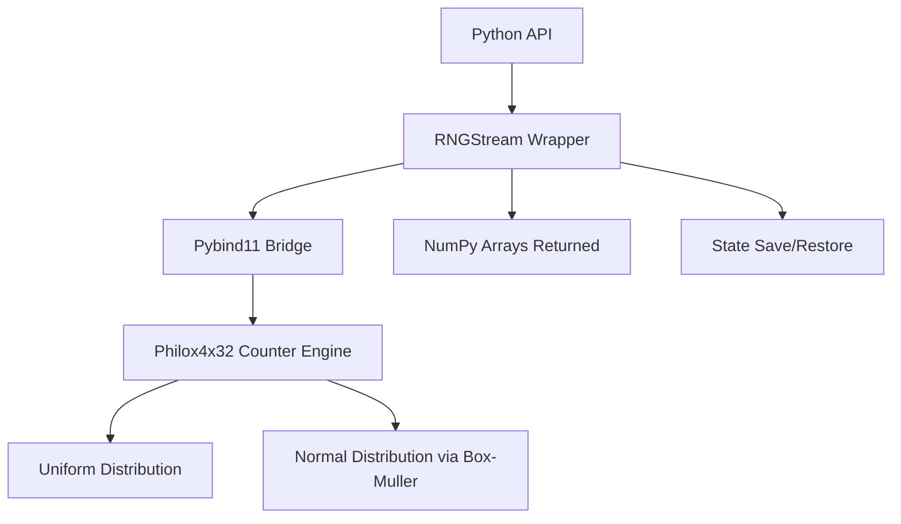

# pyRNGX

pyRNGX is a parallel and reproducible random number library for Python, designed for high-performance simulations.  
It uses counter-based generators (Philox, and later Threefry) so each worker gets its own independent stream while results remain reproducible across machines and runs.

The goal is to make large simulations, agent-based models, and Monte Carlo methods easy to scale without losing determinism.

---

## Overview

Simulations often need billions of random draws and must run on multiple cores or nodes.  
Traditional RNGs are awkward to parallelize and often break reproducibility when you change the number of workers or their order.

pyRNGX takes a different approach:

- Each stream is derived from a **seed** and a **stream_id**.  
- Streams never overlap.  
- A 128-bit counter ensures deterministic sequences regardless of execution order.  
- You can **jump ahead** by N draws in constant time.  
- Streams are serializable and can be restored later.

The Python API returns NumPy arrays and releases the GIL during generation.  
The core is written in C++ with pybind11, making it both fast and extensible.

---

## Features

- Parallel, reproducible streams with `(seed, stream_id)`  
- Counter-based design for deterministic outputs  
- Uniform and normal distributions (NumPy arrays)  
- `jump_ahead(n)`, `state()`, and `from_state()` for control  
- Ready for SIMD, OpenMP, and GPU backends later

---

## Installation

### Local build

```bash
pip install scikit-build-core pybind11 numpy
pip install -e .
```

### Tests

```bash
pytest -q
```

---

## Usage

```python
from pyrngx import RNGStream

# Create independent streams
rng0 = RNGStream(seed=42, stream_id=0)
rng1 = RNGStream(seed=42, stream_id=1)

# Uniform draws
u = rng0.uniform(5)
print(u)

# Normal draws
z = rng1.normal(5)
print(z)

# Jump ahead and restore state
rng0.jump_ahead(1000)
state = rng0.state()
rng2 = RNGStream.from_state(state)
print(rng2.uniform(3))  # identical to continuing rng0
```

---

## API

### `RNGStream(seed: int, stream_id: int)`
Create a stream.

### `uniform(size: int) -> np.ndarray`
Generate uniform doubles in [0,1).

### `normal(size: int) -> np.ndarray`
Generate normal doubles (mean 0, std 1).

### `jump_ahead(n: int)`
Advance stream by n outputs.

### `state() -> dict`
Return dict with key and counter state.

### `from_state(state: dict) -> RNGStream`
Restore stream from saved state.

### `split(k: int) -> List[RNGStream]`
Create k independent substreams.

---

## Architecture



---

## Determinism

- Same seed + same stream_id = identical results everywhere.  
- Different stream_ids = independent streams, no overlap.  
- Number of workers does not affect results.  
- State is portable across machines.  

This makes pyRNGX suitable for:  
- Monte Carlo simulations  
- Agent-based models  
- Climate, physics, epidemiological simulations  
- Financial risk analysis  
- Replaying and validating scientific experiments

---

## Roadmap

- Add more distributions (gamma, Poisson, binomial).  
- SIMD and OpenMP CPU acceleration.  
- GPU backend with CUDA/HIP for identical bit patterns.  
- MPI helpers (stream_id = rank) for distributed HPC jobs.  
- Checkpoint/replay hooks.  

---

## License

MIT License. Free to use, modify, and distribute.
