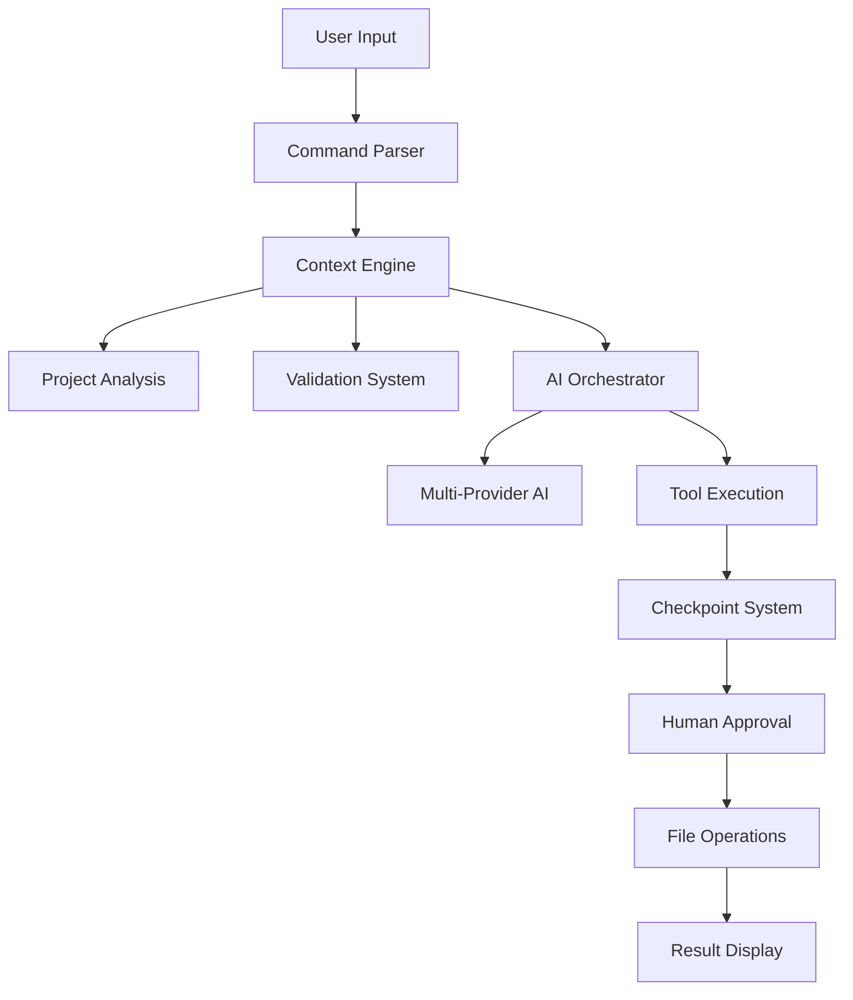

<div align="center">

# R-Code CLI

**The Most Advanced AI Coding Assistant**

_Context-Aware • Never Break Code Again • Professional Grade_

[](https://www.gnu.org/licenses/agpl-3.0)
[](https://www.python.org/downloads/)
[](https://github.com/RaheesAhmed/R-Code-CLI)
[](CONTRIBUTING.md)
[](SECURITY.md)

[🚀 Quick Start](#-quick-start) • [📖 Documentation](#-documentation) • [🤝 Contributing](#-contributing) • [💬 Community](#-community)


</div>

---

## 🎯 **What Makes R-Code CLI Different**

R-Code CLI is not just another AI coding assistant. It's a **context-aware, project-intelligent** system that understands your entire codebase and prevents the common mistakes that plague other AI tools.

### **🧠 Revolutionary Context System**

- **Complete Project Understanding**: AST parsing, dependency mapping, architecture analysis
- **Never Create Duplicates**: Context validation prevents file conflicts
- **Never Break Code**: Dependency analysis prevents breaking changes
- **Smart Suggestions**: Follows your project's naming conventions and patterns

### **⏰ Time Travel System**

- **Checkpoint Management**: Automatic and manual save points
- **Surgical Undo**: Revert specific changes without losing other work
- **Change Visualization**: See exactly what changed and when
- **Safe Experimentation**: Try anything knowing you can always go back

### **🛡️ Human-in-the-Loop Security**

- **Smart Approval**: Only dangerous operations require confirmation
- **Risk Analysis**: Automatic command safety assessment
- **Configurable Security**: Customize approval policies for your needs
- **Persistent Learning**: System learns from your approval patterns

---

## ✨ **Core Features**

<table>
<tr>
<td width="50%">

### 🤖 **AI-Powered Development**

- **Multi-Provider Support**: OpenAI, Anthropic, custom models
- **Streaming Responses**: Real-time AI feedback
- **Context-Aware**: Understands your entire project
- **Natural Language**: Chat naturally about your code

### 🏗️ **Project Intelligence**

- **AST Analysis**: Deep code structure understanding
- **Dependency Mapping**: Complete file relationship tracking
- **Architecture Detection**: Identifies patterns and frameworks
- **Quality Metrics**: Code complexity and maintainability scoring

</td>
<td width="50%">

### ⚡ **Developer Experience**

- **Slash Commands**: Quick actions with `/help`, `/undo`, `/status`
- **Configuration-Driven**: Customize behavior via JSON config
- **Cross-Platform**: Windows, macOS, Linux support
- **IDE Integration**: Works with any development environment

### 🔒 **Enterprise-Grade Security**

- **Local-First**: Your code stays on your machine
- **Encrypted Storage**: Secure API key and data handling
- **Audit Logging**: Complete operation history
- **Compliance Ready**: GDPR, CCPA, SOC 2 aligned

</td>
</tr>
</table>

---

## 🚀 **Quick Start**

### **Prerequisites**

- Python 3.8+
- AI Provider API Key (OpenAI, Anthropic, or others)

### **Installation**

#### **🎯 PyPI Installation (Recommended)**

```bash
# Install from PyPI
pip install rcode-cli

# Set your API key
export ANTHROPIC_API_KEY="your-api-key-here"
# or
export OPENAI_API_KEY="your-api-key-here"

# Start R-Code
rcode
```

#### **🔧 Development Installation**

```bash
# Clone the repository
git clone https://github.com/RaheesAhmed/R-Code-CLI.git
cd R-Code-CLI

# Install dependencies
pip install -r requirements.txt

# Set your API key
export ANTHROPIC_API_KEY="your-api-key-here"
# or
export OPENAI_API_KEY="your-api-key-here"

# Start R-Code
python cli.py
```

### **First Run**

```bash
$ python cli.py

🚀 Welcome to R-Code CLI v1.0.0
🧠 Analyzing project structure...
📁 Found 42 files to analyze
✅ Project analysis complete

┌─ R-Code Assistant
│ Hello! I'm your AI coding assistant with complete project understanding.
│ I can help you write, debug, and improve code while preventing conflicts.
│
│ Try asking me to:
│ • "Create a new user authentication module"
│ • "Fix the bug in user_service.py"
│ • "Add error handling to the API endpoints"
│
│ Type /help for commands or just start chatting!
└─

›
```

---

## 💡 **Usage Examples**

### **Context-Aware Development**

```
› Create a new user service that follows our project patterns

🔍 Using get_project_context_summary...
📊 Analyzing project structure and conventions...

I can see you're using:
• Flask with SQLAlchemy ORM
• Snake_case naming convention
• Service-Repository pattern
• JWT authentication

I'll create a user service that follows these patterns...

📁 Creating: src/services/user_service.py
📁 Creating: src/repositories/user_repository.py
📁 Creating: tests/test_user_service.py
```

### **Smart Validation**

```
› Add a login function to auth.py

🔍 Using validate_file_operation...
⚠️ Analysis found:
  • File auth.py already has login() function at line 23
  • Suggested: enhance existing function or create login_with_email()

💡 Should I enhance the existing login function or create a new variant?
```

### **Safe Experimentation**

```
› /save "Before refactoring auth system"
✅ Checkpoint saved: cp_20250208_142301

› Refactor the authentication system to use JWT tokens

🔍 Working on authentication refactor...
📝 Modified: src/auth/auth_service.py
📝 Modified: src/models/user.py
📝 Created: src/utils/jwt_helper.py

› /undo
✅ Reverted to checkpoint: cp_20250208_142301
```

---

## 🏗️ **Architecture Overview**

<div align="center">



</div>

### **Key Components**

- **🧠 Context Engine**: Complete project understanding and analysis
- **🤖 AI Orchestrator**: Multi-provider AI integration with streaming
- **⏰ Checkpoint System**: Time travel functionality with surgical undo
- **🛡️ Validation System**: Prevents duplicates and breaking changes
- **🔐 Human Approval**: Security-first approach to dangerous operations
- **⚙️ Tool Ecosystem**: Extensible tool framework for file and terminal operations

---

## 📖 **Documentation**

### **📚 Complete Documentation Suite**

<table>
<tr>
<td width="50%">

#### **🚀 Getting Started**

- **[📖 Quick Start Guide](docs/getting-started.md)** - Installation and first steps
- **[❓ FAQ](docs/faq.md)** - Common questions and answers
- **[🛠️ Troubleshooting](docs/troubleshooting.md)** - Problem solving guide

#### **📋 User Guides**

- **[📖 Complete User Guide](docs/user-guide.md)** - All features and capabilities
- **[⚙️ Configuration Guide](docs/configuration.md)** - Customize R-Code
- **[🔧 API Reference](docs/api-reference.md)** - Complete command reference

</td>
<td width="50%">

#### **🏗️ Advanced Topics**

- **[🔧 Development Guide](docs/development.md)** - Contributing code
- **[🔒 Security Guide](docs/security.md)** - Security best practices

</td>
</tr>
</table>

### **⚡ Quick Reference**

| Command        | Description             | Example                   |
| -------------- | ----------------------- | ------------------------- |
| `/help`        | Show available commands | `/help`                   |
| `/undo`        | Undo last AI operation  | `/undo`                   |
| `/save <desc>` | Create checkpoint       | `/save "Before refactor"` |
| `/checkpoints` | List save points        | `/checkpoints`            |
| `/revert <id>` | Revert to checkpoint    | `/revert cp_123456`       |
| `/status`      | Show session info       | `/status`                 |

**[📋 Complete Command Reference →](docs/api-reference.md)**

### **🎯 Popular Documentation**

#### **🌟 Most Helpful**

- **[Getting Started](docs/getting-started.md)** - _New to R-Code? Start here!_
- **[User Guide](docs/user-guide.md)** - _Complete feature walkthrough_
- **[FAQ](docs/faq.md)** - _50+ common questions answered_
- **[Examples](docs/examples/)** - _Real projects and use cases_

#### **🔥 For Developers**

- **[Flask API Example](docs/examples/python/flask-api/)** - _Backend development_
- **[React TypeScript](docs/examples/web/react-typescript/)** - _Frontend development_
- **[Configuration Guide](docs/configuration.md)** - _Customize for your workflow_
- **[Contributing Guide](CONTRIBUTING.md)** - _Join the community_

### **📞 Need Help?**

- **📚 [Browse All Documentation](docs/)** - Complete documentation hub
- **💬 [Community Discussions](https://github.com/RaheesAhmed/R-Code-CLI/discussions)** - Get community help
- **🐛 [Report Issues](https://github.com/RaheesAhmed/R-Code-CLI/issues)** - Bug reports and features
- **📧 [Email Support](mailto:support@rcode.dev)** - Direct support

---

## 🔧 **Development**

### **Project Structure**

```
R-Code-CLI/
├── 📁 src/
│   ├── 🤖 agents/          # AI agent implementations
│   ├── ⏰ checkpoint/      # Time travel system
│   ├── 💬 commands/        # Slash command handlers
│   ├── ⚙️ config/          # Configuration management
│   ├── 🧠 context/         # Project context engine
│   ├── 🛠️ tools/           # File & terminal operations
│   └── 📊 types/          # Type definitions
├── 📋 tests/              # Comprehensive test suite
├── 📚 docs/               # Documentation
├── 🔧 static/             # Assets and examples
└── 📄 Legal Framework     # Complete legal protection
```

### **Development Setup**

```bash
# Clone and setup development environment
git clone https://github.com/RaheesAhmed/R-Code-CLI.git
cd R-Code-CLI

# Create virtual environment
python -m venv .venv
source .venv/bin/activate  # Linux/macOS
.venv\Scripts\activate     # Windows

# Install development dependencies
pip install -r requirements.txt
pip install -r requirements-dev.txt

# Run tests
python -m pytest tests/

# Run with development settings
python cli.py --dev
```

---

## 🤝 **Contributing**

We welcome contributions from the community! R-Code CLI is built with high standards and professional practices.

### **How to Contribute**

1. **Read our [Contributing Guide](CONTRIBUTING.md)** for detailed guidelines
2. **Check our [Code of Conduct](CODE_OF_CONDUCT.md)** for community standards
3. **Review our [Security Policy](SECURITY.md)** for security practices
4. **Understand our [Legal Framework](#-legal-framework)** for IP requirements

### **Development Workflow**

```bash
# 1. Fork and clone
git clone https://github.com/YOUR_USERNAME/R-Code-CLI.git

# 2. Create feature branch
git checkout -b feature/amazing-new-feature

# 3. Make changes with tests
# ... develop amazing features ...

# 4. Run quality checks
python -m pytest tests/
python -m black src/
python -m flake8 src/

# 5. Submit pull request
git push origin feature/amazing-new-feature
```

### **Contribution Types**

- 🐛 **Bug Fixes**: Help us maintain code quality
- ✨ **Features**: Add new capabilities and tools
- 📚 **Documentation**: Improve guides and examples
- 🧪 **Tests**: Increase test coverage
- 🔒 **Security**: Report and fix vulnerabilities
- 🌍 **Accessibility**: Make R-Code more inclusive

---

## 🛡️ **Legal Framework**

R-Code CLI is protected by a comprehensive legal framework that ensures both open source collaboration and intellectual property protection:

### **📋 Legal Documents**

- **[GNU AGPL v3.0 License](LICENSE)** - Open source license with copyleft protection
- **[Terms of Service](TERMS.md)** - User agreement and acceptable use policy
- **[Privacy Policy](PRIVACY.md)** - Data protection and user privacy rights
- **[Code of Conduct](CODE_OF_CONDUCT.md)** - Community standards and enforcement
- **[Security Policy](SECURITY.md)** - Vulnerability reporting
- **[Trademark Policy](TRADEMARK.md)** - Brand protection and usage guidelines
- **[Contributing Guide](CONTRIBUTING.md)** - Contribution standards and IP assignment

### **🏷️ Intellectual Property**

- **Trademark**: "R-Code" and related marks are protected trademarks
- **Copyright**: All contributions are owned by the R-Code project
- **Patents**: Contributors grant patent licenses to the project
- **Attribution**: All derivatives must credit the original R-Code project

---

## 🎖️ **Recognition**

### **Hall of Fame**

We recognize our amazing contributors:

- 🌟 **Core Contributors**: Major features and architectural improvements
- ⭐ **Regular Contributors**: Multiple merged PRs and ongoing involvement
- ✨ **Community Champions**: Outstanding community support and mentorship

_[Be the first to contribute and get listed here!]_

## 📊 **Project Stats**

<div align="center">


</div>

---

## 💬 **Community**

### **Get Help**

- 💬 **[GitHub Discussions](https://github.com/RaheesAhmed/R-Code-CLI/discussions)** - General questions and ideas
- 🐛 **[GitHub Issues](https://github.com/RaheesAhmed/R-Code-CLI/issues)** - Bug reports and feature requests
- 📧 **Email**: [rahesahmed37@gmail.com](mailto:rahesahmed37@gmail.com)
- 🔒 **Security**: [rahesahmed37@gmail.com](mailto:rahesahmed37@gmail.com)

### **Stay Updated**

- ⭐ **Star this repository** for updates
- 👀 **Watch releases** for new versions
- 🐦 **Follow us** on social media (coming soon)
- 📧 **Subscribe** to our newsletter (coming soon)

### **Enterprise Support**

For organizations requiring professional support:

- 🏢 **Enterprise Licensing**: [rahesahmed37@gmail.com](mailto:rahesahmed37@gmail.com)
- 🤝 **Partnerships**: [rahesahmed37@gmail.com](mailto:rahesahmed37@gmail.com)
- 🛠️ **Custom Development**: [rahesahmed37@gmail.com](mailto:rahesahmed37@gmail.com)

---

## 🎯 **Roadmap**

### **📅 Current Focus**

- 🧪 **Beta Testing**: Community feedback and improvements
- 🔌 **Plugin System**: Extensible architecture for third-party tools
- 🌐 **Web Interface**: Optional web-based interface
- 📱 **Mobile Support**: iOS and Android companion apps

### **🔮 Future Vision**

- 🤝 **Team Collaboration**: Multi-developer project support
- ☁️ **Cloud Sync**: Optional cloud synchronization
- 🎨 **Visual Editor**: GUI interface for complex operations
- 🤖 **Custom Models**: Train models on your codebase

---

## 📄 **Changelog**

### **v1.0.0** (2025-02-08)

- 🎉 **Initial Release**: Core AI assistant functionality
- 🧠 **Context System**: Complete project understanding
- ⏰ **Time Travel**: Checkpoint and undo system
- 🛡️ **Security**: Human approval system
- 📚 **Documentation**: Comprehensive guides and docs

---

## ⚖️ **License**

R-Code CLI is licensed under the **GNU Affero General Public License v3.0** with additional terms for trademark protection and commercial use.

**What this means:**

- ✅ **Use**: Free to use for personal and commercial projects
- ✅ **Modify**: Create and distribute modified versions
- ✅ **Distribute**: Share with others freely
- 📋 **Requirements**: Derivatives must be open source (AGPL v3.0)
- 🏷️ **Trademarks**: "R-Code" trademarks require permission for commercial use

For full details, see our [License](LICENSE) and [Terms of Service](TERMS.md).

---

## 🙏 **Acknowledgments**

R-Code CLI is built on the shoulders of giants:

- **OpenAI & Anthropic**: For providing world-class AI models
- **LangChain & LangGraph**: For AI orchestration framework
- **Python Community**: For the incredible ecosystem
- **Open Source Community**: For inspiration and collaboration

---

<div align="center">

**[⭐ Star this repository](https://github.com/RaheesAhmed/R-Code-CLI)** • **[🤝 Contribute](CONTRIBUTING.md)** • **[📚 Docs](docs/)** • **[💬 Community](https://github.com/RaheesAhmed/R-Code-CLI/discussions)**

---

**Built with ❤️ by [Rahees Ahmed](https://github.com/RaheesAhmed) and the R-Code community**

_"The Most Advanced AI Coding Assistant - Context-Aware, Never Break Code Again"_

</div>
