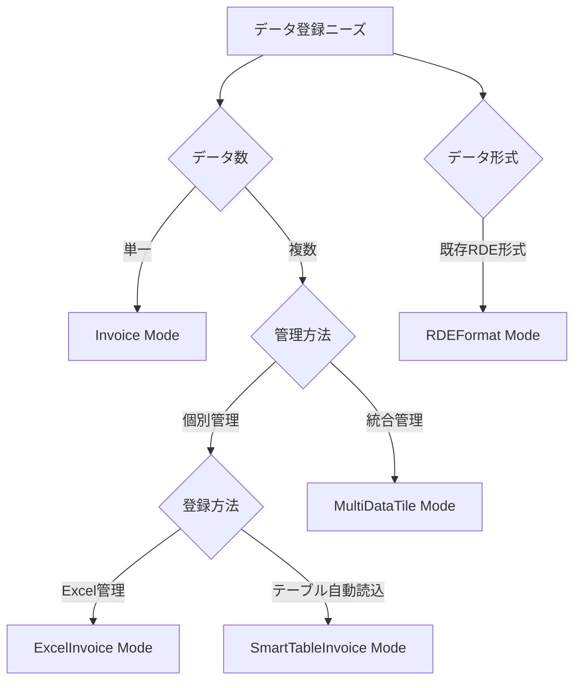
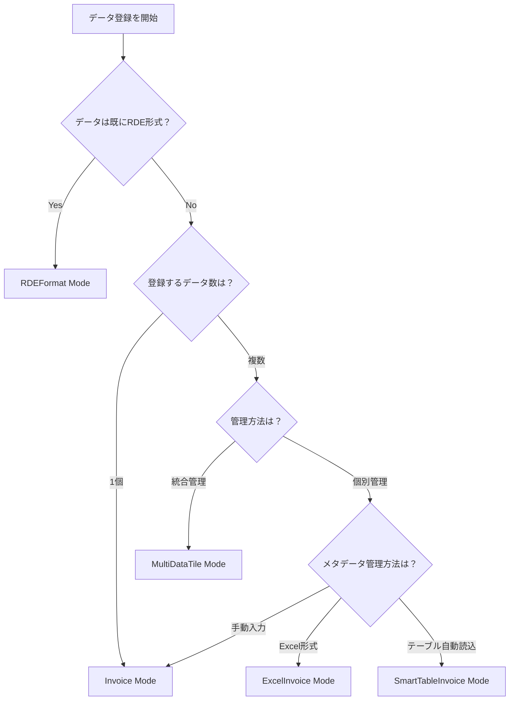

# 処理モードとは

## 目的

RDEToolKitが提供する5つの処理モード（Invoice、ExcelInvoice、SmartTableInvoice、MultiDataTile、RDEFormat）の特徴と使い分けについて説明します。データの種類と登録方法に応じた最適なモード選択を理解できます。

## 課題と背景

研究データの登録において、以下のような多様なニーズがありました：

- **単一データセット**: 1つの実験結果を1つのデータセットとして登録
- **一括登録**: 複数の関連実験を効率的に一括登録
- **統合管理**: 関連する複数のデータを1つのデータセットとして統合
- **既存データ移行**: 他システムからの既存データの移行

これらの異なるニーズに対応するため、5つの処理モードが設計されました。

## 主要コンセプト

### 処理モードの分類



### モード比較表

| モード | 用途 | データ数 | 管理方法 | 設定方法 |
|--------|------|----------|----------|----------|
| **Invoice** | 標準的な単一データセット登録 | 1個 | 個別 | デフォルト |
| **ExcelInvoice** | 複数データセットの一括登録 | 複数 | 個別 | Excelファイル |
| **SmartTableInvoice** | テーブルからの自動メタデータ生成 | 複数 | 個別 | テーブルファイル |
| **MultiDataTile** | 関連データの統合管理 | 複数 | 統合 | 設定ファイル |
| **RDEFormat** | 既存データの移行・モック作成 | 1個 | 個別 | 設定ファイル |

## 各モードの詳細

### 1. Invoice Mode（標準モード）

最も基本的な処理モードです。

#### 特徴
- 1つの実験結果を1つのデータセットとして登録
- シンプルな設定と操作
- 初心者に最適

#### 使用場面
- 単発の実験データ登録
- プロトタイプ開発
- 学習・テスト用途

#### 設定例
```yaml title="Invoice Mode設定"
system:
  extended_mode: null  # または設定なし
```

#### ディレクトリ構造
```
data/
├── inputdata/
├── invoice/
├── tasksupport/
├── structured/
├── meta/
└── raw/
```

### 2. ExcelInvoice Mode

Excelファイルを使用して複数のデータセットを効率的に一括登録するモードです。

#### 特徴
- Excelファイルで複数データセットの情報を管理
- 各データセットは個別のデータセットとして登録
- 大量データの効率的な処理

#### 使用場面
- 同種の実験を大量に実施した場合
- 定期的なデータ登録業務
- チームでの協調作業

#### 設定方法
ExcelInvoiceファイル（`*_excel_invoice.xlsx`）を`inputdata`に配置するだけで自動認識されます。

#### ディレクトリ構造
```
data/
├── inputdata/
│   └── experiment_excel_invoice.xlsx
├── invoice/
├── tasksupport/
├── divided/
│   ├── 0001/
│   │   ├── structured/
│   │   ├── meta/
│   │   └── raw/
│   └── 0002/
│       ├── structured/
│       ├── meta/
│       └── raw/
└── logs/
```

### 3. SmartTableInvoice Mode

テーブルファイル（Excel/CSV/TSV）からメタデータを読み取り、自動的にinvoice.jsonファイルを生成するモードです。

#### 特徴
- **多形式対応**: Excel (.xlsx)、CSV、TSVファイルの読み込み
- **2行ヘッダー形式**: 1行目に表示名、2行目にマッピングキーを配置
- **自動メタデータマッピング**: `basic/`、`custom/`、`sample/`プレフィックスによる構造化データ生成
- **配列データサポート**: `generalAttributes`および`specificAttributes`への適切なマッピング
- **zipファイル統合**: データファイルを含むzipとテーブルファイルの自動関連付け

#### 使用場面
- 大量のメタデータを効率的に管理したい場合
- 既存のExcel/CSVファイルからデータを移行する場合
- 複雑なメタデータ構造を柔軟に定義したい場合

#### 設定方法
SmartTableファイル（`smarttable_*.{xlsx,csv,tsv}`）を`inputdata`に配置するだけで自動認識されます。

#### テーブルファイル形式
```csv
# 1行目: 表示名（ユーザー向けの説明）
データ名,入力ファイル1,サイクル,厚さ,温度,試料名,試料ID,一般項目

# 2行目: マッピングキー（実際の処理で使用）
basic/dataName,inputdata1,custom/cycle,custom/thickness,custom/temperature,sample/names,sample/sampleId,sample/generalAttributes.3adf9874-7bcb-e5f8-99cb-3d6fd9d7b55e

# 3行目以降: データ
実験1,file1.txt,1,2mm,25,sample001,S001,value1
実験2,file2.txt,2,3mm,30,sample002,S002,value2
```

#### マッピングキーの仕様
- `basic/xxxx`: invoice.jsonの`basic`オブジェクト内の`xxxx`キーにマッピング
- `custom/xxxx`: invoice.jsonの`custom`オブジェクト内の`xxxx`キーにマッピング
- `sample/xxxx`: invoice.jsonの`sample`オブジェクト内の`xxxx`キーにマッピング
- `sample/generalAttributes.<termId>`: `generalAttributes`配列内の該当する`termId`の`value`にマッピング
- `sample/specificAttributes.<classId>.<termId>`: `specificAttributes`配列内の該当する`classId`と`termId`の`value`にマッピング
- `inputdataX`: zipファイル内のファイルパスを指定（X=1,2,3...）

#### 設定オプション
```yaml title="SmartTable設定オプション"
smarttable:
  save_table_file: true  # SmartTableファイルを保存する場合
```

`save_table_file`オプション:
- `false`（デフォルト）: SmartTableファイルはraw/nonshared_rawディレクトリに保存されません
- `true`: オリジナルのSmartTableファイルがraw/nonshared_rawディレクトリに保存されます

#### ディレクトリ構造
```
data/
├── inputdata/
│   ├── smarttable_experiment.xlsx
│   └── data.zip
├── invoice/
├── tasksupport/
├── divided/
│   ├── 0001/
│   │   ├── invoice/
│   │   │   └── invoice.json  # smarttableの1行目から生成
│   │   ├── raw/
│   │   │   ├── file1.txt
│   │   │   └── file2.txt
│   │   └── (その他の標準フォルダ)
│   └── 0002/
│       ├── invoice/
│       │   └── invoice.json  # smarttableの2行目から生成
│       └── (その他の標準フォルダ)
└── temp/
    ├── fsmarttable_experiment_0001.csv
    └── fsmarttable_experiment_0002.csv
```

### 4. MultiDataTile Mode

関連する複数のデータを1つのデータセットとして統合管理するモードです。

#### 特徴
- 複数のデータタイルを1つのデータセットとして統合
- データ間の関連性を保持
- 複合的な実験結果の管理に最適

#### 使用場面
- 時系列データの統合
- 多段階実験の結果統合
- 関連する複数の測定データの一括管理

#### 設定例
```yaml title="MultiDataTile Mode設定"
system:
  extended_mode: "MultiDataTile"

multidatatile:
  divided_dir_digit: 4
  divided_dir_start_number: 1
```

#### ディレクトリ構造
```
data/
├── inputdata/
├── invoice/
├── tasksupport/
├── divided/
│   ├── 0001/  # データタイル1
│   ├── 0002/  # データタイル2
│   └── 0003/  # データタイル3
├── structured/  # 統合結果
├── meta/        # 統合メタデータ
└── raw/         # 統合生データ
```

### 5. RDEFormat Mode

既存のRDE形式データの移行やモックデータ作成に使用するモードです。

#### 特徴
- 事前に構造化されたデータの登録
- 他システムからのデータ移行
- テスト用モックデータの作成

#### 使用場面
- 他のRDEシステムからのデータ移行
- 開発・テスト用のモックデータ作成
- 既存の構造化データの再登録

#### 設定例
```yaml title="RDEFormat Mode設定"
system:
  extended_mode: "rdeformat"
```

#### 入力形式
RDE形式のZIPファイル（`rdeformat_*.zip`）を`inputdata`に配置します。

## モード選択の指針

### 決定フローチャート



### 選択基準

| 条件 | 推奨モード | 理由 |
|------|------------|------|
| 初回利用・学習目的 | Invoice | シンプルで理解しやすい |
| 単一実験結果 | Invoice | 設定が最小限 |
| 同種実験の大量データ | ExcelInvoice | 効率的な一括処理 |
| 複雑なメタデータ構造 | SmartTableInvoice | 柔軟なマッピング機能 |
| 既存Excel/CSVからの移行 | SmartTableInvoice | 自動メタデータ生成 |
| 関連データの統合 | MultiDataTile | データ間関係の保持 |
| 既存RDEデータ | RDEFormat | 形式変換不要 |

## 実装例

### モード判定ロジック

```python title="モード自動判定"
def determine_processing_mode(input_dir, config):
    # 設定ファイルでの明示的指定を優先
    if config.system.extended_mode:
        return config.system.extended_mode
    
    # ファイル名による自動判定
    files = os.listdir(input_dir)
    
    for file in files:
        if file.endswith('_excel_invoice.xlsx'):
            return 'ExcelInvoice'
        elif file.startswith('smarttable_') and (
            file.endswith('.xlsx') or 
            file.endswith('.csv') or 
            file.endswith('.tsv')):
            return 'SmartTableInvoice'
        elif file.startswith('rdeformat_') and file.endswith('.zip'):
            return 'RDEFormat'
    
    # デフォルトはInvoiceモード
    return 'Invoice'
```

## まとめ

RDEToolKitの5つの処理モードの特徴：

- **Invoice**: 基本的な単一データセット登録
- **ExcelInvoice**: 効率的な複数データセット一括登録  
- **SmartTableInvoice**: テーブルファイルからの自動メタデータ生成と複数データセット登録
- **MultiDataTile**: 関連データの統合管理
- **RDEFormat**: 既存データの移行・モック作成

適切なモード選択により、研究データの効率的な管理と登録が可能になります。

## 次のステップ

各処理モードの詳細な使用方法については、以下のドキュメントを参照してください：

- [設定ファイル](config.ja.md)でモード設定方法を学ぶ
- [構造化処理の概念](../structured_process/structured.ja.md)で処理フローを理解する
- [ディレクトリ構造](../structured_process/directory.ja.md)でモード別のディレクトリ構成を確認する
