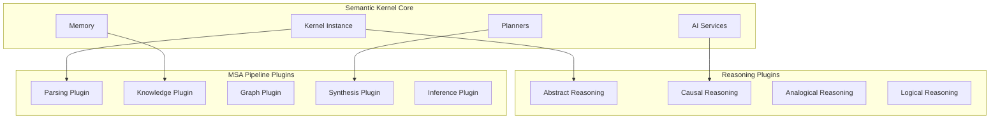

# Reasoning Kernel


A **Semantic Kernel-native** reasoning system implementing the **Model Synthesis Architecture (MSA)** for open-world cognitive reasoning. Built entirely on Microsoft Semantic Kernel with plugin-based modularity and enterprise-grade orchestration.

## Project status

This repository is an active work in progress. APIs, configuration, documentation, and examples may change without notice.

- Documentation update plan: `docs/documentation-restructure-plan.md`
- Recent documentation changes: `docs/documentation-update-summary.md`
- System overview and scope: `docs/full-system.md`

## 🚀 Core Features

- **🧠 SK-Native Architecture**: Built entirely on Microsoft Semantic Kernel patterns
- **🔌 Plugin Ecosystem**: Modular reasoning capabilities as SK plugins  
- **📋 Intelligent Planning**: SK planners for complex reasoning orchestration
- **💾 Multi-Tier Memory**: Redis/PostgreSQL integration via SK memory abstractions
- **🎯 MSA Pipeline**: Five-stage reasoning process as plugin chains
- **🌐 Multi-Model Support**: Azure OpenAI, Google Gemini, and local models
- **⚡ Production Ready**: FastAPI, streaming, and enterprise deployment

## 🚀 Quick Start

### Prerequisites

- Python 3.10+ (3.13+ not yet supported due to dependency compatibility)
- Azure OpenAI or Google AI Studio API access
- Redis (optional, for memory features)

### Installation

#### One-Line Installation (Recommended)

For macOS and Linux:

```bash
curl -fsSL https://raw.githubusercontent.com/Qredence/Reasoning-Kernel/main/setup/install.sh | bash
```

For Windows:

```cmd
curl -fsSL https://raw.githubusercontent.com/Qredence/Reasoning-Kernel/main/setup/install.bat -o install.bat
install.bat
```

#### Manual Installation

```bash
# Clone the repository
git clone https://github.com/Qredence/Reasoning-Kernel.git
cd Reasoning-Kernel

# Install with Semantic Kernel support
uv venv && source .venv/bin/activate
uv pip install -e ".[azure,google]"

# Alternative: Install with pip
pip install -e ".[azure,google]"
```

> For a complete setup guide (including environment, optional services, and troubleshooting), see the Installation Guide: `docs/guides/installation.md`.

### Configuration

Set up your environment variables:

```bash
# Azure OpenAI (Recommended)
export AZURE_OPENAI_ENDPOINT="your-endpoint"
export AZURE_OPENAI_API_KEY="your-key"
export AZURE_OPENAI_DEPLOYMENT="gpt-4"
export AZURE_OPENAI_API_VERSION="2024-12-01-preview"

# Google AI (Alternative)
export GOOGLE_AI_API_KEY="your-key"

# Optional: Redis for memory
export REDIS_URL="redis://localhost:6379"
```

### Basic Usage

#### Python SDK

```python
import asyncio
from reasoning_kernel.core.kernel_config import KernelManager
from reasoning_kernel.services.redis_service import create_redis_services
from reasoning_kernel.reasoning_kernel import ReasoningKernel, ReasoningConfig

async def main():
  # Initialize Semantic Kernel (uses Azure OpenAI env vars)
  km = KernelManager()
  await km.initialize()

  # Optional: Redis for memory (uses REDIS_URL or host/port)
  memory_service, _ = create_redis_services()

  # Initialize reasoning system
  rk = ReasoningKernel(kernel=km.kernel, redis_client=memory_service, config=ReasoningConfig())

  # Perform reasoning
  result = await rk.reason(
    "A factory machine has failed and production is stopped. "
    "Analyze the situation and suggest solutions."
  )

  print(result.success, result.overall_confidence)

asyncio.run(main())
```

#### CLI Usage

```bash
# Basic reasoning
reasoning-kernel "Analyze supply chain disruption scenario"

# Use specific reasoning mode
reasoning-kernel --mode knowledge "Factory production failure analysis"

# Interactive mode
reasoning-kernel --interactive

# JSON output for automation
reasoning-kernel --output json "Market analysis request"
```

## 📚 Documentation

- Getting started and concepts
  - Core concepts: `docs/core_concepts.md`
  - Full system overview: `docs/full-system.md`
  - Product requirements (PRD): `docs/reasoning-kernel-PRD.md`
- Architecture
  - MSA framework: `docs/architecture/msa-framework.md`
  - Semantic Kernel architecture: `docs/architecture/semantic-kernel-architecture.md`
  - Thinking exploration: `docs/architecture/thinking-exploration-reasoning-kernel.md`
- API & Services
  - REST API reference: `docs/api/rest-api.md`
- Memory & Redis (MCP)
  - MCP Redis integration: `docs/mcp_redis_integration.md`
  - Redis schema: `docs/memory/redis_schema.md`
  - Visual schema: `docs/memory/redis_visual_schema.md`
  - Implementation summary: `docs/redis-world-model-implementation-summary.md`
- Plugins
  - Plugin development guide: `docs/plugins/development-guide.md`
- Sandbox / Daytona
  - Daytona integration guide: `docs/sandbox/daytona-integration.md`
- CLI Documentation
  - User Guide: `docs/cli/user_guide.md`
  - Command Reference: `docs/cli/command_reference.md`
  - Interactive Tutorials: `docs/cli/tutorials.md`
  - Example Library: `docs/cli/examples.md`
  - Troubleshooting Guide: `docs/cli/troubleshooting.md`
- Papers and resources
  - MSA paper guide: `docs/guides/msa-paper.md`
  - Understanding the paper: `docs/guides/understanding_the_paper.md`
  - Resources: `docs/guides/ressource.md`

## 🧪 Examples

- Gemini integration demo: `examples/gemini_integration_demo.py`
- MCP Redis example: `examples/mcp_redis_example.py`
- Redis world model integration: `examples/redis_world_model_integration_demo.py`
- MSA paper demo: `examples/msa_paper_demo.py`
- Tests overview: `tests/README.md`

## 🏗️ Architecture Overview

The Reasoning Kernel is built on a **Semantic Kernel-native architecture** with the following core components:

### Plugin Ecosystem



### MSA Reasoning Pipeline

The system implements a five-stage reasoning process:

1. **Parse**: Transform natural language into structured representations
2. **Knowledge**: Retrieve relevant background knowledge from memory
3. **Graph**: Build causal dependency graphs
4. **Synthesize**: Generate probabilistic programs (NumPyro)
5. **Inference**: Execute models and compute results

### Key Benefits

- **🔌 Modular**: Each reasoning capability as an independent SK plugin
- **🎯 Orchestrated**: SK planners handle complex reasoning workflows
- **💾 Memory-Aware**: Multi-tier memory system for context and knowledge
- **🌐 Multi-Model**: Support for Azure OpenAI, Google, and local models
- **⚡ Scalable**: Production-ready with FastAPI and async processing

## 🔧 Configuration

### Environment Variables

**Primary AI Provider - Azure OpenAI (Required currently):**

```bash
AZURE_OPENAI_API_KEY=your_azure_openai_key
AZURE_OPENAI_ENDPOINT=https://your-resource.openai.azure.com/
AZURE_OPENAI_DEPLOYMENT=your_deployment_name
AZURE_OPENAI_API_VERSION=2024-12-01-preview
```

**Optional AI Provider - Google AI (Gemini):**

```bash
GOOGLE_AI_API_KEY=your_gemini_api_key
GOOGLE_AI_GEMINI_MODEL_ID=gemini-2.5-pro
GOOGLE_AI_EMBEDDING_MODEL_ID=text-embedding-004
```

**Optional configuration:**

```bash
LOG_LEVEL=INFO                    # Logging level
LOG_FORMAT=json                   # Logging format (json or text)
MCMC_NUM_WARMUP=1000             # MCMC warmup steps
MCMC_NUM_SAMPLES=2000            # MCMC sampling steps
MAX_KNOWLEDGE_ENTITIES=50        # Max entities to extract
UNCERTAINTY_THRESHOLD=0.8        # Uncertainty reporting threshold
```

> Note: Gemini support is optional. The current kernel initialization requires Azure OpenAI credentials.

### Structured Logging

The Reasoning Kernel features comprehensive structured logging with JSON output for production environments:

#### Features

- **JSON formatted logs** with structured data for easy parsing
- **Request correlation IDs** automatically added to all requests via `X-Request-ID` header
- **Performance metrics** with request duration tracking
- **Service context** automatically added to all log entries
- **Error logging** with full context and error details

#### Logging Configuration

```bash
# Set log level (DEBUG, INFO, WARNING, ERROR, CRITICAL)
LOG_LEVEL=INFO

# Set log format (json for structured, text for development)
LOG_FORMAT=json
```

#### Log Structure

JSON logs include the following fields:

```json
{
  "event": "Request completed",
  "service": "reasoning-kernel", 
  "component": "request",
  "request_id": "550e8400-e29b-41d4-a716-446655440000",
  "method": "POST",
  "path": "/api/v1/reason",
  "endpoint": "/api/v1/reason",
  "status_code": 200,
  "duration": 0.145,
  "timestamp": 1703875200.123,
  "level": "info"
}
```

#### Usage in Code

```python
from reasoning_kernel.core.logging_config import get_logger, performance_context

# Get a structured logger
logger = get_logger("my_component")

# Log with additional context
logger.info("Processing request", user_id="123", operation="synthesis")

# Track performance with automatic duration logging
with performance_context("model_synthesis", logger):
    # Your code here
    pass
```

## 🏗️ Architecture

The system is built on a modern, scalable architecture:

- **FastAPI**: High-performance async web framework
- **Semantic Kernel**: Microsoft's AI orchestration platform
- **NumPyro**: Probabilistic programming with JAX
- **Pydantic**: Type-safe data validation
- **JAX**: Hardware-accelerated computing
- **Redis Cloud**: Vector search and knowledge storage via MCP integration

### Third-Party Integrations

- **MCP Redis Cloud**: Vendored Model Context Protocol server for Redis Cloud integration (`third_party/mcp-redis-cloud/`)
  - Provides vector search, document storage, and caching capabilities
  - MIT licensed with preserved attribution
  - Integration wrapper at `reasoning_kernel/integrations/mcp_redis.py`

## 🧪 Development

```bash
# Install in development mode
pip install -e .

# Start with hot reload
uvicorn reasoning_kernel.main:app --host 0.0.0.0 --port 5000 --reload
```

### Code Quality

```bash
# Format code
black reasoning_kernel/
isort reasoning_kernel/

# Type checking
mypy reasoning_kernel/

# Static analysis (requires Datadog CLI)
datadog-ci sarif --config static-analysis.datadog.yml --output results.sarif
datadog-ci sarif upload --service reasoning-kernel results.sarif

# Run static analysis locally with Docker
docker run --rm -v $(pwd):/workspace \
  datadog/datadog-static-analyzer:latest \
  --config /workspace/static-analysis.datadog.yml \
  /workspace
```

## 🔍 Static Analysis

The project uses Datadog static analysis to ensure code quality and security. The configuration is defined in `static-analysis.datadog.yml` and includes:

- Python best practices and code style
- Security vulnerability detection
- Framework-specific rules (Django, Flask)
- GitHub Actions workflow validation

### Running Static Analysis Locally

#### Option 1: Using Datadog CLI (Recommended)

```bash
# Install Datadog CLI
npm install -g @datadog/datadog-ci

# Run static analysis
# Run static analysis and generate SARIF file
datadog-ci static-analysis scan --config static-analysis.datadog.yml --sarif-file results.sarif

# Upload SARIF results to Datadog
datadog-ci sarif upload --service reasoning-kernel results.sarif
```

#### Option 2: Using Docker

```bash
# Run static analysis with Docker
docker run --rm -v $(pwd):/workspace \
  datadog/datadog-static-analyzer:latest \
  --config /workspace/static-analysis.datadog.yml \
  /workspace
```

### CI/CD Integration

Static analysis runs automatically on:

- All pull requests
- Pushes to the main branch

#### Required Secrets

To enable the CI workflow, configure these GitHub repository secrets:

- `DD_APP_KEY`: Your Datadog application key
- `DD_API_KEY`: Your Datadog API key

The workflow will:

- ✅ Post results as PR comments
- ✅ Create check status for PRs  
- ❌ Block merging on critical/high severity violations
- 📊 Track metrics in Datadog dashboard

## 📊 Performance

The MSA Reasoning Engine is designed for production use:

- **Concurrent Sessions**: Handle multiple reasoning sessions simultaneously
- **Hardware Acceleration**: JAX-based computation with GPU support
- **Scalable Architecture**: Async processing with FastAPI
- **Memory Efficient**: Streaming inference and garbage collection

## 🤝 Contributing

We welcome contributions! Please see our contributing guidelines and code of conduct.

## 📄 License

This project is licensed under the Apache-2.0 License (see `pyproject.toml`).

## 🙏 Acknowledgments

- Microsoft Semantic Kernel team for the AI orchestration framework
- NumPyro/JAX teams for probabilistic programming capabilities
- The broader AI reasoning research community

---

## Built with ❤️ for advanced AI reasoning capabilities
