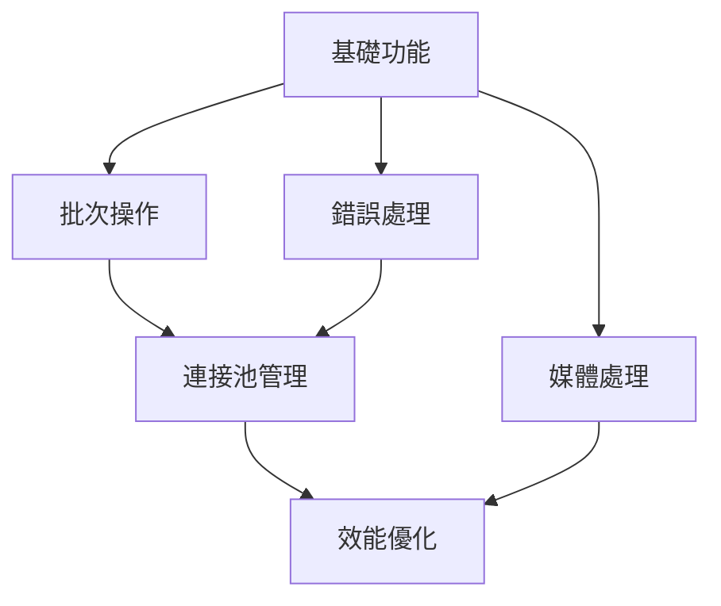

# 進階功能

歡迎來到 Redis Toolkit 的進階功能區！這裡將介紹更強大、更專業的功能，幫助您構建高效能的應用程式。

## 🚀 進階功能概覽

Redis Toolkit 不僅提供基礎的資料存取功能，還包含許多進階特性：

<div class="feature-grid">
  <div class="feature-card">
    <h3>🎨 媒體處理</h3>
    <p>內建圖片、音頻、視頻轉換器，輕鬆處理多媒體資料</p>
    <ul>
      <li>圖片編碼/解碼與縮放</li>
      <li>音頻格式轉換</li>
      <li>視頻幀提取</li>
    </ul>
    <a href="./media-processing.html" class="learn-more">深入了解 →</a>
  </div>
  
  <div class="feature-card">
    <h3>⚡ 批次操作</h3>
    <p>高效處理大量資料，顯著提升效能</p>
    <ul>
      <li>批次讀寫</li>
      <li>管線操作</li>
      <li>事務支援</li>
    </ul>
    <a href="./batch-operations.html" class="learn-more">深入了解 →</a>
  </div>
  
  <div class="feature-card">
    <h3>🔗 連接池管理</h3>
    <p>智慧連接池，優化資源使用</p>
    <ul>
      <li>自動連接管理</li>
      <li>連接池共享</li>
      <li>健康檢查</li>
    </ul>
    <a href="./connection-pool.html" class="learn-more">深入了解 →</a>
  </div>
  
  <div class="feature-card">
    <h3>🛡️ 錯誤處理</h3>
    <p>完善的錯誤處理機制，確保系統穩定</p>
    <ul>
      <li>自動重試</li>
      <li>優雅降級</li>
      <li>詳細錯誤追蹤</li>
    </ul>
    <a href="./error-handling.html" class="learn-more">深入了解 →</a>
  </div>
  
  <div class="feature-card">
    <h3>📊 效能優化</h3>
    <p>多種優化技巧，讓您的應用飛速運行</p>
    <ul>
      <li>效能分析</li>
      <li>最佳化建議</li>
      <li>基準測試</li>
    </ul>
    <a href="./performance.html" class="learn-more">深入了解 →</a>
  </div>
</div>

## 📚 學習建議

### 根據需求選擇

不同的進階功能適合不同的應用場景：

| 如果您需要... | 建議學習 |
|-------------|---------|
| 處理圖片、音頻或視頻 | [媒體處理](./media-processing.md) |
| 提升大量資料操作的效能 | [批次操作](./batch-operations.md) |
| 優化連線資源使用 | [連接池管理](./connection-pool.md) |
| 建立穩定可靠的系統 | [錯誤處理](./error-handling.md) |
| 整體效能調優 | [效能優化](./performance.md) |

### 學習路徑



## 🎯 實戰案例預覽

### 圖片快取系統

```python
from redis_toolkit import RedisToolkit
from redis_toolkit.converters import encode_image, decode_image

class ImageCache:
    def __init__(self):
        self.toolkit = RedisToolkit()
    
    def cache_image(self, image_id, image_array, ttl=3600):
        # 編碼並快取圖片
        encoded = encode_image(image_array, format='jpg', quality=85)
        self.toolkit.setter(f"img:{image_id}", encoded, ex=ttl)
    
    def get_cached_image(self, image_id):
        # 從快取獲取並解碼圖片
        encoded = self.toolkit.getter(f"img:{image_id}")
        if encoded:
            return decode_image(encoded)
        return None
```

### 高效能批次處理

```python
# 使用批次操作處理 10000 筆資料
batch_data = {
    f"data:{i}": {"value": i, "timestamp": time.time()}
    for i in range(10000)
}

# 批次寫入（比逐筆快 10 倍以上）
toolkit.batch_set(batch_data)

# 批次讀取
keys = [f"data:{i}" for i in range(10000)]
results = toolkit.batch_get(keys)
```

## 💡 進階技巧摘要

### 1. 組合使用多項功能

```python
# 結合批次操作 + 錯誤處理 + 連接池
from redis_toolkit import RedisToolkit, RedisOptions
from redis_toolkit.utils import with_retry

options = RedisOptions(
    use_connection_pool=True,
    max_connections=100
)

toolkit = RedisToolkit(options=options)

@with_retry(max_attempts=3)
def reliable_batch_operation(data):
    return toolkit.batch_set(data)
```

### 2. 監控與除錯

```python
# 啟用詳細日誌進行除錯
debug_options = RedisOptions(
    is_logger_info=True,
    log_level="DEBUG",
    max_log_size=1024
)

# 效能監控
import time
start = time.time()
# ... 您的操作 ...
elapsed = time.time() - start
print(f"操作耗時: {elapsed:.3f} 秒")
```

## 🔥 熱門使用案例

1. **即時圖片處理服務**
   - 使用媒體處理功能處理用戶上傳的圖片
   - 批次操作提升縮圖生成效率
   - 連接池管理處理高並發請求

2. **大數據分析平台**
   - 批次操作快速載入資料
   - 錯誤處理確保資料完整性
   - 效能優化減少處理時間

3. **IoT 資料收集系統**
   - 連接池管理大量設備連線
   - 批次操作處理感測器資料
   - 錯誤處理應對網路不穩定

## 🚀 準備好深入了解了嗎？

選擇您最感興趣的主題開始學習：

<div class="next-steps">
  <a href="./media-processing.html" class="action-card">
    <span class="icon">🎨</span>
    <span class="title">媒體處理</span>
    <span class="desc">處理圖片、音頻、視頻</span>
  </a>
  
  <a href="./batch-operations.html" class="action-card">
    <span class="icon">⚡</span>
    <span class="title">批次操作</span>
    <span class="desc">高效處理大量資料</span>
  </a>
  
  <a href="./connection-pool.html" class="action-card">
    <span class="icon">🔗</span>
    <span class="title">連接池</span>
    <span class="desc">優化連線資源</span>
  </a>
</div>

::: tip 學習建議
- 根據實際需求選擇學習重點
- 動手實作範例程式碼
- 在真實專案中應用所學知識
- 參考 [API 文檔](/api/) 了解更多細節
:::

<style>
.feature-grid {
  display: grid;
  grid-template-columns: repeat(auto-fit, minmax(280px, 1fr));
  gap: 1.5rem;
  margin: 2rem 0;
}

.feature-card {
  background: #f8f9fa;
  border: 1px solid #e9ecef;
  border-radius: 8px;
  padding: 1.5rem;
  transition: all 0.3s;
}

.feature-card:hover {
  transform: translateY(-3px);
  box-shadow: 0 6px 20px rgba(0,0,0,0.1);
  border-color: #dc382d;
}

.feature-card h3 {
  color: #dc382d;
  margin-top: 0;
  margin-bottom: 0.8rem;
  font-size: 1.3rem;
}

.feature-card p {
  color: #666;
  margin-bottom: 1rem;
  line-height: 1.6;
}

.feature-card ul {
  margin: 0;
  padding-left: 1.2rem;
  color: #555;
  font-size: 0.9rem;
}

.feature-card ul li {
  margin-bottom: 0.3rem;
}

.learn-more {
  display: inline-block;
  margin-top: 1rem;
  color: #dc382d;
  text-decoration: none;
  font-weight: 500;
  transition: all 0.2s;
}

.learn-more:hover {
  transform: translateX(3px);
}

.next-steps {
  display: grid;
  grid-template-columns: repeat(auto-fit, minmax(200px, 1fr));
  gap: 1rem;
  margin: 2rem 0;
}

.action-card {
  display: flex;
  flex-direction: column;
  align-items: center;
  padding: 2rem 1rem;
  background: linear-gradient(135deg, #f5f7fa 0%, #c3cfe2 100%);
  border-radius: 8px;
  text-decoration: none;
  color: inherit;
  transition: all 0.3s;
  text-align: center;
}

.action-card:hover {
  transform: translateY(-5px);
  box-shadow: 0 8px 25px rgba(0,0,0,0.15);
}

.action-card .icon {
  font-size: 2.5rem;
  margin-bottom: 0.5rem;
}

.action-card .title {
  font-size: 1.2rem;
  font-weight: 600;
  color: #dc382d;
  margin-bottom: 0.3rem;
}

.action-card .desc {
  font-size: 0.9rem;
  color: #666;
}
</style>