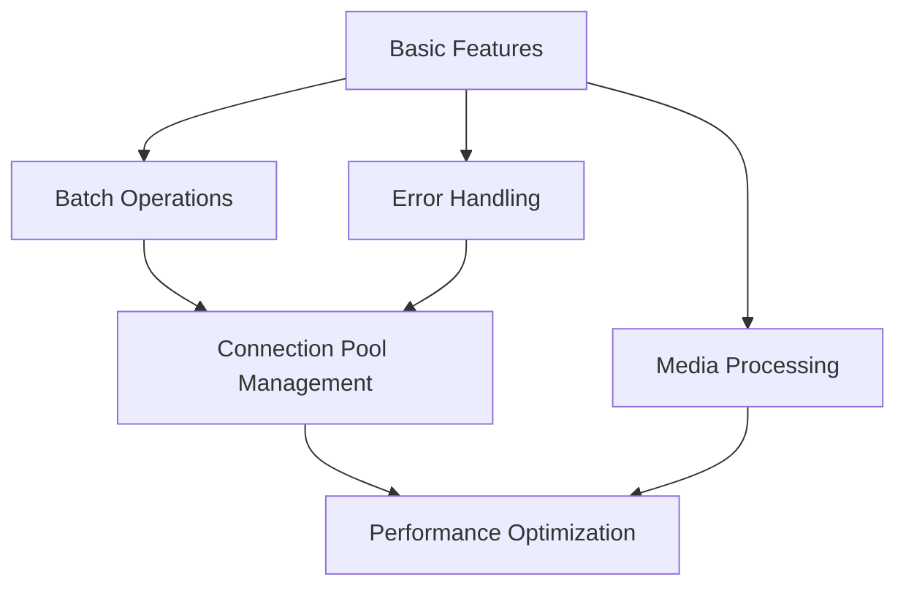

# Advanced Features

Welcome to the advanced features section of Redis Toolkit! Here we'll introduce more powerful and professional features to help you build high-performance applications.

## 🚀 Advanced Features Overview

Redis Toolkit provides not only basic data access functionality but also many advanced features:

<div class="feature-grid">
  <div class="feature-card">
    <h3>🎨 Media Processing</h3>
    <p>Built-in image, audio, and video converters for easy multimedia data handling</p>
    <ul>
      <li>Image encoding/decoding & resizing</li>
      <li>Audio format conversion</li>
      <li>Video frame extraction</li>
    </ul>
    <a href="./media-processing.html" class="learn-more">Learn More →</a>
  </div>
  
  <div class="feature-card">
    <h3>⚡ Batch Operations</h3>
    <p>Efficiently process large amounts of data with significant performance improvements</p>
    <ul>
      <li>Batch read/write</li>
      <li>Pipeline operations</li>
      <li>Transaction support</li>
    </ul>
    <a href="./batch-operations.html" class="learn-more">Learn More →</a>
  </div>
  
  <div class="feature-card">
    <h3>🔗 Connection Pool Management</h3>
    <p>Smart connection pooling for optimized resource usage</p>
    <ul>
      <li>Automatic connection management</li>
      <li>Connection pool sharing</li>
      <li>Health checks</li>
    </ul>
    <a href="./connection-pool.html" class="learn-more">Learn More →</a>
  </div>
  
  <div class="feature-card">
    <h3>🛡️ Error Handling</h3>
    <p>Comprehensive error handling mechanisms for system stability</p>
    <ul>
      <li>Automatic retry</li>
      <li>Graceful degradation</li>
      <li>Detailed error tracking</li>
    </ul>
    <a href="./error-handling.html" class="learn-more">Learn More →</a>
  </div>
  
  <div class="feature-card">
    <h3>📊 Performance Optimization</h3>
    <p>Multiple optimization techniques to make your application fly</p>
    <ul>
      <li>Performance profiling</li>
      <li>Optimization recommendations</li>
      <li>Benchmarking</li>
    </ul>
    <a href="./performance.html" class="learn-more">Learn More →</a>
  </div>
</div>

## 📚 Learning Suggestions

### Choose Based on Your Needs

Different advanced features suit different application scenarios:

| If you need to... | We recommend learning |
|-------------------|----------------------|
| Process images, audio, or video | [Media Processing](./media-processing.md) |
| Improve performance for bulk data operations | [Batch Operations](./batch-operations.md) |
| Optimize connection resource usage | [Connection Pool Management](./connection-pool.md) |
| Build stable and reliable systems | [Error Handling](./error-handling.md) |
| Overall performance tuning | [Performance Optimization](./performance.md) |

### Learning Path



## 🎯 Real-World Examples Preview

### Image Caching System

```python
from redis_toolkit import RedisToolkit
from redis_toolkit.converters import encode_image, decode_image

class ImageCache:
    def __init__(self):
        self.toolkit = RedisToolkit()
    
    def cache_image(self, image_id, image_array, ttl=3600):
        # Encode and cache image
        encoded = encode_image(image_array, format='jpg', quality=85)
        self.toolkit.setter(f"img:{image_id}", encoded, ex=ttl)
    
    def get_cached_image(self, image_id):
        # Get and decode image from cache
        encoded = self.toolkit.getter(f"img:{image_id}")
        if encoded:
            return decode_image(encoded)
        return None
```

### High-Performance Batch Processing

```python
# Process 10,000 data items using batch operations
batch_data = {
    f"data:{i}": {"value": i, "timestamp": time.time()}
    for i in range(10000)
}

# Batch write (10x faster than individual writes)
toolkit.batch_set(batch_data)

# Batch read
keys = [f"data:{i}" for i in range(10000)]
results = toolkit.batch_get(keys)
```

## 💡 Advanced Tips Summary

### 1. Combine Multiple Features

```python
# Combine batch operations + error handling + connection pooling
from redis_toolkit import RedisToolkit, RedisOptions
from redis_toolkit.utils import with_retry

options = RedisOptions(
    use_connection_pool=True,
    max_connections=100
)

toolkit = RedisToolkit(options=options)

@with_retry(max_attempts=3)
def reliable_batch_operation(data):
    return toolkit.batch_set(data)
```

### 2. Monitoring and Debugging

```python
# Enable detailed logging for debugging
debug_options = RedisOptions(
    is_logger_info=True,
    log_level="DEBUG",
    max_log_size=1024
)

# Performance monitoring
import time
start = time.time()
# ... your operations ...
elapsed = time.time() - start
print(f"Operation took: {elapsed:.3f} seconds")
```

## 🔥 Popular Use Cases

1. **Real-time Image Processing Service**
   - Use media processing features for user-uploaded images
   - Batch operations improve thumbnail generation efficiency
   - Connection pool management handles high concurrent requests

2. **Big Data Analytics Platform**
   - Batch operations for fast data loading
   - Error handling ensures data integrity
   - Performance optimization reduces processing time

3. **IoT Data Collection System**
   - Connection pool manages numerous device connections
   - Batch operations process sensor data
   - Error handling deals with network instability

## 🚀 Ready to Dive Deeper?

Choose your most interesting topic to start learning:

<div class="next-steps">
  <a href="./media-processing.html" class="action-card">
    <span class="icon">🎨</span>
    <span class="title">Media Processing</span>
    <span class="desc">Handle images, audio, video</span>
  </a>
  
  <a href="./batch-operations.html" class="action-card">
    <span class="icon">⚡</span>
    <span class="title">Batch Operations</span>
    <span class="desc">Efficiently process bulk data</span>
  </a>
  
  <a href="./connection-pool.html" class="action-card">
    <span class="icon">🔗</span>
    <span class="title">Connection Pool</span>
    <span class="desc">Optimize connection resources</span>
  </a>
</div>

::: tip Learning Tips
- Choose learning priorities based on actual needs
- Practice with example code hands-on
- Apply learned knowledge in real projects
- Refer to the [API Documentation](/en/api/) for more details
:::

<style>
.feature-grid {
  display: grid;
  grid-template-columns: repeat(auto-fit, minmax(280px, 1fr));
  gap: 1.5rem;
  margin: 2rem 0;
}

.feature-card {
  background: #f8f9fa;
  border: 1px solid #e9ecef;
  border-radius: 8px;
  padding: 1.5rem;
  transition: all 0.3s;
}

.feature-card:hover {
  transform: translateY(-3px);
  box-shadow: 0 6px 20px rgba(0,0,0,0.1);
  border-color: #dc382d;
}

.feature-card h3 {
  color: #dc382d;
  margin-top: 0;
  margin-bottom: 0.8rem;
  font-size: 1.3rem;
}

.feature-card p {
  color: #666;
  margin-bottom: 1rem;
  line-height: 1.6;
}

.feature-card ul {
  margin: 0;
  padding-left: 1.2rem;
  color: #555;
  font-size: 0.9rem;
}

.feature-card ul li {
  margin-bottom: 0.3rem;
}

.learn-more {
  display: inline-block;
  margin-top: 1rem;
  color: #dc382d;
  text-decoration: none;
  font-weight: 500;
  transition: all 0.2s;
}

.learn-more:hover {
  transform: translateX(3px);
}

.next-steps {
  display: grid;
  grid-template-columns: repeat(auto-fit, minmax(200px, 1fr));
  gap: 1rem;
  margin: 2rem 0;
}

.action-card {
  display: flex;
  flex-direction: column;
  align-items: center;
  padding: 2rem 1rem;
  background: linear-gradient(135deg, #f5f7fa 0%, #c3cfe2 100%);
  border-radius: 8px;
  text-decoration: none;
  color: inherit;
  transition: all 0.3s;
  text-align: center;
}

.action-card:hover {
  transform: translateY(-5px);
  box-shadow: 0 8px 25px rgba(0,0,0,0.15);
}

.action-card .icon {
  font-size: 2.5rem;
  margin-bottom: 0.5rem;
}

.action-card .title {
  font-size: 1.2rem;
  font-weight: 600;
  color: #dc382d;
  margin-bottom: 0.3rem;
}

.action-card .desc {
  font-size: 0.9rem;
  color: #666;
}
</style>