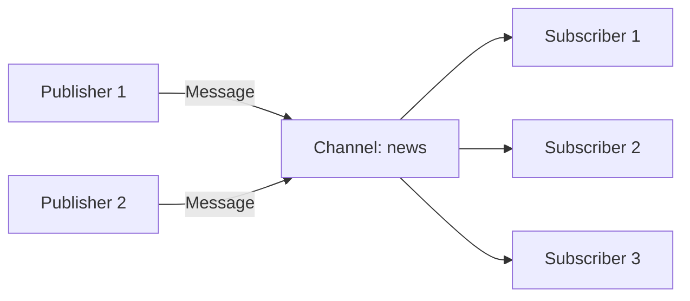

# Publish/Subscribe (Pub/Sub)

Redis Toolkit simplifies Redis's publish/subscribe functionality, providing enhanced features like automatic serialization, background listening, and error handling, making message passing simple and reliable.

## 🎯 What is Publish/Subscribe?

Publish/Subscribe (Pub/Sub) is a messaging pattern:

- **Publisher**: Sends messages to specific channels
- **Subscriber**: Listens to one or more channels for messages
- **Channel**: The conduit for message delivery



## 🚀 Quick Start

### Basic Subscriber

```python
from redis_toolkit import RedisToolkit

# Define message handler function
def handle_message(channel, data):
    print(f"Received message from {channel}:")
    print(f"Content: {data}")

# Create subscriber
subscriber = RedisToolkit(
    channels=["news", "updates"],  # Subscribe to multiple channels
    message_handler=handle_message
)

# Subscriber automatically listens for messages in background
print("Subscriber is listening...")
```

### Basic Publisher

```python
# Create publisher
publisher = RedisToolkit()

# Send message (auto-serialization)
message = {
    "type": "breaking_news",
    "title": "Important Update",
    "content": "Redis Toolkit new version released!",
    "timestamp": "2024-01-01 10:00:00"
}

publisher.publisher("news", message)
print("Message sent")
```

## 📡 Advanced Subscription Features

### Pattern Subscription

```python
# Use pattern to subscribe to multiple related channels
def pattern_handler(channel, data):
    print(f"Channel {channel}: {data}")

# Subscribe to all channels starting with "user:"
pattern_subscriber = RedisToolkit(
    channels=["user:*"],  # Pattern matching
    message_handler=pattern_handler
)

# All these messages will be received
publisher.publisher("user:login", {"user_id": 1001})
publisher.publisher("user:logout", {"user_id": 1002})
publisher.publisher("user:update", {"user_id": 1003})
```

### Multi-Channel Handling

```python
# Route different processing logic based on channel
def multi_channel_handler(channel, data):
    if channel == "orders":
        process_order(data)
    elif channel == "payments":
        process_payment(data)
    elif channel.startswith("notifications:"):
        send_notification(channel, data)

def process_order(order_data):
    print(f"Processing order: {order_data['order_id']}")

def process_payment(payment_data):
    print(f"Processing payment: ${payment_data['amount']}")

def send_notification(channel, notification):
    user_id = channel.split(":")[1]
    print(f"Sending notification to user {user_id}: {notification['message']}")

# Subscribe to multiple types of channels
subscriber = RedisToolkit(
    channels=["orders", "payments", "notifications:*"],
    message_handler=multi_channel_handler
)
```

## 🔄 Two-Way Communication Example

### Request-Response Pattern

```python
import uuid
import threading
import time

class RequestResponse:
    def __init__(self):
        self.toolkit = RedisToolkit()
        self.responses = {}
        
        # 啟動回應監聽器
        self.response_listener = RedisToolkit(
            channels=["responses:*"],
            message_handler=self._handle_response
        )
    
    def send_request(self, request_data, timeout=5):
        """Send request and wait for response"""
        request_id = str(uuid.uuid4())
        response_channel = f"responses:{request_id}"
        
        # Prepare to wait for response
        event = threading.Event()
        self.responses[request_id] = {"event": event, "data": None}
        
        # Send request
        request = {
            "id": request_id,
            "response_channel": response_channel,
            "data": request_data
        }
        self.toolkit.publisher("requests", request)
        
        # Wait for response
        if event.wait(timeout):
            return self.responses[request_id]["data"]
        else:
            raise TimeoutError("Request timeout")
    
    def _handle_response(self, channel, data):
        """Handle response"""
        request_id = channel.split(":")[1]
        if request_id in self.responses:
            self.responses[request_id]["data"] = data
            self.responses[request_id]["event"].set()

# Request processor (another process)
def request_processor():
    def handle_request(channel, request):
        print(f"Processing request: {request['id']}")
        
        # Process request
        result = {"status": "success", "result": len(request['data'])}
        
        # Send response
        toolkit = RedisToolkit()
        toolkit.publisher(request['response_channel'], result)
    
    processor = RedisToolkit(
        channels=["requests"],
        message_handler=handle_request
    )

# Usage example
client = RequestResponse()
response = client.send_request({"action": "calculate", "data": [1, 2, 3, 4, 5]})
print(f"Received response: {response}")
```

## 🎨 Real-World Use Cases

### 1. Real-time Notification System

```python
class NotificationSystem:
    def __init__(self):
        self.publisher = RedisToolkit()
    
    def send_notification(self, user_id, notification):
        """Send notification to specific user"""
        channel = f"notifications:user:{user_id}"
        
        message = {
            "id": str(uuid.uuid4()),
            "type": notification['type'],
            "title": notification['title'],
            "body": notification['body'],
            "timestamp": time.time(),
            "read": False
        }
        
        self.publisher.publisher(channel, message)
        
        # Also send to global channel for monitoring
        self.publisher.publisher("notifications:all", {
            "user_id": user_id,
            "notification_id": message['id']
        })
    
    def broadcast(self, notification):
        """Broadcast notification to all users"""
        self.publisher.publisher("notifications:broadcast", {
            "id": str(uuid.uuid4()),
            "title": notification['title'],
            "body": notification['body'],
            "timestamp": time.time()
        })

# Client-side subscription
class UserNotificationClient:
    def __init__(self, user_id):
        self.user_id = user_id
        
        def handle_notification(channel, data):
            if channel == f"notifications:user:{user_id}":
                self.show_personal_notification(data)
            elif channel == "notifications:broadcast":
                self.show_broadcast_notification(data)
        
        self.subscriber = RedisToolkit(
            channels=[
                f"notifications:user:{user_id}",
                "notifications:broadcast"
            ],
            message_handler=handle_notification
        )
    
    def show_personal_notification(self, notification):
        print(f"[Personal] {notification['title']}: {notification['body']}")
    
    def show_broadcast_notification(self, notification):
        print(f"[Broadcast] {notification['title']}: {notification['body']}")

# Usage example
notifier = NotificationSystem()
client = UserNotificationClient(user_id=1001)

# Send personal notification
notifier.send_notification(1001, {
    "type": "order",
    "title": "Order Update",
    "body": "Your order has been shipped"
})

# Broadcast notification
notifier.broadcast({
    "title": "System Maintenance",
    "body": "System will undergo maintenance at 10 PM tonight"
})
```

### 2. Chat Room System

```python
class ChatRoom:
    def __init__(self, room_id):
        self.room_id = room_id
        self.toolkit = RedisToolkit()
        self.channel = f"chat:room:{room_id}"
    
    def join(self, user_name, on_message):
        """Join chat room"""
        # Send join message
        self.toolkit.publisher(self.channel, {
            "type": "join",
            "user": user_name,
            "timestamp": time.time()
        })
        
        # Subscribe to chat room channel
        def message_handler(channel, data):
            on_message(data)
        
        subscriber = RedisToolkit(
            channels=[self.channel],
            message_handler=message_handler
        )
        
        return subscriber
    
    def send_message(self, user_name, message):
        """Send message"""
        self.toolkit.publisher(self.channel, {
            "type": "message",
            "user": user_name,
            "text": message,
            "timestamp": time.time()
        })
    
    def leave(self, user_name):
        """Leave chat room"""
        self.toolkit.publisher(self.channel, {
            "type": "leave",
            "user": user_name,
            "timestamp": time.time()
        })

# Usage example
def display_message(data):
    if data["type"] == "join":
        print(f"*** {data['user']} joined the chat ***")
    elif data["type"] == "message":
        print(f"{data['user']}: {data['text']}")
    elif data["type"] == "leave":
        print(f"*** {data['user']} left the chat ***")

# Create chat room
room = ChatRoom("general")

# Alice joins
alice_sub = room.join("Alice", display_message)
room.send_message("Alice", "Hello everyone!")

# Bob joins
bob_sub = room.join("Bob", display_message)
room.send_message("Bob", "Hi Alice!")
```

### 3. Task Queue System

```python
class TaskQueue:
    def __init__(self, queue_name):
        self.queue_name = queue_name
        self.toolkit = RedisToolkit()
        self.channel = f"tasks:{queue_name}"
    
    def submit_task(self, task_type, payload, priority="normal"):
        """Submit task"""
        task = {
            "id": str(uuid.uuid4()),
            "type": task_type,
            "payload": payload,
            "priority": priority,
            "submitted_at": time.time(),
            "status": "pending"
        }
        
        # Send to different channels based on priority
        channel = f"{self.channel}:{priority}"
        self.toolkit.publisher(channel, task)
        
        return task["id"]
    
    def create_worker(self, worker_id, task_handler):
        """Create worker"""
        def handle_task(channel, task):
            print(f"Worker {worker_id} processing task: {task['id']}")
            
            try:
                # Update task status
                task["status"] = "processing"
                task["worker_id"] = worker_id
                task["started_at"] = time.time()
                
                # Execute task
                result = task_handler(task)
                
                # Complete task
                task["status"] = "completed"
                task["result"] = result
                task["completed_at"] = time.time()
                
                # Publish completion event
                self.toolkit.publisher(f"tasks:completed", task)
                
            except Exception as e:
                # Task failed
                task["status"] = "failed"
                task["error"] = str(e)
                task["failed_at"] = time.time()
                
                # Publish failure event
                self.toolkit.publisher(f"tasks:failed", task)
        
        # Subscribe to tasks of different priorities
        return RedisToolkit(
            channels=[
                f"{self.channel}:high",
                f"{self.channel}:normal",
                f"{self.channel}:low"
            ],
            message_handler=handle_task
        )

# Usage example
queue = TaskQueue("image_processing")

# Define task handler function
def process_image(task):
    print(f"Processing image: {task['payload']['image_path']}")
    time.sleep(2)  # Simulate processing
    return {"status": "processed", "size": "1024x768"}

# Create workers
worker1 = queue.create_worker("worker-1", process_image)
worker2 = queue.create_worker("worker-2", process_image)

# Submit task
task_id = queue.submit_task("resize", {
    "image_path": "/images/photo.jpg",
    "width": 800,
    "height": 600
}, priority="high")

print(f"Task submitted: {task_id}")
```

## 🛡️ Error Handling and Reconnection

### Automatic Reconnection

```python
from redis_toolkit import RedisToolkit, RedisOptions

# Configure reconnection options
options = RedisOptions(
    subscriber_retry_delay=5,  # Reconnection delay (seconds)
    is_logger_info=True       # Enable logging
)

def resilient_handler(channel, data):
    try:
        # Process message
        process_message(data)
    except Exception as e:
        # Log error but don't interrupt subscription
        print(f"Error processing message: {e}")

# Subscriber automatically handles disconnection and reconnection
subscriber = RedisToolkit(
    channels=["important_events"],
    message_handler=resilient_handler,
    options=options
)
```

### Message Acknowledgment

```python
class ReliableMessaging:
    def __init__(self):
        self.toolkit = RedisToolkit()
    
    def publish_with_ack(self, channel, message, timeout=5):
        """Publish message and wait for acknowledgment"""
        msg_id = str(uuid.uuid4())
        ack_channel = f"ack:{msg_id}"
        
        # Prepare to receive acknowledgment
        ack_received = threading.Event()
        
        def ack_handler(ch, data):
            if data.get("msg_id") == msg_id:
                ack_received.set()
        
        ack_subscriber = RedisToolkit(
            channels=[ack_channel],
            message_handler=ack_handler
        )
        
        # Send message
        message["_msg_id"] = msg_id
        message["_ack_channel"] = ack_channel
        self.toolkit.publisher(channel, message)
        
        # Wait for acknowledgment
        if ack_received.wait(timeout):
            print(f"Message {msg_id} acknowledged")
            return True
        else:
            print(f"Message {msg_id} not acknowledged")
            return False
    
    def create_ack_subscriber(self, channel):
        """Create subscriber that sends acknowledgments"""
        def handler_with_ack(ch, data):
            try:
                # Process message
                process_message(data)
                
                # Send acknowledgment
                if "_msg_id" in data and "_ack_channel" in data:
                    self.toolkit.publisher(data["_ack_channel"], {
                        "msg_id": data["_msg_id"],
                        "status": "acknowledged"
                    })
            except Exception as e:
                print(f"Processing failed: {e}")
        
        return RedisToolkit(
            channels=[channel],
            message_handler=handler_with_ack
        )
```

## 📊 Performance Optimization

### Batch Publishing

```python
# Batch send multiple messages
def batch_publish(channel, messages):
    toolkit = RedisToolkit()
    pipe = toolkit.client.pipeline()
    
    for msg in messages:
        serialized = json.dumps(msg)
        pipe.publish(channel, serialized)
    
    pipe.execute()

# Usage example
messages = [
    {"id": i, "data": f"Message {i}"}
    for i in range(1000)
]

batch_publish("bulk_updates", messages)
```

### Message Filtering

```python
def filtered_handler(channel, data):
    # Filter messages in handler
    if data.get("priority") != "high":
        return  # Ignore non-high priority messages
    
    if data.get("user_id") not in allowed_users:
        return  # Ignore unauthorized users
    
    # Process messages that meet criteria
    process_important_message(data)
```

## 🎯 Best Practices

1. **Channel Naming Convention**
   ```python
   # Use structured channel names
   "users:1001:notifications"    # User notifications
   "orders:status:pending"       # Order status
   "system:alerts:critical"      # System alerts
   ```

2. **Standardize Message Format**
   ```python
   # Unified message format
   message = {
       "id": str(uuid.uuid4()),
       "type": "event_type",
       "timestamp": time.time(),
       "version": "1.0",
       "data": {...}
   }
   ```

3. **Avoid Blocking Operations**
   ```python
   def non_blocking_handler(channel, data):
       # Put time-consuming operations in queue
       task_queue.put({
           "channel": channel,
           "data": data
       })
       # Return immediately, don't block subscription
   ```

4. **Resource Cleanup**
   ```python
   # Properly clean up subscriber
   try:
       # Use subscriber
       subscriber = RedisToolkit(...)
   finally:
       # Ensure cleanup
       subscriber.cleanup()
   ```

## 📚 Next Steps

After mastering Pub/Sub functionality, you can:

- Learn about [Configuration Options](./configuration.md) to optimize Pub/Sub performance
- Explore [Batch Operations](/en/advanced/batch-operations.md) to improve message processing efficiency
- Check out [Error Handling](/en/advanced/error-handling.md) to build more stable systems

::: tip Summary
Redis Toolkit's Pub/Sub makes real-time communication simple. Remember: design channel structure wisely, standardize message formats, and pay attention to error handling!
:::