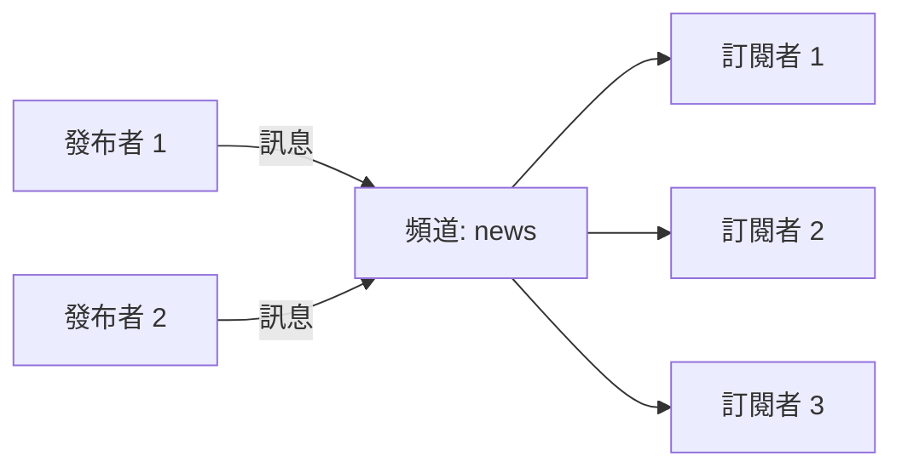

# 發布訂閱 (Pub/Sub)

Redis Toolkit 簡化了 Redis 的發布訂閱功能，提供自動序列化、背景監聽、錯誤處理等增強功能，讓訊息傳遞變得簡單可靠。

## 🎯 什麼是發布訂閱？

發布訂閱（Pub/Sub）是一種訊息傳遞模式：

- **發布者（Publisher）**：發送訊息到特定頻道
- **訂閱者（Subscriber）**：監聽一個或多個頻道的訊息
- **頻道（Channel）**：訊息傳遞的管道



## 🚀 快速開始

### 基本訂閱者

```python
from redis_toolkit import RedisToolkit

# 定義訊息處理函數
def handle_message(channel, data):
    print(f"收到來自 {channel} 的訊息:")
    print(f"內容: {data}")

# 創建訂閱者
subscriber = RedisToolkit(
    channels=["news", "updates"],  # 訂閱多個頻道
    message_handler=handle_message
)

# 訂閱者會在背景自動監聽訊息
print("訂閱者正在監聽...")
```

### 基本發布者

```python
# 創建發布者
publisher = RedisToolkit()

# 發送訊息（自動序列化）
message = {
    "type": "breaking_news",
    "title": "重要更新",
    "content": "Redis Toolkit 發布新版本！",
    "timestamp": "2024-01-01 10:00:00"
}

publisher.publisher("news", message)
print("訊息已發送")
```

## 📡 進階訂閱功能

### 訂閱模式匹配

```python
# 使用模式訂閱多個相關頻道
def pattern_handler(channel, data):
    print(f"頻道 {channel}: {data}")

# 訂閱所有以 "user:" 開頭的頻道
pattern_subscriber = RedisToolkit(
    channels=["user:*"],  # 模式匹配
    message_handler=pattern_handler
)

# 這些訊息都會被接收
publisher.publisher("user:login", {"user_id": 1001})
publisher.publisher("user:logout", {"user_id": 1002})
publisher.publisher("user:update", {"user_id": 1003})
```

### 多頻道處理

```python
# 根據頻道分發不同處理邏輯
def multi_channel_handler(channel, data):
    if channel == "orders":
        process_order(data)
    elif channel == "payments":
        process_payment(data)
    elif channel.startswith("notifications:"):
        send_notification(channel, data)

def process_order(order_data):
    print(f"處理訂單: {order_data['order_id']}")

def process_payment(payment_data):
    print(f"處理付款: ${payment_data['amount']}")

def send_notification(channel, notification):
    user_id = channel.split(":")[1]
    print(f"發送通知給用戶 {user_id}: {notification['message']}")

# 訂閱多種類型的頻道
subscriber = RedisToolkit(
    channels=["orders", "payments", "notifications:*"],
    message_handler=multi_channel_handler
)
```

## 🔄 雙向通訊範例

### 請求-回應模式

```python
import uuid
import threading
import time

class RequestResponse:
    def __init__(self):
        self.toolkit = RedisToolkit()
        self.responses = {}
        
        # 啟動回應監聽器
        self.response_listener = RedisToolkit(
            channels=["responses:*"],
            message_handler=self._handle_response
        )
    
    def send_request(self, request_data, timeout=5):
        """發送請求並等待回應"""
        request_id = str(uuid.uuid4())
        response_channel = f"responses:{request_id}"
        
        # 準備等待回應
        event = threading.Event()
        self.responses[request_id] = {"event": event, "data": None}
        
        # 發送請求
        request = {
            "id": request_id,
            "response_channel": response_channel,
            "data": request_data
        }
        self.toolkit.publisher("requests", request)
        
        # 等待回應
        if event.wait(timeout):
            return self.responses[request_id]["data"]
        else:
            raise TimeoutError("請求超時")
    
    def _handle_response(self, channel, data):
        """處理回應"""
        request_id = channel.split(":")[1]
        if request_id in self.responses:
            self.responses[request_id]["data"] = data
            self.responses[request_id]["event"].set()

# 請求處理器（另一個進程）
def request_processor():
    def handle_request(channel, request):
        print(f"處理請求: {request['id']}")
        
        # 處理請求
        result = {"status": "success", "result": len(request['data'])}
        
        # 發送回應
        toolkit = RedisToolkit()
        toolkit.publisher(request['response_channel'], result)
    
    processor = RedisToolkit(
        channels=["requests"],
        message_handler=handle_request
    )

# 使用範例
client = RequestResponse()
response = client.send_request({"action": "calculate", "data": [1, 2, 3, 4, 5]})
print(f"收到回應: {response}")
```

## 🎨 實際應用場景

### 1. 即時通知系統

```python
class NotificationSystem:
    def __init__(self):
        self.publisher = RedisToolkit()
    
    def send_notification(self, user_id, notification):
        """發送通知給特定用戶"""
        channel = f"notifications:user:{user_id}"
        
        message = {
            "id": str(uuid.uuid4()),
            "type": notification['type'],
            "title": notification['title'],
            "body": notification['body'],
            "timestamp": time.time(),
            "read": False
        }
        
        self.publisher.publisher(channel, message)
        
        # 同時發送到全域頻道供監控
        self.publisher.publisher("notifications:all", {
            "user_id": user_id,
            "notification_id": message['id']
        })
    
    def broadcast(self, notification):
        """廣播通知給所有用戶"""
        self.publisher.publisher("notifications:broadcast", {
            "id": str(uuid.uuid4()),
            "title": notification['title'],
            "body": notification['body'],
            "timestamp": time.time()
        })

# 用戶端訂閱
class UserNotificationClient:
    def __init__(self, user_id):
        self.user_id = user_id
        
        def handle_notification(channel, data):
            if channel == f"notifications:user:{user_id}":
                self.show_personal_notification(data)
            elif channel == "notifications:broadcast":
                self.show_broadcast_notification(data)
        
        self.subscriber = RedisToolkit(
            channels=[
                f"notifications:user:{user_id}",
                "notifications:broadcast"
            ],
            message_handler=handle_notification
        )
    
    def show_personal_notification(self, notification):
        print(f"[個人通知] {notification['title']}: {notification['body']}")
    
    def show_broadcast_notification(self, notification):
        print(f"[廣播] {notification['title']}: {notification['body']}")

# 使用範例
notifier = NotificationSystem()
client = UserNotificationClient(user_id=1001)

# 發送個人通知
notifier.send_notification(1001, {
    "type": "order",
    "title": "訂單更新",
    "body": "您的訂單已發貨"
})

# 廣播通知
notifier.broadcast({
    "title": "系統維護",
    "body": "系統將於今晚 10 點進行維護"
})
```

### 2. 聊天室系統

```python
class ChatRoom:
    def __init__(self, room_id):
        self.room_id = room_id
        self.toolkit = RedisToolkit()
        self.channel = f"chat:room:{room_id}"
    
    def join(self, user_name, on_message):
        """加入聊天室"""
        # 發送加入訊息
        self.toolkit.publisher(self.channel, {
            "type": "join",
            "user": user_name,
            "timestamp": time.time()
        })
        
        # 訂閱聊天室頻道
        def message_handler(channel, data):
            on_message(data)
        
        subscriber = RedisToolkit(
            channels=[self.channel],
            message_handler=message_handler
        )
        
        return subscriber
    
    def send_message(self, user_name, message):
        """發送訊息"""
        self.toolkit.publisher(self.channel, {
            "type": "message",
            "user": user_name,
            "text": message,
            "timestamp": time.time()
        })
    
    def leave(self, user_name):
        """離開聊天室"""
        self.toolkit.publisher(self.channel, {
            "type": "leave",
            "user": user_name,
            "timestamp": time.time()
        })

# 使用範例
def display_message(data):
    if data["type"] == "join":
        print(f"*** {data['user']} 加入聊天室 ***")
    elif data["type"] == "message":
        print(f"{data['user']}: {data['text']}")
    elif data["type"] == "leave":
        print(f"*** {data['user']} 離開聊天室 ***")

# 創建聊天室
room = ChatRoom("general")

# Alice 加入
alice_sub = room.join("Alice", display_message)
room.send_message("Alice", "大家好！")

# Bob 加入
bob_sub = room.join("Bob", display_message)
room.send_message("Bob", "嗨 Alice！")
```

### 3. 任務佇列系統

```python
class TaskQueue:
    def __init__(self, queue_name):
        self.queue_name = queue_name
        self.toolkit = RedisToolkit()
        self.channel = f"tasks:{queue_name}"
    
    def submit_task(self, task_type, payload, priority="normal"):
        """提交任務"""
        task = {
            "id": str(uuid.uuid4()),
            "type": task_type,
            "payload": payload,
            "priority": priority,
            "submitted_at": time.time(),
            "status": "pending"
        }
        
        # 根據優先級發送到不同頻道
        channel = f"{self.channel}:{priority}"
        self.toolkit.publisher(channel, task)
        
        return task["id"]
    
    def create_worker(self, worker_id, task_handler):
        """創建工作者"""
        def handle_task(channel, task):
            print(f"Worker {worker_id} 處理任務: {task['id']}")
            
            try:
                # 更新任務狀態
                task["status"] = "processing"
                task["worker_id"] = worker_id
                task["started_at"] = time.time()
                
                # 執行任務
                result = task_handler(task)
                
                # 完成任務
                task["status"] = "completed"
                task["result"] = result
                task["completed_at"] = time.time()
                
                # 發布完成事件
                self.toolkit.publisher(f"tasks:completed", task)
                
            except Exception as e:
                # 任務失敗
                task["status"] = "failed"
                task["error"] = str(e)
                task["failed_at"] = time.time()
                
                # 發布失敗事件
                self.toolkit.publisher(f"tasks:failed", task)
        
        # 訂閱不同優先級的任務
        return RedisToolkit(
            channels=[
                f"{self.channel}:high",
                f"{self.channel}:normal",
                f"{self.channel}:low"
            ],
            message_handler=handle_task
        )

# 使用範例
queue = TaskQueue("image_processing")

# 定義任務處理函數
def process_image(task):
    print(f"處理圖片: {task['payload']['image_path']}")
    time.sleep(2)  # 模擬處理
    return {"status": "processed", "size": "1024x768"}

# 創建工作者
worker1 = queue.create_worker("worker-1", process_image)
worker2 = queue.create_worker("worker-2", process_image)

# 提交任務
task_id = queue.submit_task("resize", {
    "image_path": "/images/photo.jpg",
    "width": 800,
    "height": 600
}, priority="high")

print(f"任務已提交: {task_id}")
```

## 🛡️ 錯誤處理與重連

### 自動重連機制

```python
from redis_toolkit import RedisToolkit, RedisOptions

# 配置重連選項
options = RedisOptions(
    subscriber_retry_delay=5,  # 重連延遲（秒）
    is_logger_info=True       # 啟用日誌
)

def resilient_handler(channel, data):
    try:
        # 處理訊息
        process_message(data)
    except Exception as e:
        # 記錄錯誤但不中斷訂閱
        print(f"處理訊息時發生錯誤: {e}")

# 訂閱者會自動處理連線中斷和重連
subscriber = RedisToolkit(
    channels=["important_events"],
    message_handler=resilient_handler,
    options=options
)
```

### 訊息確認機制

```python
class ReliableMessaging:
    def __init__(self):
        self.toolkit = RedisToolkit()
    
    def publish_with_ack(self, channel, message, timeout=5):
        """發布訊息並等待確認"""
        msg_id = str(uuid.uuid4())
        ack_channel = f"ack:{msg_id}"
        
        # 準備接收確認
        ack_received = threading.Event()
        
        def ack_handler(ch, data):
            if data.get("msg_id") == msg_id:
                ack_received.set()
        
        ack_subscriber = RedisToolkit(
            channels=[ack_channel],
            message_handler=ack_handler
        )
        
        # 發送訊息
        message["_msg_id"] = msg_id
        message["_ack_channel"] = ack_channel
        self.toolkit.publisher(channel, message)
        
        # 等待確認
        if ack_received.wait(timeout):
            print(f"訊息 {msg_id} 已確認")
            return True
        else:
            print(f"訊息 {msg_id} 未收到確認")
            return False
    
    def create_ack_subscriber(self, channel):
        """創建會發送確認的訂閱者"""
        def handler_with_ack(ch, data):
            try:
                # 處理訊息
                process_message(data)
                
                # 發送確認
                if "_msg_id" in data and "_ack_channel" in data:
                    self.toolkit.publisher(data["_ack_channel"], {
                        "msg_id": data["_msg_id"],
                        "status": "acknowledged"
                    })
            except Exception as e:
                print(f"處理失敗: {e}")
        
        return RedisToolkit(
            channels=[channel],
            message_handler=handler_with_ack
        )
```

## 📊 效能優化

### 批次發布

```python
# 批次發送多個訊息
def batch_publish(channel, messages):
    toolkit = RedisToolkit()
    pipe = toolkit.client.pipeline()
    
    for msg in messages:
        serialized = json.dumps(msg)
        pipe.publish(channel, serialized)
    
    pipe.execute()

# 使用範例
messages = [
    {"id": i, "data": f"Message {i}"}
    for i in range(1000)
]

batch_publish("bulk_updates", messages)
```

### 訊息過濾

```python
def filtered_handler(channel, data):
    # 在處理器中過濾訊息
    if data.get("priority") != "high":
        return  # 忽略非高優先級訊息
    
    if data.get("user_id") not in allowed_users:
        return  # 忽略未授權用戶
    
    # 處理符合條件的訊息
    process_important_message(data)
```

## 🎯 最佳實踐

1. **頻道命名規範**
   ```python
   # 使用結構化的頻道名稱
   "users:1001:notifications"    # 用戶通知
   "orders:status:pending"       # 訂單狀態
   "system:alerts:critical"      # 系統警報
   ```

2. **訊息格式標準化**
   ```python
   # 統一的訊息格式
   message = {
       "id": str(uuid.uuid4()),
       "type": "event_type",
       "timestamp": time.time(),
       "version": "1.0",
       "data": {...}
   }
   ```

3. **避免阻塞操作**
   ```python
   def non_blocking_handler(channel, data):
       # 將耗時操作放入佇列
       task_queue.put({
           "channel": channel,
           "data": data
       })
       # 立即返回，不阻塞訂閱
   ```

4. **資源清理**
   ```python
   # 正確清理訂閱者
   try:
       # 使用訂閱者
       subscriber = RedisToolkit(...)
   finally:
       # 確保清理
       subscriber.cleanup()
   ```

## 📚 下一步

掌握了發布訂閱功能後，您可以：

- 學習[配置選項](./configuration.md)，優化 Pub/Sub 性能
- 探索[批次操作](/advanced/batch-operations.md)，提升訊息處理效率
- 查看[錯誤處理](/advanced/error-handling.md)，建立更穩定的系統

::: tip 小結
Redis Toolkit 的 Pub/Sub 功能讓即時通訊變得簡單。記住：合理設計頻道結構，標準化訊息格式，注意錯誤處理！
:::