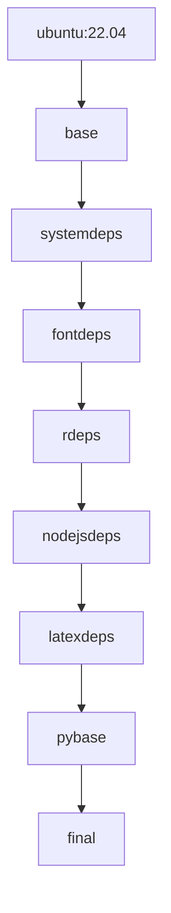

# Docker Image Architecture

This document describes the architecture of the Rxiv-Maker Docker images.

## Overview

The Rxiv-Maker Docker images use a multi-stage build approach to create optimized, production-ready containers for scientific document generation. The architecture supports both AMD64 and ARM64 platforms with comprehensive LaTeX, Python, Node.js, and R environments.

## Multi-Stage Build Process

### Base Image Architecture



### Stage Descriptions

#### 1. Base Stage (`ubuntu:22.04`)
- **Purpose**: Foundation layer with Ubuntu 22.04 LTS
- **Configuration**: Environment variables, locale settings
- **Size Impact**: ~70MB

#### 2. System Dependencies Stage (`systemdeps`)
- **Purpose**: Essential system packages and development tools
- **Includes**: Build tools, graphics libraries, GitHub CLI
- **Key Components**:
  - `build-essential`, `make`, `pkg-config`
  - `libpango1.0-dev`, `libjpeg-dev`
  - `libfontconfig1-dev`, `libfreetype6-dev`
- **Size Impact**: ~200MB

#### 3. Font Dependencies Stage (`fontdeps`) *[Experimental Only]*
- **Purpose**: Comprehensive font collection for better rendering
- **Includes**: Liberation, DejaVu, Noto, scientific fonts
- **Benefits**: Enhanced SVG text rendering quality
- **Size Impact**: ~50MB

#### 4. R Dependencies Stage (`rdeps`)
- **Purpose**: R environment with statistical libraries
- **Includes**: R base, development packages, graphics libraries
- **Key Packages**: `ggplot2`, `dplyr`, `svglite`
- **Size Impact**: ~300MB

#### 5. Node.js Dependencies Stage (`nodejsdeps`)
- **Purpose**: Node.js environment for Mermaid diagrams
- **Includes**: Node.js 18 LTS, Mermaid CLI
- **Configuration**: Optimized for SVG-only output
- **Size Impact**: ~150MB

#### 6. LaTeX Dependencies Stage (`latexdeps`)
- **Purpose**: Complete LaTeX distribution
- **Includes**: texlive packages, biber, latexdiff
- **Strategy**: Staged installation to avoid memory issues
- **Size Impact**: ~1.5GB

#### 7. Python Base Stage (`pybase`)
- **Purpose**: Python 3.11 with scientific libraries
- **Includes**: Core libraries, development tools
- **Package Manager**: Uses `uv` for faster installation
- **Size Impact**: ~400MB

#### 8. Final Stage (`final`)
- **Purpose**: Optimized runtime image
- **Features**: Non-root user, proper permissions, environment setup
- **Working Directory**: `/workspace`
- **Size Impact**: Cleanup reduces by ~200MB

## Image Variants

### Base Images (`images/base/`)

**Target**: Production use with standard dependencies
**Repository**: `henriqueslab/rxiv-maker-base`
**Features**:
- Complete LaTeX distribution
- Python 3.11 with scientific stack
- Node.js 18 with Mermaid CLI
- R with common packages
- Standard graphics support


## Platform Support

### AMD64 (x86_64)
- **Status**: Full support, optimal performance
- **Use Cases**: Most development and CI/CD environments
- **Performance**: Native execution, fastest builds

### ARM64 (aarch64)
- **Status**: Full support with optimizations
- **Use Cases**: Apple Silicon Macs, ARM-based servers
- **Performance**: Native execution, good performance

### Multi-Platform Builds
- **Tool**: Docker Buildx with QEMU emulation
- **CI/CD**: Automatic builds for both platforms
- **Distribution**: Single manifest supporting both architectures

## Environment Configuration

### Runtime Environment Variables

```bash
# LaTeX Configuration
TEXMFVAR=/tmp/texmf-var
TEXMFHOME=/tmp/texmf-home
TEXMFCACHE=/tmp/texmf-cache

# Font Configuration
FONTCONFIG_FILE=/etc/fonts/fonts.conf
FC_CACHE_DIR=/tmp/fontconfig-cache

# R Configuration
R_LIBS_USER=/home/rxivmaker/.R/library

# System Configuration
PKG_CONFIG_PATH=/usr/lib/pkgconfig:/usr/lib/x86_64-linux-gnu/pkgconfig:/usr/lib/aarch64-linux-gnu/pkgconfig
LD_LIBRARY_PATH=/usr/lib:/usr/lib/x86_64-linux-gnu:/usr/lib/aarch64-linux-gnu
```

### Directory Structure

```
/workspace/              # Main working directory
├── output/              # Generated files
├── .cache/              # Legacy local cache (migrated to user cache dirs)
└── [user-content]       # Mounted manuscript content

/home/rxivmaker/         # User home directory
├── .R/library/          # R packages
└── .cache/              # User cache

/tmp/                    # Temporary files
├── texmf-var/           # LaTeX variable files
└── fontconfig-cache/    # Font cache
```

## Performance Characteristics

### Build Times

| Stage | Build Time | Size Impact |
|-------|------------|-------------|
| systemdeps | 45s | ~200MB |
| fontdeps | 30s | ~50MB |
| rdeps | 120s | ~300MB |
| nodejsdeps | 90s | ~150MB |
| latexdeps | 180s | ~1.5GB |
| pybase | 60s | ~400MB |
| final | 15s | -200MB (cleanup) |
| **Total** | **~8min** | **~2.5GB** |

### Runtime Performance

| Operation | Performance | Notes |
|-----------|------------|-------|
| SVG to PNG | Fast | Via mermaid.ink API |
| Font rendering | High quality | Extended font collection |
| Memory usage | ~2GB | Typical usage |
| Startup time | 2-3s | Container startup |

## Security Considerations

### User Configuration
- **Runtime User**: `rxivmaker` (non-root)
- **UID/GID**: Dynamically assigned
- **Permissions**: Minimal required permissions

### Network Access
- **Build Time**: Full internet access for package installation
- **Runtime**: User-controlled network access
- **Secrets**: No secrets embedded in images

### File System
- **Read-Only**: System directories mounted read-only
- **Writable**: Only `/workspace`, `/tmp`, and user home
- **Isolation**: Proper file system isolation

## Optimization Strategies

### Layer Caching
- **Multi-stage**: Enables aggressive layer caching
- **Order**: Frequently changing layers at the end
- **Size**: Intermediate layers cleaned up

### Package Management
- **APT**: Cache cleaned after each installation
- **Python**: Uses `uv` for faster, cached installs
- **R**: Uses binary packages where available
- **Node.js**: Global installation with version pinning

### Size Optimization
- **Size**: ~2.5GB compressed
- **Compression**: Docker layer compression
- **Cleanup**: Aggressive cleanup of build artifacts

## Maintenance and Updates

### Regular Updates
- **Base OS**: Ubuntu 22.04 LTS security updates
- **Dependencies**: Monthly review of package versions
- **Security**: Automated security scanning

### Version Management
- **Tags**: Semantic versioning (v1.6, v1.7, etc.)
- **Latest**: Points to current stable version

### Testing Strategy
- **Unit Tests**: Individual component functionality
- **Integration**: Full workflow testing
- **Performance**: Benchmark against previous versions
- **Security**: Vulnerability scanning