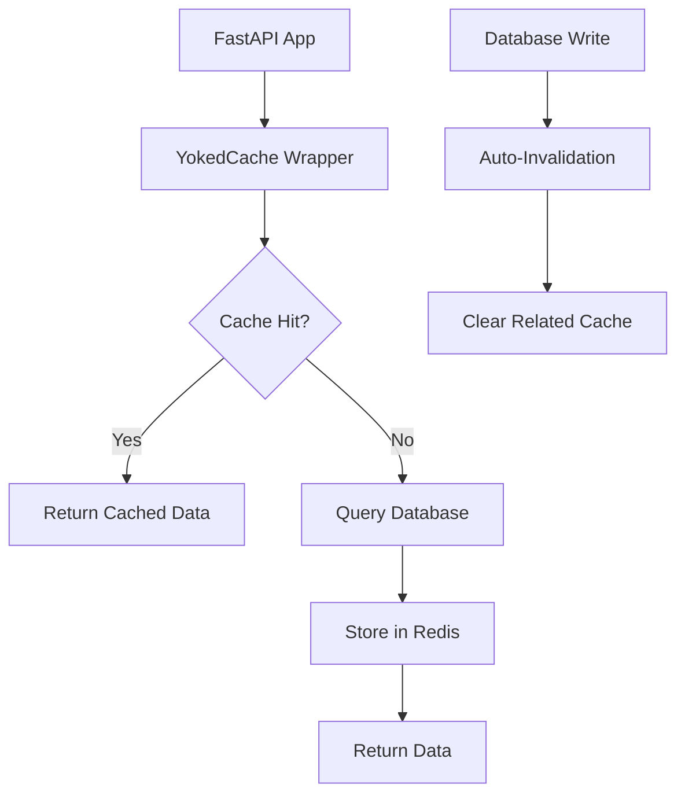

# YokedCache

High-Performance Caching for Modern Python Applications

[](https://pypi.org/project/yokedcache/)
[](https://pypi.org/project/yokedcache/)
[](https://opensource.org/licenses/MIT)
[](https://github.com/sirstig/yokedcache/actions/workflows/test.yml)
[](https://github.com/psf/black)


Intelligent caching with automatic invalidation, fuzzy search, and seamless FastAPI integration.

**[Documentation](https://sirstig.github.io/yokedcache)** | **[Report Bug](https://github.com/sirstig/yokedcache/issues)** | **[Request Feature](https://github.com/sirstig/yokedcache/issues)**

## Table of Contents

- [Overview](#overview)
- [Key Features](#key-features)
- [Installation](#installation)
- [Quick Start](#quick-start)
- [Documentation](#documentation)
- [Usage Examples](#usage-examples)
- [CLI Usage](#cli-usage)
- [Performance](#performance)
- [Architecture](#architecture)
- [Testing](#testing)
- [Contributing](#contributing)
- [License](#license)

---

## Overview

Traditional caching solutions require manual cache management and lack intelligent invalidation. YokedCache solves this with:

- **Smart Auto-Invalidation**: Automatically detects database changes and invalidates related caches
- **Multi-Backend Support**: Redis, Memcached, and in-memory backends for flexibility
- **Zero-Code Integration**: Drop-in replacement for your existing database dependencies  
- **Intelligent Tagging**: Group and invalidate related caches effortlessly  
- **Advanced Search**: Traditional fuzzy search plus vector-based semantic similarity
- **Production Monitoring**: Prometheus and StatsD integration for real-time metrics
- **Professional Tooling**: Comprehensive CLI with CSV export and monitoring capabilities

## Quick Start

```bash
pip install yokedcache
```

```python
from fastapi import FastAPI, Depends
from yokedcache import cached_dependency

app = FastAPI()

# Replace your database dependency
cached_get_db = cached_dependency(get_db, ttl=300)

@app.get("/users/{user_id}")
async def get_user(user_id: int, db=Depends(cached_get_db)):
    # Your existing code - no changes needed!
    return db.query(User).filter(User.id == user_id).first()
```

That's it! Your database queries are now cached with automatic invalidation.

## Key Features

### Multi-Backend Architecture

- **Redis**: Full-featured backend with clustering and persistence support
- **Memcached**: High-performance distributed caching
- **In-Memory**: Fast local caching for development and testing
- Pluggable backend system for custom implementations

### Smart Invalidation

- Automatic cache invalidation on database writes
- Tag-based grouping for related data
- Pattern-based invalidation with wildcards
- Configurable rules per table/operation

### Advanced Search Capabilities

- Traditional fuzzy search with configurable thresholds
- Vector-based semantic similarity using TF-IDF and cosine similarity
- Multiple similarity algorithms (cosine, euclidean, manhattan)
- Redis vector persistence for large-scale deployments

### Deep Integration

- Zero-code FastAPI integration
- SQLAlchemy ORM support
- Async/await throughout
- Connection pooling & health checks

### Production Monitoring

- **Prometheus**: Native metrics export for Grafana dashboards
- **StatsD**: Real-time metrics for DataDog, Grafana, and other platforms
- Comprehensive performance tracking and alerting
- Custom metrics collection support

### Professional Tooling

- Comprehensive CLI for cache control and monitoring
- CSV export for data analysis and reporting
- Real-time statistics with watch mode
- YAML-based configuration with validation
- Cache warming and bulk operations

## Installation

```bash
# Basic installation (Redis backend only)
pip install yokedcache

# With specific features
pip install yokedcache[memcached]     # Add Memcached support
pip install yokedcache[monitoring]    # Add Prometheus/StatsD support  
pip install yokedcache[vector]        # Add vector similarity search
pip install yokedcache[fuzzy]         # Add traditional fuzzy search

# Full installation with all features
pip install yokedcache[full]

# Development installation
pip install yokedcache[dev]
```

## Documentation

| Guide | Link | Description |
|-------|------|-------------|
| Quick Start | [Getting Started](#quick-start) | 5-minute integration guide |
| API Reference | [Documentation](https://sirstig.github.io/yokedcache) | Complete API documentation |
| Examples | [Examples](examples/) | Real-world usage examples |
| CLI Guide | [CLI Usage](#cli-usage) | Command-line tool documentation |

## Usage Examples

```python
from fastapi import FastAPI, Depends
from yokedcache import YokedCache, cached_dependency

app = FastAPI()
cache = YokedCache(redis_url="redis://localhost:6379/0")

# Wrap your existing database dependency
cached_get_db = cached_dependency(get_db, cache=cache, ttl=300)

@app.get("/users/{user_id}")
async def get_user(user_id: int, db=Depends(cached_get_db)):
    # Your existing code works unchanged!
    return db.query(User).filter(User.id == user_id).first()

# Automatic caching + invalidation now active!
```

### Advanced Usage

### Multi-Backend Configuration

```python
from yokedcache import YokedCache
from yokedcache.backends import RedisBackend, MemcachedBackend, MemoryBackend

# Redis backend (default)
redis_cache = YokedCache(backend=RedisBackend(
    redis_url="redis://localhost:6379/0"
))

# Memcached backend
memcached_cache = YokedCache(backend=MemcachedBackend(
    servers=["localhost:11211"]
))

# In-memory backend for development
memory_cache = YokedCache(backend=MemoryBackend(
    max_size=1000  # Limit to 1000 keys
))
```

### Vector-Based Similarity Search

```python
from yokedcache.vector_search import VectorSimilaritySearch

# Initialize vector search
vector_search = VectorSimilaritySearch(
    similarity_method="cosine",  # or "euclidean", "manhattan"
    max_features=1000
)

# Perform semantic search
results = await cache.vector_search(
    query="user authentication",
    threshold=0.5,  # 50% similarity
    max_results=10
)
```

### Production Monitoring

```python
from yokedcache.monitoring import PrometheusCollector, StatsDCollector, CacheMetrics

# Set up Prometheus monitoring
prometheus = PrometheusCollector(namespace="myapp")
cache_metrics = CacheMetrics([prometheus])

# Set up StatsD monitoring  
statsd = StatsDCollector(host="statsd.example.com", prefix="myapp.cache")
cache_metrics.add_collector(statsd)

# Initialize cache with monitoring
cache = YokedCache(metrics=cache_metrics)
```

### Configuration with YAML

```yaml
# cache_config.yaml
default_ttl: 300
key_prefix: "myapp"

tables:
  users:
    ttl: 3600  # 1 hour for user data
    tags: ["user_data"]
    invalidate_on: ["insert", "update", "delete"]
```

### Manual Cache Control

```python
from yokedcache import YokedCache, cached

cache = YokedCache()

# Decorator caching
@cached(cache=cache, ttl=600, tags=["products"])
async def get_expensive_data(query: str):
    return expensive_db_query(query)

# Manual operations
await cache.set("key", {"data": "value"}, ttl=300, tags=["api"])
data = await cache.get("key")
await cache.invalidate_tags(["products"])
```

## CLI Usage

YokedCache includes a powerful CLI for cache management:

```bash
# View cache statistics
yokedcache stats --watch

# Export stats to CSV for analysis
yokedcache stats --format csv --output cache_stats.csv

# Export stats to JSON for dashboards  
yokedcache stats --format json --output stats.json

# Test connection to different backends
yokedcache ping --backend redis
yokedcache ping --backend memcached

# List cached keys with filtering
yokedcache list --pattern "user:*" --limit 50

# Flush specific caches by tags
yokedcache flush --tags "user_data,session_data"

# Advanced search with vector similarity
yokedcache search "user authentication" --method vector --threshold 0.5

# Traditional fuzzy search
yokedcache search "alice" --method fuzzy --threshold 80

# Monitor in real-time with CSV logging
yokedcache stats --format csv --output metrics.csv --watch

# Export current configuration
yokedcache export-config --output config.yaml

# Warm cache with predefined data
yokedcache warm --config-file cache_config.yaml
```

## Performance

| Metric | Improvement | Description |
|--------|-------------|-------------|
| Database Load | 60-90% reduction | Automatic query caching |
| Response Time | 200-500ms faster | Redis-fast cache hits |
| Memory Usage | Optimized | Efficient serialization |
| Setup Time | Under 5 minutes | Drop-in integration |

## Architecture



## Testing

YokedCache includes comprehensive test coverage for all features:

### Quick Verification

```bash
# Verify all features are working
python test_quick_verification.py
```

### Full Test Suite

```bash
# Install development dependencies
pip install yokedcache[dev]

# Run all tests
pytest

# Run with coverage
pytest --cov=yokedcache --cov-report=html

# Run specific feature tests
pytest tests/test_backends.py      # Multi-backend tests
pytest tests/test_vector_search.py # Vector similarity tests
pytest tests/test_monitoring.py    # Monitoring tests
pytest tests/test_cli.py           # CLI tests
```

### Test Categories

- **Backend Tests**: Memory, Redis, Memcached implementations
- **Vector Search Tests**: TF-IDF, cosine similarity, semantic search
- **Monitoring Tests**: Prometheus, StatsD, metrics collection
- **CLI Tests**: CSV export, search commands, configuration
- **Integration Tests**: End-to-end workflows and error handling

For detailed testing information, see the [Testing Guide](docs/testing.md).

## Contributing

We welcome contributions! Here's how to get started:

1. Fork the repository
2. Create a feature branch: `git checkout -b feature/amazing-feature`
3. Make your changes and add tests
4. Commit your changes: `git commit -m "feat: add amazing feature"`
5. Push to the branch: `git push origin feature/amazing-feature`
6. Open a Pull Request

See [CONTRIBUTING.md](CONTRIBUTING.md) for detailed guidelines.

## Project Status

[](https://github.com/sirstig/yokedcache/stargazers)
[](https://github.com/sirstig/yokedcache/network/members)
[](https://github.com/sirstig/yokedcache/issues)
[](https://github.com/sirstig/yokedcache/pulls)

## License

This project is licensed under the MIT License - see the [LICENSE](LICENSE) file for details.

## Acknowledgments

- [Redis](https://redis.io/) - For the excellent caching backend
- [FastAPI](https://fastapi.tiangolo.com/) - For the amazing Python web framework  
- [SQLAlchemy](https://www.sqlalchemy.org/) - For database ORM integration
- Python Community - For continuous inspiration and feedback

---

**Made with care by [Project Yoked LLC](https://github.com/sirstig)**

If YokedCache helps your project, please consider giving it a star on GitHub!
