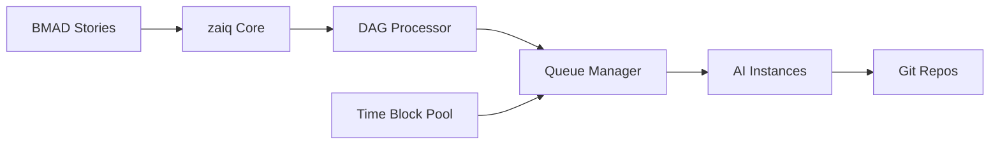

# Proposed Solution

## Core Concept: zaiq

### Solution Overview

zaiq is a Docker-deployable service that acts as an intelligent orchestration layer between your BMAD-structured backlog and available AI coding instances. It automatically distributes development tasks, manages dependencies, and eventually enables capacity sharing across team members.

### How It Works



1. **Story Ingestion:** zaiq reads BMAD-formatted stories from your project
2. **Dependency Analysis:** DAG processor identifies and visualizes dependencies
3. **Smart Queueing:** Stories are queued based on dependencies and priority
4. **Automated Execution:** Available AI instances pull and execute stories
5. **Git Integration:** Results are committed to feature branches automatically
6. **Capacity Sharing:** Unused time blocks are pooled for team use

---

## Key Differentiators

### 1. BMAD-Native Architecture
- **Built for BMAD:** Understands epic/story/task hierarchy natively
- **Context Preservation:** Maintains story context across sessions
- **Automatic Decomposition:** Can break down epics into executable stories

### 2. Intelligent Dependency Management
- **Visual DAG:** See all story dependencies before starting work
- **Automatic Ordering:** Executes stories in dependency-aware sequence
- **Blocker Detection:** Identifies and alerts on circular dependencies
- **Parallel Execution:** Runs independent stories simultaneously

### 3. AI-Specific Optimizations
- **Token Management:** Optimizes prompt size for AI model limits
- **Context Windows:** Manages conversation history efficiently
- **Rate Limit Handling:** Automatic retry with exponential backoff
- **Usage Tracking:** Real-time monitoring of capacity consumption

### 4. Time Block Marketplace (Phase 2)
- **Capacity Pooling:** Team members contribute unused hours
- **Credit System:** Fair allocation based on contribution
- **Priority Queuing:** Urgent work gets first access to available time
- **Usage Analytics:** Track and optimize capacity utilization

---

## Technical Architecture

### Component Design

```yaml
services:
  zaiq-core:
    responsibilities:
      - Story ingestion and parsing
      - Queue management
      - API orchestration
    
  dag-engine:
    responsibilities:
      - Dependency detection
      - Execution ordering
      - Visualization generation
  
  ai-connector:
    responsibilities:
      - API integration
      - Session management
      - Context optimization
  
  git-operator:
    responsibilities:
      - Repository operations
      - Branch management
      - Commit automation
  
  web-ui:
    responsibilities:
      - DAG visualization
      - Queue monitoring
      - Configuration management
```

### Deployment Model

**Phase 1: Single-User Docker**
```bash
docker run -d \
  -e AI_API_KEY=xxx \
  -e GIT_SSH_KEY=xxx \
  -v ./stories:/stories \
  zaiq:latest
```

**Phase 2: Multi-User Platform**
```bash
docker-compose up -d  # Full platform with auth, DB, queue
```

---

## Why This Solution Will Succeed

### 1. Solves Real Pain Points
- **Immediate value:** Users see productivity gains from day one
- **Measurable ROI:** Clear metrics on capacity utilization
- **Low friction:** Works with existing tools and workflows

### 2. Technical Advantages
- **Docker simplicity:** One command deployment
- **Git native:** No new version control to learn
- **BMAD compatible:** Leverages existing methodology
- **Secure by design:** SSH keys never leave user control

### 3. Network Effects
- **Team value grows:** More users = more shared capacity
- **Knowledge sharing:** Successful patterns propagate
- **Community driven:** Open for extensions and contributions

### 4. Timing Advantages
- **First mover:** No direct competitors in this space
- **Rising demand:** AI coding adoption accelerating
- **Technical maturity:** Required components now stable

---

## Implementation Approach

### MVP (Month 1)
- Basic story execution
- Simple queue management
- Git integration
- CLI interface

### Beta (Month 2-3)
- DAG visualization
- Web UI
- Multi-repo support
- Error recovery

### GA (Month 4-6)
- Time block sharing
- Team management
- Analytics dashboard
- Enterprise features

---

## Risk Mitigation

### Technical Risks
- **AI API changes:** Abstract API layer for adaptability
- **Rate limiting:** Implement sophisticated retry logic
- **Security concerns:** Zero-trust architecture, encrypted credentials

### Business Risks
- **Adoption barriers:** Start with single-user mode for easy trial
- **Competition:** Build moat through BMAD integration
- **Pricing sensitivity:** Freemium model with clear value tiers

---

## Success Metrics

### Technical Metrics
- Story completion rate > 95%
- Average queue time < 30 minutes
- Capacity utilization > 70%

### Business Metrics
- User activation rate > 60%
- Monthly active teams growth > 20%
- Net Promoter Score > 50

### User Satisfaction
- Setup time < 10 minutes
- Time to first value < 1 hour
- Support ticket rate < 5%