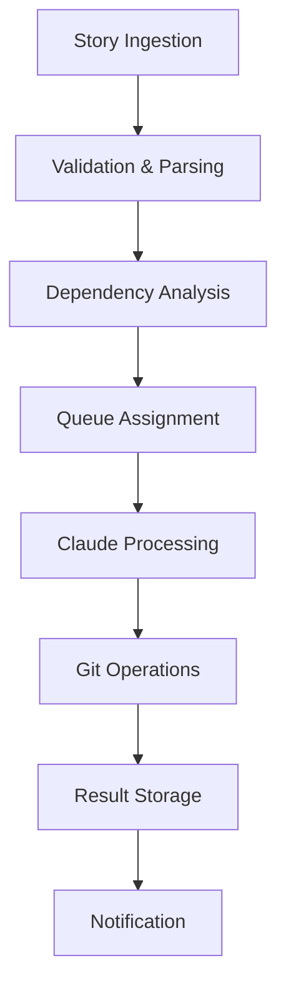

# Technical Considerations

## Platform & Deployment Architecture

### Containerization Strategy

#### Docker-First Approach
**Design Decision:** Docker as primary deployment mechanism for MVP and beyond.

**Technical Rationale:**
- **Portability:** Runs consistently across Linux, macOS, and Windows
- **Dependency Management:** Eliminates "works on my machine" issues
- **Security Isolation:** Process and filesystem isolation for safe operation
- **Resource Management:** Built-in resource limits and monitoring
- **Distribution:** Simple distribution via container registries

**Container Architecture:**
```dockerfile
# Multi-stage build for optimized production image
FROM python:3.11-slim AS builder
# Build dependencies and application
FROM python:3.11-slim AS runtime
# Runtime environment with minimal dependencies
```

**Resource Requirements:**
- **Minimum:** 2GB RAM, 1 CPU core, 10GB storage
- **Recommended:** 4GB RAM, 2 CPU cores, 50GB storage
- **Enterprise:** 8GB RAM, 4 CPU cores, 200GB storage

#### Orchestration Evolution
**MVP (Phase 1):** Standalone Docker containers
**Beta (Phase 2):** Docker Compose for multi-service architecture
**GA (Phase 3):** Kubernetes for enterprise deployments

### Microservices Architecture

#### Core Service Components

##### zaiq Core Service
**Responsibilities:** Central orchestration and API gateway
- Story ingestion and validation
- Queue management and distribution
- User authentication and authorization
- Configuration management
- Inter-service communication

**Technology Stack:**
- **Framework:** FastAPI (Python) for high-performance async API
- **Database:** PostgreSQL for relational data, Redis for caching
- **Message Queue:** Redis or RabbitMQ for async task distribution
- **Monitoring:** Prometheus metrics, structured logging

##### Story Processing Engine
**Responsibilities:** BMAD story parsing and AI API integration
- Story format validation and parsing
- Context preparation and prompt engineering
- AI API communication and session management
- Response processing and validation
- Error handling and retry logic

**Technology Stack:**
- **Parser:** Custom Python parser with Pydantic validation
- **AI Integration:** Multiple AI SDKs (Anthropic, OpenAI, etc.) with custom retry logic
- **Context Management:** Vector embeddings for context optimization
- **State Management:** SQLite for local state, PostgreSQL for shared state

##### Git Operations Service
**Responsibilities:** Repository management and version control
- SSH key management and repository access
- Branch creation and management
- Commit generation and push operations
- Merge conflict detection and reporting
- Repository metadata extraction

**Technology Stack:**
- **Git Library:** GitPython for Git operations
- **SSH Management:** Paramiko for secure SSH operations
- **Credential Storage:** HashiCorp Vault or encrypted local storage
- **Repository Analysis:** Custom analyzers for dependency detection

##### DAG Processing Engine
**Responsibilities:** Dependency analysis and execution ordering
- Story dependency extraction and analysis
- Topological sorting and execution planning
- Parallel execution coordination
- Circular dependency detection
- Impact analysis for changes

**Technology Stack:**
- **Graph Processing:** NetworkX (Python) for dependency graphs
- **Parallel Execution:** Celery or Ray for distributed processing
- **Visualization:** D3.js or Cytoscape.js for web-based DAG visualization
- **Analysis:** Custom algorithms for dependency detection

---

## Technology Stack Decisions

### Programming Languages

#### Primary Language: Python 3.11+
**Rationale:**
- **AI Ecosystem:** Excellent support for AI/ML libraries and APIs
- **Development Velocity:** Rapid prototyping and development
- **Library Ecosystem:** Rich ecosystem for Git, Docker, web development
- **Team Expertise:** Strong developer community and hiring pool
- **Async Support:** Native async/await for concurrent operations

**Key Libraries:**
- **Web Framework:** FastAPI for API development
- **AI Integration:** Multiple AI SDKs (Anthropic, OpenAI, Google AI, etc.)
- **Git Operations:** GitPython, Dulwich for Git integration
- **Data Processing:** Pandas, NetworkX for analysis
- **Validation:** Pydantic for data validation and parsing

#### Frontend Technology: TypeScript + React
**Rationale (for Phase 2 Web UI):**
- **Type Safety:** TypeScript prevents runtime errors
- **Component Architecture:** React ecosystem for complex UIs
- **Real-time Updates:** WebSocket integration for live updates
- **Visualization:** Integration with D3.js and graph libraries

#### Infrastructure: Go (Selected Components)
**Rationale (for performance-critical components):**
- **Performance:** High-performance components like proxy/gateway
- **Concurrency:** Excellent support for concurrent operations
- **Deployment:** Small binary size and minimal runtime dependencies
- **Reliability:** Strong typing and error handling

### Database Architecture

#### Primary Database: PostgreSQL 15+
**Use Cases:**
- User management and authentication
- Story metadata and execution history
- Team configuration and permissions
- Analytics and reporting data

**Schema Design:**
```sql
-- Core entities
CREATE TABLE users (id, email, created_at, config);
CREATE TABLE teams (id, name, owner_id, settings);
CREATE TABLE stories (id, content, status, dependencies);
CREATE TABLE executions (id, story_id, start_time, end_time, status);
```

#### Cache Layer: Redis 7+
**Use Cases:**
- Session management and temporary data
- Queue management for story processing
- Real-time updates and WebSocket data
- Rate limiting and throttling

#### Time Series: InfluxDB (Future)
**Use Cases:**
- Performance metrics and monitoring
- Capacity utilization tracking
- System health and alerting
- Analytics and business intelligence

### Message Queue & Event Streaming

#### Queue System: Redis + Celery
**MVP Approach:** Redis as message broker with Celery workers

**Benefits:**
- **Simplicity:** Single Redis instance for caching and queuing
- **Python Integration:** Native Celery integration
- **Reliability:** Persistent queues with acknowledgment
- **Scalability:** Horizontal scaling of worker processes

**Future Evolution:** Apache Kafka for high-throughput streaming

### External Service Integration

#### AI Service Integration
**Multi-Provider Support:** Claude, GPT, Gemini, and other AI APIs
- **SDKs:** Official SDKs for major providers (Anthropic, OpenAI, Google)
- **Rate Limiting:** Custom retry logic with exponential backoff
- **Fallback:** Support for multiple API keys and accounts across providers
- **Monitoring:** Request tracking and performance metrics

**Supported Providers:**
- Anthropic Claude models for development tasks
- OpenAI GPT models for specialized tasks
- Google Gemini for alternative capabilities
- Local LLM support (Ollama, LocalAI)
- Custom fine-tuned models
- Multi-model orchestration

#### Version Control Integration
**Supported Platforms:**
- GitHub (primary focus for MVP)
- GitLab (Phase 2)
- Bitbucket (Phase 2)
- Self-hosted Git (Phase 2)

**Authentication Methods:**
- SSH keys (MVP primary method)
- Personal Access Tokens (Phase 2)
- GitHub Apps (Phase 2)
- OAuth flows (Phase 3)

---

## Security Architecture

### Authentication & Authorization

#### User Authentication (Phase 2+)
**Strategy:** JWT-based authentication with refresh tokens
- **Local Users:** Email/password with bcrypt hashing
- **SSO Integration:** SAML 2.0, OpenID Connect for enterprise
- **API Authentication:** API keys for programmatic access
- **Multi-Factor:** TOTP-based 2FA for enhanced security

#### Authorization Model
**Role-Based Access Control (RBAC):**
- **Individual Users:** Full access to personal stories and repositories
- **Team Members:** Read/write access to shared team resources
- **Team Admins:** User management and team configuration
- **System Admins:** Full system access and configuration

### Data Protection

#### Encryption at Rest
**Sensitive Data:**
- SSH private keys: AES-256 encryption with user-provided passphrase
- API keys: Vault or encrypted environment variables
- Story content: Optional encryption for sensitive projects
- User credentials: bcrypt for passwords, encrypted session tokens

#### Encryption in Transit
**Network Security:**
- HTTPS/TLS 1.3 for all web communication
- SSH for Git repository access
- WSS (WebSocket Secure) for real-time updates
- VPN support for enterprise deployments

#### Secret Management
**MVP Approach:** Environment variables with validation
**Phase 2:** HashiCorp Vault integration
**Phase 3:** Cloud provider secret managers (AWS Secrets Manager, Azure Key Vault)

### Container Security

#### Image Security
**Base Image:** Official Python slim images with security updates
**Vulnerability Scanning:** Regular scans with tools like Trivy or Snyk
**Multi-stage Builds:** Minimize attack surface in production images
**Non-root Execution:** Run containers as non-root user

#### Runtime Security
**Resource Limits:** CPU and memory limits to prevent resource exhaustion
**Network Policies:** Restricted network access for containers
**Filesystem:** Read-only filesystem where possible
**Capabilities:** Drop unnecessary Linux capabilities

---

## Performance & Scalability

### Performance Targets

#### Response Time Requirements
**API Endpoints:**
- Story submission: <500ms
- Queue status: <200ms
- Story execution start: <1s
- Real-time updates: <100ms latency

**Story Processing:**
- Simple stories: <2 minutes end-to-end
- Complex stories: <10 minutes end-to-end
- Dependency resolution: <30 seconds
- Git operations: <1 minute per operation

#### Throughput Targets
**MVP (Single User):**
- 10 concurrent stories per instance
- 100 stories per hour processing capacity
- 1,000 API requests per minute

**Phase 2 (Multi-User):**
- 100 concurrent stories across all users
- 500 stories per hour system-wide
- 10,000 API requests per minute

### Scalability Architecture

#### Horizontal Scaling Strategy
**Stateless Services:** All services designed to be stateless for easy scaling
**Load Balancing:** NGINX or cloud load balancers for traffic distribution
**Auto-scaling:** Kubernetes HPA or cloud auto-scaling groups
**Database Scaling:** Read replicas and connection pooling

#### Caching Strategy
**Multi-Level Caching:**
- **L1:** In-memory caching within services (Redis)
- **L2:** Distributed caching across services (Redis Cluster)
- **L3:** CDN caching for static content (Phase 2+)

#### Queue Management
**Queue Partitioning:** Separate queues by priority, user, or team
**Worker Scaling:** Dynamic worker scaling based on queue depth
**Dead Letter Queues:** Failed message handling and retry logic
**Priority Queues:** High-priority stories bypass standard queue

---

## Development & Operations

### Development Environment

#### Local Development Setup
```bash
# Developer setup with Docker Compose
docker-compose -f docker-compose.dev.yml up
# Includes: PostgreSQL, Redis, hot reload, debug tools
```

**Development Tools:**
- **IDE Support:** VS Code dev containers with full environment
- **Testing:** pytest with coverage reporting and fixtures
- **Linting:** black, flake8, mypy for code quality
- **Pre-commit Hooks:** Automated formatting and validation

#### CI/CD Pipeline
**Continuous Integration:**
- **Testing:** Unit tests, integration tests, security scans
- **Code Quality:** Coverage requirements, static analysis
- **Build:** Multi-platform Docker image builds
- **Deployment:** Automated deployment to staging environments

**Deployment Strategy:**
- **Blue-Green Deployments:** Zero-downtime updates
- **Feature Flags:** Safe feature rollout and rollback
- **Database Migrations:** Automated schema updates
- **Health Checks:** Comprehensive health monitoring

### Monitoring & Observability

#### Metrics Collection
**Application Metrics:**
- Story processing times and success rates
- API response times and error rates
- Queue depth and processing capacity
- User activity and engagement metrics

**Infrastructure Metrics:**
- Container resource usage (CPU, memory, disk)
- Database performance and connection pools
- Network latency and throughput
- Cache hit rates and efficiency

#### Logging Strategy
**Structured Logging:** JSON-formatted logs with correlation IDs
**Log Levels:** DEBUG, INFO, WARN, ERROR with appropriate filtering
**Log Aggregation:** ELK stack or cloud logging solutions
**Retention Policy:** Different retention periods based on log importance

#### Alerting & Notifications
**Critical Alerts:**
- Service downtime or high error rates
- Database connection failures
- Queue processing delays
- Security events or anomalies

**Notification Channels:**
- Email for non-urgent alerts
- Slack/Teams for team notifications
- PagerDuty for critical incidents
- In-app notifications for users

---

## Data Architecture

### Data Flow & Pipeline

#### Story Processing Pipeline


#### Data Storage Strategy
**Transactional Data:** PostgreSQL for ACID compliance
**Session Data:** Redis for fast access and expiration
**File Storage:** Local filesystem (MVP), S3-compatible (Phase 2)
**Analytics Data:** Time-series database for metrics and trends

### Backup & Recovery

#### Backup Strategy
**Database Backups:**
- Daily automated backups with point-in-time recovery
- Cross-region replication for disaster recovery
- Backup validation and recovery testing
- Encrypted backup storage

**Configuration Backup:**
- Version-controlled infrastructure as code
- Environment configuration snapshots
- Secret and credential backup procedures
- Application state and queue persistence

#### Disaster Recovery
**Recovery Time Objective (RTO):** <4 hours for full service restoration
**Recovery Point Objective (RPO):** <1 hour for data loss tolerance
**Multi-Region:** Active-passive setup for critical deployments
**Failover Automation:** Automated failover for high-availability setups

---

## Integration Architecture

### API Design

#### RESTful API Standards
**API Versioning:** URL path versioning (v1, v2) for backward compatibility
**Response Format:** Consistent JSON structure with status codes
**Error Handling:** Standardized error responses with actionable messages
**Rate Limiting:** Token bucket algorithm with user-specific limits

**Example API Endpoints:**
```
POST /api/v1/stories          # Submit new story
GET  /api/v1/stories/{id}     # Get story status
GET  /api/v1/queue            # View processing queue
POST /api/v1/queue/prioritize # Adjust story priority
```

#### WebSocket Integration
**Real-time Updates:** Live updates for story processing status
**Connection Management:** Automatic reconnection and state synchronization
**Message Format:** JSON-based message protocol with type discrimination
**Authentication:** JWT-based WebSocket authentication

### Third-Party Integration Framework

#### Integration Patterns
**Webhook Support:** Inbound webhooks from project management tools
**API Polling:** Outbound polling for systems without webhooks
**Event-Driven:** Event bus for loose coupling between integrations
**Plugin Architecture:** Extensible plugin system for custom integrations

#### Common Integration Use Cases
**Project Management:** Jira, Linear, Asana story synchronization
**Code Repositories:** GitHub, GitLab, Bitbucket integration
**Communication:** Slack, Teams, Discord notifications
**CI/CD:** Jenkins, GitHub Actions, GitLab CI pipeline triggers

---

## Technical Debt & Maintenance

### Code Quality Standards
**Test Coverage:** Minimum 80% coverage for critical paths
**Documentation:** Comprehensive API docs and architectural decisions
**Code Review:** Mandatory peer review for all changes
**Dependency Management:** Regular security updates and version management

### Maintenance Strategy
**Regular Updates:** Monthly dependency updates and security patches
**Performance Monitoring:** Continuous performance profiling and optimization
**Refactoring Schedule:** Quarterly technical debt reduction sprints
**Legacy Support:** Defined support lifecycle for deprecated features

This technical foundation supports the zaiq vision while maintaining flexibility for future evolution and scaling requirements.